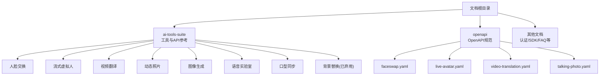
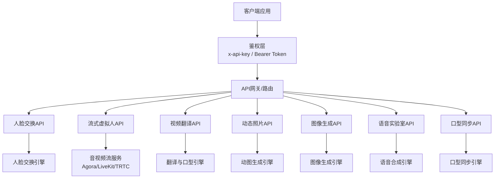
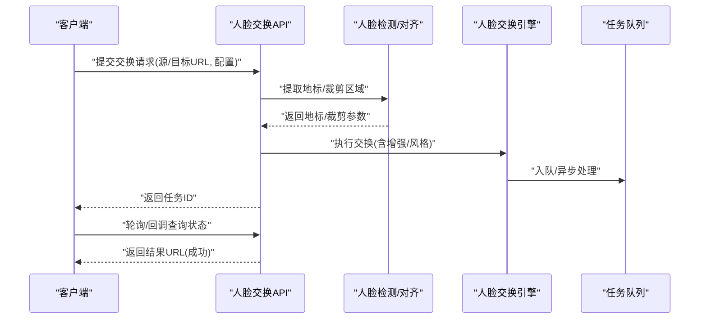
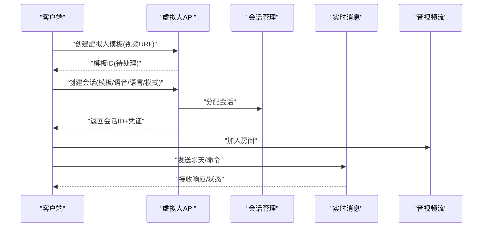
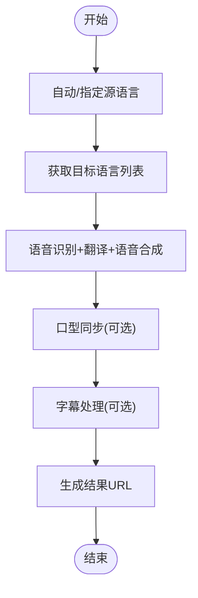
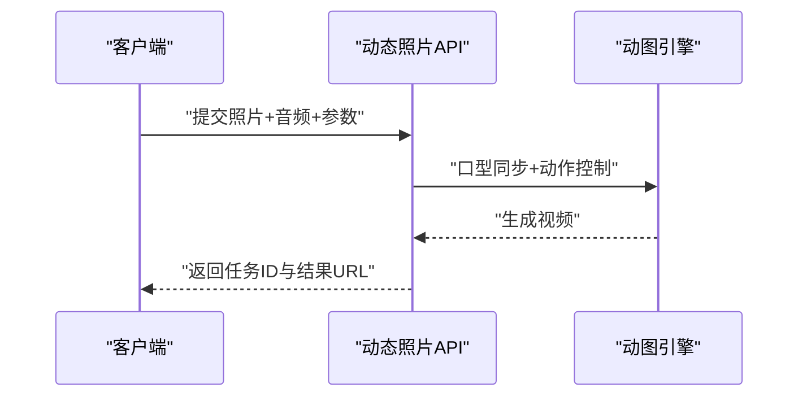
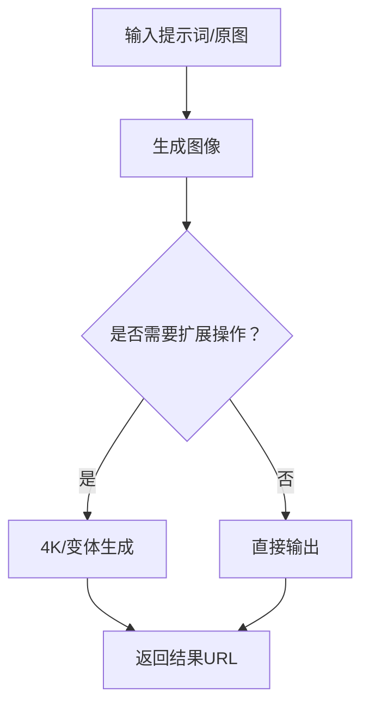
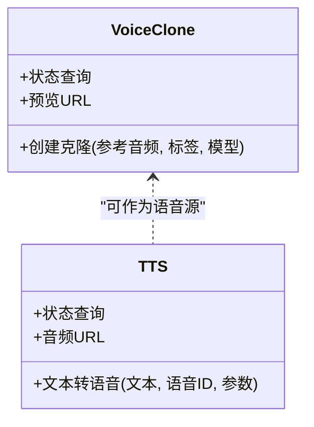
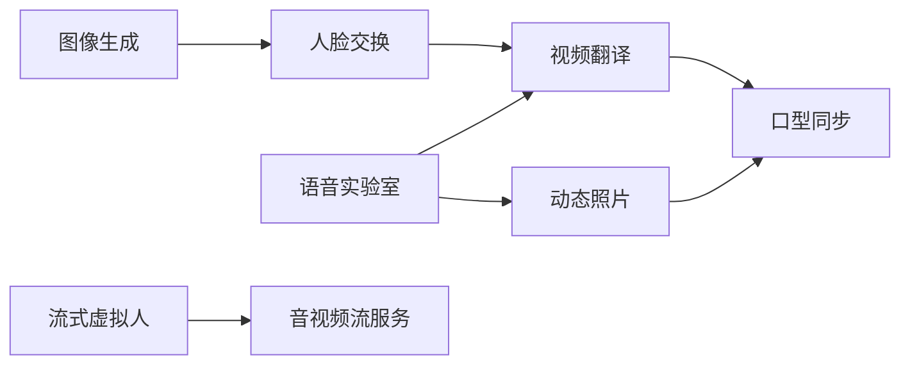

# AI 工具套件

<cite>
**本文档引用的文件**
- [README.md](file://README.md)
- [index.mdx](file://index.mdx)
- [ai-tools-suite/aimodel.mdx](file://ai-tools-suite/aimodel.mdx)
- [ai-tools-suite/error-code.mdx](file://ai-tools-suite/error-code.mdx)
- [openapi/faceswap.yaml](file://openapi/faceswap.yaml)
- [openapi/live-avatar.yaml](file://openapi/live-avatar.yaml)
- [openapi/video-translation.yaml](file://openapi/video-translation.yaml)
- [openapi/talking-photo.yaml](file://openapi/talking-photo.yaml)
- [ai-tools-suite/faceswap.mdx](file://ai-tools-suite/faceswap.mdx)
- [ai-tools-suite/live-avatar.mdx](file://ai-tools-suite/live-avatar.mdx)
- [ai-tools-suite/video-translation.mdx](file://ai-tools-suite/video-translation.mdx)
- [ai-tools-suite/talking-photo.mdx](file://ai-tools-suite/talking-photo.mdx)
- [ai-tools-suite/image-generate.mdx](file://ai-tools-suite/image-generate.mdx)
- [ai-tools-suite/voiceLab.mdx](file://ai-tools-suite/voiceLab.mdx)
- [ai-tools-suite/background-change.mdx](file://ai-tools-suite/background-change.mdx)
- [ai-tools-suite/lip-sync.mdx](file://ai-tools-suite/lip-sync.mdx)
</cite>

## 目录
1. [简介](#简介)
2. [项目结构](#项目结构)
3. [核心组件](#核心组件)
4. [架构总览](#架构总览)
5. [详细组件分析](#详细组件分析)
6. [依赖关系分析](#依赖关系分析)
7. [性能考虑](#性能考虑)
8. [故障排除指南](#故障排除指南)
9. [结论](#结论)
10. [附录](#附录)

## 简介
本文件为 Akool AI Tools Suite 的全面功能概览与技术文档，覆盖人脸交换、语音合成、视频翻译、口型同步、动态照片、流式虚拟人等核心能力。文档从系统架构、组件关系、数据流、处理逻辑、集成点、错误处理与性能特征等方面进行深入解析，并提供工具选择指南与使用场景建议，帮助开发者与产品团队快速定位合适工具并高效集成。

## 项目结构
该文档仓库采用基于主题的组织方式，核心内容位于 ai-tools-suite 目录下，每个工具均配有独立的 API 参考与使用说明；openapi 目录提供标准化的 OpenAPI 描述；其余页面提供认证、SDK、常见问题与发布信息等辅助内容。

图表来源
- [index.mdx:1-38](file://index.mdx#L1-L38)
- [README.md:1-33](file://README.md#L1-L33)

章节来源
- [index.mdx:1-38](file://index.mdx#L1-L38)
- [README.md:1-33](file://README.md#L1-L33)

## 核心组件
- 人脸交换（Face Swap）
  - 支持图片与视频的人脸交换，提供多版本接口与多模态风格选择，支持单/多人脸映射与增强选项。
- 流式虚拟人（Live Avatar）
  - 提供上传、管理、会话创建与状态查询能力，支持多种音视频协议与第三方服务对接。
- 视频翻译（Video Translation）
  - 多语言视频翻译与口型同步，支持字幕处理、背景音乐移除与风格化语音。
- 动态照片（Talking Photo）
  - 基于照片与音频生成带口型同步的动图视频，可配置分辨率与动作提示。
- 图像生成（Image Generate）
  - 文生图与以图生图，支持按钮式扩展（如4K放大、变体生成）与结果状态查询。
- 语音实验室（VoiceLab）
  - 语音克隆、文本转语音与语音资源管理，支持多模型与参数微调。
- 口型同步（Lip Sync）
  - 将音频与视频进行口型同步处理，支持状态查询与回调通知。
- 背景替换（Background Change）
  - 已弃用，历史接口文档保留以便追溯。

章节来源
- [ai-tools-suite/faceswap.mdx:1-176](file://ai-tools-suite/faceswap.mdx#L1-L176)
- [ai-tools-suite/live-avatar.mdx:1-365](file://ai-tools-suite/live-avatar.mdx#L1-L365)
- [ai-tools-suite/video-translation.mdx:1-168](file://ai-tools-suite/video-translation.mdx#L1-L168)
- [ai-tools-suite/talking-photo.mdx:1-123](file://ai-tools-suite/talking-photo.mdx#L1-L123)
- [ai-tools-suite/image-generate.mdx:1-470](file://ai-tools-suite/image-generate.mdx#L1-L470)
- [ai-tools-suite/voiceLab.mdx:1-800](file://ai-tools-suite/voiceLab.mdx#L1-L800)
- [ai-tools-suite/lip-sync.mdx:1-331](file://ai-tools-suite/lip-sync.mdx#L1-L331)
- [ai-tools-suite/background-change.mdx:1-390](file://ai-tools-suite/background-change.mdx#L1-L390)

## 架构总览
Akool AI Tools Suite 通过统一的 OpenAPI 入口提供各类 AI 能力，客户端通过鉴权头（x-api-key 或 Bearer Token）发起请求，服务端按工具类型路由到对应算法引擎或第三方服务（如 Agora/LiveKit/TRTC）。工具间可通过“任务状态查询”与“回调通知”实现解耦协作。

图表来源
- [openapi/faceswap.yaml:1-632](file://openapi/faceswap.yaml#L1-L632)
- [openapi/live-avatar.yaml:1-689](file://openapi/live-avatar.yaml#L1-L689)
- [openapi/video-translation.yaml:1-283](file://openapi/video-translation.yaml#L1-L283)
- [openapi/talking-photo.yaml:1-288](file://openapi/talking-photo.yaml#L1-L288)

## 详细组件分析

### 人脸交换（Face Swap）
- 功能要点
  - 支持图片与视频的人脸交换，提供 V3/V4 多版本接口，V4 推荐用于高质量图片交换，V4 Plus 支持多模态与多张脸映射。
  - 提供信用额度查询、结果列表与删除能力，便于资源管理。
  - 支持 webhook 回调与人脸增强选项，提升结果质量。
- 数据流与处理逻辑
  - 输入：源人脸与目标人脸（图片/视频 URL）及可选地标/映射参数。
  - 处理：人脸检测与对齐、风格迁移、增强后输出结果。
  - 输出：任务ID与结果URL，支持轮询查询状态。
- 关键参数与约束
  - 单次请求最多支持 50 对人脸（V4 Pro）。
  - 多人脸时需提供 face_mapping 或 opts 参数。
- 错误码与状态
  - 状态码：队列/处理/成功/失败。
  - 常见错误：配额不足、参数错误、账户封禁等。

图表来源
- [openapi/faceswap.yaml:14-272](file://openapi/faceswap.yaml#L14-L272)
- [ai-tools-suite/faceswap.mdx:37-176](file://ai-tools-suite/faceswap.mdx#L37-L176)

章节来源
- [openapi/faceswap.yaml:1-632](file://openapi/faceswap.yaml#L1-L632)
- [ai-tools-suite/faceswap.mdx:1-176](file://ai-tools-suite/faceswap.mdx#L1-L176)

### 流式虚拟人（Live Avatar）
- 功能要点
  - 支持上传视频创建虚拟人模板、查询可用模板、创建会话、关闭会话与查询会话详情。
  - 支持多种流媒体协议（Agora/LiveKit/TRTC），并提供丰富的语音参数与对话模式。
  - 支持知识库集成，增强上下文对话准确性。
- 数据流与处理逻辑
  - 模板创建：上传视频 → 引擎处理 → 状态更新 → 可用模板。
  - 会话创建：指定模板/语音/语言/场景 → 分配流媒体资源 → 返回凭证。
  - 交互：通过流消息发送聊天/命令，接收响应。
- 关键参数与约束
  - 会话时长预扣费，结束后按实际消耗退款。
  - 支持 fast_dialogue 场景模式，优化实时语音交互。
- 错误码与状态
  - 状态码：队列/处理/完成/失败。
  - 常见错误：账户封禁、参数错误、编码格式不支持等。

图表来源
- [openapi/live-avatar.yaml:14-282](file://openapi/live-avatar.yaml#L14-L282)
- [ai-tools-suite/live-avatar.mdx:24-365](file://ai-tools-suite/live-avatar.mdx#L24-L365)

章节来源
- [openapi/live-avatar.yaml:1-689](file://openapi/live-avatar.yaml#L1-L689)
- [ai-tools-suite/live-avatar.mdx:1-365](file://ai-tools-suite/live-avatar.mdx#L1-L365)

### 视频翻译（Video Translation）
- 功能要点
  - 支持多语言翻译、自动语言检测、口型同步、字幕处理与背景音乐移除。
  - 提供语言列表查询与翻译结果状态查询。
- 数据流与处理逻辑
  - 输入：视频URL、源语言、目标语言列表、可选字幕与语音参数。
  - 处理：语音识别、翻译、语音合成、口型同步、字幕生成。
  - 输出：任务ID与结果URL，支持 webhook 通知。
- 关键参数与约束
  - 视频时长≤60秒，大小≤300MB，帧率≤60fps。
  - 同一视频同语种重复口型同步有限制。
- 错误码与状态
  - 状态码：队列/处理/完成/失败。
  - 常见错误：视频过大/编码不支持/无音频等。

图表来源
- [openapi/video-translation.yaml:14-103](file://openapi/video-translation.yaml#L14-L103)
- [ai-tools-suite/video-translation.mdx:25-168](file://ai-tools-suite/video-translation.mdx#L25-L168)

章节来源
- [openapi/video-translation.yaml:1-283](file://openapi/video-translation.yaml#L1-L283)
- [ai-tools-suite/video-translation.mdx:1-168](file://ai-tools-suite/video-translation.mdx#L1-L168)

### 动态照片（Talking Photo）
- 功能要点
  - 基于照片与音频生成带口型同步的动图视频，支持分辨率与动作提示。
- 数据流与处理逻辑
  - 输入：照片URL、音频URL、可选提示词与分辨率。
  - 处理：驱动口型同步与手部动作，生成视频。
  - 输出：任务ID与结果URL，支持 webhook。
- 关键参数与约束
  - 分辨率：720/1080。
  - 建议音频时长与视频长度一致以获得最佳效果。
- 错误码与状态
  - 状态码：队列/处理/完成/失败。
  - 常见错误：授权无效、内容不存在、参数错误等。

图表来源
- [openapi/talking-photo.yaml:14-111](file://openapi/talking-photo.yaml#L14-L111)
- [ai-tools-suite/talking-photo.mdx:22-123](file://ai-tools-suite/talking-photo.mdx#L22-L123)

章节来源
- [openapi/talking-photo.yaml:1-288](file://openapi/talking-photo.yaml#L1-L288)
- [ai-tools-suite/talking-photo.mdx:1-123](file://ai-tools-suite/talking-photo.mdx#L1-L123)

### 图像生成（Image Generate）
- 功能要点
  - 文生图与以图生图，支持按钮式扩展（如4K放大、变体生成）与结果状态查询。
- 数据流与处理逻辑
  - 输入：提示词、可选原图与比例。
  - 处理：文本理解与图像生成，支持后续扩展操作。
  - 输出：任务ID与结果URL，支持 webhook。
- 关键参数与约束
  - 支持多种比例与扩展按钮组合。
- 错误码与状态
  - 状态码：队列/处理/完成/失败。
  - 常见错误：授权无效、内容不存在、参数错误等。

图表来源
- [ai-tools-suite/image-generate.mdx:8-470](file://ai-tools-suite/image-generate.mdx#L8-L470)

章节来源
- [ai-tools-suite/image-generate.mdx:1-470](file://ai-tools-suite/image-generate.mdx#L1-L470)

### 语音实验室（VoiceLab）
- 功能要点
  - 语音克隆、文本转语音与语音资源管理，支持多模型与参数微调。
- 数据流与处理逻辑
  - 语音克隆：上传参考音频 → 引擎训练 → 返回克隆语音ID与预览。
  - 文本转语音：输入文本与语音参数 → 合成音频 → 返回URL。
- 关键参数与约束
  - 支持多模型（如 Akool Multilingual 1/2/3/4），不同模型支持不同参数。
  - 提供稳定性、相似度、情感、音高等参数调节。
- 错误码与状态
  - 状态码：队列/处理/完成/失败。
  - 常见错误：授权无效、参数错误、账户封禁等。

图表来源
- [ai-tools-suite/voiceLab.mdx:79-800](file://ai-tools-suite/voiceLab.mdx#L79-L800)

章节来源
- [ai-tools-suite/voiceLab.mdx:1-800](file://ai-tools-suite/voiceLab.mdx#L1-L800)

### 口型同步（Lip Sync）
- 功能要点
  - 将音频与视频进行口型同步处理，支持状态查询与回调通知。
- 数据流与处理逻辑
  - 输入：视频URL与音频URL。
  - 处理：口型检测与同步。
  - 输出：任务ID与结果URL。
- 关键参数与约束
  - 建议视频帧率低于25以获得更好效果。
- 错误码与状态
  - 状态码：队列/处理/完成/失败。
  - 常见错误：视频过大/编码不支持/无音频等。

章节来源
- [ai-tools-suite/lip-sync.mdx:1-331](file://ai-tools-suite/lip-sync.mdx#L1-L331)

### 背景替换（Background Change）
- 状态：已弃用，保留历史文档以便追溯。
- 功能要点
  - 曾支持颜色/模板背景替换与前景叠加，现不再可用。

章节来源
- [ai-tools-suite/background-change.mdx:1-390](file://ai-tools-suite/background-change.mdx#L1-L390)

## 依赖关系分析
- 组件内聚与耦合
  - 各工具相对独立，通过统一的 OpenAPI 与鉴权层接入，内部耦合度低。
  - 结果查询与回调机制降低客户端轮询压力，提升整体解耦性。
- 外部依赖
  - 流式虚拟人依赖第三方音视频平台（Agora/LiveKit/TRTC）。
  - 语音合成依赖多模型与外部语音服务。
- 循环依赖
  - 未发现循环依赖，各工具间通过任务ID与回调进行弱关联。

图表来源
- [openapi/faceswap.yaml:1-632](file://openapi/faceswap.yaml#L1-L632)
- [openapi/live-avatar.yaml:1-689](file://openapi/live-avatar.yaml#L1-L689)
- [openapi/video-translation.yaml:1-283](file://openapi/video-translation.yaml#L1-L283)
- [openapi/talking-photo.yaml:1-288](file://openapi/talking-photo.yaml#L1-L288)

## 性能考虑
- 处理时延
  - 视频类任务（人脸交换、视频翻译、口型同步）通常较长，建议合理设置并发与重试策略。
- 资源限制
  - 视频时长、大小、帧率与分辨率直接影响处理时间与成本，应遵循各工具的约束条件。
- 并发与配额
  - 使用信用额度或订阅配额时，建议监控余额并合理规划批量任务。
- 缓存与复用
  - 成功结果有效期约7天，建议及时下载并归档，避免过期导致的重复计算。

## 故障排除指南
- 常见错误码
  - 1000：成功
  - 1003：参数错误
  - 1005：操作过于频繁
  - 1006：配额不足
  - 1008：内容不存在
  - 1009：权限不足
  - 1101/1102：授权无效或为空
  - 1200：账户被封禁
  - 其他工具特定错误：如视频翻译的编码/时长限制、流式虚拟人的编码/分辨率限制等
- 排查步骤
  - 检查鉴权头与Token有效性。
  - 核对输入参数与资源URL可达性。
  - 关注状态轮询与回调通知，定位失败原因。
  - 查阅工具专属错误码表，结合日志与任务ID定位问题。

章节来源
- [ai-tools-suite/error-code.mdx:1-59](file://ai-tools-suite/error-code.mdx#L1-L59)

## 结论
Akool AI Tools Suite 提供了从图像/视频生成到语音合成与实时交互的完整能力矩阵。通过标准化的 OpenAPI、灵活的参数配置与完善的错误处理机制，开发者可以快速构建多模态应用。建议在项目初期明确业务场景与性能要求，优先选择适合的工具组合，并结合回调与状态查询实现稳定可靠的自动化流程。

## 附录
- 工具选择与使用场景建议
  - 人脸交换：需要高质量人脸替换的图片/视频场景，优先 V4 Pro（单人脸）或 V4 Plus（多模态/多张脸）。
  - 流式虚拟人：需要实时互动与多语言对话的直播/客服场景，结合知识库提升回答质量。
  - 视频翻译：多语言内容分发与本地化，配合口型同步与字幕处理提升观看体验。
  - 动态照片：低成本人物动效视频，适合短视频与社交场景。
  - 图像生成：创意设计与素材生成，支持后续扩展操作。
  - 语音实验室：个性化语音合成与克隆，适配播报、有声书、角色配音等。
  - 口型同步：将静态视频与新音频进行自然口型匹配，适用于配音与二次创作。
  - 背景替换：已弃用，建议使用视频翻译或图像生成替代方案。