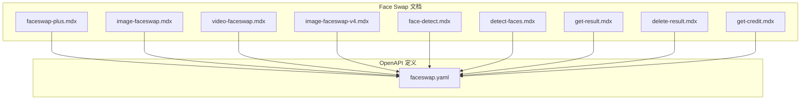
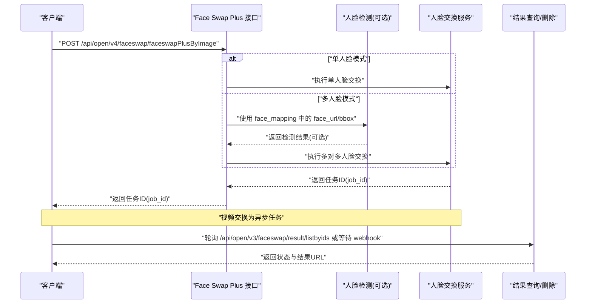
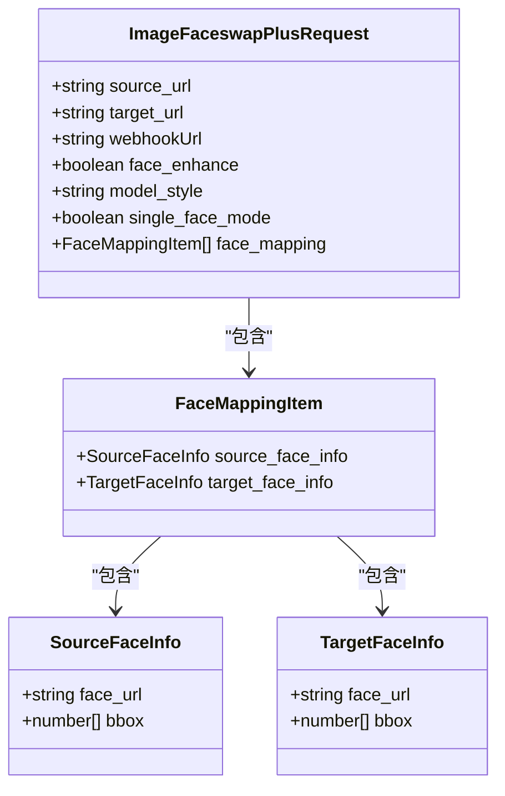

# Face Swap Plus (推荐)

<cite>
**本文引用的文件**
- [faceswap-plus.mdx](file://ai-tools-suite/faceswap/faceswap-plus.mdx)
- [faceswap.yaml](file://openapi/faceswap.yaml)
- [get-result.mdx](file://ai-tools-suite/faceswap/get-result.mdx)
- [delete-result.mdx](file://ai-tools-suite/faceswap/delete-result.mdx)
- [face-detect.mdx](file://ai-tools-suite/faceswap/face-detect.mdx)
- [detect-faces.mdx](file://ai-tools-suite/face-detection/detect-faces.mdx)
- [image-faceswap.mdx](file://ai-tools-suite/faceswap/image-faceswap.mdx)
- [video-faceswap.mdx](file://ai-tools-suite/faceswap/video-faceswap.mdx)
- [image-faceswap-v4.mdx](file://ai-tools-suite/faceswap/image-faceswap-v4.mdx)
- [get-credit.mdx](file://ai-tools-suite/faceswap/get-credit.mdx)
</cite>

## 目录
1. [简介](#简介)
2. [项目结构](#项目结构)
3. [核心组件](#核心组件)
4. [架构总览](#架构总览)
5. [详细组件分析](#详细组件分析)
6. [依赖分析](#依赖分析)
7. [性能考虑](#性能考虑)
8. [故障排查指南](#故障排查指南)
9. [结论](#结论)
10. [附录](#附录)

## 简介
Face Swap Plus 是一个统一的人像交换 API，同时支持图片与视频的人脸交换，并提供“单人脸模式”和“多人脸模式”。其核心优势包括：
- 统一接口：同一套 API 同时支持图片与视频
- 多人脸交换：通过 face_mapping 参数定义多个源目标人脸映射关系
- 单人脸模式：无需预检测，直接提供源图与目标图即可完成交换
- 风格选择：支持 realistic、beautify、lossless 三种风格
- 异步处理：视频交换为异步流程，支持 webhook 回调或轮询查询结果

该文档将从系统架构、端点设计、参数详解、请求示例、最佳实践等维度进行深入说明，并重点讲解 face_mapping 的使用方法与 single_face_mode 的适用场景。

## 项目结构
本仓库中与 Face Swap Plus 相关的文档与 OpenAPI 定义主要分布在以下位置：
- ai-tools-suite/faceswap：Face Swap 相关的用户文档（含 API 使用说明、示例与注意事项）
- openapi/faceswap.yaml：OpenAPI 规范，定义了端点、请求/响应模型与参数约束
- ai-tools-suite/face-detection：人脸检测文档，用于生成 opts 或返回 face_urls，支撑 Face Swap Plus 的多人脸模式

图表来源
- [faceswap-plus.mdx:1-227](file://ai-tools-suite/faceswap/faceswap-plus.mdx#L1-L227)
- [faceswap.yaml:1-632](file://openapi/faceswap.yaml#L1-L632)

章节来源
- [faceswap-plus.mdx:1-227](file://ai-tools-suite/faceswap/faceswap-plus.mdx#L1-L227)
- [faceswap.yaml:1-632](file://openapi/faceswap.yaml#L1-L632)

## 核心组件
- 统一交换接口：支持图片与视频的人脸交换，端点为 /api/open/v4/faceswap/faceswapPlusByImage
- 多人脸映射：通过 face_mapping 数组定义多个源目标人脸配对
- 单人脸模式：single_face_mode=true 时，简化输入，无需 face_mapping
- 风格控制：model_style 支持 realistic、beautify、lossless
- 异步结果：视频交换为异步任务，可通过 webhookUrl 或轮询 /api/open/v3/faceswap/result/listbyids 获取结果
- 资源有效期：生成的资源（图片、视频、语音）有效期为 7 天，需及时保存

章节来源
- [faceswap-plus.mdx:12-29](file://ai-tools-suite/faceswap/faceswap-plus.mdx#L12-L29)
- [faceswap-plus.mdx:40-51](file://ai-tools-suite/faceswap/faceswap-plus.mdx#L40-L51)
- [faceswap-plus.mdx:66-73](file://ai-tools-suite/faceswap/faceswap-plus.mdx#L66-L73)
- [faceswap-plus.mdx:217-227](file://ai-tools-suite/faceswap/faceswap-plus.mdx#L217-L227)
- [faceswap.yaml:103-164](file://openapi/faceswap.yaml#L103-L164)

## 架构总览
下图展示了 Face Swap Plus 的整体交互流程：客户端提交请求到 faceswapPlusByImage，服务端根据 single_face_mode 或 face_mapping 进行处理；视频交换为异步任务，完成后通过 webhook 或轮询返回结果。

图表来源
- [faceswap-plus.mdx:154-214](file://ai-tools-suite/faceswap/faceswap-plus.mdx#L154-L214)
- [faceswap.yaml:103-164](file://openapi/faceswap.yaml#L103-L164)
- [get-result.mdx:1-21](file://ai-tools-suite/faceswap/get-result.mdx#L1-L21)

## 详细组件分析

### API 端点与请求参数
- 端点：POST /api/open/v4/faceswap/faceswapPlusByImage
- 请求体模型：ImageFaceswapPlusRequest
- 关键参数：
  - source_url：源（新）人脸图片 URL
  - target_url：目标材料 URL（图片或视频）
  - webhookUrl：回调 URL（视频交换常用）
  - face_enhance：是否启用面部增强（默认 false）
  - model_style：模型风格（realistic 默认，beautify，lossless）
  - single_face_mode：是否启用单人脸模式（默认 false）
  - face_mapping：多人脸映射数组（仅在 single_face_mode=false 时需要）

章节来源
- [faceswap-plus.mdx:39-51](file://ai-tools-suite/faceswap/faceswap-plus.mdx#L39-L51)
- [faceswap-plus.mdx:52-65](file://ai-tools-suite/faceswap/faceswap-plus.mdx#L52-L65)
- [faceswap-plus.mdx:66-73](file://ai-tools-suite/faceswap/faceswap-plus.mdx#L66-L73)
- [faceswap.yaml:480-520](file://openapi/faceswap.yaml#L480-L520)

### FaceMappingItem 结构与 bbox 规则
- source_face_info/target_face_info 均包含：
  - face_url：人脸图片 URL
  - bbox：可选，格式 [x1, y1, x2, y2]
- bbox 的必要性取决于 face_url 来源：
  - 若 face_url 来自人脸检测 API 返回的 face_urls，则无需 bbox
  - 若 face_url 来自用户上传的原图 URL，则必须提供 bbox，且 bbox 可由检测 API 的 crop_region 转换而来

章节来源
- [faceswap-plus.mdx:74-85](file://ai-tools-suite/faceswap/faceswap-plus.mdx#L74-L85)
- [faceswap.yaml:362-410](file://openapi/faceswap.yaml#L362-L410)

### 单人脸模式与多人脸模式对比
- 单人脸模式（single_face_mode=true）：
  - 无需 face_mapping
  - 输入更简单，适合快速单人交换
- 多人脸模式（single_face_mode=false，默认）：
  - 必须提供 face_mapping
  - 支持多对多映射，适合群像交换

章节来源
- [faceswap-plus.mdx:25-29](file://ai-tools-suite/faceswap/faceswap-plus.mdx#L25-L29)
- [faceswap-plus.mdx:66-73](file://ai-tools-suite/faceswap/faceswap-plus.mdx#L66-L73)
- [faceswap-plus.mdx:52-65](file://ai-tools-suite/faceswap/faceswap-plus.mdx#L52-L65)

### 请求与响应示例
- 图片单人脸交换示例（单人脸模式）
- 图片多人脸交换示例（使用 face_urls，无需 bbox）
- 图片多人脸交换示例（使用原图 URL，需提供 bbox）
- 视频单人脸交换示例
- 视频多人脸交换示例
- 视频交换带 webhook 示例

章节来源
- [faceswap-plus.mdx:90-150](file://ai-tools-suite/faceswap/faceswap-plus.mdx#L90-L150)
- [faceswap-plus.mdx:168-214](file://ai-tools-suite/faceswap/faceswap-plus.mdx#L168-L214)

### 与人脸检测 API 的集成
- 人脸检测 API 可返回：
  - crop_landmarks：可用于 Face Swap Pro 的 opts 参数
  - face_urls：可直接作为 Face Swap Plus 的 face_url，无需 bbox
  - crop_region：可转换为 bbox 供 Face Swap Plus 使用
- 建议在多人脸模式下优先使用 return_face_url 获取 face_urls，以避免手动提供 bbox

章节来源
- [detect-faces.mdx:1-183](file://ai-tools-suite/face-detection/detect-faces.mdx#L1-L183)
- [face-detect.mdx:1-122](file://ai-tools-suite/faceswap/face-detect.mdx#L1-L122)
- [faceswap-plus.mdx:74-85](file://ai-tools-suite/faceswap/faceswap-plus.mdx#L74-L85)

### 结果查询与清理
- 查询结果：GET /api/open/v3/faceswap/result/listbyids
- 删除结果：POST /api/open/v3/faceswap/result/delbyids
- 结果状态：1（排队）、2（处理中）、3（成功）、4（失败）

章节来源
- [get-result.mdx:1-21](file://ai-tools-suite/faceswap/get-result.mdx#L1-L21)
- [delete-result.mdx:1-13](file://ai-tools-suite/faceswap/delete-result.mdx#L1-L13)
- [faceswap.yaml:200-272](file://openapi/faceswap.yaml#L200-L272)

### 与其他 Face Swap API 的关系
- Face Swap Plus：统一图片/视频、支持单/多人脸、支持风格选择
- Face Swap Pro（V4）：更高品质的图片交换，支持批量与 opts 参数
- 传统高质图片/视频交换：已标记为 V3 兼容 API，推荐优先使用 Face Swap Plus

章节来源
- [faceswap-plus.mdx:30-38](file://ai-tools-suite/faceswap/faceswap-plus.mdx#L30-L38)
- [image-faceswap-v4.mdx:1-136](file://ai-tools-suite/faceswap/image-faceswap-v4.mdx#L1-L136)
- [image-faceswap.mdx:1-24](file://ai-tools-suite/faceswap/image-faceswap.mdx#L1-L24)
- [video-faceswap.mdx:1-20](file://ai-tools-suite/faceswap/video-faceswap.mdx#L1-L20)

## 依赖分析
- Face Swap Plus 依赖 OpenAPI 规范中的 ImageFaceswapPlusRequest 模型与相关枚举值
- 多人脸模式可与人脸检测 API 协同工作，通过 return_face_url 或 crop_region/bbox 提供输入
- 视频交换依赖异步结果查询或 webhook 回调机制

图表来源
- [faceswap.yaml:480-520](file://openapi/faceswap.yaml#L480-L520)
- [faceswap.yaml:362-410](file://openapi/faceswap.yaml#L362-L410)

章节来源
- [faceswap.yaml:273-632](file://openapi/faceswap.yaml#L273-L632)

## 性能考虑
- 视频时长建议：保持在 60 秒以内，以获得更短的处理时间
- 视频格式：MP4、MOV、AVI 支持，推荐 H.264 编码
- 分辨率：高分辨率视频会增加处理时间
- 人脸数量：建议限制在 8 个以内，以保证效果与速度
- 单人脸模式：在仅需单人交换时启用，可减少数据准备与计算开销
- webhook 与轮询：视频交换采用异步方式，合理设置 webhook 或轮询频率，避免频繁请求

章节来源
- [faceswap-plus.mdx:160-167](file://ai-tools-suite/faceswap/faceswap-plus.mdx#L160-L167)
- [faceswap-plus.mdx:154-158](file://ai-tools-suite/faceswap/faceswap-plus.mdx#L154-L158)

## 故障排查指南
- 视频交换未返回结果：检查 webhookUrl 是否正确配置，或使用 /api/open/v3/faceswap/result/listbyids 轮询查询
- 人脸映射错误：确认 face_mapping 中每个条目的 source_face_info/target_face_info 字段完整；若 face_url 来自用户上传的原图，请确保提供正确的 bbox
- 资源过期：生成的图片/视频/语音资源有效期为 7 天，请及时保存
- 余额不足：通过 /api/open/v3/faceswap/quota/info 查询账户余额，确保有足够积分

章节来源
- [faceswap-plus.mdx:7-10](file://ai-tools-suite/faceswap/faceswap-plus.mdx#L7-L10)
- [get-result.mdx:1-21](file://ai-tools-suite/faceswap/get-result.mdx#L1-L21)
- [get-credit.mdx:1-13](file://ai-tools-suite/faceswap/get-credit.mdx#L1-L13)

## 结论
Face Swap Plus 通过统一的接口与灵活的单/多人脸模式，满足图片与视频的人脸交换需求。配合人脸检测 API，可快速构建高质量的人脸交换应用。建议在单人场景使用 single_face_mode，在群像或多对多映射场景使用 face_mapping，并结合 webhook 或轮询机制管理异步任务。

## 附录

### API 端点一览
- POST /api/open/v4/faceswap/faceswapPlusByImage：统一图片/视频人脸交换
- GET /api/open/v3/faceswap/result/listbyids：按 ID 列表查询结果
- POST /api/open/v3/faceswap/result/delbyids：按 ID 删除结果
- GET /api/open/v3/faceswap/quota/info：查询用户余额

章节来源
- [faceswap.yaml:103-164](file://openapi/faceswap.yaml#L103-L164)
- [faceswap.yaml:200-272](file://openapi/faceswap.yaml#L200-L272)
- [faceswap.yaml:226-244](file://openapi/faceswap.yaml#L226-L244)

### 请求参数速查
- source_url：源（新）人脸图片 URL
- target_url：目标材料 URL（图片或视频）
- webhookUrl：回调 URL（视频交换常用）
- face_enhance：是否启用面部增强（默认 false）
- model_style：模型风格（realistic 默认，beautify，lossless）
- single_face_mode：是否启用单人脸模式（默认 false）
- face_mapping：多人脸映射数组（仅在 single_face_mode=false 时需要）

章节来源
- [faceswap-plus.mdx:39-51](file://ai-tools-suite/faceswap/faceswap-plus.mdx#L39-L51)
- [faceswap-plus.mdx:52-65](file://ai-tools-suite/faceswap/faceswap-plus.mdx#L52-L65)
- [faceswap-plus.mdx:66-73](file://ai-tools-suite/faceswap/faceswap-plus.mdx#L66-L73)
- [faceswap.yaml:480-520](file://openapi/faceswap.yaml#L480-L520)