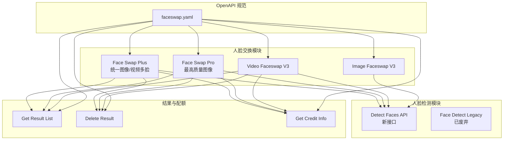
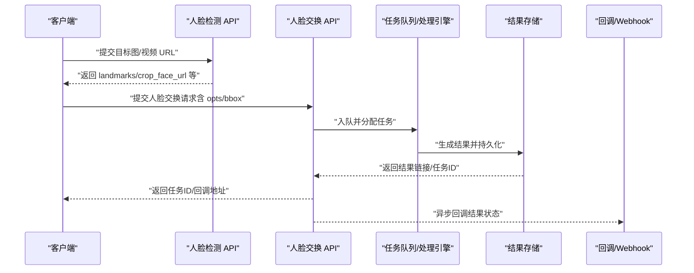
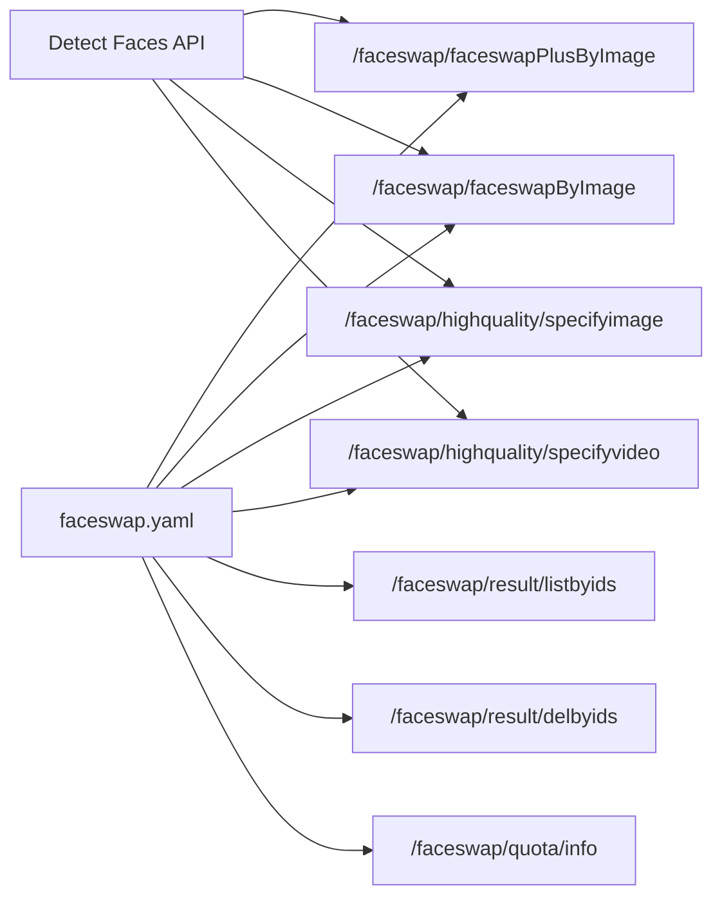

# 人脸交换系统

<cite>
**本文引用的文件列表**
- [faceswap-plus.mdx](file://ai-tools-suite/faceswap/faceswap-plus.mdx)
- [image-faceswap-v4.mdx](file://ai-tools-suite/faceswap/image-faceswap-v4.mdx)
- [video-faceswap.mdx](file://ai-tools-suite/faceswap/video-faceswap.mdx)
- [image-faceswap.mdx](file://ai-tools-suite/faceswap/image-faceswap.mdx)
- [face-detect.mdx](file://ai-tools-suite/faceswap/face-detect.mdx)
- [detect-faces.mdx](file://ai-tools-suite/face-detection/detect-faces.mdx)
- [get-result.mdx](file://ai-tools-suite/faceswap/get-result.mdx)
- [delete-result.mdx](file://ai-tools-suite/faceswap/delete-result.mdx)
- [get-credit.mdx](file://ai-tools-suite/faceswap/get-credit.mdx)
- [faceswap.yaml](file://openapi/faceswap.yaml)
- [error-code.mdx](file://ai-tools-suite/error-code.mdx)
- [jssdk-start.mdx](file://sdk/jssdk-start.mdx)
- [jssdk-best-practice.mdx](file://sdk/jssdk-best-practice.mdx)
- [live-avatar.mdx](file://ai-tools-suite/live-avatar.mdx)
</cite>

## 目录
1. [简介](#简介)
2. [项目结构](#项目结构)
3. [核心组件](#核心组件)
4. [架构总览](#架构总览)
5. [详细组件分析](#详细组件分析)
6. [依赖关系分析](#依赖关系分析)
7. [性能与质量建议](#性能与质量建议)
8. [故障排除指南](#故障排除指南)
9. [结论](#结论)
10. [附录：API 参考与最佳实践](#附录api-参考与最佳实践)

## 简介
本技术文档面向开发者与集成方，系统性阐述 Akool 人脸交换系统的算法原理、技术架构与实现细节。文档覆盖以下关键能力：
- 多版本人脸交换 API 的功能差异与适用场景：Face Swap Plus（统一图像/视频多脸）、Face Swap Pro（最高质量图像单/多脸）、Image Faceswap V3/V4、Video Faceswap（V3 兼容）。
- 完整的 API 接口说明、请求参数详解、响应格式与错误码。
- 结果管理（查询、删除）、账户与配额管理、实用工具（人脸检测）的使用方法。
- 面向开发者的集成指南与性能优化、质量控制、故障排查建议。

## 项目结构
该仓库以“文档 + OpenAPI 规范”为主，围绕人脸交换相关能力提供分模块文档与接口定义：
- ai-tools-suite/faceswap：人脸交换各版本 API 文档与结果管理
- ai-tools-suite/face-detection：人脸检测 API 文档
- openapi：OpenAPI 描述文件，定义了各端点、请求/响应模型与安全方案
- sdk：SDK 快速开始与最佳实践（与人脸交换无直接耦合，但可作为前端集成参考）
- ai-tools-suite/error-code：通用错误码说明
- ai-tools-suite/live-avatar：直播虚拟人 API（与人脸交换同属 AI 工具套件）

图表来源
- [faceswap-plus.mdx:1-227](file://ai-tools-suite/faceswap/faceswap-plus.mdx#L1-L227)
- [image-faceswap-v4.mdx:1-136](file://ai-tools-suite/faceswap/image-faceswap-v4.mdx#L1-L136)
- [video-faceswap.mdx:1-20](file://ai-tools-suite/faceswap/video-faceswap.mdx#L1-L20)
- [detect-faces.mdx:1-183](file://ai-tools-suite/face-detection/detect-faces.mdx#L1-L183)
- [faceswap.yaml:1-632](file://openapi/faceswap.yaml#L1-L632)

章节来源
- [faceswap-plus.mdx:1-227](file://ai-tools-suite/faceswap/faceswap-plus.mdx#L1-L227)
- [image-faceswap-v4.mdx:1-136](file://ai-tools-suite/faceswap/image-faceswap-v4.mdx#L1-L136)
- [video-faceswap.mdx:1-20](file://ai-tools-suite/faceswap/video-faceswap.mdx#L1-L20)
- [detect-faces.mdx:1-183](file://ai-tools-suite/face-detection/detect-faces.mdx#L1-L183)
- [faceswap.yaml:1-632](file://openapi/faceswap.yaml#L1-L632)

## 核心组件
- Face Swap Plus（统一图像/视频多脸）
  - 支持单脸/多脸模式；支持风格选择（真实、美化、无损）；支持异步回调。
  - 适用于需要在图片或视频中进行多张脸互换的场景。
- Face Swap Pro（最高质量图像）
  - 图像专用，强调“更真实、更相似”，简化集成（单脸时 opts 可选），支持批量（最多 50 对）。
  - 适用于对图像质量要求极高的单/多脸替换。
- Image Faceswap V3/V4
  - V3 为经典图像接口；V4 引入 akool_faceswap_image_hq 模型与更严格的参数校验。
- Video Faceswap（V3 兼容）
  - 用于高质量视频人脸替换，适合长视频与复杂场景。
- 人脸检测（Detect Faces）
  - 提供 6 点关键点、裁剪人脸 URL、单脸模式等，为人脸交换提供 opts 与 bbox。
- 结果管理与配额
  - 查询结果状态、删除历史结果、查询账户余额。

章节来源
- [faceswap-plus.mdx:21-38](file://ai-tools-suite/faceswap/faceswap-plus.mdx#L21-L38)
- [image-faceswap-v4.mdx:12-21](file://ai-tools-suite/faceswap/image-faceswap-v4.mdx#L12-L21)
- [image-faceswap.mdx:16-23](file://ai-tools-suite/faceswap/image-faceswap.mdx#L16-L23)
- [detect-faces.mdx:11-23](file://ai-tools-suite/face-detection/detect-faces.mdx#L11-L23)

## 架构总览
整体架构由“客户端/服务端调用 + OpenAPI 规范 + 人脸检测前置 + 结果管理 + 账户配额”构成。人脸交换请求通过 OpenAPI 端点提交，人脸检测为可选前置步骤，结果通过查询端点或回调通知返回。

图表来源
- [detect-faces.mdx:1-183](file://ai-tools-suite/face-detection/detect-faces.mdx#L1-L183)
- [faceswap-plus.mdx:154-214](file://ai-tools-suite/faceswap/faceswap-plus.mdx#L154-L214)
- [image-faceswap-v4.mdx:61-136](file://ai-tools-suite/faceswap/image-faceswap-v4.mdx#L61-L136)
- [faceswap.yaml:13-272](file://openapi/faceswap.yaml#L13-L272)

## 详细组件分析

### Face Swap Plus（统一图像/视频多脸）
- 功能要点
  - 单脸/多脸模式切换；风格选择；异步处理与回调。
  - 多脸映射 face_mapping 支持 source/target face_url 与 bbox；当使用人脸检测返回的 face_urls 时，无需 bbox。
- 请求参数
  - 核心字段：source_url、target_url、webhookUrl、face_enhance、model_style、single_face_mode。
  - 多脸模式需提供 face_mapping 数组，每项包含 source_face_info/target_face_info，分别含 face_url 与可选 bbox。
- 响应与状态
  - 返回 data._id、data.job_id；通过“按 ID 列表查询结果”接口轮询状态。
- 使用建议
  - 单脸场景优先 single_face_mode；多脸场景提供 face_mapping 并确保 source/target 一一对应。
  - 视频场景注意时长与编码，避免超限。

章节来源
- [faceswap-plus.mdx:39-227](file://ai-tools-suite/faceswap/faceswap-plus.mdx#L39-L227)
- [faceswap.yaml:103-163](file://openapi/faceswap.yaml#L103-L163)

### Face Swap Pro（最高质量图像）
- 功能要点
  - akool_faceswap_image_hq 模型；单脸/多脸均可用；单脸时 opts 可选，多脸时必须提供 opts。
  - 支持批量（最多 50 对）；简化集成流程。
- 请求参数
  - sourceImage/targetImage：数组，每项包含 path（必填，有效 HTTP/HTTPS URL）与 opts（条件必填）。
  - model_name（默认 akool_faceswap_image_hq）、webhookUrl、face_enhance、single_face_mode。
- 参数校验规则
  - 当 sourceImage 或 targetImage 长度 > 1 时，所有元素的 opts 必须提供；否则拒绝请求。
- 使用建议
  - 单脸场景 opts 可选但推荐提供；多脸场景务必提供 opts 以提升对齐精度。

章节来源
- [image-faceswap-v4.mdx:22-136](file://ai-tools-suite/faceswap/image-faceswap-v4.mdx#L22-L136)
- [faceswap.yaml:426-479](file://openapi/faceswap.yaml#L426-L479)

### Image Faceswap V3/V4
- V3（经典图像）
  - 通过 modifyImage 字段指定目标图；支持 opts 与 face_enhance；模型选择可通过 face_enhance 控制。
- V4（最高质量图像）
  - 使用 akool_faceswap_image_hq 模型；参数校验更严格；支持批量与简化 opts 使用。
- 使用建议
  - 新项目优先使用 V4；如需兼容旧模型或特定效果，可参考 V3 的模型选择说明。

章节来源
- [image-faceswap.mdx:16-23](file://ai-tools-suite/faceswap/image-faceswap.mdx#L16-L23)
- [faceswap.yaml:14-55](file://openapi/faceswap.yaml#L14-L55)
- [faceswap.yaml:56-101](file://openapi/faceswap.yaml#L56-L101)

### Video Faceswap（V3 兼容）
- 功能要点
  - 高质量视频人脸替换；需提供 sourceImage/targetImage（经人脸检测后的裁剪图）与 modifyVideo。
  - 注意 sourceImage 与 targetImage 的顺序需一一对应。
- 使用建议
  - 优先使用 Face Swap Plus 进行统一处理；仅在需要 V3 行为时使用此接口。

章节来源
- [video-faceswap.mdx:12-19](file://ai-tools-suite/faceswap/video-faceswap.mdx#L12-L19)
- [faceswap.yaml:165-199](file://openapi/faceswap.yaml#L165-L199)

### 人脸检测（Detect Faces）
- 功能要点
  - 支持 URL 与 base64 输入；可返回裁剪人脸 URL、单脸模式、关键点 landmarks_str 等。
  - landmarks_str 可直接作为人脸交换 API 的 opts 参数。
- 关键参数
  - url/img（二选一）、num_frames（视频分析帧数）、return_face_url、single_face。
- 使用建议
  - 图像场景建议开启 return_face_url 获取 face_urls，避免 bbox 计算；视频场景根据时长与帧数平衡质量与性能。

章节来源
- [detect-faces.mdx:11-183](file://ai-tools-suite/face-detection/detect-faces.mdx#L11-L183)
- [face-detect.mdx:1-122](file://ai-tools-suite/faceswap/face-detect.mdx#L1-L122)

### 结果管理与配额
- 查询结果
  - GET /api/open/v3/faceswap/result/listbyids，传入逗号分隔的 _ids，返回结果列表。
- 删除结果
  - POST /api/open/v3/faceswap/result/delbyids，传入逗号分隔的 _ids，不可逆操作。
- 账户配额
  - GET /api/open/v3/faceswap/quota/info，查询当前余额；提交请求会扣减配额。

章节来源
- [get-result.mdx:1-21](file://ai-tools-suite/faceswap/get-result.mdx#L1-L21)
- [delete-result.mdx:1-13](file://ai-tools-suite/faceswap/delete-result.mdx#L1-L13)
- [get-credit.mdx:1-13](file://ai-tools-suite/faceswap/get-credit.mdx#L1-L13)
- [faceswap.yaml:200-272](file://openapi/faceswap.yaml#L200-L272)

## 依赖关系分析
- 人脸交换 API 依赖 OpenAPI 规范中的路径、模型与安全方案。
- 人脸检测为可选前置步骤，用于提供 opts 与 bbox，提升对齐精度。
- 结果管理与配额独立于交换逻辑，通过 ID 列表查询与删除，余额查询保障计费透明。

图表来源
- [faceswap.yaml:13-272](file://openapi/faceswap.yaml#L13-L272)
- [detect-faces.mdx:1-183](file://ai-tools-suite/face-detection/detect-faces.mdx#L1-L183)

章节来源
- [faceswap.yaml:1-632](file://openapi/faceswap.yaml#L1-L632)

## 性能与质量建议
- 图像质量
  - 人脸清晰、正面、无遮挡；尽量使用裁剪后的人脸图（return_face_url）以减少 bbox 计算误差。
- 视频处理
  - 时长建议小于 60 秒；分辨率与编码（H.264）影响处理时间；限制人脸数量（建议 ≤ 8）。
- 模型与风格
  - Face Swap Pro 强调真实与相似；Face Swap Plus 支持风格选择（realistic/beautify/lossless）。
- 批量与并发
  - Face Swap Pro 支持最多 50 对；合理拆分请求，避免超时与资源争用。
- 回调与轮询
  - 视频场景建议使用 webhookUrl；图片场景可轮询“按 ID 列表查询结果”。

章节来源
- [faceswap-plus.mdx:160-167](file://ai-tools-suite/faceswap/faceswap-plus.mdx#L160-L167)
- [image-faceswap-v4.mdx:55-59](file://ai-tools-suite/faceswap/image-faceswap-v4.mdx#L55-L59)

## 故障排除指南
- 常见错误码
  - 1000：成功；1003：参数错误；1006：配额不足；1015：视频处理错误；1016：人脸交换错误；1101/1102：令牌无效或为空；1204/1207/1209/1210：视频时长/大小/编码/帧率超限。
- 状态码对照
  - 1：排队；2：处理中；3：成功；4：失败。
- 排查步骤
  - 确认输入 URL 可访问且格式正确；检查人脸检测返回的 landmarks_str/face_urls 是否正确传递；核对 opts 与 bbox 的提供规则；监控配额余额；使用 webhook 或轮询查询结果。

章节来源
- [error-code.mdx:1-59](file://ai-tools-suite/error-code.mdx#L1-L59)
- [get-result.mdx:12-19](file://ai-tools-suite/faceswap/get-result.mdx#L12-L19)

## 结论
Akool 人脸交换系统提供从高精图像到视频的全链路解决方案。Face Swap Pro 专注图像最高质量，Face Swap Plus 统一处理图像/视频多脸场景，Video Faceswap 保留 V3 兼容路径。配合人脸检测与结果管理、配额查询，开发者可快速构建稳定、可扩展的人脸交换应用。

## 附录：API 参考与最佳实践

### OpenAPI 端点与模型概览
- 图像人脸交换（V3）
  - POST /api/open/v3/faceswap/highquality/specifyimage
  - 请求体：targetImage/sourceImage/modifyImage/face_enhance/webhookUrl
  - 响应：data._id、data.url、data.job_id
- 图像人脸交换（V4）
  - POST /api/open/v4/faceswap/faceswapByImage
  - 请求体：sourceImage/targetImage/model_name/webhookUrl/face_enhance/single_face_mode
  - 响应：data._id、data.job_id
- 统一图像/视频多脸
  - POST /api/open/v4/faceswap/faceswapPlusByImage
  - 请求体：source_url/target_url/webhookUrl/face_enhance/model_style/face_mapping/single_face_mode
  - 响应：data._id、data.job_id
- 视频人脸交换（V3）
  - POST /api/open/v3/faceswap/highquality/specifyvideo
  - 请求体：sourceImage/targetImage/face_enhance/modifyVideo/webhookUrl
  - 响应：data._id、data.job_id
- 结果查询与删除
  - GET /api/open/v3/faceswap/result/listbyids?_ids=...
  - POST /api/open/v3/faceswap/result/delbyids（_ids 逗号分隔）
- 配额查询
  - GET /api/open/v3/faceswap/quota/info

章节来源
- [faceswap.yaml:14-272](file://openapi/faceswap.yaml#L14-L272)

### 人脸检测（Detect Faces）最佳实践
- URL 要求：HTTPS、公开可访问；视频 num_frames：短（5-10）、中（10-20）、长（20-50）按需选择。
- 单脸模式：仅返回最大人脸，降低后续对齐成本。
- 裁剪人脸 URL：开启 return_face_url 可直接用于交换，避免 bbox 计算。

章节来源
- [detect-faces.mdx:178-183](file://ai-tools-suite/face-detection/detect-faces.mdx#L178-L183)

### 集成与安全建议（参考 SDK 最佳实践）
- 后端代理：敏感密钥与令牌仅在服务端持有，前端通过后端转发请求。
- 事件监听与清理：SDK 示例展示了事件注册、消息收发与会话关闭的最佳实践，可借鉴到前端集成中。
- 令牌与配额：结合配额查询接口，实现自动续费与额度告警。

章节来源
- [jssdk-start.mdx:30-112](file://sdk/jssdk-start.mdx#L30-L112)
- [jssdk-best-practice.mdx:30-112](file://sdk/jssdk-best-practice.mdx#L30-L112)
- [get-credit.mdx:7-12](file://ai-tools-suite/faceswap/get-credit.mdx#L7-L12)