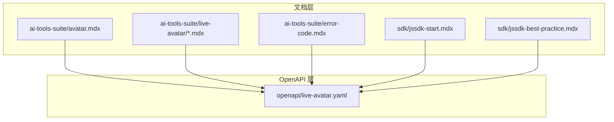
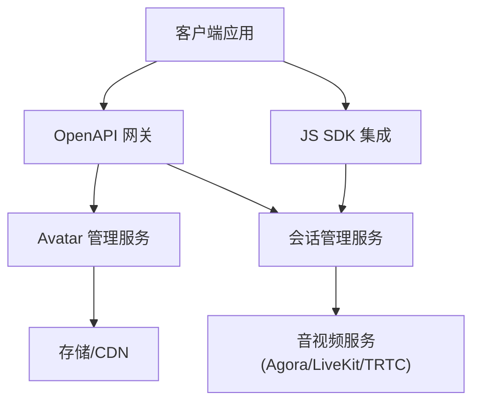
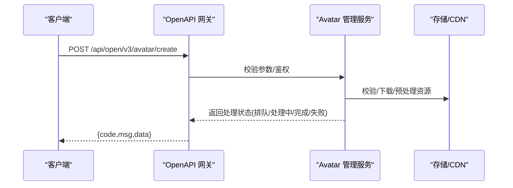
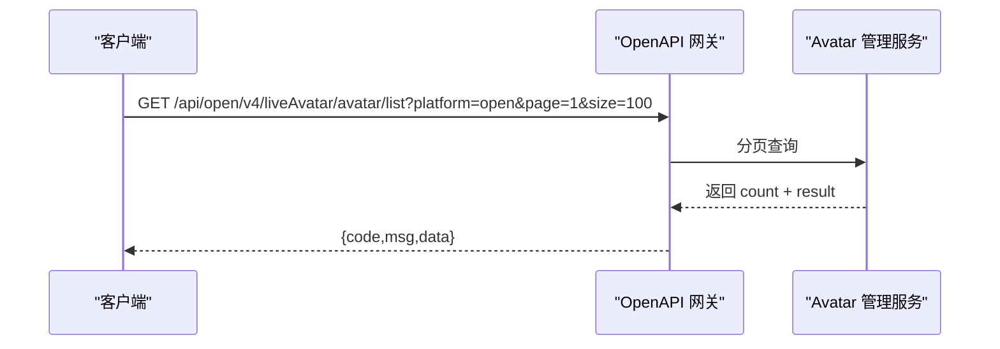
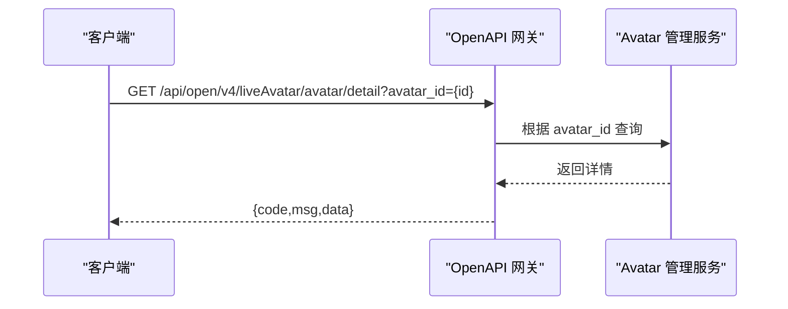
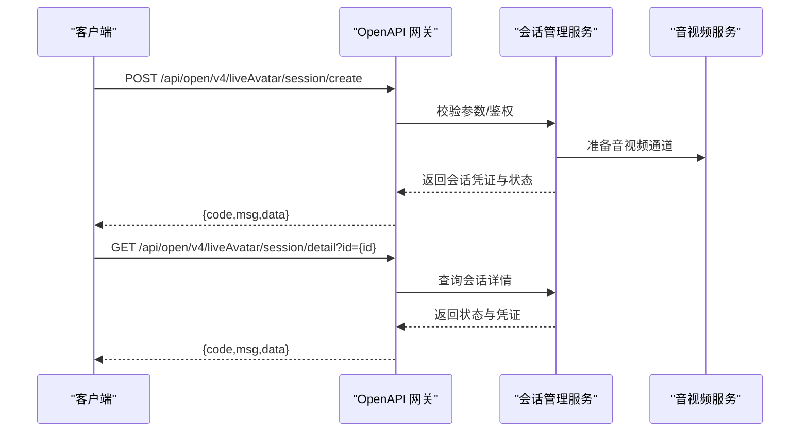
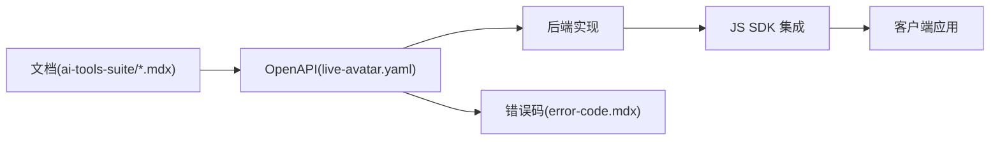

# Avatar 管理

<cite>
**本文引用的文件**
- [avatar.mdx](file://ai-tools-suite/avatar.mdx)
- [live-avatar.yaml](file://openapi/live-avatar.yaml)
- [error-code.mdx](file://ai-tools-suite/error-code.mdx)
- [jssdk-start.mdx](file://sdk/jssdk-start.mdx)
- [jssdk-best-practice.mdx](file://sdk/jssdk-best-practice.mdx)
- [upload.mdx](file://ai-tools-suite/live-avatar/upload.mdx)
- [list.mdx](file://ai-tools-suite/live-avatar/list.mdx)
- [detail.mdx](file://ai-tools-suite/live-avatar/detail.mdx)
- [create-session.mdx](file://ai-tools-suite/live-avatar/create-session.mdx)
- [list-sessions.mdx](file://ai-tools-suite/live-avatar/list-sessions.mdx)
- [session-detail.mdx](file://ai-tools-suite/live-avatar/session-detail.mdx)
- [close-session.mdx](file://ai-tools-suite/live-avatar/close-session.mdx)
</cite>

## 目录
1. [简介](#简介)
2. [项目结构](#项目结构)
3. [核心组件](#核心组件)
4. [架构总览](#架构总览)
5. [详细组件分析](#详细组件分析)
6. [依赖关系分析](#依赖关系分析)
7. [性能与质量建议](#性能与质量建议)
8. [故障排查指南](#故障排查指南)
9. [结论](#结论)
10. [附录](#附录)

## 简介
本技术文档围绕流媒体虚拟主播的 Avatar 管理能力，系统性梳理了 Avatar 上传、列表查询、详情查询以及生命周期管理相关的接口与规范，并结合 OpenAPI 规范与官方文档，给出请求参数、响应格式、错误码说明与最佳实践建议。读者可据此快速实现 Avatar 的全生命周期管理，包括上传、检索、状态跟踪与会话集成。

## 项目结构
该仓库以“文档+OpenAPI”的方式组织流媒体相关能力：
- 文档层：ai-tools-suite 下的各模块文档，涵盖 Avatar、Live Avatar、会话管理等
- OpenAPI 层：openapi 目录下的 live-avatar.yaml，定义了 Avatar 与会话管理的接口契约
- SDK 层：sdk 目录下的 JS SDK 快速开始与最佳实践，便于前端集成

图表来源
- [avatar.mdx](file://ai-tools-suite/avatar.mdx)
- [live-avatar.yaml](file://openapi/live-avatar.yaml)

章节来源
- [avatar.mdx](file://ai-tools-suite/avatar.mdx)
- [live-avatar.yaml](file://openapi/live-avatar.yaml)

## 核心组件
- Avatar 上传（Create Avatar）
  - 功能：从视频 URL 创建流式 Avatar 模板，返回处理状态与标识
  - 关键参数：url、avatar_id、name、type、url_from
  - 响应字段：包含 _id、avatar_id、url、status 等
- Avatar 列表（List Avatars）
  - 功能：按平台类型、分页参数查询可用 Avatar
  - 关键参数：platform、page、size
  - 响应字段：count、result 数组（每项含 _id、avatar_id、url、available 等）
- Avatar 详情（Avatar Detail）
  - 功能：根据 avatar_id 查询单个 Avatar 的详细信息
  - 关键参数：avatar_id
  - 响应字段：_id、uid、type、from、avatar_id、name、url、thumbnailUrl、gender、available 等
- 会话管理（Session Management）
  - 功能：创建、查询、关闭 Avatar 实时会话；支持多平台（Agora/LiveKit/TRTC）
  - 关键参数：avatar_id、duration、voice_id/voice_url、language、mode_type、scene_mode、e2e_type、background_url、stream_type、credentials 等
  - 响应字段：_id、uid、type、status、stream_type、credentials 等

章节来源
- [avatar.mdx](file://ai-tools-suite/avatar.mdx)
- [live-avatar.yaml](file://openapi/live-avatar.yaml)

## 架构总览
下图展示了 Avatar 生命周期与会话管理的整体交互：客户端通过 OpenAPI 上传 Avatar、查询列表与详情；随后创建实时会话并与音视频服务对接。

图表来源
- [live-avatar.yaml](file://openapi/live-avatar.yaml)
- [jssdk-start.mdx](file://sdk/jssdk-start.mdx)

## 详细组件分析

### 组件一：Avatar 上传（Create Avatar）
- 接口路径与方法
  - POST /api/open/v3/avatar/create
- 请求头
  - x-api-key 或 Authorization（Bearer）
- 请求体参数
  - url：Avatar 资源链接（推荐约 1 分钟，人物在画面中轻微旋转且清晰）
  - avatar_id：唯一标识，仅允许字母数字
  - name：展示名称
  - type：Avatar 类型，2 表示流式 Avatar
  - url_from：资源来源，1 表示 Akool 链接，2 表示第三方链接（YouTube/TikTok/X/Google Drive）
- 响应字段
  - code、msg、data（数组，包含 _id、avatar_id、url、status 等）

图表来源
- [live-avatar.yaml](file://openapi/live-avatar.yaml)
- [avatar.mdx](file://ai-tools-suite/avatar.mdx)

章节来源
- [avatar.mdx](file://ai-tools-suite/avatar.mdx)
- [live-avatar.yaml](file://openapi/live-avatar.yaml)
- [upload.mdx](file://ai-tools-suite/live-avatar/upload.mdx)

### 组件二：Avatar 列表查询（List Avatars）
- 接口路径与方法
  - GET /api/open/v4/liveAvatar/avatar/list
- 查询参数
  - platform：open/aigc（默认 open）
  - page：页码，默认 1
  - size：每页数量，默认 100，最大 100
- 响应字段
  - code、msg、data.count、data.result（数组，每项含 _id、avatar_id、url、available 等）

图表来源
- [live-avatar.yaml](file://openapi/live-avatar.yaml)

章节来源
- [live-avatar.yaml](file://openapi/live-avatar.yaml)
- [list.mdx](file://ai-tools-suite/live-avatar/list.mdx)

### 组件三：Avatar 详情查询（Avatar Detail）
- 接口路径与方法
  - GET /api/open/v4/liveAvatar/avatar/detail
- 查询参数
  - avatar_id：Avatar 唯一标识
- 响应字段
  - code、msg、data（对象，包含 _id、uid、type、from、avatar_id、name、url、thumbnailUrl、gender、available 等）

图表来源
- [live-avatar.yaml](file://openapi/live-avatar.yaml)

章节来源
- [live-avatar.yaml](file://openapi/live-avatar.yaml)
- [detail.mdx](file://ai-tools-suite/live-avatar/detail.mdx)

### 组件四：会话管理（Session Management）
- 创建会话
  - POST /api/open/v4/liveAvatar/session/create
  - 参数：avatar_id、duration、voice_id/voice_url、language、mode_type、scene_mode、e2e_type、background_url、stream_type、credentials
  - 响应：_id、uid、type、status、stream_type、credentials
- 查询会话详情
  - GET /api/open/v4/liveAvatar/session/detail?id={id}
- 查询会话列表
  - GET /api/open/v4/liveAvatar/session/list?page=&size=&status=
- 关闭会话
  - POST /api/open/v4/liveAvatar/session/close

图表来源
- [live-avatar.yaml](file://openapi/live-avatar.yaml)
- [create-session.mdx](file://ai-tools-suite/live-avatar/create-session.mdx)
- [list-sessions.mdx](file://ai-tools-suite/live-avatar/list-sessions.mdx)
- [session-detail.mdx](file://ai-tools-suite/live-avatar/session-detail.mdx)
- [close-session.mdx](file://ai-tools-suite/live-avatar/close-session.mdx)

章节来源
- [live-avatar.yaml](file://openapi/live-avatar.yaml)
- [create-session.mdx](file://ai-tools-suite/live-avatar/create-session.mdx)
- [list-sessions.mdx](file://ai-tools-suite/live-avatar/list-sessions.mdx)
- [session-detail.mdx](file://ai-tools-suite/live-avatar/session-detail.mdx)
- [close-session.mdx](file://ai-tools-suite/live-avatar/close-session.mdx)

## 依赖关系分析
- 文档与 OpenAPI 的耦合
  - ai-tools-suite/avatar.mdx 与 openapi/live-avatar.yaml 对应，前者提供使用说明与示例，后者提供严格的契约定义
- SDK 与后端的协作
  - jssdk-start.mdx 与 jssdk-best-practice.mdx 提供前端集成与安全实践，强调后端代理敏感操作（如会话创建/关闭）
- 错误码统一
  - error-code.mdx 提供统一的业务错误码映射，便于前后端一致化处理

图表来源
- [avatar.mdx](file://ai-tools-suite/avatar.mdx)
- [live-avatar.yaml](file://openapi/live-avatar.yaml)
- [error-code.mdx](file://ai-tools-suite/error-code.mdx)
- [jssdk-start.mdx](file://sdk/jssdk-start.mdx)
- [jssdk-best-practice.mdx](file://sdk/jssdk-best-practice.mdx)

章节来源
- [avatar.mdx](file://ai-tools-suite/avatar.mdx)
- [live-avatar.yaml](file://openapi/live-avatar.yaml)
- [error-code.mdx](file://ai-tools-suite/error-code.mdx)
- [jssdk-start.mdx](file://sdk/jssdk-start.mdx)
- [jssdk-best-practice.mdx](file://sdk/jssdk-best-practice.mdx)

## 性能与质量建议
- 上传质量与格式
  - 建议上传约 1 分钟长的视频，人物在画面中轻微旋转且清晰，以提升建模与驱动效果
  - 支持第三方链接时，当前支持 YouTube、TikTok、X、Google Drive
- 分页与并发
  - 列表查询 size 建议不超过 100；对高频查询可考虑本地缓存与增量更新策略
- 会话时长与计费
  - 会话时长上限与计费规则由后端控制，建议在创建前校验用户配额与订阅状态
- 安全与鉴权
  - 使用 x-api-key 或 Authorization 进行鉴权；优先使用 Authorization（Bearer）
  - 前端避免直接暴露密钥，通过后端代理调用敏感接口

章节来源
- [avatar.mdx](file://ai-tools-suite/avatar.mdx)
- [live-avatar.yaml](file://openapi/live-avatar.yaml)
- [jssdk-best-practice.mdx](file://sdk/jssdk-best-practice.mdx)

## 故障排查指南
- 常见错误码
  - 1000：成功
  - 1003：参数错误
  - 1004：需要验证
  - 1005：操作过于频繁
  - 1006：配额不足
  - 1009：权限不足
  - 1014：资源不存在
  - 1015：视频处理错误
  - 1104：余额不足
  - 1200：账户被封禁
  - 1209：不支持的视频编码格式
  - 1210：帧率超限
  - 1214：liveAvatar 正在处理
  - 1215：liveAvatar 处理繁忙
  - 1216：liveAvatar 会话不存在
  - 1220：上传 Avatar 错误
  - 1223：上传超出限额
- 排查步骤
  - 确认鉴权头设置正确（x-api-key 或 Authorization）
  - 检查请求参数是否符合 OpenAPI 约束（如 avatar_id 仅允许字母数字）
  - 对于上传失败，检查资源可访问性与格式支持
  - 对于会话异常，确认会话状态与凭证有效性

章节来源
- [error-code.mdx](file://ai-tools-suite/error-code.mdx)
- [live-avatar.yaml](file://openapi/live-avatar.yaml)

## 结论
通过 OpenAPI 与文档的协同，Avatar 管理实现了从上传、检索到会话集成的完整闭环。建议开发者遵循统一的鉴权与错误码约定，结合 JS SDK 的最佳实践，构建安全、稳定、高性能的流媒体虚拟主播应用。

## 附录

### API 接口一览（摘要）
- 上传 Avatar
  - 方法：POST
  - 路径：/api/open/v3/avatar/create
  - 参数：url、avatar_id、name、type、url_from
  - 响应：code、msg、data（包含 _id、avatar_id、url、status 等）
- 获取 Avatar 列表
  - 方法：GET
  - 路径：/api/open/v4/liveAvatar/avatar/list
  - 参数：platform、page、size
  - 响应：code、msg、data.count、data.result
- 获取 Avatar 详情
  - 方法：GET
  - 路径：/api/open/v4/liveAvatar/avatar/detail
  - 参数：avatar_id
  - 响应：code、msg、data
- 创建会话
  - 方法：POST
  - 路径：/api/open/v4/liveAvatar/session/create
  - 参数：avatar_id、duration、voice_id/voice_url、language、mode_type、scene_mode、e2e_type、background_url、stream_type、credentials
  - 响应：code、msg、data（包含 _id、status、credentials）
- 查询会话详情
  - 方法：GET
  - 路径：/api/open/v4/liveAvatar/session/detail
  - 参数：id
  - 响应：code、msg、data
- 查询会话列表
  - 方法：GET
  - 路径：/api/open/v4/liveAvatar/session/list
  - 参数：page、size、status
  - 响应：code、msg、data.count、data.result
- 关闭会话
  - 方法：POST
  - 路径：/api/open/v4/liveAvatar/session/close
  - 参数：id
  - 响应：code、msg、data

章节来源
- [live-avatar.yaml](file://openapi/live-avatar.yaml)
- [avatar.mdx](file://ai-tools-suite/avatar.mdx)