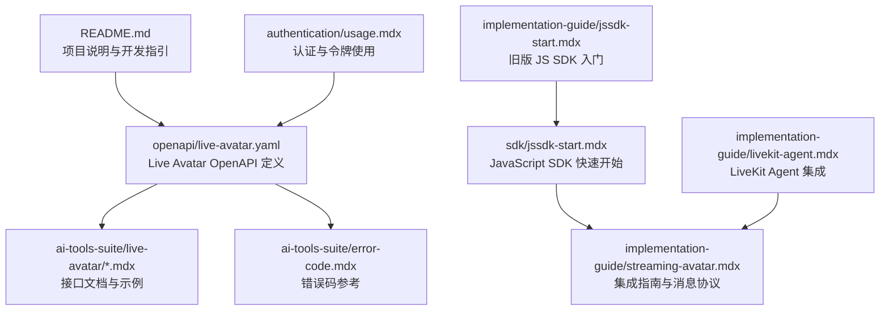
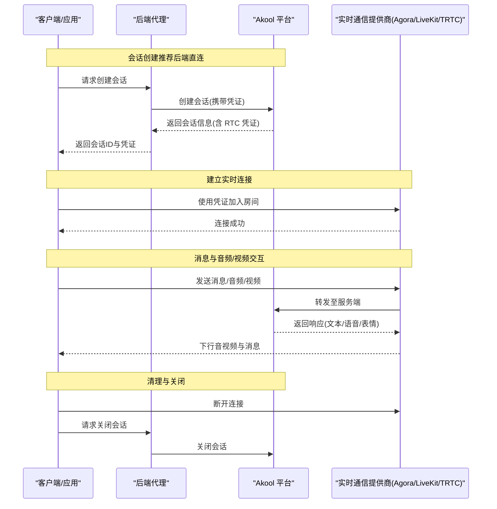
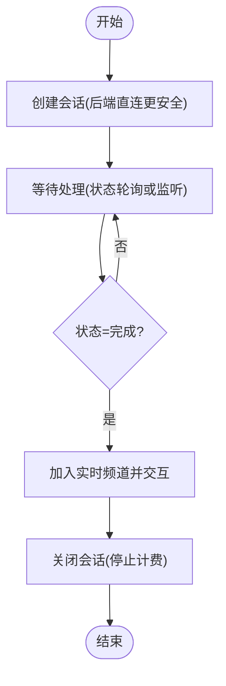
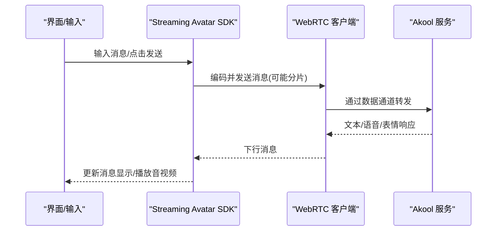
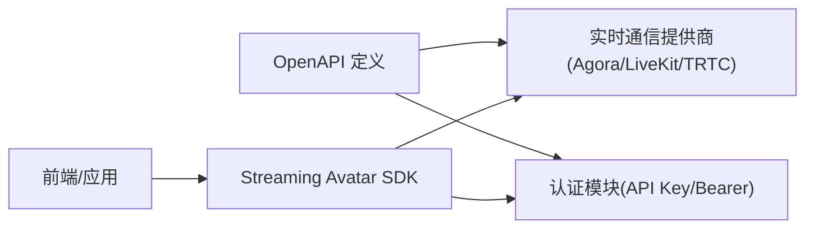

# 流媒体虚拟主播

<cite>
**本文引用的文件**
- [README.md](file://README.md)
- [live-avatar.yaml](file://openapi/live-avatar.yaml)
- [create-session.mdx](file://ai-tools-suite/live-avatar/create-session.mdx)
- [close-session.mdx](file://ai-tools-suite/live-avatar/close-session.mdx)
- [upload.mdx](file://ai-tools-suite/live-avatar/upload.mdx)
- [list.mdx](file://ai-tools-suite/live-avatar/list.mdx)
- [detail.mdx](file://ai-tools-suite/live-avatar/detail.mdx)
- [session-detail.mdx](file://ai-tools-suite/live-avatar/session-detail.mdx)
- [list-sessions.mdx](file://ai-tools-suite/live-avatar/list-sessions.mdx)
- [jssdk-start.mdx](file://sdk/jssdk-start.mdx)
- [jssdk-best-practice.mdx](file://sdk/jssdk-best-practice.mdx)
- [streaming-avatar.mdx](file://implementation-guide/streaming-avatar.mdx)
- [livekit-agent.mdx](file://implementation-guide/livekit-agent.mdx)
- [jssdk-start.mdx](file://implementation-guide/jssdk-start.mdx)
- [error-code.mdx](file://ai-tools-suite/error-code.mdx)
- [usage.mdx](file://authentication/usage.mdx)
</cite>

## 目录
1. [简介](#简介)
2. [项目结构](#项目结构)
3. [核心组件](#核心组件)
4. [架构总览](#架构总览)
5. [详细组件分析](#详细组件分析)
6. [依赖关系分析](#依赖关系分析)
7. [性能考虑](#性能考虑)
8. [故障排除指南](#故障排除指南)
9. [结论](#结论)
10. [附录](#附录)

## 简介
本技术文档面向开发者，系统性介绍 Akool 流媒体虚拟主播（Streaming Avatar）系统：涵盖实时视频聊天与语音交互的端到端架构、Agora RTC SDK 集成与 WebSocket 消息协议、会话生命周期管理、Avatar 资源上传与管理、以及完整的 API 接口规范与最佳实践。文档同时提供 SDK 使用示例、性能优化建议与常见问题排查指引，帮助快速完成从后端会话创建到前端实时交互的完整集成。

## 项目结构
该仓库采用文档驱动的组织方式，围绕“OpenAPI 规范 + 多语言实现指南 + SDK 快速开始 + 最佳实践”构建，便于前后端与 SDK 用户查阅与集成。

**图表来源**
- [README.md:1-33](file://README.md#L1-L33)
- [live-avatar.yaml:1-689](file://openapi/live-avatar.yaml#L1-L689)
- [jssdk-start.mdx:1-590](file://sdk/jssdk-start.mdx#L1-L590)
- [streaming-avatar.mdx:1-800](file://implementation-guide/streaming-avatar.mdx#L1-L800)
- [livekit-agent.mdx:1-69](file://implementation-guide/livekit-agent.mdx#L1-L69)
- [jssdk-start.mdx:1-80](file://implementation-guide/jssdk-start.mdx#L1-L80)
- [error-code.mdx:1-59](file://ai-tools-suite/error-code.mdx#L1-L59)
- [usage.mdx:1-280](file://authentication/usage.mdx#L1-L280)

**章节来源**
- [README.md:1-33](file://README.md#L1-L33)

## 核心组件
- 后端 OpenAPI：提供 Avatar 上传、列表与详情查询，以及会话创建、查询、关闭与列表等接口，统一返回业务状态码与数据体。
- 实时通信层：支持 Agora、LiveKit、TRTC 三种 WebRTC 提供商；通过 SDK 连接频道并使用数据通道传输消息协议。
- 消息协议：基于 JSON 的“chat”与“command”两类消息，支持分片发送、速率控制与命令式参数设置。
- 前端 SDK：提供事件驱动的接入方式，封装加入频道、订阅音视频、发送消息、麦克风控制、中断响应等能力。
- 认证与配额：支持直接 API Key 与 Bearer Token 两种认证方式，并在 OpenAPI 中统一鉴权头。

**章节来源**
- [live-avatar.yaml:13-282](file://openapi/live-avatar.yaml#L13-L282)
- [streaming-avatar.mdx:116-181](file://implementation-guide/streaming-avatar.mdx#L116-L181)
- [jssdk-start.mdx:6-24](file://sdk/jssdk-start.mdx#L6-L24)
- [usage.mdx:10-48](file://authentication/usage.mdx#L10-L48)

## 架构总览
下图展示浏览器/应用客户端、后端代理、Akool 平台与第三方实时通信提供商之间的交互流程，覆盖会话创建、连接建立、消息转发与清理阶段。

**图表来源**
- [streaming-avatar.mdx:116-181](file://implementation-guide/streaming-avatar.mdx#L116-L181)
- [jssdk-start.mdx:440-517](file://sdk/jssdk-start.mdx#L440-L517)
- [live-avatar.yaml:132-242](file://openapi/live-avatar.yaml#L132-L242)

## 详细组件分析

### 1) OpenAPI 与接口规范
- Avatar 管理
  - 上传：POST /api/open/v3/avatar/create
  - 列表：GET /api/open/v4/liveAvatar/avatar/list
  - 详情：GET /api/open/v4/liveAvatar/avatar/detail
- 会话管理
  - 创建：POST /api/open/v4/liveAvatar/session/create
  - 详情：GET /api/open/v4/liveAvatar/session/detail
  - 关闭：POST /api/open/v4/liveAvatar/session/close
  - 列表：GET /api/open/v4/liveAvatar/session/list
- 统一响应结构：包含 code、msg 与 data 字段；业务成功通常为 1000。

**章节来源**
- [live-avatar.yaml:14-282](file://openapi/live-avatar.yaml#L14-L282)

### 2) 会话创建与生命周期
- 创建会话：需提供 avatar_id、duration、voice_id/voice_url、language、mode_type、scene_mode、e2e_type、background_url、voice_params、stream_type 与对应 credentials。
- 会话状态：queueing(排队)、processing(处理中)、completed(完成)、failed(失败)，可通过详情与列表接口查询。
- 关闭会话：调用关闭接口以停止计费并释放资源。

**图表来源**
- [live-avatar.yaml:132-242](file://openapi/live-avatar.yaml#L132-L242)
- [create-session.mdx:1-26](file://ai-tools-suite/live-avatar/create-session.mdx#L1-L26)
- [close-session.mdx:1-106](file://ai-tools-suite/live-avatar/close-session.mdx#L1-L106)

**章节来源**
- [live-avatar.yaml:132-282](file://openapi/live-avatar.yaml#L132-L282)
- [create-session.mdx:1-26](file://ai-tools-suite/live-avatar/create-session.mdx#L1-L26)
- [close-session.mdx:1-106](file://ai-tools-suite/live-avatar/close-session.mdx#L1-L106)

### 3) Avatar 上传、管理与查询
- 上传：提交视频 URL、唯一标识、名称、类型与来源，等待处理完成后可用。
- 列表与详情：分页查询可用 Avatar，按 avatar_id 获取详细信息（含可用性、性别、缩略图等）。
- 注意：资源有效期有限，需及时保存。

**章节来源**
- [live-avatar.yaml:14-131](file://openapi/live-avatar.yaml#L14-L131)
- [upload.mdx:1-11](file://ai-tools-suite/live-avatar/upload.mdx#L1-L11)
- [list.mdx:1-6](file://ai-tools-suite/live-avatar/list.mdx#L1-L6)
- [detail.mdx:1-6](file://ai-tools-suite/live-avatar/detail.mdx#L1-L6)

### 4) 实时消息协议与 SDK 集成
- 协议版本：v=2
- 消息类型：
  - chat：用于用户向 Avatar 发送文本，支持分片(idx/fin)与历史拼接。
  - command：用于设置参数(set-params)、中断响应(interrupt)等命令。
- SDK 支持：
  - 事件驱动：onMessageReceived/onMessageUpdated/onUserPublished/onException/onTokenDidExpire 等。
  - 方法：joinChannel、joinChat、sendMessage、toggleMic、interrupt、closeStreaming 等。
- 数据通道限制：
  - Agora：单条约 1KB，速率约 6KB/s；大消息需分片与限速发送。
  - LiveKit：可靠模式单条可达约 15KB；典型对话无需分片。
  - TRTC：与 Agora 类似，约 1KB 限制。

**图表来源**
- [streaming-avatar.mdx:412-602](file://implementation-guide/streaming-avatar.mdx#L412-L602)
- [jssdk-start.mdx:95-144](file://sdk/jssdk-start.mdx#L95-L144)

**章节来源**
- [streaming-avatar.mdx:66-114](file://implementation-guide/streaming-avatar.mdx#L66-L114)
- [streaming-avatar.mdx:412-602](file://implementation-guide/streaming-avatar.mdx#L412-L602)
- [jssdk-start.mdx:95-144](file://sdk/jssdk-start.mdx#L95-L144)

### 5) 认证与配额
- 直接 API Key：推荐方式，使用 x-api-key 头。
- Bearer Token：通过 /api/open/v3/getToken 获取，有效期较长。
- 错误码：统一以 code=1000 表示成功，其他值表示失败与具体原因。

**章节来源**
- [usage.mdx:10-48](file://authentication/usage.mdx#L10-L48)
- [usage.mdx:50-84](file://authentication/usage.mdx#L50-L84)
- [error-code.mdx:6-59](file://ai-tools-suite/error-code.mdx#L6-L59)

### 6) LiveKit Agent 集成（可选）
- 通过 LiveKit Agents 框架构建服务端 AI Agent，结合 Akool Streaming Avatar 实现更丰富的实时交互体验。
- 包含环境变量配置、本地启动与 Playground 测试步骤。

**章节来源**
- [livekit-agent.mdx:1-69](file://implementation-guide/livekit-agent.mdx#L1-L69)

## 依赖关系分析
- 后端 OpenAPI 依赖实时通信提供商（Agora/LiveKit/TRTC）提供的频道与数据通道能力。
- 前端 SDK 依赖浏览器 WebRTC 能力与对应提供商 SDK。
- 认证模块贯穿所有请求，确保 API Key 或 Bearer Token 的正确传递。

**图表来源**
- [live-avatar.yaml:1-12](file://openapi/live-avatar.yaml#L1-L12)
- [streaming-avatar.mdx:10-21](file://implementation-guide/streaming-avatar.mdx#L10-L21)
- [jssdk-start.mdx:33-46](file://sdk/jssdk-start.mdx#L33-L46)

**章节来源**
- [live-avatar.yaml:1-12](file://openapi/live-avatar.yaml#L1-L12)
- [streaming-avatar.mdx:10-21](file://implementation-guide/streaming-avatar.mdx#L10-L21)
- [jssdk-start.mdx:33-46](file://sdk/jssdk-start.mdx#L33-L46)

## 性能考虑
- 消息分片与速率控制：在 Agora/ TRTC 场景下，大文本需拆分为多片段并遵守速率限制，避免丢包与延迟尖峰。
- 选择合适编码与模式：优先使用 VP8/VP9 等低延迟编码；在 LiveKit 可启用自适应流与 Dynacast。
- 降低首帧延迟：预热客户端、提前订阅、合理布局渲染元素。
- 网络质量监控：利用 SDK 提供的统计与事件回调，动态调整分辨率与码率。
- 会话生命周期：及时关闭会话，避免资源占用与持续计费。

[本节为通用指导，不直接分析特定文件]

## 故障排除指南
- 常见错误码定位：参考错误码表，确认 code=1000 为成功；非 1000 时根据描述排查参数、权限、配额等问题。
- 认证失败：检查 x-api-key 或 Bearer Token 是否正确、是否过期。
- 会话异常：核对会话状态（queueing/processing/completed/failed），必要时重新创建或联系技术支持。
- 音视频问题：确认凭证有效、网络稳定、浏览器权限已授权；关注 onException/onTokenDidExpire 回调。

**章节来源**
- [error-code.mdx:6-59](file://ai-tools-suite/error-code.mdx#L6-L59)
- [usage.mdx:270-279](file://authentication/usage.mdx#L270-L279)
- [jssdk-best-practice.mdx:129-141](file://sdk/jssdk-best-practice.mdx#L129-L141)

## 结论
Akool 流媒体虚拟主播系统通过清晰的 OpenAPI、灵活的实时通信提供商适配与完善的 SDK，为开发者提供了端到端的实时视频聊天与语音交互能力。遵循本文档的集成步骤、消息协议与最佳实践，可在保证安全性与性能的前提下，快速构建高质量的虚拟主播应用。

[本节为总结性内容，不直接分析特定文件]

## 附录

### A. OpenAPI 接口一览（摘要）
- Avatar 管理
  - 上传：POST /api/open/v3/avatar/create
  - 列表：GET /api/open/v4/liveAvatar/avatar/list
  - 详情：GET /api/open/v4/liveAvatar/avatar/detail
- 会话管理
  - 创建：POST /api/open/v4/liveAvatar/session/create
  - 详情：GET /api/open/v4/liveAvatar/session/detail
  - 关闭：POST /api/open/v4/liveAvatar/session/close
  - 列表：GET /api/open/v4/liveAvatar/session/list

**章节来源**
- [live-avatar.yaml:14-282](file://openapi/live-avatar.yaml#L14-L282)

### B. 消息协议字段说明（摘要）
- chat 消息
  - v、type、mid、idx、fin、pld.text
- command 消息
  - v、type、mid、pld.cmd、pld.data（如 set-params/interrupt）
- voice_params（fast_dialogue 或普通模式）
  - voice_id、speed、stt_language、pron_map、stt_type、turn_detection、elevenlabs_settings

**章节来源**
- [live-avatar.yaml:427-634](file://openapi/live-avatar.yaml#L427-L634)
- [ai-tools-suite/live-avatar.mdx:37-216](file://ai-tools-suite/live-avatar.mdx#L37-L216)

### C. SDK 快速开始要点
- 安装与引入：支持 NPM 与 CDN；支持 ESM/CommonJS/IIFE。
- 初始化：创建实例、注册事件、加入频道、进入聊天模式。
- 发送消息：sendMessage；控制参数：joinChat；中断响应：interrupt；关闭：closeStreaming。

**章节来源**
- [jssdk-start.mdx:48-196](file://sdk/jssdk-start.mdx#L48-L196)
- [jssdk-start.mdx:197-590](file://sdk/jssdk-start.mdx#L197-L590)