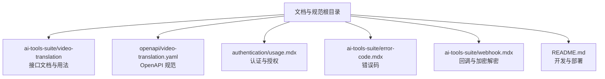
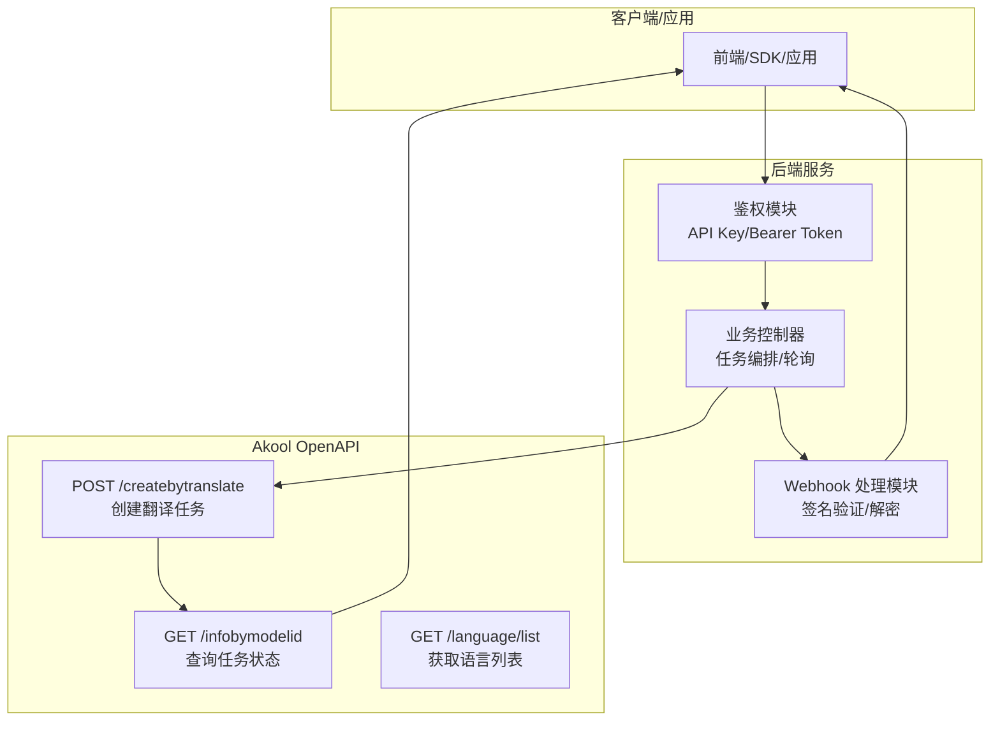
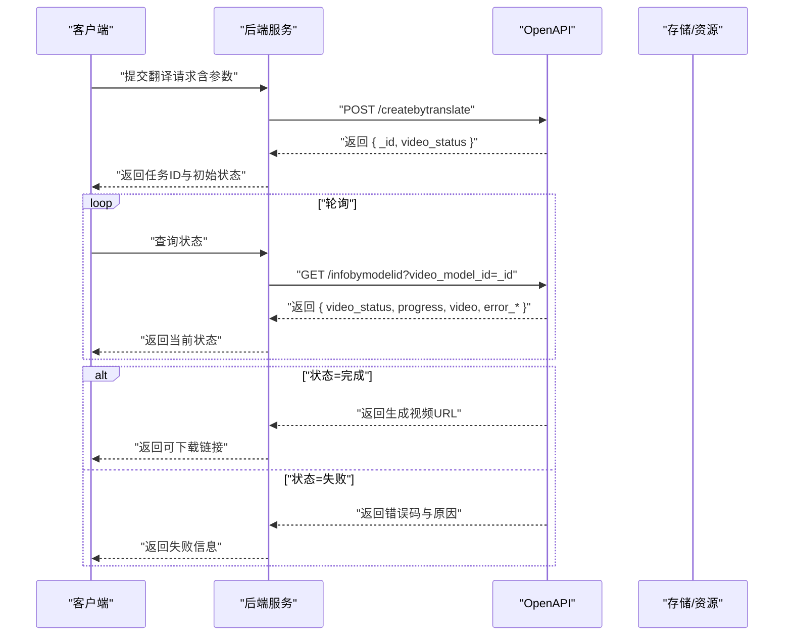
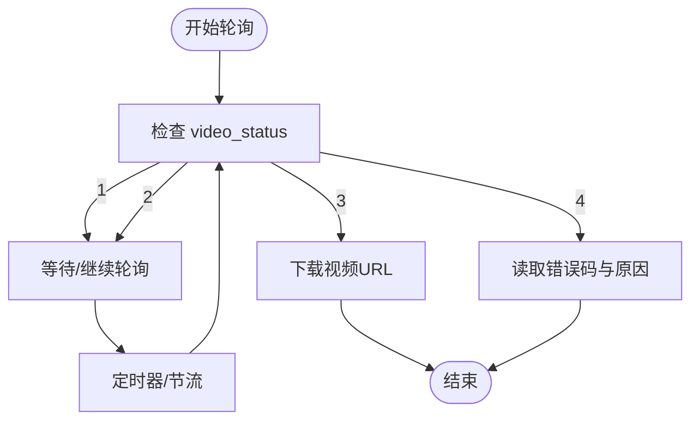
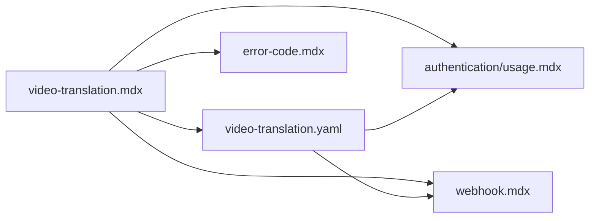

# 视频翻译系统

<cite>
**本文引用的文件**
- [ai-tools-suite/video-translation.mdx](file://ai-tools-suite/video-translation.mdx)
- [ai-tools-suite/video-translation/create-translation.mdx](file://ai-tools-suite/video-translation/create-translation.mdx)
- [ai-tools-suite/video-translation/get-result.mdx](file://ai-tools-suite/video-translation/get-result.mdx)
- [ai-tools-suite/video-translation/get-languages.mdx](file://ai-tools-suite/video-translation/get-languages.mdx)
- [openapi/video-translation.yaml](file://openapi/video-translation.yaml)
- [authentication/usage.mdx](file://authentication/usage.mdx)
- [ai-tools-suite/error-code.mdx](file://ai-tools-suite/error-code.mdx)
- [ai-tools-suite/webhook.mdx](file://ai-tools-suite/webhook.mdx)
- [README.md](file://README.md)
</cite>

## 目录
1. [简介](#简介)
2. [项目结构](#项目结构)
3. [核心组件](#核心组件)
4. [架构总览](#架构总览)
5. [详细组件分析](#详细组件分析)
6. [依赖关系分析](#依赖关系分析)
7. [性能与质量保障](#性能与质量保障)
8. [故障排查指南](#故障排查指南)
9. [结论](#结论)
10. [附录](#附录)

## 简介
本技术文档面向 Akool 视频翻译系统，系统提供多语言视频翻译能力，支持自动源语言检测、AI 声音合成、口型同步（lip-sync）、字幕处理以及回调通知（webhook）。本文从系统架构、数据流、处理逻辑、API 接口、语言列表管理、质量与性能优化、错误处理策略等方面进行深入解析，并给出开发者集成指南与最佳实践建议。

## 项目结构
该仓库采用文档驱动的组织方式，核心视频翻译相关文档与 OpenAPI 定义集中在以下路径：
- ai-tools-suite/video-translation：视频翻译接口文档与使用说明
- openapi/video-translation.yaml：OpenAPI 规范定义
- authentication/usage.mdx：认证与授权说明
- ai-tools-suite/error-code.mdx：错误码说明
- ai-tools-suite/webhook.mdx：回调通知与加密解密规范
- README.md：开发与部署指引

图表来源
- [README.md:1-33](file://README.md#L1-L33)
- [ai-tools-suite/video-translation.mdx:1-168](file://ai-tools-suite/video-translation.mdx#L1-L168)
- [openapi/video-translation.yaml:1-283](file://openapi/video-translation.yaml#L1-L283)
- [authentication/usage.mdx:1-280](file://authentication/usage.mdx#L1-L280)
- [ai-tools-suite/error-code.mdx:1-59](file://ai-tools-suite/error-code.mdx#L1-L59)
- [ai-tools-suite/webhook.mdx:1-447](file://ai-tools-suite/webhook.mdx#L1-L447)

章节来源
- [README.md:1-33](file://README.md#L1-L33)

## 核心组件
- 视频翻译服务端点
  - 创建翻译任务：POST /api/open/v3/content/video/createbytranslate
  - 查询结果：GET /api/open/v3/content/video/infobymodelid
  - 获取语言列表：GET /api/open/v3/language/list
- 认证与授权
  - 支持直接 API Key 与 Bearer Token 两种方式
- 错误码与状态码
  - 统一业务响应 code 字段，成功值为 1000
  - 任务状态码：队列中(1)、处理中(2)、完成(3)、失败(4)
- 回调通知（Webhook）
  - 使用 AES-CBC 加密与 SHA-1 签名，要求回调返回 200 状态码

章节来源
- [openapi/video-translation.yaml:13-103](file://openapi/video-translation.yaml#L13-L103)
- [authentication/usage.mdx:10-48](file://authentication/usage.mdx#L10-L48)
- [ai-tools-suite/error-code.mdx:6-59](file://ai-tools-suite/error-code.mdx#L6-L59)
- [ai-tools-suite/video-translation/get-result.mdx:9-17](file://ai-tools-suite/video-translation/get-result.mdx#L9-L17)

## 架构总览
系统采用“前端/客户端 -> 后端服务 -> Akool OpenAPI”的三层协作模式。后端负责鉴权、参数校验、任务调度与资源管理；OpenAPI 提供统一的翻译任务创建、状态查询与语言列表接口；Webhook 负责异步结果通知。

图表来源
- [openapi/video-translation.yaml:14-102](file://openapi/video-translation.yaml#L14-L102)
- [authentication/usage.mdx:10-48](file://authentication/usage.mdx#L10-L48)
- [ai-tools-suite/webhook.mdx:45-78](file://ai-tools-suite/webhook.mdx#L45-L78)

## 详细组件分析

### 翻译任务创建流程
- 输入参数要点
  - url：待翻译视频地址
  - source_language：默认自动检测或指定语言代码
  - language：目标语言列表（逗号分隔）
  - lipsync：是否启用口型同步
  - speaker_num：说话人数（0 表示自动检测）
  - remove_bgm：是否移除背景音乐
  - caption_type：字幕处理策略（0-4）
  - caption_url：外置字幕文件地址（SRT/ASS）
  - studio_voice：高级翻译控制（禁译词、风格、固定映射、发音修正）
  - webhookUrl：回调地址
  - dynamic_duration：动态时长控制
- 输出
  - 返回任务唯一标识 _id 与初始状态 video_status
- 典型工作流
  - 1) 获取语言列表
  - 2) 创建翻译任务
  - 3) 轮询状态直至完成
  - 4) 下载结果资源

图表来源
- [openapi/video-translation.yaml:14-83](file://openapi/video-translation.yaml#L14-L83)
- [ai-tools-suite/video-translation/get-result.mdx:6-17](file://ai-tools-suite/video-translation/get-result.mdx#L6-L17)

章节来源
- [openapi/video-translation.yaml:125-191](file://openapi/video-translation.yaml#L125-L191)
- [ai-tools-suite/video-translation/create-translation.mdx:1-14](file://ai-tools-suite/video-translation/create-translation.mdx#L1-L14)

### 结果获取与状态管理
- 状态码
  - 1 队列中
  - 2 处理中
  - 3 已完成（可下载）
  - 4 失败（附带错误码与原因）
- 进度与资源
  - progress：0-100 的进度百分比
  - video：完成后的视频 URL
  - audio_splits：拆分输出（原字幕、翻译字幕、无字幕视频）

图表来源
- [openapi/video-translation.yaml:206-243](file://openapi/video-translation.yaml#L206-L243)
- [ai-tools-suite/video-translation/get-result.mdx:9-17](file://ai-tools-suite/video-translation/get-result.mdx#L9-L17)

章节来源
- [openapi/video-translation.yaml:232-243](file://openapi/video-translation.yaml#L232-L243)

### 语言列表管理
- 接口：GET /api/open/v3/language/list
- 返回结构：lang_list 数组，每项包含语言显示名、语言代码、国旗图标 URL
- 使用场景：在创建任务前先拉取可用语言，指导用户选择目标语言

章节来源
- [openapi/video-translation.yaml:262-283](file://openapi/video-translation.yaml#L262-L283)
- [ai-tools-suite/video-translation/get-languages.mdx:1-10](file://ai-tools-suite/video-translation/get-languages.mdx#L1-L10)

### 认证与授权
- 直接 API Key（推荐）
  - 在请求头添加 x-api-key
- Bearer Token（兼容）
  - 通过 /api/open/v3/getToken 获取 token 并在后续请求中使用 Authorization: Bearer
- 安全建议
  - 生产环境必须通过后端服务发起请求，避免在前端暴露密钥
  - 使用短有效期令牌与严格的访问控制

章节来源
- [authentication/usage.mdx:10-48](file://authentication/usage.mdx#L10-L48)
- [authentication/usage.mdx:63-84](file://authentication/usage.mdx#L63-L84)

### Webhook 回调与安全
- 回调消息结构
  - signature：消息体签名
  - dataEncrypt：消息体加密
  - timestamp、nonce
- 解密与验签流程
  - 使用 clientSecret 对 dataEncrypt 执行 AES-CBC 解密得到明文
  - 使用 SHA-1 对 (clientId, timestamp, nonce, dataEncrypt) 排序拼接后计算签名，与 signature 比较
  - 成功后需返回 HTTP 200
- 注意事项
  - 若未返回 200，平台会重试
  - 明文包含 _id、status、type、url 等字段

章节来源
- [ai-tools-suite/webhook.mdx:9-43](file://ai-tools-suite/webhook.mdx#L9-L43)
- [ai-tools-suite/webhook.mdx:45-78](file://ai-tools-suite/webhook.mdx#L45-L78)

## 依赖关系分析
- 文档与规范耦合
  - video-translation.mdx 作为概览与最佳实践，引用具体 API 文档与错误码
  - openapi/video-translation.yaml 为权威规范，定义了请求/响应模型与状态码
- 认证与 Webhook 依赖
  - 认证模块为所有 API 调用提供安全入口
  - Webhook 模块为异步通知提供统一的安全协议

图表来源
- [ai-tools-suite/video-translation.mdx:1-168](file://ai-tools-suite/video-translation.mdx#L1-L168)
- [openapi/video-translation.yaml:1-283](file://openapi/video-translation.yaml#L1-L283)
- [authentication/usage.mdx:1-280](file://authentication/usage.mdx#L1-L280)
- [ai-tools-suite/error-code.mdx:1-59](file://ai-tools-suite/error-code.mdx#L1-L59)
- [ai-tools-suite/webhook.mdx:1-447](file://ai-tools-suite/webhook.mdx#L1-L447)

## 性能与质量保障
- 视频输入限制
  - 时长：建议不超过 60 秒
  - 大小：不超过 300MB
  - 帧率：不超过 30fps
  - 编码：建议 H.264
- 质量优化建议
  - 清晰语音与背景音乐分离有助于提升翻译质量
  - 可开启 remove_bgm 以减少背景音乐对语音识别的影响
  - 正确设置 speaker_num 以改善多人对话场景下的声纹分离
- 性能优化策略
  - 并行处理多个视频任务时注意配额与并发控制
  - 使用 webhook 异步通知，避免阻塞式轮询
  - 对于高频查询，增加节流与缓存策略

章节来源
- [ai-tools-suite/video-translation.mdx:98-117](file://ai-tools-suite/video-translation.mdx#L98-L117)

## 故障排查指南
- 常见错误码与含义
  - 1000：成功
  - 1003：参数错误
  - 1009：权限不足
  - 1101：非法令牌或过期
  - 1200：账户被封禁
  - 1204：视频时长超限
  - 1207：视频大小超限
  - 1209：不支持的编码格式
  - 1210：帧率超限
- 任务失败定位
  - 检查 video_status 是否为 4
  - 读取 error_code 与 error_reason 获取具体原因
  - 结合错误码参考表定位问题类型
- Webhook 失败
  - 确认回调服务正确实现签名验证与解密
  - 确保回调返回 200 状态码
  - 检查 clientSecret、clientId 配置是否一致

章节来源
- [ai-tools-suite/error-code.mdx:6-59](file://ai-tools-suite/error-code.mdx#L6-L59)
- [openapi/video-translation.yaml:238-243](file://openapi/video-translation.yaml#L238-L243)
- [ai-tools-suite/webhook.mdx:9-43](file://ai-tools-suite/webhook.mdx#L9-L43)

## 结论
Akool 视频翻译系统通过清晰的 OpenAPI 规范与完善的文档体系，提供了从任务创建、状态查询到结果下载与回调通知的完整链路。结合合理的认证策略、严格的质量与性能约束，以及完善的错误处理与 Webhook 安全机制，能够满足大多数跨语言视频内容处理场景的需求。开发者应遵循“后端代发请求、前端只消费结果”的原则，确保系统的安全性与稳定性。

## 附录

### API 接口清单与关键参数
- 创建翻译任务
  - 方法与路径：POST /api/open/v3/content/video/createbytranslate
  - 关键参数：url、source_language、language、lipsync、speaker_num、remove_bgm、caption_type、caption_url、studio_voice、webhookUrl、dynamic_duration
- 查询翻译结果
  - 方法与路径：GET /api/open/v3/content/video/infobymodelid
  - 关键参数：video_model_id（即创建任务返回的 _id）
- 获取语言列表
  - 方法与路径：GET /api/open/v3/language/list

章节来源
- [openapi/video-translation.yaml:14-102](file://openapi/video-translation.yaml#L14-L102)

### 开发者集成指南（最佳实践）
- 认证
  - 优先使用 x-api-key 直接认证
  - 所有请求均需在后端发起，避免前端暴露密钥
- 任务创建
  - 先调用语言列表接口获取可用目标语言
  - 设置 source_language 为 DEFAULT 或明确指定语言代码
  - 根据场景配置 lipsync、remove_bgm、caption_type 等参数
- 结果获取
  - 使用 video_model_id 轮询状态，直到 video_status=3
  - 下载完成后及时保存，注意资源有效期
- Webhook
  - 实现签名验证与 AES-CBC 解密
  - 回调成功必须返回 HTTP 200
- 错误处理
  - 对常见错误码进行分类处理
  - 对失败任务进行重试与告警

章节来源
- [authentication/usage.mdx:10-48](file://authentication/usage.mdx#L10-L48)
- [ai-tools-suite/video-translation.mdx:25-117](file://ai-tools-suite/video-translation.mdx#L25-L117)
- [ai-tools-suite/webhook.mdx:45-78](file://ai-tools-suite/webhook.mdx#L45-L78)