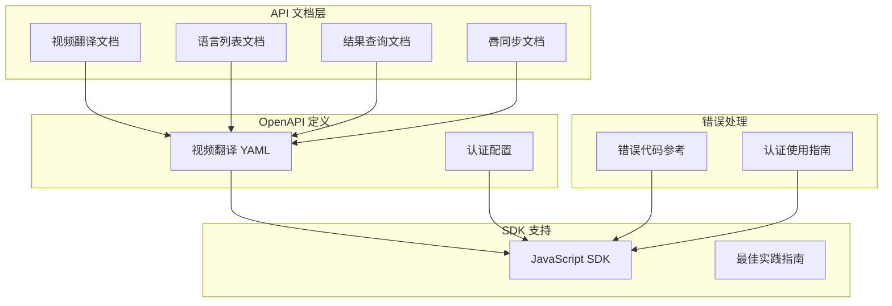
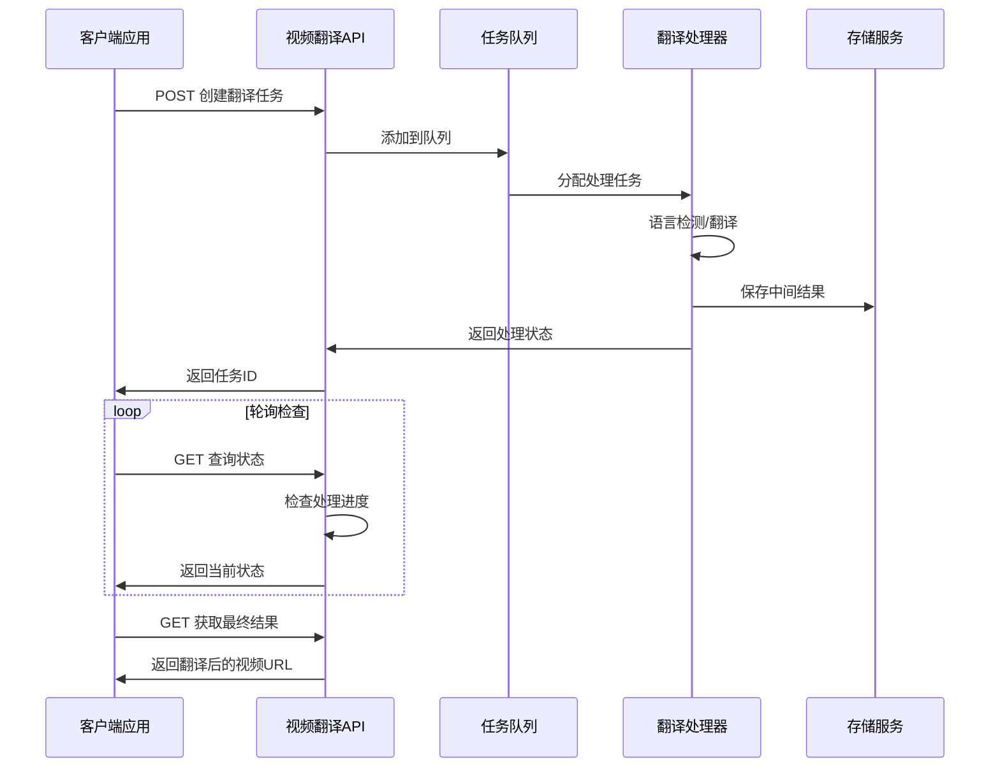
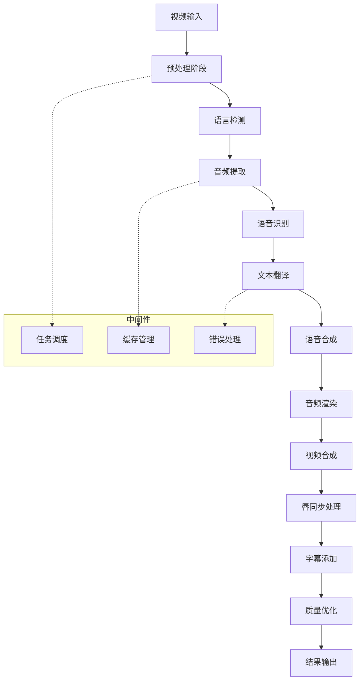
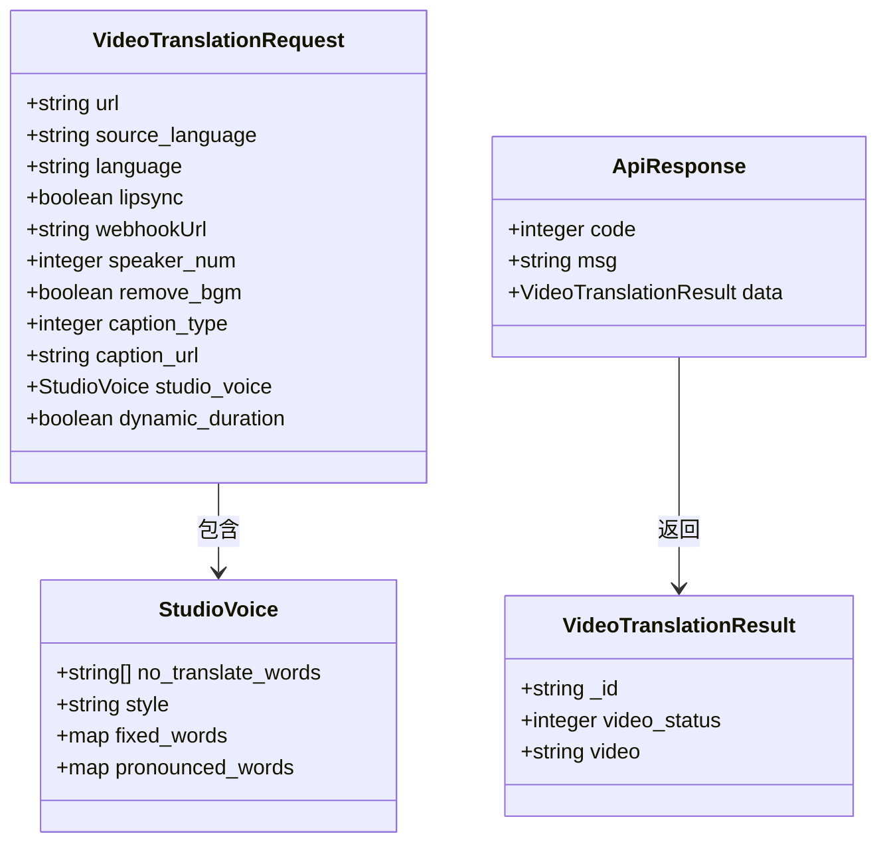
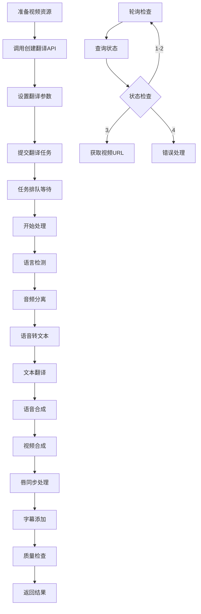
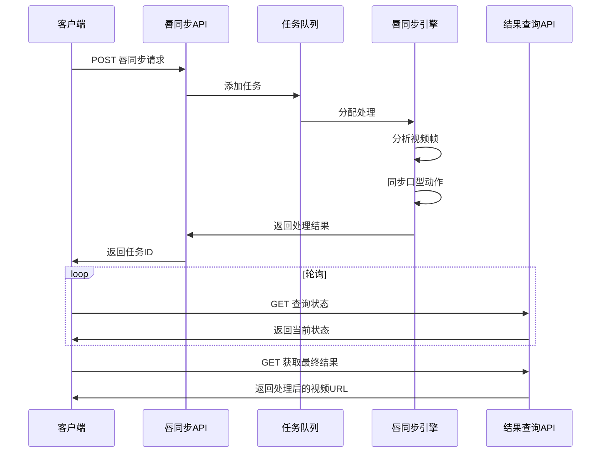
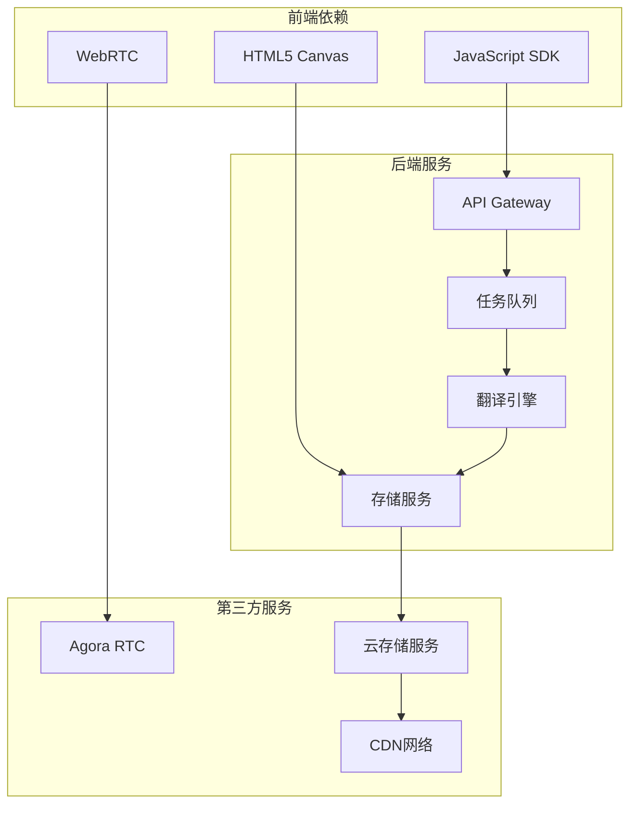
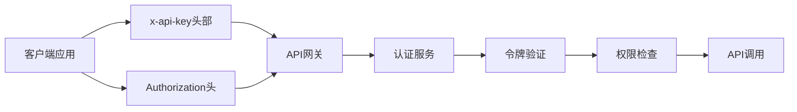
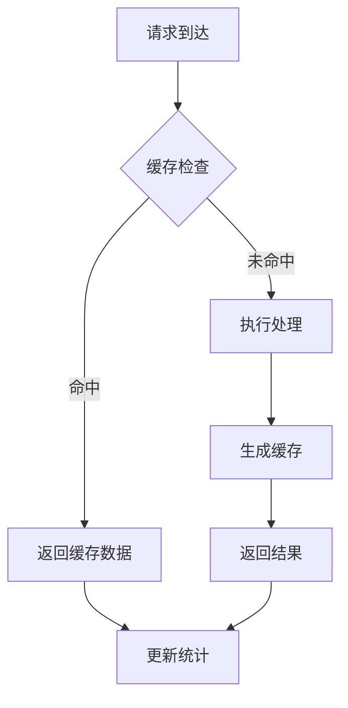

# 视频翻译系统概览

<cite>
**本文档中引用的文件**
- [video-translation.mdx](file://ai-tools-suite/video-translation.mdx)
- [create-translation.mdx](file://ai-tools-suite/video-translation/create-translation.mdx)
- [get-languages.mdx](file://ai-tools-suite/video-translation/get-languages.mdx)
- [get-result.mdx](file://ai-tools-suite/video-translation/get-result.mdx)
- [lip-sync.mdx](file://ai-tools-suite/lip-sync.mdx)
- [video-translation.yaml](file://openapi/video-translation.yaml)
- [error-code.mdx](file://ai-tools-suite/error-code.mdx)
- [usage.mdx](file://authentication/usage.mdx)
- [jssdk-start.mdx](file://sdk/jssdk-start.mdx)
- [jssdk-best-practice.mdx](file://sdk/jssdk-best-practice.mdx)
</cite>

## 目录
1. [简介](#简介)
2. [项目结构](#项目结构)
3. [核心组件](#核心组件)
4. [架构概览](#架构概览)
5. [详细组件分析](#详细组件分析)
6. [依赖关系分析](#依赖关系分析)
7. [性能考虑](#性能考虑)
8. [故障排除指南](#故障排除指南)
9. [结论](#结论)

## 简介

Akool 视频翻译系统是一个基于人工智能技术的视频内容本地化解决方案。该系统能够将视频内容自动翻译成多种语言，并提供唇同步技术、字幕支持和高级语音控制等功能。通过智能的语言检测、多语言翻译和AI驱动的唇部同步，用户可以轻松创建高质量的多语言视频内容。

系统采用现代化的API架构设计，支持实时处理和异步任务管理，为开发者提供了完整的集成工具包和详细的开发指南。

## 项目结构

视频翻译系统主要由以下核心模块组成：

**图表来源**
- [video-translation.mdx:1-112](file://ai-tools-suite/video-translation.mdx#L1-L112)
- [video-translation.yaml:1-283](file://openapi/video-translation.yaml#L1-L283)

**章节来源**
- [video-translation.mdx:1-112](file://ai-tools-suite/video-translation.mdx#L1-L112)
- [video-translation.yaml:1-283](file://openapi/video-translation.yaml#L1-L283)

## 核心组件

### 视频翻译 API 组件

系统提供三个核心API端点，支持完整的视频翻译工作流程：

| API 端点 | HTTP 方法 | 功能描述 |
|---------|----------|----------|
| `/api/open/v3/content/video/createbytranslate` | POST | 创建视频翻译任务 |
| `/api/open/v3/content/video/infobymodelid` | GET | 查询翻译结果状态 |
| `/api/open/v3/language/list` | GET | 获取支持的语言列表 |

### 认证与安全组件

系统支持两种认证方式：
- **直接 API Key 认证**：推荐方式，使用自定义 `x-api-key` 头部
- **Bearer Token 认证**：传统方式，通过 `/getToken` 端点获取访问令牌

### 错误处理组件

系统提供统一的错误代码体系，涵盖网络请求、业务逻辑、权限验证等各类错误场景。

**章节来源**
- [video-translation.yaml:14-103](file://openapi/video-translation.yaml#L14-L103)
- [usage.mdx:10-84](file://authentication/usage.mdx#L10-L84)

## 架构概览

**图表来源**
- [create-translation.mdx:1-14](file://ai-tools-suite/video-translation/create-translation.mdx#L1-L14)
- [get-result.mdx:1-19](file://ai-tools-suite/video-translation/get-result.mdx#L1-L19)

### 数据流架构

**图表来源**
- [video-translation.yaml:125-192](file://openapi/video-translation.yaml#L125-L192)

## 详细组件分析

### 视频翻译核心功能

#### 自动语言检测
系统支持自动语言检测功能，通过设置 `source_language` 参数为 "DEFAULT" 来启用。该功能能够准确识别视频中的原始语言，无需手动指定。

#### 多语言翻译
支持同时翻译到多个目标语言，通过逗号分隔的语言代码实现批量翻译。系统支持广泛的全球语言，包括地区变体语言。

#### 唇同步技术
通过 `lipsync` 参数启用AI驱动的唇同步技术，确保翻译后的口型动作与音频完美匹配，提升观看体验。

#### 字幕支持
提供灵活的字幕处理选项，包括：
- 添加原始字幕
- 添加目标语言字幕
- 翻译并替换原始字幕
- 添加翻译后的字幕

**章节来源**
- [video-translation.mdx:43-58](file://ai-tools-suite/video-translation.mdx#L43-L58)

### API 请求参数详解

**图表来源**
- [video-translation.yaml:125-205](file://openapi/video-translation.yaml#L125-L205)

### 工作流程详解

#### 视频翻译完整流程

**图表来源**
- [video-translation.mdx:33-42](file://ai-tools-suite/video-translation.mdx#L33-L42)

#### 唇同步独立流程

**图表来源**
- [lip-sync.mdx:13-186](file://ai-tools-suite/lip-sync.mdx#L13-L186)

**章节来源**
- [video-translation.mdx:33-112](file://ai-tools-suite/video-translation.mdx#L33-L112)
- [lip-sync.mdx:1-331](file://ai-tools-suite/lip-sync.mdx#L1-L331)

## 依赖关系分析

### 技术栈依赖

### 认证依赖关系

**图表来源**
- [usage.mdx:19-48](file://authentication/usage.mdx#L19-L48)

**章节来源**
- [usage.mdx:1-280](file://authentication/usage.mdx#L1-L280)

## 性能考虑

### 视频处理性能优化

| 优化维度 | 推荐配置 | 性能影响 |
|---------|---------|----------|
| 视频时长 | ≤60秒 | 减少处理时间 |
| 文件大小 | ≤300MB | 提高上传效率 |
| 帧率 | ≤30fps | 降低计算复杂度 |
| 音频质量 | 标准采样率 | 平衡音质与性能 |
| 语言数量 | ≤5种 | 控制并发翻译 |

### 并发处理能力

系统支持多任务并发处理，建议：
- 单个应用实例：最多10个并发任务
- 批量处理：使用队列机制避免超载
- 资源监控：实时监控CPU和内存使用情况

### 缓存策略

## 故障排除指南

### 常见错误代码及解决方案

| 错误代码 | 错误类型 | 可能原因 | 解决方案 |
|---------|---------|---------|---------|
| 1000 | 成功 | 请求正常完成 | 无需处理 |
| 1003 | 参数错误 | 请求参数缺失或格式不正确 | 检查API参数格式 |
| 1008 | 内容不存在 | 资源URL无效或已过期 | 验证资源链接有效性 |
| 1009 | 权限不足 | API Key权限不足 | 检查账户权限设置 |
| 1101 | 认证失败 | 令牌过期或无效 | 重新获取访问令牌 |
| 1200 | 账户被封禁 | 违规使用API | 联系客服解封 |
| 1204 | 视频时长超限 | 视频超过60秒限制 | 剪辑视频或使用专业版 |
| 1207 | 文件过大 | 视频文件超过300MB | 压缩视频文件 |

### 最佳实践建议

#### 开发环境配置
- 使用测试API Key进行开发和调试
- 实现重试机制处理临时性错误
- 设置合理的超时时间避免长时间阻塞

#### 生产环境部署
- 实现负载均衡避免单点故障
- 建立监控告警系统
- 准备应急预案处理突发流量

#### 性能优化
- 实现请求限流防止API滥用
- 使用CDN加速静态资源加载
- 优化网络连接减少延迟

**章节来源**
- [error-code.mdx:1-59](file://ai-tools-suite/error-code.mdx#L1-L59)
- [jssdk-best-practice.mdx:30-112](file://sdk/jssdk-best-practice.mdx#L30-L112)

## 结论

Akool 视频翻译系统为企业和个人开发者提供了完整的多语言视频本地化解决方案。通过其强大的AI技术、灵活的API接口和完善的错误处理机制，用户可以轻松实现高质量的视频内容国际化。

系统的主要优势包括：
- **技术先进性**：基于最新AI技术的自动语言检测和翻译
- **功能完整性**：从语言检测到唇同步的全流程解决方案
- **易用性**：简洁的API设计和丰富的开发文档
- **可靠性**：完善的错误处理和监控机制
- **扩展性**：支持大规模并发处理和水平扩展

对于开发者而言，Akool 视频翻译系统不仅是一个工具，更是推动全球化内容传播的重要基础设施。通过合理的技术选型和最佳实践，可以充分发挥系统潜力，为用户提供卓越的多语言视频体验。