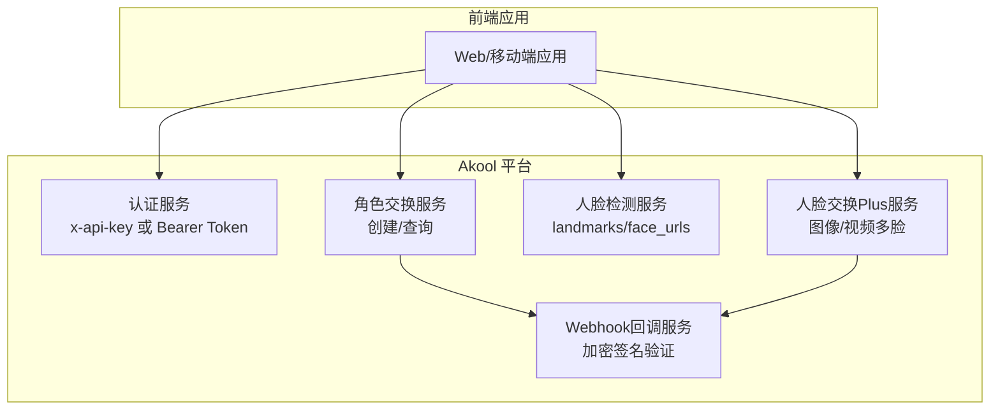
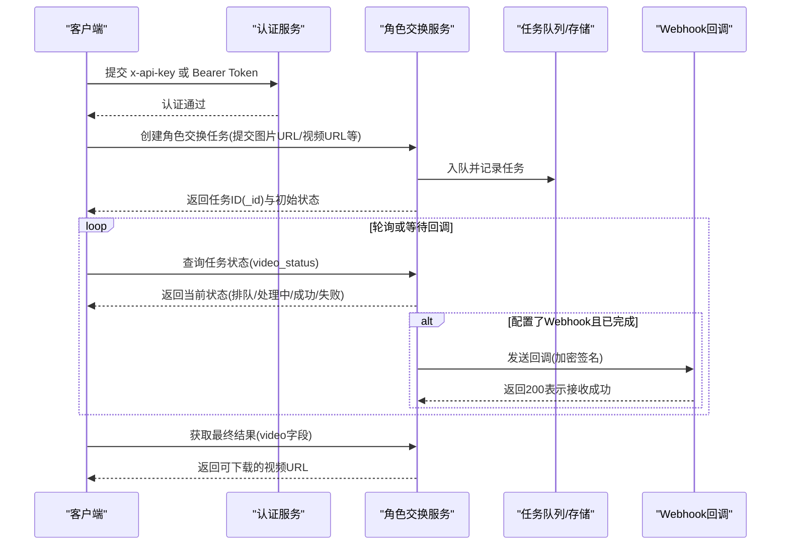
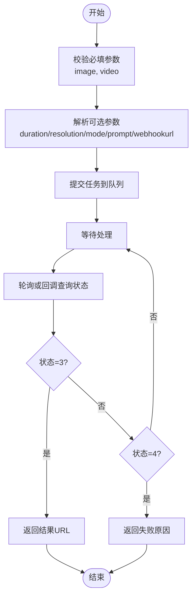
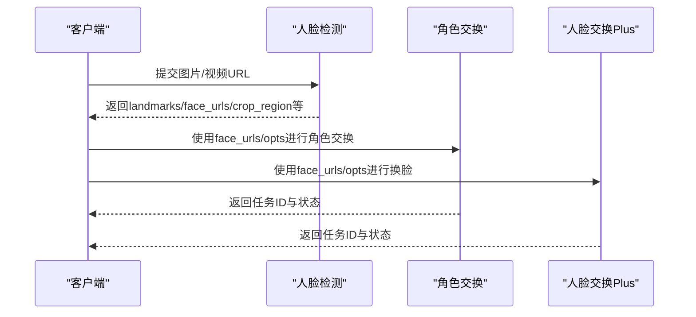
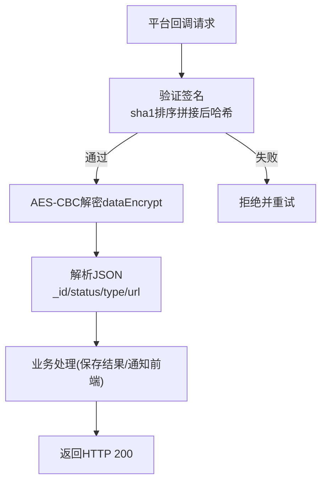
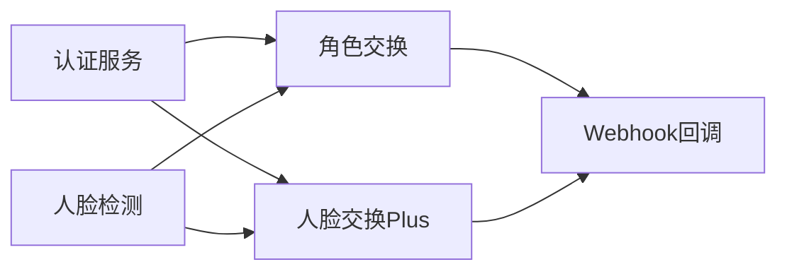

# 角色交换系统

<cite>
**本文档引用的文件**
- [角色交换概览](file://ai-tools-suite/character-swap/character-swap.mdx)
- [创建角色交换](file://ai-tools-suite/character-swap/create.mdx)
- [获取结果](file://ai-tools-suite/character-swap/get-result.mdx)
- [人脸检测](file://ai-tools-suite/face-detection/detect-faces.mdx)
- [人脸交换Plus](file://ai-tools-suite/faceswap/faceswap-plus.mdx)
- [错误码](file://ai-tools-suite/error-code.mdx)
- [认证与使用](file://authentication/usage.mdx)
- [Webhook回调](file://ai-tools-suite/webhook.mdx)
- [OpenAPI定义](file://openapi/faceswap.yaml)
</cite>

## 目录
1. [简介](#简介)
2. [项目结构](#项目结构)
3. [核心组件](#核心组件)
4. [架构总览](#架构总览)
5. [详细组件分析](#详细组件分析)
6. [依赖关系分析](#依赖关系分析)
7. [性能考虑](#性能考虑)
8. [故障排除指南](#故障排除指南)
9. [结论](#结论)
10. [附录](#附录)

## 简介
本技术文档面向开发者，系统性介绍 Akool 角色交换系统（Character Swap）的技术实现与使用方法。文档涵盖创意内容生成与处理的技术原理、角色交换的创建流程、参数配置与结果管理机制，并提供完整的 API 接口说明、应用场景与使用限制、最佳实践与质量优化建议，以及集成方案与故障排除方法。

## 项目结构
角色交换系统由以下关键模块组成：
- 角色交换 API 文档：提供创建与查询接口说明
- 人脸检测 API：为多脸场景提供坐标与裁剪信息
- 人脸交换（Faceswap）系列 API：提供图像/视频换脸能力
- 认证与授权：支持直接 API Key 与 Bearer Token 两种方式
- Webhook 回调：异步结果通知与安全解密
- 错误码参考：统一的状态码与错误含义

图表来源
- [角色交换概览:11-16](file://ai-tools-suite/character-swap/character-swap.mdx#L11-L16)
- [人脸检测:1-23](file://ai-tools-suite/face-detection/detect-faces.mdx#L1-L23)
- [人脸交换Plus:1-19](file://ai-tools-suite/faceswap/faceswap-plus.mdx#L1-L19)
- [Webhook回调:1-31](file://ai-tools-suite/webhook.mdx#L1-L31)

章节来源
- [角色交换概览:1-161](file://ai-tools-suite/character-swap/character-swap.mdx#L1-L161)
- [人脸检测:1-183](file://ai-tools-suite/face-detection/detect-faces.mdx#L1-L183)
- [人脸交换Plus:1-227](file://ai-tools-suite/faceswap/faceswap-plus.mdx#L1-L227)
- [Webhook回调:1-447](file://ai-tools-suite/webhook.mdx#L1-L447)

## 核心组件
- 角色交换服务：接收角色图片与源视频，返回动画化或替换后的视频
- 人脸检测服务：输出人脸关键点、裁剪区域与可直接使用的裁剪人脸 URL
- 人脸交换Plus服务：支持单脸/多脸图像与视频换脸，提供风格选项
- 认证与授权：支持 x-api-key 与 Bearer Token 两种方式
- Webhook 回调：异步通知任务状态变更，支持签名与 AES 加解密

章节来源
- [角色交换概览:11-16](file://ai-tools-suite/character-swap/character-swap.mdx#L11-L16)
- [人脸检测:11-23](file://ai-tools-suite/face-detection/detect-faces.mdx#L11-L23)
- [人脸交换Plus:21-29](file://ai-tools-suite/faceswap/faceswap-plus.mdx#L21-L29)
- [认证与使用:10-48](file://authentication/usage.mdx#L10-L48)

## 架构总览
角色交换系统采用“请求-异步处理-回调/轮询”的模式：
- 客户端提交创建请求，服务端返回任务 ID
- 服务端后台异步执行生成，期间可通过任务 ID 查询状态
- 可选 Webhook：任务完成或失败时平台回调业务服务器
- 结果有效期：生成资源（图片/视频/音频）7 天后过期

图表来源
- [创建角色交换:11-58](file://ai-tools-suite/character-swap/create.mdx#L11-L58)
- [获取结果:6-48](file://ai-tools-suite/character-swap/get-result.mdx#L6-L48)
- [Webhook回调:13-43](file://ai-tools-suite/webhook.mdx#L13-L43)

章节来源
- [创建角色交换:1-224](file://ai-tools-suite/character-swap/create.mdx#L1-L224)
- [获取结果:1-209](file://ai-tools-suite/character-swap/get-result.mdx#L1-L209)
- [Webhook回调:1-447](file://ai-tools-suite/webhook.mdx#L1-L447)

## 详细组件分析

### 角色交换 API
- 终端与认证
  - 创建接口：POST /api/open/v4/characterSwap/create
  - 查询接口：GET /api/open/v3/content/video/infobymodelid?video_model_id={id}
  - 支持 x-api-key 与 Authorization: Bearer Token
- 请求参数
  - 必填：image（角色图片URL）、video（源视频URL）
  - 可选：duration（秒，1-120，默认自动检测）、resolution（480p/720p/1080p，默认720p）、mode（animate/replace，默认animate）、prompt（提示词，最大500字符）、webhookurl（回调地址）
- 响应数据
  - code/msg/data：code=1000 表示成功；data 包含任务ID、状态、时长、分辨率、文件名、输入URL、提示词、模式、模型名、回调URL等
- 状态码
  - 1=排队、2=处理中、3=成功、4=失败
- 价格与计费
  - 按分辨率与视频时长计算（每5秒为单位），例如720p每5秒10积分
- 使用限制
  - 需要 Pro 计划及以上权限
  - 视频时长上限120秒
  - 资源7天后过期

图表来源
- [创建角色交换:24-58](file://ai-tools-suite/character-swap/create.mdx#L24-L58)
- [获取结果:25-48](file://ai-tools-suite/character-swap/get-result.mdx#L25-L48)

章节来源
- [角色交换概览:11-72](file://ai-tools-suite/character-swap/character-swap.mdx#L11-L72)
- [创建角色交换:11-224](file://ai-tools-suite/character-swap/create.mdx#L11-L224)
- [获取结果:6-209](file://ai-tools-suite/character-swap/get-result.mdx#L6-L209)

### 人脸检测与换脸联动
- 人脸检测
  - 支持图片/视频 URL 或 base64 输入
  - 输出关键点、边界框、裁剪人脸URL、裁剪区域与landmarks字符串
  - 可选择仅返回最大人脸
- 与角色交换联动
  - 对于多脸场景，可先调用检测接口获取 face_urls 与 crop_landmarks
  - 在角色交换中使用这些信息提升对齐精度
- 与人脸交换Plus联动
  - detect-faces 的 landmarks_str 可直接作为 faceswap 的 opts 参数
  - detect-faces 的 face_urls 可直接用于 faceswap 的 face_url

图表来源
- [人脸检测:25-66](file://ai-tools-suite/face-detection/detect-faces.mdx#L25-L66)
- [人脸交换Plus:360-479](file://ai-tools-suite/faceswap/faceswap-plus.mdx#L360-L479)

章节来源
- [人脸检测:1-183](file://ai-tools-suite/face-detection/detect-faces.mdx#L1-L183)
- [人脸交换Plus:1-227](file://ai-tools-suite/faceswap/faceswap-plus.mdx#L1-L227)

### Webhook 回调与安全
- 回调触发条件
  - 任务状态变为完成(3)或失败(4)时发送回调
- 回调内容
  - signature、dataEncrypt、timestamp、nonce
  - 解密后得到 _id、status、type、url 等字段
- 安全机制
  - 使用 SHA-1 对 clientId、timestamp、nonce、dataEncrypt 排序后签名
  - 使用 AES-CBC（PKCS#7填充）解密 dataEncrypt
  - 回调服务需返回 HTTP 200 表示接收成功

图表来源
- [Webhook回调:13-43](file://ai-tools-suite/webhook.mdx#L13-L43)
- [Webhook回调:45-78](file://ai-tools-suite/webhook.mdx#L45-L78)

章节来源
- [Webhook回调:1-447](file://ai-tools-suite/webhook.mdx#L1-L447)

### 认证与授权
- 直接 API Key（推荐）
  - 在请求头添加 x-api-key: {API Key}
- Bearer Token（传统方式）
  - 先通过 /api/open/v3/getToken 获取 token
  - 在请求头添加 Authorization: Bearer {token}
- 安全建议
  - 生产环境必须通过后端代理访问，避免在前端暴露 API Key
  - 后端从环境变量读取密钥，严格控制访问范围

章节来源
- [认证与使用:10-48](file://authentication/usage.mdx#L10-L48)
- [认证与使用:63-84](file://authentication/usage.mdx#L63-L84)

## 依赖关系分析
- 角色交换依赖
  - 认证服务：x-api-key 或 Bearer Token
  - 人脸检测：为多脸场景提供坐标与裁剪信息
  - Webhook：异步通知任务状态
- 人脸交换Plus依赖
  - 人脸检测：提供 face_urls 与 crop_landmarks
  - 认证服务：同上
  - Webhook：异步通知任务状态

图表来源
- [角色交换概览:11-16](file://ai-tools-suite/character-swap/character-swap.mdx#L11-L16)
- [人脸检测:1-23](file://ai-tools-suite/face-detection/detect-faces.mdx#L1-L23)
- [人脸交换Plus:1-19](file://ai-tools-suite/faceswap/faceswap-plus.mdx#L1-L19)
- [Webhook回调:1-31](file://ai-tools-suite/webhook.mdx#L1-L31)

章节来源
- [角色交换概览:1-161](file://ai-tools-suite/character-swap/character-swap.mdx#L1-L161)
- [人脸检测:1-183](file://ai-tools-suite/face-detection/detect-faces.mdx#L1-L183)
- [人脸交换Plus:1-227](file://ai-tools-suite/faceswap/faceswap-plus.mdx#L1-L227)
- [Webhook回调:1-447](file://ai-tools-suite/webhook.mdx#L1-L447)

## 性能考虑
- 资源准备
  - 图片：高分辨率、正面或轻微角度、光线良好、面部清晰可见
  - 视频：MP4格式、高质量、时长不超过120秒、包含目标动作
- 参数选择
  - 分辨率：480p/720p/1080p，越高耗时越长
  - 持续时间：不指定则自动检测，建议合理设置以控制成本
  - 模式：animate 应用动作到角色图；replace 将视频中的人脸替换为角色
  - 提示词：最多500字符，用于增强生成控制
- 异步处理
  - 使用 webhook 或轮询查询状态，避免阻塞
  - 成功后尽快下载并保存结果，避免过期

章节来源
- [角色交换概览:73-96](file://ai-tools-suite/character-swap/character-swap.mdx#L73-L96)
- [创建角色交换:210-222](file://ai-tools-suite/character-swap/create.mdx#L210-L222)

## 故障排除指南
- 常见错误码
  - 1000：成功
  - 1003：参数错误或为空
  - 1008：内容不存在
  - 1009：无操作权限
  - 1015：创建视频错误，请稍后再试
  - 1101/1102：授权无效或令牌过期/不能为空
  - 1200：账户被封禁
- 状态码对照
  - 1=排队、2=处理中、3=成功、4=失败
- 排查步骤
  - 确认认证头有效（x-api-key 或 Bearer Token）
  - 检查输入资源 URL 可访问性与格式要求
  - 若使用 webhook，确认回调地址可接受 HTTP 200
  - 失败时查看 faceswap_fail_reason 字段获取具体原因

章节来源
- [错误码:6-59](file://ai-tools-suite/error-code.mdx#L6-L59)
- [获取结果:192-200](file://ai-tools-suite/character-swap/get-result.mdx#L192-L200)

## 结论
角色交换系统通过标准化的 API 流程与安全的回调机制，为开发者提供了稳定高效的创意内容生成能力。结合人脸检测与人脸交换Plus，可覆盖从单脸到多脸的多种场景。建议在生产环境中采用后端代理与 webhook 方案，确保安全性与可靠性，并遵循最佳实践以获得更佳的质量与性能。

## 附录

### API 接口清单
- 角色交换
  - 创建：POST /api/open/v4/characterSwap/create
  - 查询：GET /api/open/v3/content/video/infobymodelid?video_model_id={id}
- 人脸检测
  - 检测：POST /interface/detect-api/detect_faces
- 人脸交换Plus
  - 图像/视频换脸：POST /api/open/v4/faceswap/faceswapPlusByImage
- 认证
  - 直接 API Key：x-api-key
  - Bearer Token：POST /api/open/v3/getToken
- Webhook
  - 回调：HTTP POST，携带 signature、dataEncrypt、timestamp、nonce

章节来源
- [创建角色交换:11-15](file://ai-tools-suite/character-swap/create.mdx#L11-L15)
- [获取结果:6-10](file://ai-tools-suite/character-swap/get-result.mdx#L6-L10)
- [人脸检测:1-5](file://ai-tools-suite/face-detection/detect-faces.mdx#L1-L5)
- [人脸交换Plus:4-4](file://ai-tools-suite/faceswap/faceswap-plus.mdx#L4-L4)
- [认证与使用:50-84](file://authentication/usage.mdx#L50-L84)
- [Webhook回调:1-31](file://ai-tools-suite/webhook.mdx#L1-L31)