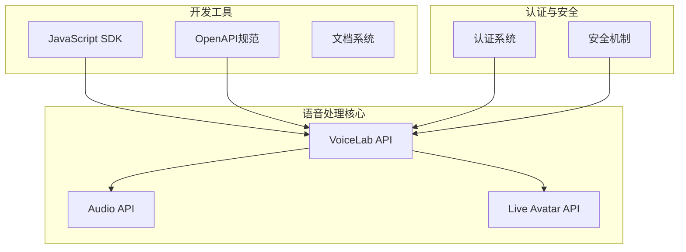
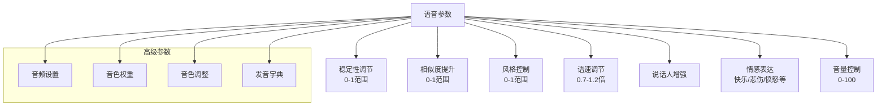
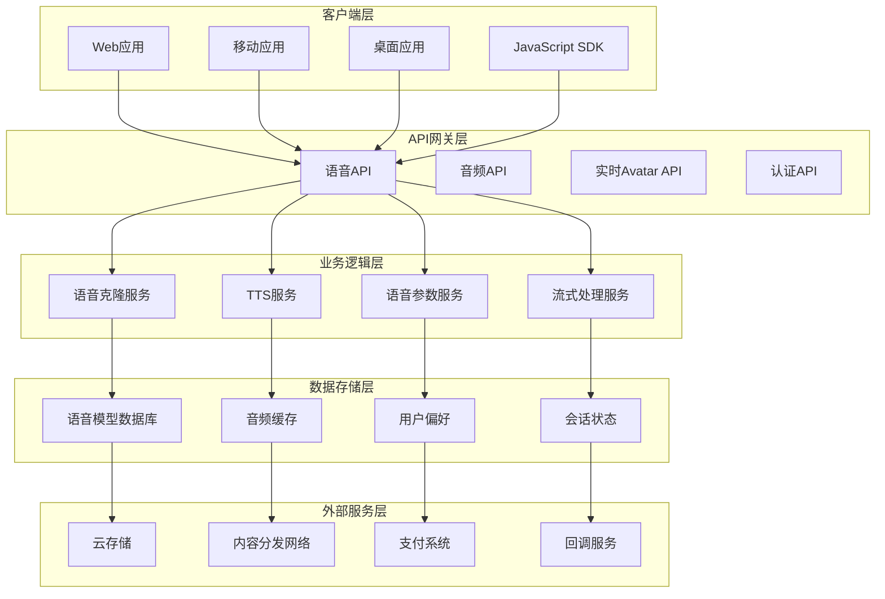
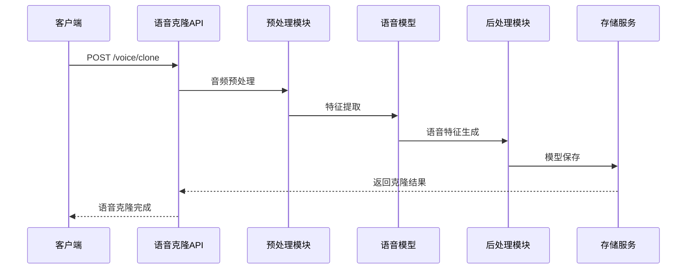
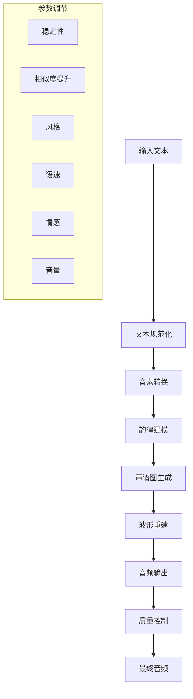
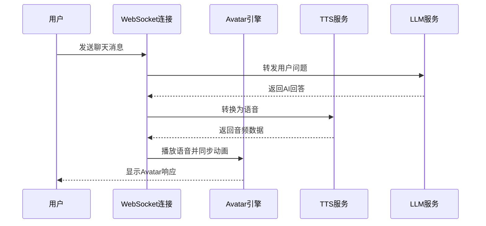
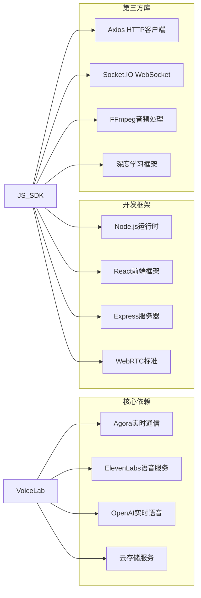
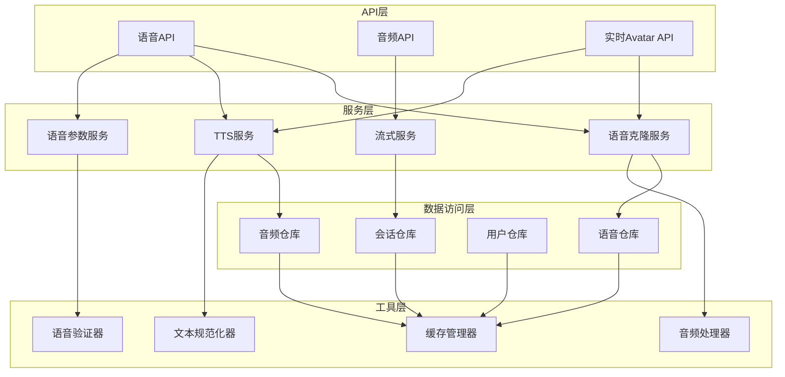
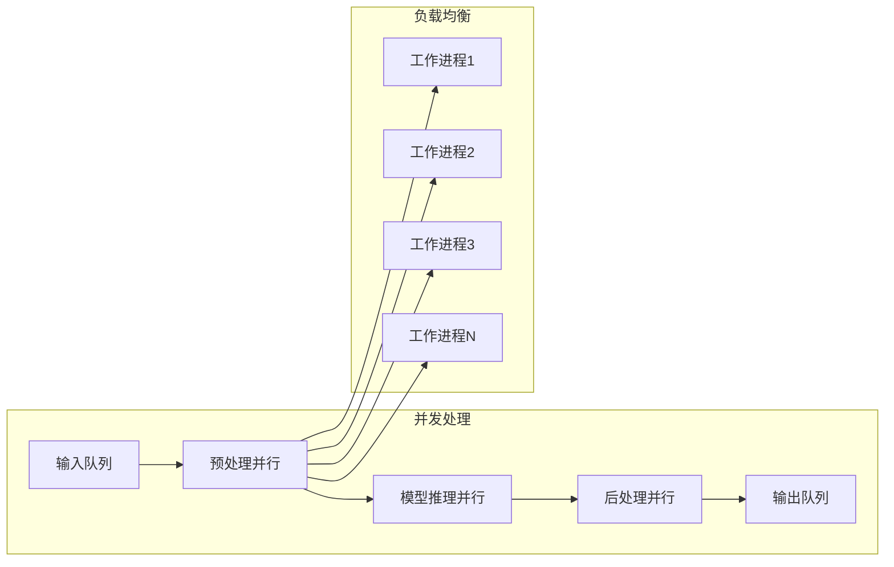
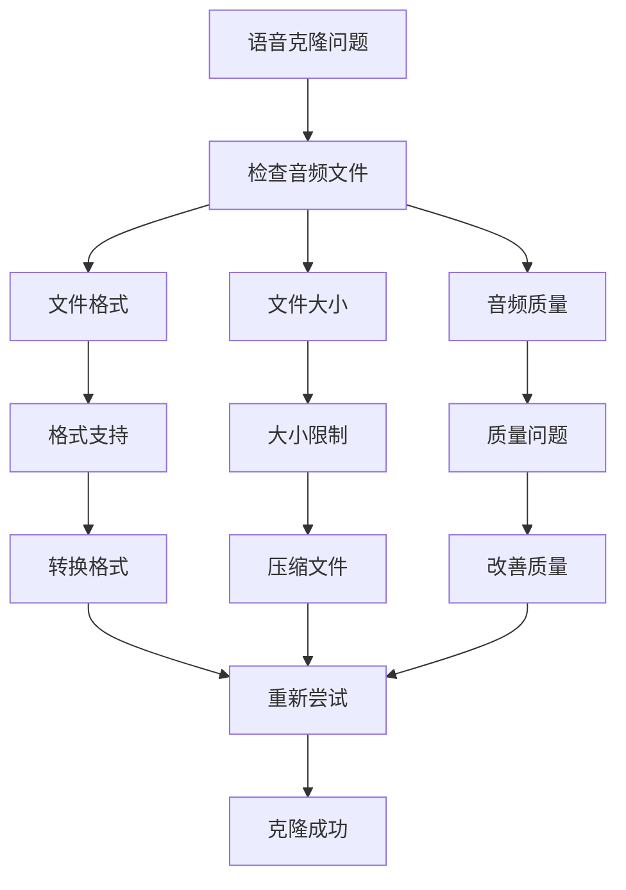

# 语音实验室

<cite>
**本文档引用的文件**
- [voiceLab.mdx](file://ai-tools-suite/voiceLab.mdx)
- [audio.mdx](file://ai-tools-suite/audio.mdx)
- [live-avatar.mdx](file://ai-tools-suite/live-avatar.mdx)
- [live-avatar.yaml](file://openapi/live-avatar.yaml)
- [jssdk-api.mdx](file://sdk/jssdk-api.mdx)
- [jssdk-best-practice.mdx](file://sdk/jssdk-best-practice.mdx)
- [FAQ.mdx](file://ai-tools-suite/FAQ.mdx)
- [error-code.mdx](file://ai-tools-suite/error-code.mdx)
</cite>

## 目录
1. [简介](#简介)
2. [项目结构](#项目结构)
3. [核心组件](#核心组件)
4. [架构概览](#架构概览)
5. [详细组件分析](#详细组件分析)
6. [依赖关系分析](#依赖关系分析)
7. [性能考虑](#性能考虑)
8. [故障排除指南](#故障排除指南)
9. [结论](#结论)
10. [附录](#附录)

## 简介

Akool 语音实验室是一个基于人工智能的语音合成平台，提供语音克隆、文本转语音(TTS)和语音参数调节等核心功能。该平台支持多语言处理，具备强大的语音稳定性设置和音色相似度调节能力，为开发者提供了完整的语音合成解决方案。

平台的核心优势包括：
- **多模型支持**：提供多个语音模型，覆盖不同语言和应用场景
- **高质量语音合成**：支持语音克隆和个性化定制
- **灵活的参数调节**：提供丰富的语音参数控制选项
- **实时交互能力**：支持流式语音处理和实时对话
- **完整的开发工具链**：提供多种编程语言的SDK和API

## 项目结构

语音实验室采用模块化设计，主要包含以下核心模块：



**图表来源**
- [voiceLab.mdx:1-100](file://ai-tools-suite/voiceLab.mdx#L1-L100)
- [audio.mdx:1-50](file://ai-tools-suite/audio.mdx#L1-L50)
- [live-avatar.mdx:1-50](file://ai-tools-suite/live-avatar.mdx#L1-L50)

**章节来源**
- [voiceLab.mdx:1-100](file://ai-tools-suite/voiceLab.mdx#L1-L100)
- [audio.mdx:1-50](file://ai-tools-suite/audio.mdx#L1-L50)
- [live-avatar.mdx:1-50](file://ai-tools-suite/live-avatar.mdx#L1-L50)

## 核心组件

### 语音模型体系

平台提供四个主要的语音模型，每个模型都有其特定的优势和适用场景：

| 模型名称 | 语言支持 | 主要特性 | 适用场景 |
|---------|----------|----------|----------|
| Akool Multilingual 1 | 28种语言 | 强大的语音克隆能力，支持稳定性调节 | 通用语音合成，需要高保真度 |
| Akool Multilingual 2 | 100+种语言 | 优秀的多语言支持，不支持语音克隆 | 多语言内容生成 |
| Akool Multilingual 3 | 60+种语言 | 中文、日语、韩语、英语等重点语言优化 | 中文应用场景，混合音色 |
| Akool Multilingual 4 | 10种语言 | 巴西葡萄牙语专业优化 | 葡萄牙语内容生成 |

### 语音参数控制系统

平台提供了全面的语音参数调节功能：



**图表来源**
- [voiceLab.mdx:349-482](file://ai-tools-suite/voiceLab.mdx#L349-L482)

**章节来源**
- [voiceLab.mdx:17-76](file://ai-tools-suite/voiceLab.mdx#L17-L76)
- [voiceLab.mdx:349-482](file://ai-tools-suite/voiceLab.mdx#L349-L482)

## 架构概览

语音实验室采用分层架构设计，确保系统的可扩展性和稳定性：



**图表来源**
- [voiceLab.mdx:79-133](file://ai-tools-suite/voiceLab.mdx#L79-L133)
- [live-avatar.yaml:13-689](file://openapi/live-avatar.yaml#L13-L689)

## 详细组件分析

### 语音克隆组件

语音克隆是平台的核心功能之一，通过深度学习技术实现高质量的语音复制：

#### 技术实现流程



**图表来源**
- [voiceLab.mdx:79-133](file://ai-tools-suite/voiceLab.mdx#L79-L133)

#### 关键参数说明

| 参数名称 | 类型 | 必填 | 描述 | 取值范围 |
|---------|------|------|------|----------|
| source_voice_file | String | 是 | 原始音频文件URL | 支持mp3、wav等格式 |
| voice_options | Object | 否 | 音频标签选项 | 包含风格、性别、年龄等 |
| name | String | 否 | 音频名称 | 自定义名称 |
| webhookUrl | String | 否 | 回调URL地址 | HTTP请求地址 |
| voice_model_name | String | 否 | 指定克隆模型 | Akool Multilingual 1/3/4 |

**章节来源**
- [voiceLab.mdx:79-133](file://ai-tools-suite/voiceLab.mdx#L79-L133)

### 文本转语音组件

TTS组件提供从文本到语音的完整转换服务：

#### 处理流程



**图表来源**
- [voiceLab.mdx:330-415](file://ai-tools-suite/voiceLab.mdx#L330-L415)

#### 高级参数配置

| 参数类别 | 参数名称 | 类型 | 描述 | 取值范围 |
|---------|----------|------|------|----------|
| 基础参数 | stability | Number | 语音稳定性 | 0-1 |
| 基础参数 | similarity_boost | Number | 相似度提升 | 0-1 |
| 基础参数 | style | Number | 语音风格 | 0-1 |
| 基础参数 | speed | Number | 语速 | 0.7-1.2 |
| 高级参数 | emotion | String | 情感表达 | happy/sad/angry等 |
| 高级参数 | volume | Integer | 音量控制 | 0-100 |
| 音频参数 | sample_rate | Integer | 采样率 | 8000-44100 |
| 音频参数 | bitrate | Integer | 码率 | 32000-256000 |
| 音频参数 | format | String | 音频格式 | mp3/wav |
| 音频参数 | channel | Integer | 声道数 | 1/2 |

**章节来源**
- [voiceLab.mdx:330-482](file://ai-tools-suite/voiceLab.mdx#L330-L482)

### 实时Avatar组件

实时Avatar功能结合了语音合成和视频渲染技术：

#### 交互协议



**图表来源**
- [live-avatar.mdx:37-216](file://ai-tools-suite/live-avatar.mdx#L37-L216)

#### 协议参数

| 参数类型 | 参数名称 | 类型 | 描述 | 示例值 |
|---------|----------|------|------|--------|
| 聊天消息 | v | Number | 协议版本 | 2 |
| 聊天消息 | type | String | 消息类型 | chat |
| 聊天消息 | mid | String | 消息唯一标识 | msg-1723629433573 |
| 聊天消息 | idx | Number | 消息索引 | 0 |
| 聊天消息 | fin | Boolean | 是否为最后部分 | true |
| 聊天消息 | pld.text | String | 文本内容 | "Hello" |
| 命令消息 | pld.cmd | String | 命令类型 | set-params/interrupt |
| 设置参数 | vid | String | 语音ID | 1 |
| 设置参数 | lang | String | 语言代码 | en/es/fr |
| 设置参数 | mode | Number | 交互模式 | 1/2 |
| 设置参数 | bgurl | String | 背景URL | https://example.com/bg.jpg |

**章节来源**
- [live-avatar.mdx:37-216](file://ai-tools-suite/live-avatar.mdx#L37-L216)

## 依赖关系分析

### 外部依赖

语音实验室依赖于多个外部服务和组件：



**图表来源**
- [jssdk-api.mdx:17-585](file://sdk/jssdk-api.mdx#L17-L585)

### 内部模块依赖



**图表来源**
- [voiceLab.mdx:79-133](file://ai-tools-suite/voiceLab.mdx#L79-L133)
- [live-avatar.yaml:283-689](file://openapi/live-avatar.yaml#L283-L689)

**章节来源**
- [jssdk-api.mdx:17-585](file://sdk/jssdk-api.mdx#L17-L585)
- [live-avatar.yaml:283-689](file://openapi/live-avatar.yaml#L283-L689)

## 性能考虑

### 语音处理性能优化

语音实验室在性能方面采用了多项优化策略：

#### 并行处理架构



#### 缓存策略

| 缓存类型 | 缓存内容 | 缓存策略 | 过期时间 |
|---------|----------|----------|----------|
| 语音模型 | 克隆后的语音模型 | LRU缓存 | 24小时 |
| 音频片段 | 常用音频片段 | 分层缓存 | 1小时 |
| 用户偏好 | 用户设置和偏好 | 持久化缓存 | 永不过期 |
| 会话状态 | 实时会话信息 | 内存缓存 | 30分钟 |

### 性能监控指标

| 指标类型 | 目标值 | 监控方式 | 警告阈值 |
|---------|--------|----------|----------|
| 响应时间 | < 2秒 | API响应时间统计 | > 5秒 |
| 吞吐量 | > 100请求/秒 | QPS统计 | < 50请求/秒 |
| 成功率 | > 99% | 业务成功率统计 | < 95% |
| CPU使用率 | < 80% | 系统监控 | > 90% |
| 内存使用率 | < 70% | 系统监控 | > 85% |
| 带宽使用率 | < 60% | 网络监控 | > 80% |

## 故障排除指南

### 常见错误及解决方案

#### API错误码对照表

| 错误码 | 错误类型 | 描述 | 解决方案 |
|-------|----------|------|----------|
| 1000 | 成功 | 请求成功 | 无需操作 |
| 1003 | 参数错误 | 参数验证失败 | 检查请求参数格式 |
| 1004 | 需要验证 | 认证失败 | 检查API密钥或令牌 |
| 1006 | 配额不足 | 余额不足 | 充值或升级套餐 |
| 1009 | 权限不足 | 无操作权限 | 检查用户权限 |
| 1010 | 操作限制 | 频繁操作 | 等待冷却时间 |
| 1101 | 令牌无效 | 令牌过期或无效 | 重新获取令牌 |
| 1104 | 余额不足 | 积分不足 | 充值或检查计费 |
| 1200 | 账户被封 | 账户异常 | 联系客服解封 |
| 1214 | Avatar处理中 | Avatar正在处理 | 稍后重试 |
| 1216 | 会话不存在 | 会话ID无效 | 检查会话状态 |

#### 语音克隆常见问题



#### TTS处理问题排查

| 问题类型 | 症状 | 排查步骤 | 解决方案 |
|---------|------|----------|----------|
| 生成超时 | 响应时间过长 | 检查网络连接、降低文本长度 | 优化网络环境、分段处理 |
| 音质下降 | 语音质量差 | 检查音频参数设置、源音频质量 | 调整参数、使用高质量音频 |
| 语言识别错误 | 语音不符合预期 | 检查语言代码、文本规范化 | 正确设置语言、启用文本规范化 |
| 参数无效 | 某些参数不生效 | 检查模型兼容性 | 使用兼容的参数组合 |

**章节来源**
- [error-code.mdx:1-59](file://ai-tools-suite/error-code.mdx#L1-L59)
- [FAQ.mdx:1-29](file://ai-tools-suite/FAQ.mdx#L1-L29)

### 调试技巧

#### 开发者调试建议

1. **API测试工具**
   - 使用Postman或curl进行API测试
   - 启用详细的日志记录
   - 测试不同参数组合的效果

2. **性能监控**
   - 监控API响应时间和吞吐量
   - 分析内存使用情况
   - 检查并发处理能力

3. **错误追踪**
   - 记录完整的错误堆栈信息
   - 分析错误发生的上下文
   - 建立错误报告机制

## 结论

Akool 语音实验室提供了一个功能完整、性能优异的语音合成平台。通过多模型支持、灵活的参数调节和实时交互能力，满足了从个人开发者到企业用户的多样化需求。

### 主要优势

1. **技术先进性**：采用最新的深度学习技术和语音处理算法
2. **功能完整性**：涵盖语音克隆、TTS、实时Avatar等核心功能
3. **易用性**：提供简洁的API接口和丰富的SDK支持
4. **可扩展性**：模块化架构支持功能扩展和性能优化
5. **安全性**：完善的认证机制和数据保护措施

### 发展方向

未来发展方向包括：
- 进一步优化语音质量和处理速度
- 扩展更多语言和方言支持
- 增强实时交互和多模态能力
- 提供更丰富的定制化选项
- 加强与其他AI服务的集成

## 附录

### API参考文档

#### 语音克隆API

**请求示例**
```json
{
  "source_voice_file": "https://example.com/audio.mp3",
  "name": "My Voice",
  "voice_options": {
    "remove_background_noise": true,
    "style": ["Authoritative", "Calm"],
    "gender": ["Male"],
    "age": ["Elderly"],
    "scenario": ["Advertisement"],
    "language": "en",
    "clone_prompt": "语音克隆提示文本",
    "need_volume_normalization": true
  },
  "voice_model_name": "Akool Multilingual 3",
  "webhookUrl": ""
}
```

**响应示例**
```json
{
  "code": 1000,
  "msg": "OK",
  "data": {
    "uid": 101400,
    "team_id": "6805fb69e92d9edc7ca0b409",
    "voice_id": "generated_voice_id",
    "gender": "Male",
    "name": "MyVoice0626-01",
    "preview": "audio_preview_url",
    "text": "预览文本",
    "duration": 8064,
    "status": 1,
    "create_time": 1751349718268,
    "style": ["Authoritative", "Calm"],
    "scenario": ["Advertisement"],
    "age": ["Elderly", "Middle"],
    "deduction_credit": 0,
    "webhookUrl": "",
    "source_voice_file": "original_audio_url"
  }
}
```

#### TTS API

**请求示例**
```json
{
  "input_text": "这是要转换的文本内容",
  "voice_id": "voice_model_id",
  "voice_options": {
    "stability": 0.6,
    "similarity_boost": 0.8,
    "style": 1,
    "speed": 1.0,
    "speaker_boost": true,
    "emotion": "happy",
    "volume": 80
  },
  "pitch": -5,
  "webhookUrl": "",
  "language_code": "zh",
  "extra_options": {
    "previous_text": "上一段文本",
    "next_text": "下一段文本",
    "apply_text_normalization": "auto",
    "apply_language_text_normalization": true,
    "latex_read": true,
    "text_normalization": true,
    "audio_setting": {
      "sample_rate": 24000,
      "bitrate": 32000,
      "format": "mp3",
      "channel": 2
    },
    "timber_weights": [
      {
        "voice_id": "voice_id_1",
        "weight": 80
      }
    ],
    "pronunciation_dict": {
      "tone": ["雍容/(yong3)(neng4)"]
    },
    "voice_modify": {
      "pitch": 50,
      "intensity": 30,
      "timbre": -50,
      "sound_effects": "robotic"
    },
    "subtitle_enable": true
  }
}
```

**响应示例**
```json
{
  "code": 1000,
  "msg": "OK",
  "data": {
    "create_time": 1751350015709,
    "uid": 101400,
    "team_id": "6805fb69e92d9edc7ca0b409",
    "input_text": "输入文本内容",
    "preview": "audio_preview_url",
    "status": 1,
    "webhookUrl": "",
    "duration": 0,
    "file_name": "generated_file_name",
    "gender": "Male",
    "deduction_credit": 1.9295,
    "name": "generated_name",
    "_id": "document_id",
    "voice_model_id": "voice_model_document_id",
    "voice_id": "voice_model_id",
    "voice_options": {
      "stability": 0.7,
      "similarity_boost": 0.5,
      "style": 0.6,
      "speed": 0.8,
      "speaker_boost": false,
      "emotion": "happy",
      "volume": 50
    }
  }
}
```

### 最佳实践建议

#### 开发集成指南

1. **认证配置**
   - 使用API密钥进行身份验证
   - 实现令牌刷新机制
   - 处理认证失败的重试逻辑

2. **错误处理**
   - 实现幂等性设计
   - 处理网络异常和超时
   - 记录详细的错误日志

3. **性能优化**
   - 实现请求队列和限流
   - 使用缓存减少重复请求
   - 优化音频文件传输

4. **安全考虑**
   - 不在客户端暴露敏感信息
   - 实现HTTPS加密传输
   - 定期更新安全证书

#### 使用场景推荐

1. **教育领域**
   - 个性化朗读服务
   - 多语言教学辅助
   - 无障碍阅读支持

2. **娱乐应用**
   - 游戏角色配音
   - 有声书制作
   - 视频内容配音

3. **商业应用**
   - 客服机器人语音
   - 语音助手集成
   - 多语言内容本地化

4. **媒体制作**
   - 语音合成内容
   - 广告配音服务
   - 影视后期制作

**章节来源**
- [voiceLab.mdx:79-800](file://ai-tools-suite/voiceLab.mdx#L79-L800)
- [audio.mdx:9-575](file://ai-tools-suite/audio.mdx#L9-L575)
- [jssdk-best-practice.mdx:1-203](file://sdk/jssdk-best-practice.mdx#L1-L203)