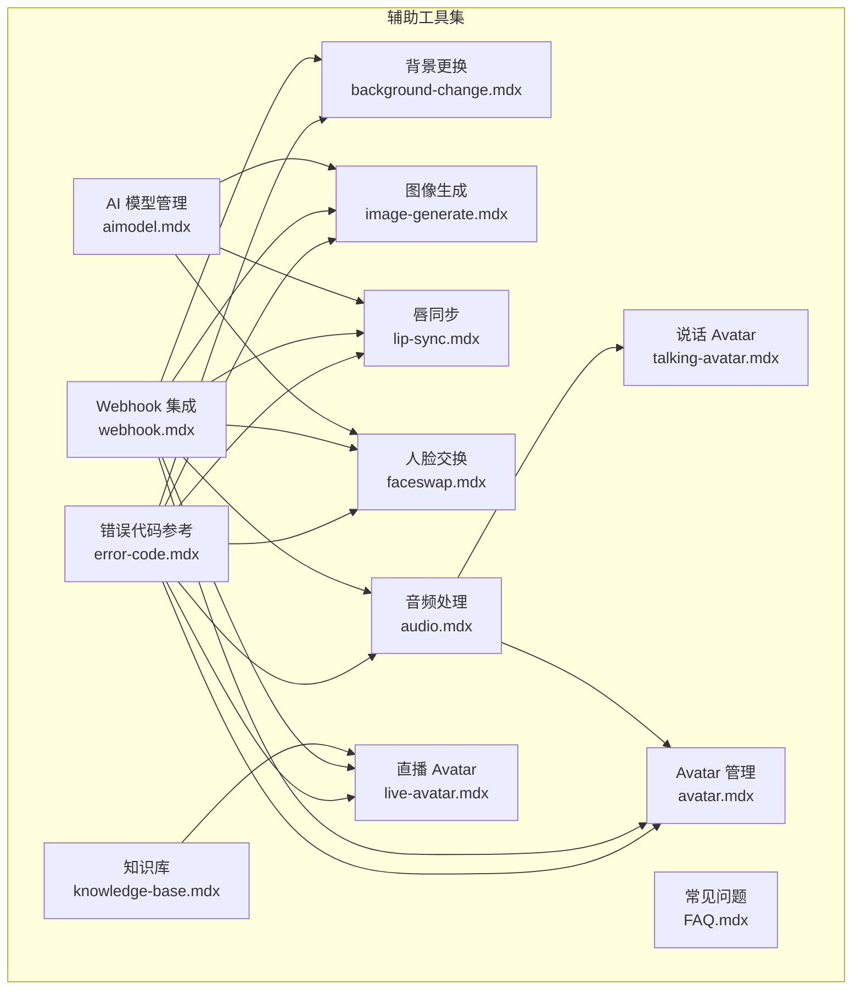
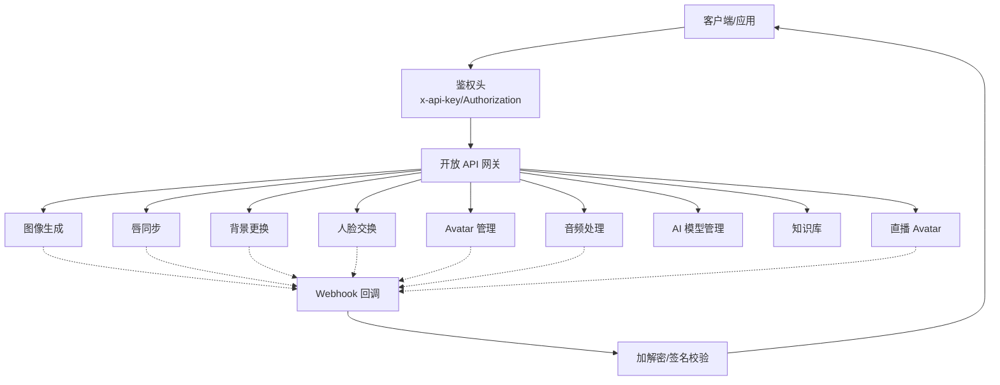
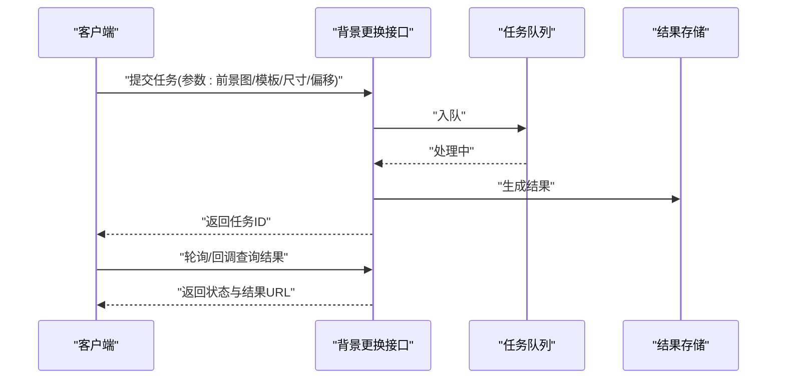
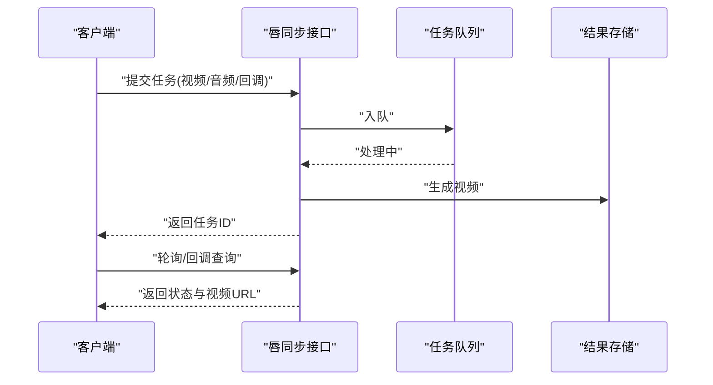
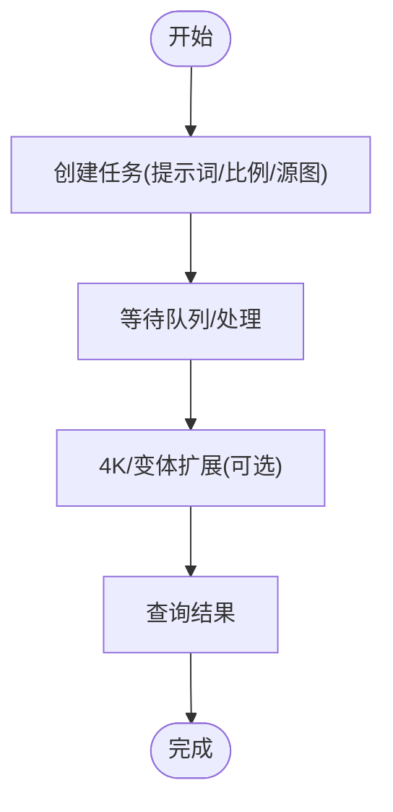
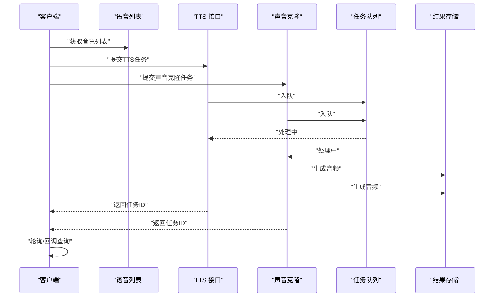
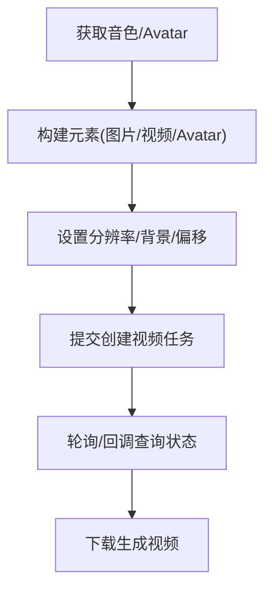
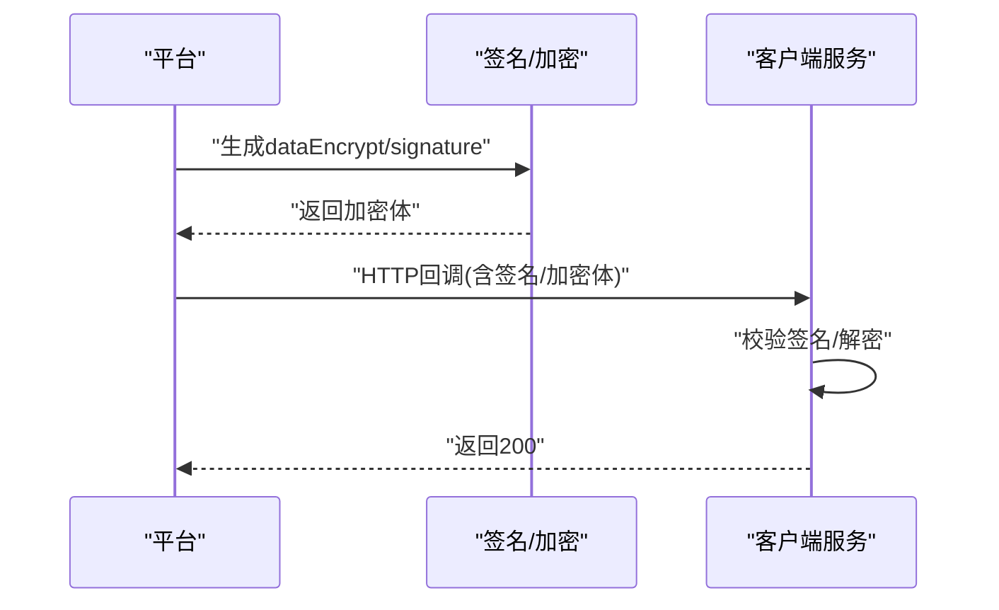
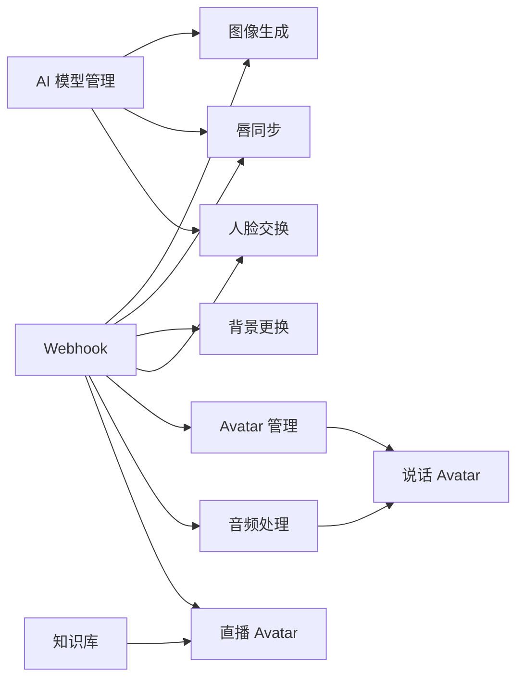

# 辅助工具集

<cite>
**本文引用的文件**
- [background-change.mdx](file://ai-tools-suite/background-change.mdx)
- [lip-sync.mdx](file://ai-tools-suite/lip-sync.mdx)
- [image-generate.mdx](file://ai-tools-suite/image-generate.mdx)
- [aimodel.mdx](file://ai-tools-suite/aimodel.mdx)
- [audio.mdx](file://ai-tools-suite/audio.mdx)
- [avatar.mdx](file://ai-tools-suite/avatar.mdx)
- [knowledge-base.mdx](file://ai-tools-suite/knowledge-base.mdx)
- [webhook.mdx](file://ai-tools-suite/webhook.mdx)
- [error-code.mdx](file://ai-tools-suite/error-code.mdx)
- [FAQ.mdx](file://ai-tools-suite/FAQ.mdx)
- [live-avatar.mdx](file://ai-tools-suite/live-avatar.mdx)
- [faceswap.mdx](file://ai-tools-suite/faceswap.mdx)
- [talking-avatar.mdx](file://ai-tools-suite/talking-avatar.mdx)
</cite>

## 目录
1. [简介](#简介)
2. [项目结构](#项目结构)
3. [核心组件](#核心组件)
4. [架构总览](#架构总览)
5. [详细组件分析](#详细组件分析)
6. [依赖关系分析](#依赖关系分析)
7. [性能考虑](#性能考虑)
8. [故障排除指南](#故障排除指南)
9. [结论](#结论)
10. [附录](#附录)

## 简介
本文件系统性梳理 Akool AI 工具套件的“辅助工具集”，涵盖背景更换、唇同步、图像生成、AI 模型管理、音频处理、Avatar 管理、知识库、Webhook 集成、错误代码与常见问题等模块。重点阐述各工具在主 AI 工具中的支撑作用与集成方式，提供接口说明、使用场景、最佳实践、错误排查与性能优化建议，帮助开发者快速完成端到端集成。

## 项目结构
辅助工具集以“按功能域划分”的文档组织方式呈现，每个功能域独立成文，包含：
- API 接口定义（请求/响应参数、示例）
- 状态码与错误码说明
- Webhook 加解密与回调流程
- 最佳实践与常见问题

图表来源
- [background-change.mdx:1-390](file://ai-tools-suite/background-change.mdx#L1-L390)
- [lip-sync.mdx:1-331](file://ai-tools-suite/lip-sync.mdx#L1-L331)
- [image-generate.mdx:1-470](file://ai-tools-suite/image-generate.mdx#L1-L470)
- [aimodel.mdx:1-267](file://ai-tools-suite/aimodel.mdx#L1-L267)
- [audio.mdx:1-575](file://ai-tools-suite/audio.mdx#L1-L575)
- [avatar.mdx:1-946](file://ai-tools-suite/avatar.mdx#L1-L946)
- [knowledge-base.mdx:1-962](file://ai-tools-suite/knowledge-base.mdx#L1-L962)
- [webhook.mdx:1-447](file://ai-tools-suite/webhook.mdx#L1-L447)
- [error-code.mdx:1-59](file://ai-tools-suite/error-code.mdx#L1-L59)
- [FAQ.mdx:1-29](file://ai-tools-suite/FAQ.mdx#L1-L29)
- [live-avatar.mdx:1-365](file://ai-tools-suite/live-avatar.mdx#L1-L365)
- [faceswap.mdx:1-176](file://ai-tools-suite/faceswap.mdx#L1-L176)
- [talking-avatar.mdx:1-852](file://ai-tools-suite/talking-avatar.mdx#L1-L852)

章节来源
- [background-change.mdx:1-390](file://ai-tools-suite/background-change.mdx#L1-L390)
- [lip-sync.mdx:1-331](file://ai-tools-suite/lip-sync.mdx#L1-L331)
- [image-generate.mdx:1-470](file://ai-tools-suite/image-generate.mdx#L1-L470)
- [aimodel.mdx:1-267](file://ai-tools-suite/aimodel.mdx#L1-L267)
- [audio.mdx:1-575](file://ai-tools-suite/audio.mdx#L1-L575)
- [avatar.mdx:1-946](file://ai-tools-suite/avatar.mdx#L1-L946)
- [knowledge-base.mdx:1-962](file://ai-tools-suite/knowledge-base.mdx#L1-L962)
- [webhook.mdx:1-447](file://ai-tools-suite/webhook.mdx#L1-L447)
- [error-code.mdx:1-59](file://ai-tools-suite/error-code.mdx#L1-L59)
- [FAQ.mdx:1-29](file://ai-tools-suite/FAQ.mdx#L1-L29)
- [live-avatar.mdx:1-365](file://ai-tools-suite/live-avatar.mdx#L1-L365)
- [faceswap.mdx:1-176](file://ai-tools-suite/faceswap.mdx#L1-L176)
- [talking-avatar.mdx:1-852](file://ai-tools-suite/talking-avatar.mdx#L1-L852)

## 核心组件
- 背景更换：支持颜色/模板叠加与前景图定位，返回任务状态与结果链接。
- 唇同步：将音频驱动到视频口型，支持轮询或 Webhook 回调。
- 图像生成：文本/图像到图像生成，支持 4K 扩展与变体生成。
- AI 模型管理：动态获取可用模型列表及配置，指导后续调用。
- 音频处理：语音列表、TTS 与声音克隆，支持回调查询。
- Avatar 管理：系统/自定义 Avatar 列表、上传、创建视频。
- 知识库：文档/URL 管理，增强直播 Avatar 的上下文能力。
- Webhook 集成：统一加解密签名方案，确保回调安全可靠。
- 错误代码参考：覆盖各工具域的业务与系统错误码。
- 常见问题：直播流播放、WebSocket 交互、会话管理等。

章节来源
- [background-change.mdx:11-390](file://ai-tools-suite/background-change.mdx#L11-L390)
- [lip-sync.mdx:11-331](file://ai-tools-suite/lip-sync.mdx#L11-L331)
- [image-generate.mdx:8-470](file://ai-tools-suite/image-generate.mdx#L8-L470)
- [aimodel.mdx:8-267](file://ai-tools-suite/aimodel.mdx#L8-L267)
- [audio.mdx:9-575](file://ai-tools-suite/audio.mdx#L9-L575)
- [avatar.mdx:18-946](file://ai-tools-suite/avatar.mdx#L18-L946)
- [knowledge-base.mdx:14-962](file://ai-tools-suite/knowledge-base.mdx#L14-L962)
- [webhook.mdx:7-447](file://ai-tools-suite/webhook.mdx#L7-L447)
- [error-code.mdx:6-59](file://ai-tools-suite/error-code.mdx#L6-L59)
- [FAQ.mdx:6-29](file://ai-tools-suite/FAQ.mdx#L6-L29)

## 架构总览
辅助工具集通过统一的鉴权头（x-api-key 或 Authorization）与 Webhook 回调机制，串联起图像/视频/音频/AI 模型等子系统。AI 模型管理作为上游配置中心，指导下游具体任务；音频与 Avatar 管理为视频类任务提供基础资源；知识库为直播 Avatar 提供上下文增强；Webhook 统一处理异步结果通知与安全校验。

图表来源
- [aimodel.mdx:10-267](file://ai-tools-suite/aimodel.mdx#L10-L267)
- [webhook.mdx:45-447](file://ai-tools-suite/webhook.mdx#L45-L447)
- [audio.mdx:9-575](file://ai-tools-suite/audio.mdx#L9-L575)
- [avatar.mdx:18-946](file://ai-tools-suite/avatar.mdx#L18-L946)
- [image-generate.mdx:8-470](file://ai-tools-suite/image-generate.mdx#L8-L470)
- [lip-sync.mdx:11-331](file://ai-tools-suite/lip-sync.mdx#L11-L331)
- [background-change.mdx:11-390](file://ai-tools-suite/background-change.mdx#L11-L390)
- [faceswap.mdx:15-176](file://ai-tools-suite/faceswap.mdx#L15-L176)
- [knowledge-base.mdx:55-962](file://ai-tools-suite/knowledge-base.mdx#L55-L962)
- [live-avatar.mdx:24-365](file://ai-tools-suite/live-avatar.mdx#L24-L365)

## 详细组件分析

### 背景更换（Background Change）
- 功能概述：支持颜色填充、模板叠加与前景图定位，返回任务状态与结果链接。
- 关键参数：画布尺寸、前景图、模板图（可选）、缩放与偏移、回调地址。
- 状态流转：队列中 → 处理中 → 成功/失败；成功后通过回调或查询接口获取结果。
- 使用场景：电商产品图背景替换、人像合成背景定制。
- 最佳实践：优先使用模板叠加+定位参数，避免超大画布导致资源浪费；合理设置回调地址。

图表来源
- [background-change.mdx:14-251](file://ai-tools-suite/background-change.mdx#L14-L251)
- [background-change.mdx:253-374](file://ai-tools-suite/background-change.mdx#L253-L374)

章节来源
- [background-change.mdx:11-390](file://ai-tools-suite/background-change.mdx#L11-L390)

### 唇同步（LipSync）
- 功能概述：将音频驱动到视频口型，支持轮询或 Webhook 回调。
- 关键参数：视频 URL、音频 URL、回调地址；注意帧率与长度建议。
- 状态流转：队列中 → 处理中 → 成功/失败；成功后返回生成视频 URL。
- 使用场景：短视频配音、虚拟主播口型同步。
- 最佳实践：控制视频帧率与时长，保证音视频对齐质量。

图表来源
- [lip-sync.mdx:14-180](file://ai-tools-suite/lip-sync.mdx#L14-L180)
- [lip-sync.mdx:182-303](file://ai-tools-suite/lip-sync.mdx#L182-L303)

章节来源
- [lip-sync.mdx:11-331](file://ai-tools-suite/lip-sync.mdx#L11-L331)

### 图像生成（Image Generate）
- 功能概述：文本/图像到图像生成，支持 4K 扩展与变体生成。
- 关键参数：提示词、比例、源图（可选）、回调地址。
- 流程：创建任务 → 4K/变体扩展 → 查询结果。
- 使用场景：创意设计、内容素材生成。
- 最佳实践：合理选择比例与扩展按钮，避免过度消耗配额。

图表来源
- [image-generate.mdx:10-173](file://ai-tools-suite/image-generate.mdx#L10-L173)
- [image-generate.mdx:175-330](file://ai-tools-suite/image-generate.mdx#L175-L330)
- [image-generate.mdx:332-454](file://ai-tools-suite/image-generate.mdx#L332-L454)

章节来源
- [image-generate.mdx:8-470](file://ai-tools-suite/image-generate.mdx#L8-L470)

### AI 模型管理（AI Model）
- 功能概述：动态获取可用模型列表与配置，指导后续调用。
- 关键参数：类型数组（如图像转视频、文本转视频、人脸交换）。
- 使用场景：根据业务需求选择合适模型与分辨率/时长限制。
- 最佳实践：结合配额与价格策略选择模型；关注是否支持扩展提示/最后一帧等特性。

章节来源
- [aimodel.mdx:8-267](file://ai-tools-suite/aimodel.mdx#L8-L267)

### 音频处理（Audio）
- 功能概述：语音列表、TTS 与声音克隆，支持回调查询。
- 关键参数：输入文本、音色 ID、语速、回调地址。
- 使用场景：说话 Avatar、直播语音合成。
- 最佳实践：预置音色列表，控制文本长度与语速，提升合成质量。

图表来源
- [audio.mdx:9-129](file://ai-tools-suite/audio.mdx#L9-L129)
- [audio.mdx:131-294](file://ai-tools-suite/audio.mdx#L131-L294)
- [audio.mdx:296-458](file://ai-tools-suite/audio.mdx#L296-L458)
- [audio.mdx:460-574](file://ai-tools-suite/audio.mdx#L460-L574)

章节来源
- [audio.mdx:1-575](file://ai-tools-suite/audio.mdx#L1-L575)

### Avatar 管理（Avatar）
- 功能概述：系统/自定义 Avatar 列表、上传、创建视频。
- 关键参数：元素（图片/视频/Avatar）、缩放/偏移、分辨率、背景色、回调地址。
- 使用场景：说话 Avatar、直播 Avatar 场景搭建。
- 最佳实践：合理设置分辨率与背景，确保元素层级与对齐。

图表来源
- [avatar.mdx:18-144](file://ai-tools-suite/avatar.mdx#L18-L144)
- [avatar.mdx:264-422](file://ai-tools-suite/avatar.mdx#L264-L422)
- [avatar.mdx:424-800](file://ai-tools-suite/avatar.mdx#L424-L800)

章节来源
- [avatar.mdx:1-946](file://ai-tools-suite/avatar.mdx#L1-L946)

### 知识库（Knowledge Base）
- 功能概述：管理文档与 URL，增强直播 Avatar 的上下文理解。
- 关键参数：名称、开场白、提示词、文档/URL 数组。
- 使用场景：客服/教育/企业助手等需要上下文增强的对话场景。
- 最佳实践：控制单文件大小与总量，规范字段长度，定期清理无效资源。

章节来源
- [knowledge-base.mdx:14-962](file://ai-tools-suite/knowledge-base.mdx#L14-L962)

### Webhook 集成（Webhook）
- 功能概述：统一回调通道，提供加解密与签名校验，确保数据安全。
- 关键流程：平台加密消息体 → 客户端校验签名 → 解密消息 → 返回 200。
- 使用场景：所有异步任务完成后，自动推送结果。
- 最佳实践：实现幂等处理，重试与失败告警，严格校验签名与时间戳。

图表来源
- [webhook.mdx:9-447](file://ai-tools-suite/webhook.mdx#L9-L447)

章节来源
- [webhook.mdx:1-447](file://ai-tools-suite/webhook.mdx#L1-L447)

### 错误代码参考（ErrorCode）
- 功能概述：统一错误码说明，便于快速定位问题。
- 覆盖范围：参数错误、频繁操作、配额不足、鉴权失效、账号封禁、处理异常等。
- 使用场景：日志记录、告警触发、用户提示。
- 最佳实践：将错误码映射到用户可理解的提示信息，并提供自助排查指引。

章节来源
- [error-code.mdx:6-59](file://ai-tools-suite/error-code.mdx#L6-L59)

### 常见问题（FAQ）
- 功能概述：直播流播放、WebSocket 交互、会话管理等常见问题解答。
- 使用场景：快速解决集成过程中的典型问题。
- 最佳实践：结合文档与示例，逐步验证播放器与协议兼容性。

章节来源
- [FAQ.mdx:6-29](file://ai-tools-suite/FAQ.mdx#L6-L29)

### 直播 Avatar（Live Avatar）
- 功能概述：基于 WebSocket 的实时互动，支持参数设置、打断、动作控制。
- 关键参数：版本号、消息类型、唯一标识、分片索引、负载内容。
- 使用场景：实时客服、虚拟主播、互动教学。
- 最佳实践：先查询会话状态再建立连接，正确处理消息分片与命令响应。

章节来源
- [live-avatar.mdx:24-365](file://ai-tools-suite/live-avatar.mdx#L24-L365)

### 人脸交换（Faceswap）
- 功能概述：图像/视频人脸交换，支持多脸映射与单脸模式。
- 关键参数：源/目标 URL、模型风格、增强开关、单脸/多脸映射。
- 使用场景：娱乐、内容创作、隐私保护。
- 最佳实践：控制视频时长与人脸数量，启用增强提升质量。

章节来源
- [faceswap.mdx:15-176](file://ai-tools-suite/faceswap.mdx#L15-L176)

### 说话 Avatar（Talking Avatar）
- 功能概述：结合音色与 Avatar 生成说话视频，支持元素组合与回调查询。
- 关键参数：分辨率、元素（图片/Avatar/音频）、偏移/缩放、回调地址。
- 使用场景：短视频、数字人播报、虚拟角色讲解。
- 最佳实践：合理设置分辨率与元素层级，优先使用回调获取结果。

章节来源
- [talking-avatar.mdx:18-852](file://ai-tools-suite/talking-avatar.mdx#L18-L852)

## 依赖关系分析
- 上游依赖：AI 模型管理为图像生成、唇同步、人脸交换提供模型选择依据。
- 资源依赖：音频与 Avatar 管理为视频类任务提供基础资源（音色/人物）。
- 通知依赖：Webhook 统一承接各任务的异步结果，降低轮询成本。
- 数据依赖：知识库为直播 Avatar 提供上下文增强，提升对话质量。

图表来源
- [aimodel.mdx:10-267](file://ai-tools-suite/aimodel.mdx#L10-L267)
- [audio.mdx:9-575](file://ai-tools-suite/audio.mdx#L9-L575)
- [avatar.mdx:18-946](file://ai-tools-suite/avatar.mdx#L18-L946)
- [image-generate.mdx:8-470](file://ai-tools-suite/image-generate.mdx#L8-L470)
- [lip-sync.mdx:11-331](file://ai-tools-suite/lip-sync.mdx#L11-L331)
- [background-change.mdx:11-390](file://ai-tools-suite/background-change.mdx#L11-L390)
- [faceswap.mdx:15-176](file://ai-tools-suite/faceswap.mdx#L15-L176)
- [knowledge-base.mdx:55-962](file://ai-tools-suite/knowledge-base.mdx#L55-L962)
- [live-avatar.mdx:24-365](file://ai-tools-suite/live-avatar.mdx#L24-L365)
- [webhook.mdx:45-447](file://ai-tools-suite/webhook.mdx#L45-L447)

## 性能考虑
- 合理设置回调地址，避免轮询带来的网络与服务器压力。
- 控制视频时长与分辨率，减少处理耗时与资源占用。
- 对高并发场景启用配额与限流策略，保障稳定性。
- 使用 Webhook 的加解密与签名机制，降低中间环节的安全风险与重复传输成本。
- 对于直播 Avatar，选择合适的播放器与协议，确保低延迟与高可用。

## 故障排除指南
- 参数错误：检查必填字段与格式，参考错误码说明进行修正。
- 频繁操作：降低请求频率，合理使用配额与缓存。
- 鉴权失败：确认 API Key/Token 有效且未过期。
- 资源不存在：核对资源 URL 可访问性与有效期。
- 处理异常：查看任务状态与错误原因，必要时重试或联系技术支持。
- Webhook 回调失败：检查签名与解密逻辑，确保返回 200 状态码。

章节来源
- [error-code.mdx:6-59](file://ai-tools-suite/error-code.mdx#L6-L59)
- [webhook.mdx:9-447](file://ai-tools-suite/webhook.mdx#L9-L447)
- [FAQ.mdx:6-29](file://ai-tools-suite/FAQ.mdx#L6-L29)

## 结论
辅助工具集通过标准化的接口、统一的鉴权与 Webhook 回调机制，为图像/视频/音频/AI 模型等能力提供了稳定、可扩展的支撑。开发者应结合业务场景选择合适的工具与模型，遵循最佳实践与错误处理策略，确保系统的可靠性与用户体验。

## 附录
- 快速集成清单
  - 明确业务目标与所需工具域
  - 获取并配置 API Key/Token
  - 通过 AI 模型管理选择合适模型
  - 准备音频/Avatar/图像等基础资源
  - 设置 Webhook 并实现签名/解密逻辑
  - 编写回调处理与轮询查询逻辑
  - 记录错误码并建立告警机制
  - 进行端到端联调与性能压测