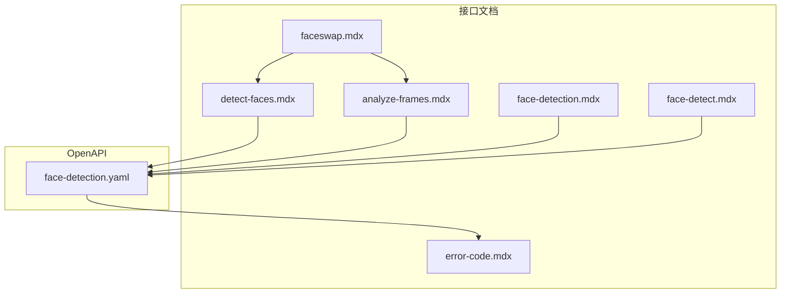
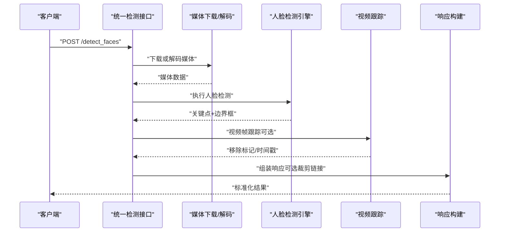
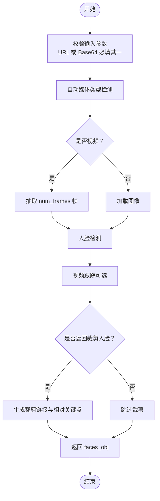
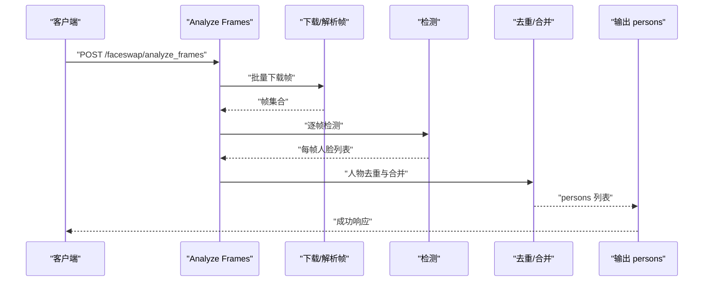
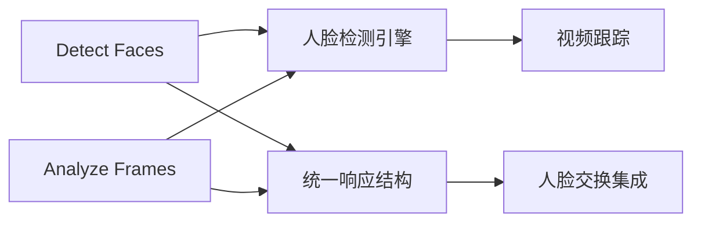

# 面部检测系统

<cite>
**本文档引用的文件**
- [face-detection/detect-faces.mdx](file://ai-tools-suite/face-detection/detect-faces.mdx)
- [face-detection/analyze-frames.mdx](file://ai-tools-suite/face-detection/analyze-frames.mdx)
- [face-detection.mdx](file://ai-tools-suite/face-detection.mdx)
- [face-detection.yaml](file://openapi/face-detection.yaml)
- [faceswap/face-detect.mdx](file://ai-tools-suite/faceswap/face-detect.mdx)
- [faceswap.mdx](file://ai-tools-suite/faceswap.mdx)
- [error-code.mdx](file://ai-tools-suite/error-code.mdx)
</cite>

## 目录
1. [简介](#简介)
2. [项目结构](#项目结构)
3. [核心组件](#核心组件)
4. [架构概览](#架构概览)
5. [详细组件分析](#详细组件分析)
6. [依赖关系分析](#依赖关系分析)
7. [性能考量](#性能考量)
8. [故障排查指南](#故障排查指南)
9. [结论](#结论)
10. [附录](#附录)

## 简介
本技术文档面向 Akool 面部检测系统，系统提供统一的人脸定位与特征识别能力，支持图像与视频输入，并输出 6 点面部关键点、边界框以及可选的裁剪人脸图像链接。系统同时提供视频帧分析能力，用于多帧场景下的人脸去重与跟踪，便于后续的人脸交换等 AI 应用。

系统核心特性：
- 统一检测接口：自动识别媒体类型（图像/视频），支持 URL 与 Base64 输入
- 6 点面部关键点：左眼、右眼、鼻尖、嘴中心、左右嘴角
- 视频跟踪：跨帧人脸 ID 持续性与移除标记
- 裁剪人脸：可选返回裁剪后的人脸图像链接及相对坐标系下的关键点
- 多帧分析：按帧去重与合并，输出人物列表，便于人脸交换准备

## 项目结构
文档采用按功能模块组织的方式，核心文件分布如下：
- 接口文档与示例：ai-tools-suite/face-detection/*.mdx
- OpenAPI 定义：openapi/face-detection.yaml
- 与人脸交换集成：ai-tools-suite/faceswap/*.mdx
- 错误码参考：ai-tools-suite/error-code.mdx

图表来源
- [face-detection.yaml:23-289](file://openapi/face-detection.yaml#L23-L289)
- [face-detection/detect-faces.mdx:1-183](file://ai-tools-suite/face-detection/detect-faces.mdx#L1-L183)
- [face-detection/analyze-frames.mdx:1-199](file://ai-tools-suite/face-detection/analyze-frames.mdx#L1-L199)
- [face-detection.mdx:1-313](file://ai-tools-suite/face-detection.mdx#L1-L313)
- [faceswap/face-detect.mdx:1-122](file://ai-tools-suite/faceswap/face-detect.mdx#L1-L122)
- [faceswap.mdx:1-176](file://ai-tools-suite/faceswap.mdx#L1-L176)
- [error-code.mdx:1-59](file://ai-tools-suite/error-code.mdx#L1-L59)

章节来源
- [face-detection.mdx:1-313](file://ai-tools-suite/face-detection.mdx#L1-L313)
- [face-detection.yaml:1-626](file://openapi/face-detection.yaml#L1-L626)

## 核心组件
- 统一检测接口（Detect Faces）
  - 支持图像与视频输入，自动媒体类型检测
  - 输出每张脸的 6 点关键点、边界框、可选裁剪人脸链接与相对关键点
  - 视频模式支持跨帧跟踪与移除标记
- 帧分析接口（Analyze Frames）
  - 单图或多帧分析，自动去重同一人物
  - 输出人物列表，含首次/末次出现时间戳与所有出现位置
  - 可配置裁剪扩展比例以提升人脸上下文

章节来源
- [face-detection/detect-faces.mdx:1-183](file://ai-tools-suite/face-detection/detect-faces.mdx#L1-L183)
- [face-detection/analyze-frames.mdx:1-199](file://ai-tools-suite/face-detection/analyze-frames.mdx#L1-L199)
- [face-detection.mdx:1-313](file://ai-tools-suite/face-detection.mdx#L1-L313)

## 架构概览
系统采用“请求-处理-响应”的三层结构：
- 请求层：接收来自客户端的 JSON 请求，支持 URL 或 Base64 图像输入
- 处理层：根据媒体类型进行下载/解码、提取帧（视频）、人脸检测与跟踪、可选裁剪人脸生成
- 响应层：返回标准化结果，包含错误码、消息与结构化数据

图表来源
- [face-detection.yaml:24-158](file://openapi/face-detection.yaml#L24-L158)
- [face-detection.mdx:28-98](file://ai-tools-suite/face-detection.mdx#L28-L98)

## 详细组件分析

### 统一检测接口（Detect Faces）
- 功能要点
  - 自动媒体类型检测（基于 URL 扩展名与内容类型）
  - 支持 URL 与 Base64 两种输入方式；两者同时提供时优先使用 URL
  - 视频模式可指定抽取帧数（num_frames），默认 5；图像模式忽略该参数
  - 可选返回裁剪人脸链接（return_face_url=true），并返回原图坐标与裁剪后关键点
  - 可选仅返回最大人脸（single_face=true）
- 关键数据结构
  - faces_obj：以帧索引字符串为键的对象，值为该帧的面数据
  - 每个面包含：landmarks（6 点）、landmarks_str（前 4 点字符串）、region（边界框）、removed（视频移除标记）、frame_time（视频时间戳）、face_urls/crop_region/crop_landmarks（可选）
- 典型流程
  - 图像：直接检测并返回
  - 视频：抽帧 -> 检测 -> 跟踪 -> 标记移除 -> 返回结果

图表来源
- [face-detection.yaml:24-158](file://openapi/face-detection.yaml#L24-L158)
- [face-detection/detect-faces.mdx:11-66](file://ai-tools-suite/face-detection/detect-faces.mdx#L11-L66)

章节来源
- [face-detection/detect-faces.mdx:1-183](file://ai-tools-suite/face-detection/detect-faces.mdx#L1-L183)
- [face-detection.mdx:107-138](file://ai-tools-suite/face-detection.mdx#L107-L138)

### 帧分析接口（Analyze Frames）
- 功能要点
  - 单图：每张脸作为独立人物返回
  - 多图：自动去重同一人物，合并其多次出现
  - 输出 persons 列表，包含 person_id、face_url、bbox、confidence、appearances（含时间戳与帧索引）、first_seen/last_seen
  - 可配置 expand_ratio 控制裁剪区域扩展比例
- 典型流程
  - 下载/解析帧 -> 人脸检测 -> 去重与合并 -> 生成人物列表

图表来源
- [face-detection.yaml:160-289](file://openapi/face-detection.yaml#L160-L289)
- [face-detection/analyze-frames.mdx:1-199](file://ai-tools-suite/face-detection/analyze-frames.mdx#L1-L199)

章节来源
- [face-detection/analyze-frames.mdx:1-199](file://ai-tools-suite/face-detection/analyze-frames.mdx#L1-L199)
- [face-detection.mdx:1-313](file://ai-tools-suite/face-detection.mdx#L1-L313)

### OpenAPI 规范与数据模型
- 认证方式
  - x-api-key 头部认证
  - Bearer Token 认证（可选）
- 统一检测请求体
  - url/img：媒体输入
  - num_frames：视频抽帧数量（1-100，默认 5）
  - return_face_url：是否返回裁剪人脸链接
  - single_face：是否仅返回最大人脸
- 统一检测响应
  - error_code/error_msg：状态码与消息
  - faces_obj：帧级人脸数据对象
- 帧分析请求体
  - frame_urls：帧 URL 数组
  - timestamps：可选时间戳数组
  - expand_ratio：裁剪扩展比例（0-1，默认 0.3）
- 帧分析响应
  - success：是否成功
  - frame_count：分析帧数
  - persons：人物列表

章节来源
- [face-detection.yaml:19-300](file://openapi/face-detection.yaml#L19-L300)
- [face-detection.yaml:302-626](file://openapi/face-detection.yaml#L302-L626)

### 与人脸交换的集成
- 使用 Detect Faces 的 landmarks_str 作为 Face Swap 的 opts 参数
- 使用 return_face_url 时，可直接将 face_urls 传入 Face Swap API
- 帧分析接口返回的 persons 中的 face_url 可直接用于 Face Swap

章节来源
- [face-detection/detect-faces.mdx:154-176](file://ai-tools-suite/face-detection/detect-faces.mdx#L154-L176)
- [face-detection/analyze-frames.mdx:174-192](file://ai-tools-suite/face-detection/analyze-frames.mdx#L174-L192)
- [faceswap.mdx:15-60](file://ai-tools-suite/faceswap.mdx#L15-L60)

## 依赖关系分析
- 组件耦合
  - Detect Faces 与 Analyze Frames 共享统一的媒体处理与人脸检测能力
  - Analyze Frames 依赖 Detect Faces 的裁剪与关键点信息
- 外部依赖
  - 媒体下载与解码（HTTP/HTTPS）
  - 人脸检测引擎（InsightFace，用于关键点与边界框）
  - 视频跟踪（跨帧人脸匹配与移除标记）
- 接口契约
  - 统一的错误码与消息规范
  - 标准化的响应字段与数据结构

图表来源
- [face-detection.yaml:24-158](file://openapi/face-detection.yaml#L24-L158)
- [face-detection/analyze-frames.mdx:160-289](file://ai-tools-suite/face-detection/analyze-frames.mdx#L160-L289)

## 性能考量
- 处理时间
  - 图像：通常小于 1 秒
  - 视频：取决于抽帧数量、分辨率与每帧人脸数量
- 优化建议
  - 合理设置 num_frames：短片 5-10 帧，中片 10-20 帧，长片 20-50 帧
  - 使用 single_face=true 仅返回最大人脸，减少响应体积
  - 缓存重复媒体的结果
  - 批量处理多个视频以提高吞吐
- 资源限制
  - 接口存在速率限制，请参考账户设置

章节来源
- [face-detection.mdx:282-304](file://ai-tools-suite/face-detection.mdx#L282-L304)

## 故障排查指南
- 常见错误与解决
  - 缺少输入：确保提供 url 或 img 其中之一
  - URL 格式无效：检查协议与可访问性
  - 下载失败：确认媒体 URL 公开可达
  - 无检测结果：检查图像质量与人脸可见性
  - 处理失败：确认媒体格式受支持
  - 媒体类型检测失败：确保文件扩展名或内容类型正确
- 错误码参考
  - 通用错误码：如参数错误、频繁操作、配额不足、非法令牌、账户被封禁等
  - 人脸交换相关：如人脸数量超出限制、人脸交换错误等

章节来源
- [face-detection.mdx:242-254](file://ai-tools-suite/face-detection.mdx#L242-L254)
- [error-code.mdx:1-59](file://ai-tools-suite/error-code.mdx#L1-L59)

## 结论
Akool 面部检测系统通过统一接口提供高精度的人脸定位与特征识别，支持图像与视频场景，并具备视频跟踪与裁剪人脸能力。结合帧分析接口，可实现多帧去重与人物追踪，为后续的人脸交换等 AI 应用提供高质量输入。开发者可通过合理的参数配置与缓存策略优化性能，并遵循错误处理与最佳实践以获得稳定可靠的集成体验。

## 附录

### 接口文档与使用示例
- 统一检测接口（Detect Faces）
  - 请求参数：url/img、num_frames、return_face_url、single_face
  - 响应字段：error_code、error_msg、faces_obj
  - 示例与最佳实践详见文档
- 帧分析接口（Analyze Frames）
  - 请求参数：frame_urls、timestamps、expand_ratio
  - 响应字段：success、frame_count、persons
  - 示例与最佳实践详见文档

章节来源
- [face-detection/detect-faces.mdx:1-183](file://ai-tools-suite/face-detection/detect-faces.mdx#L1-L183)
- [face-detection/analyze-frames.mdx:1-199](file://ai-tools-suite/face-detection/analyze-frames.mdx#L1-L199)

### 与人脸交换的集成步骤
- 图像场景
  - 使用 Detect Faces 获取 landmarks_str 或裁剪人脸链接
  - 将 landmarks_str 作为 Face Swap 的 opts 参数
- 多帧场景
  - 使用 Analyze Frames 获取 persons 列表
  - 从 persons 中提取 face_url 并传入 Face Swap

章节来源
- [face-detection/detect-faces.mdx:154-176](file://ai-tools-suite/face-detection/detect-faces.mdx#L154-L176)
- [face-detection/analyze-frames.mdx:174-192](file://ai-tools-suite/face-detection/analyze-frames.mdx#L174-L192)
- [faceswap.mdx:15-60](file://ai-tools-suite/faceswap.mdx#L15-L60)