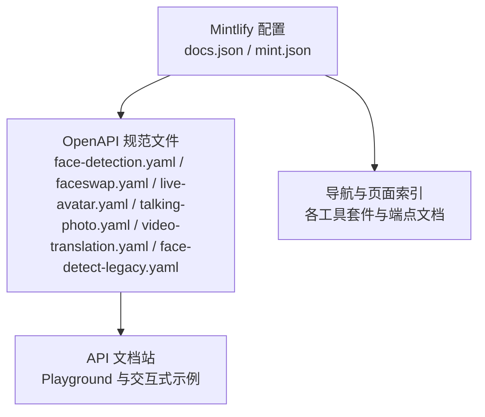
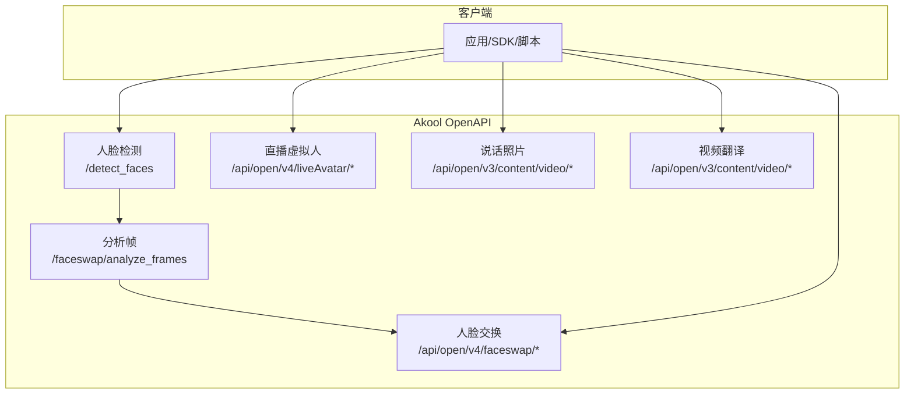
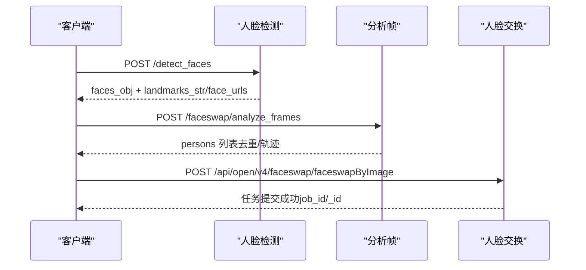
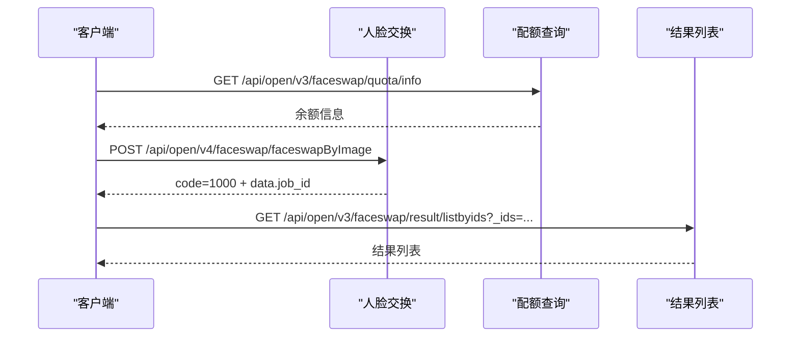
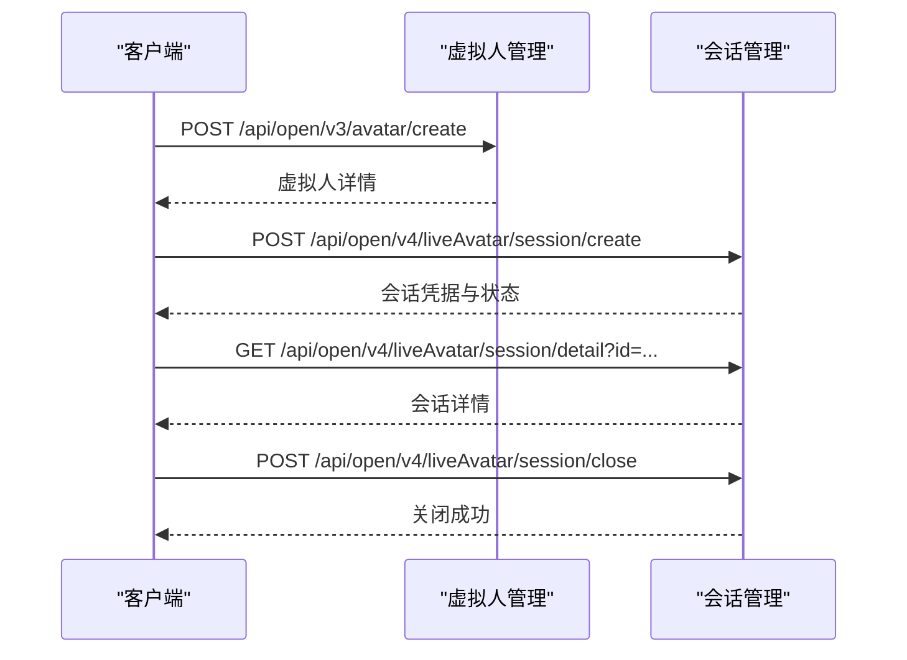
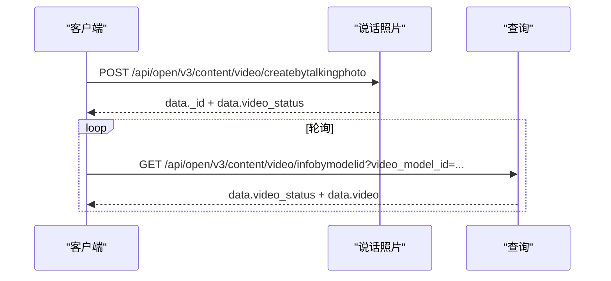
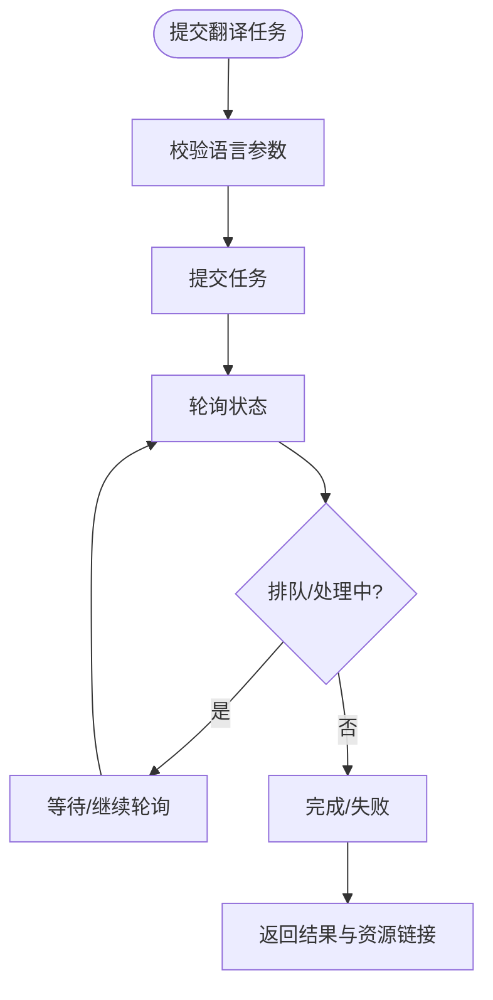
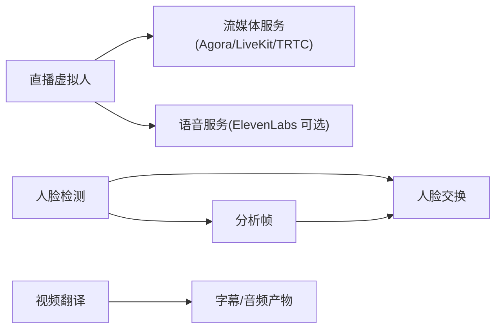

# OpenAPI 规范

<cite>
**本文引用的文件**
- [face-detect-legacy.yaml](file://openapi/face-detect-legacy.yaml)
- [face-detection.yaml](file://openapi/face-detection.yaml)
- [faceswap.yaml](file://openapi/faceswap.yaml)
- [live-avatar.yaml](file://openapi/live-avatar.yaml)
- [talking-photo.yaml](file://openapi/talking-photo.yaml)
- [video-translation.yaml](file://openapi/video-translation.yaml)
- [docs.json](file://docs.json)
- [mint.json](file://mint.json)
- [README.md](file://README.md)
- [detect-faces.mdx](file://ai-tools-suite/face-detection/detect-faces.mdx)
- [image-faceswap-v4.mdx](file://ai-tools-suite/faceswap/image-faceswap-v4.mdx)
- [create-session.mdx](file://ai-tools-suite/live-avatar/create-session.mdx)
</cite>

## 目录
1. [简介](#简介)
2. [项目结构](#项目结构)
3. [核心组件](#核心组件)
4. [架构总览](#架构总览)
5. [详细组件分析](#详细组件分析)
6. [依赖关系分析](#依赖关系分析)
7. [性能与并发特性](#性能与并发特性)
8. [故障排查指南](#故障排查指南)
9. [结论](#结论)
10. [附录：API 端点清单与示例](#附录api-端点清单与示例)

## 简介
本文件面向开发者，系统化梳理 Akool AI Tools Suite 的 OpenAPI 规范，覆盖人脸检测、人脸交换、直播虚拟人、说话照片、视频翻译等能力域。文档从 OpenAPI 结构、安全机制、数据模型、错误码、端点清单到调用示例与客户端生成实践进行完整说明，并提供可视化图示帮助理解。

## 项目结构
- 文档与配置
  - 文档引擎与导航：通过 Mintlify 配置文件集中管理导航、Logo、颜色主题与 API Playground。
  - OpenAPI 集成：在配置中声明多个 YAML 规范文件，统一在文档站内展示与交互。
- OpenAPI 规范文件
  - 人脸检测（含旧版与新版）
  - 人脸交换
  - 直播虚拟人
  - 说话照片
  - 视频翻译

图表来源
- [docs.json:206-221](file://docs.json#L206-L221)
- [mint.json:9-15](file://mint.json#L9-L15)

章节来源
- [docs.json:1-235](file://docs.json#L1-L235)
- [mint.json:1-201](file://mint.json#L1-L201)
- [README.md:1-33](file://README.md#L1-L33)

## 核心组件
- 安全机制
  - 支持两种认证方式：
    - x-api-key 头部认证
    - Bearer Token 认证（Authorization: Bearer）
  - 说明：当同时提供 Authorization 和 x-api-key 时，优先使用 Authorization。
- 服务器与域名
  - 生产服务地址统一为 https://openapi.akool.com
  - 部分子域（如人脸检测接口）另有独立路径前缀
- 错误处理
  - 统一返回体包含业务状态码与消息字段
  - 不同端点对 4xx/5xx 响应有明确语义与示例

章节来源
- [face-detection.yaml:19-21](file://openapi/face-detection.yaml#L19-L21)
- [face-detection.yaml:291-300](file://openapi/face-detection.yaml#L291-L300)
- [faceswap.yaml:9-11](file://openapi/faceswap.yaml#L9-L11)
- [faceswap.yaml:274-283](file://openapi/faceswap.yaml#L274-L283)
- [live-avatar.yaml:9-11](file://openapi/live-avatar.yaml#L9-L11)
- [live-avatar.yaml:284-293](file://openapi/live-avatar.yaml#L284-L293)
- [talking-photo.yaml:9-11](file://openapi/talking-photo.yaml#L9-L11)
- [talking-photo.yaml:113-122](file://openapi/talking-photo.yaml#L113-L122)
- [video-translation.yaml:9-11](file://openapi/video-translation.yaml#L9-L11)
- [video-translation.yaml:105-112](file://openapi/video-translation.yaml#L105-L112)

## 架构总览
下图展示各 OpenAPI 能力域之间的关系与典型调用链路（以人脸检测与人脸交换为例）：

图表来源
- [face-detection.yaml:24-46](file://openapi/face-detection.yaml#L24-L46)
- [face-detection.yaml:160-182](file://openapi/face-detection.yaml#L160-L182)
- [faceswap.yaml:14-102](file://openapi/faceswap.yaml#L14-L102)
- [live-avatar.yaml:14-131](file://openapi/live-avatar.yaml#L14-L131)
- [talking-photo.yaml:14-64](file://openapi/talking-photo.yaml#L14-L64)
- [video-translation.yaml:14-58](file://openapi/video-translation.yaml#L14-L58)

## 详细组件分析

### 人脸检测（Face Detection）
- 能力概述
  - 统一检测图片或视频中的脸，支持 6 点关键点、边界框、可选裁剪人脸链接、单脸模式、视频跨帧跟踪与去重。
- 关键端点
  - POST /detect_faces：统一入口，支持 URL 或 Base64 输入；可选返回裁剪人脸链接与仅最大脸。
  - POST /faceswap/analyze_frames：多帧分析，支持去重与人物轨迹记录，输出 persons 列表供后续人脸交换使用。
- 请求参数与响应要点
  - 统一鉴权：x-api-key 或 Bearer
  - 输入模式：url/img 二选一；若两者都提供，优先 url
  - 返回结构：error_code/error_msg + faces_obj（按帧索引组织），可选 face_urls/crop_region/crop_landmarks
- 典型流程（人脸检测 -> 人脸交换）
  - 先调用人脸检测，得到 crop_landmarks 与 face_urls
  - 将其作为人脸交换的 opts 与目标 face_url 使用

图表来源
- [face-detection.yaml:24-83](file://openapi/face-detection.yaml#L24-L83)
- [face-detection.yaml:160-218](file://openapi/face-detection.yaml#L160-L218)
- [faceswap.yaml:56-102](file://openapi/faceswap.yaml#L56-L102)

章节来源
- [face-detection.yaml:1-626](file://openapi/face-detection.yaml#L1-L626)
- [face-detect-legacy.yaml:1-115](file://openapi/face-detect-legacy.yaml#L1-L115)
- [detect-faces.mdx:1-183](file://ai-tools-suite/face-detection/detect-faces.mdx#L1-L183)

### 人脸交换（Face Swap）
- 能力概述
  - 支持图片与视频的人脸交换，提供多版本 API（高质图片、Pro 版、Plus 版）。
  - 支持批量交换、单脸模式、风格选择（真实/美化/无损）、回调通知。
- 关键端点
  - POST /api/open/v3/faceswap/highquality/specifyimage：高质图片交换（旧版）
  - POST /api/open/v4/faceswap/faceswapByImage：Face Swap Pro（akool_faceswap_image_hq），最高质量，简化集成
  - POST /api/open/v4/faceswap/faceswapPlusByImage：Face Swap Plus（akool_faceswap_classic_plus），多脸/多模态
  - GET /api/open/v3/faceswap/result/listbyids：按 ID 获取结果列表
  - GET /api/open/v3/faceswap/quota/info：查询用户配额
  - POST /api/open/v3/faceswap/result/delbyids：按 ID 删除结果
- 参数与约束
  - sourceImage/targetImage：数组，每项包含 path 与可选 opts（当数组长度 > 1 时必填）
  - opts 来源：来自人脸检测的 crop_landmarks 字段
  - model_name：默认 akool_faceswap_image_hq
  - face_enhance：是否增强
  - single_face_mode：单脸模式
- 响应与状态
  - 统一返回 code/msg/data
  - data 中包含 _id/job_id 等任务标识，用于后续轮询或回调

图表来源
- [faceswap.yaml:14-102](file://openapi/faceswap.yaml#L14-L102)
- [faceswap.yaml:200-271](file://openapi/faceswap.yaml#L200-L271)
- [faceswap.yaml:226-243](file://openapi/faceswap.yaml#L226-L243)

章节来源
- [faceswap.yaml:1-632](file://openapi/faceswap.yaml#L1-L632)
- [image-faceswap-v4.mdx:1-136](file://ai-tools-suite/faceswap/image-faceswap-v4.mdx#L1-L136)

### 直播虚拟人（Live Avatar）
- 能力概述
  - 提供上传视频创建流式虚拟人、查询列表与详情、创建会话、查询会话、关闭会话、分页查询会话等功能。
- 关键端点
  - POST /api/open/v3/avatar/create：上传视频创建流式虚拟人
  - GET /api/open/v4/liveAvatar/avatar/list：分页获取可用虚拟人
  - GET /api/open/v4/liveAvatar/avatar/detail：获取指定虚拟人详情
  - POST /api/open/v4/liveAvatar/session/create：创建会话（支持多种流媒体提供商凭据）
  - GET /api/open/v4/liveAvatar/session/detail：获取会话详情
  - POST /api/open/v4/liveAvatar/session/close：关闭会话
  - GET /api/open/v4/liveAvatar/session/list：分页查询会话
- 会话参数要点
  - avatar_id：虚拟人标识
  - duration：会话时长（秒）
  - voice_id/voice_url：声音模型
  - language：语言代码
  - mode_type：对话/复述模式
  - scene_mode：场景模式（如 fast_dialogue）
  - stream_type：流媒体类型（agora/livekit/trtc）
  - credentials：对应平台的接入凭据
  - voice_params：语音参数（含 Turn Detection、ElevenLabs 设置等）

图表来源
- [live-avatar.yaml:14-131](file://openapi/live-avatar.yaml#L14-L131)
- [live-avatar.yaml:132-281](file://openapi/live-avatar.yaml#L132-L281)

章节来源
- [live-avatar.yaml:1-689](file://openapi/live-avatar.yaml#L1-L689)
- [create-session.mdx:1-26](file://ai-tools-suite/live-avatar/create-session.mdx#L1-L26)

### 说话照片（Talking Photo）
- 能力概述
  - 基于照片与音频生成带口型同步的动画视频。
- 关键端点
  - POST /api/open/v3/content/video/createbytalkingphoto：提交生成任务
  - GET /api/open/v3/content/video/infobymodelid：根据模型 ID 查询结果
- 请求参数
  - talking_photo_url：照片 URL
  - audio_url：音频 URL
  - prompt：控制手势与动作的提示词
  - resolution：输出分辨率（720/1080）
  - webhookUrl：回调地址
- 响应与状态
  - data._id：任务模型 ID
  - data.video_status：排队/处理/完成/失败
  - data.video：完成后可访问的视频 URL

图表来源
- [talking-photo.yaml:14-64](file://openapi/talking-photo.yaml#L14-L64)
- [talking-photo.yaml:65-89](file://openapi/talking-photo.yaml#L65-L89)

章节来源
- [talking-photo.yaml:1-288](file://openapi/talking-photo.yaml#L1-L288)

### 视频翻译（Video Translation）
- 能力概述
  - 将视频翻译为多语言，支持 AI 语音与口型同步，可选字幕处理。
- 关键端点
  - POST /api/open/v3/content/video/createbytranslate：提交翻译任务
  - GET /api/open/v3/content/video/infobymodelid：查询任务状态与结果
  - GET /api/open/v3/language/list：获取支持语言列表
- 请求参数
  - url：待翻译视频 URL
  - source_language：源语言（自动或指定）
  - language：目标语言列表（逗号分隔）
  - lipsync：是否启用口型同步
  - speaker_num：说话人数（0 自动检测）
  - remove_bgm：是否移除背景音乐
  - caption_type：字幕处理策略（0-4）
  - caption_url：字幕文件 URL（SRT/ASS）
  - studio_voice：高级语音与翻译设置（固定词映射、发音修正、风格等）
  - dynamic_duration：动态时长控制
- 响应与状态
  - data._id：任务 ID
  - data.video_status：排队/处理/完成/失败
  - data.video：完成后可访问的视频 URL
  - data.audio_splits：拆分产物（原语言/目标语言字幕、无字幕视频）

图表来源
- [video-translation.yaml:14-58](file://openapi/video-translation.yaml#L14-L58)
- [video-translation.yaml:59-83](file://openapi/video-translation.yaml#L59-L83)
- [video-translation.yaml:85-102](file://openapi/video-translation.yaml#L85-L102)

章节来源
- [video-translation.yaml:1-283](file://openapi/video-translation.yaml#L1-L283)

## 依赖关系分析
- 组件耦合
  - 人脸检测与人脸交换存在强关联：前者提供关键点与裁剪链接，后者消费这些数据提升对齐精度。
  - 直播虚拟人与知识库、语音服务存在间接耦合（通过会话参数传递知识库 ID 与语音模型）。
- 外部依赖
  - 流媒体服务：Agora、LiveKit、TRTC
  - 语音服务：ElevenLabs（可选自定义配置）
  - 存储与 CDN：用于人脸裁剪链接、最终结果视频等资源访问

图表来源
- [face-detection.yaml:160-218](file://openapi/face-detection.yaml#L160-L218)
- [faceswap.yaml:56-102](file://openapi/faceswap.yaml#L56-L102)
- [live-avatar.yaml:427-490](file://openapi/live-avatar.yaml#L427-L490)
- [video-translation.yaml:125-192](file://openapi/video-translation.yaml#L125-L192)

## 性能与并发特性
- 并发与队列
  - 各任务均采用排队/处理/完成/失败状态机，建议在提交后轮询或使用 webhook 回调。
- 资源有效期
  - API 生成的资源（图片/视频/语音）通常具有有效期（例如 7 天），请尽快下载保存。
- 批量与限制
  - 人脸交换支持最多 50 对源/目标图像，建议合理分批提交以控制时延与成本。
- 优化建议
  - 使用 single_face/single_face_mode 减少计算量
  - 对长视频适当减少提取帧数（num_frames）
  - 使用裁剪链接与关键点（opts）提升对齐精度，减少二次检测成本

[本节为通用建议，不直接分析具体文件]

## 故障排查指南
- 常见错误码与含义
  - 人脸检测
    - error_code=0：成功
    - error_code=1：输入参数缺失或无效（如缺少 url/img、URL 格式错误、下载失败）
  - 人脸交换
    - code=1000：成功
    - 其他 code：业务异常（如配额不足、参数校验失败）
  - 直播虚拟人
    - code=1000：成功
    - 其他 code：会话创建/查询/关闭失败
  - 说话照片/视频翻译
    - code=1000：成功
    - 其他 code：任务失败，需查看 data.error_code 与 data.error_reason
- 排查步骤
  - 检查鉴权头：确保 x-api-key 或 Authorization 正确且有效
  - 校验输入：确认 URL 可访问、Base64 数据格式正确、数组长度与 opts 是否满足条件
  - 查看状态：使用 infobymodelid 或 listbyids 获取最新状态
  - 重试与回退：网络抖动或服务限流时，建议指数退避重试

章节来源
- [face-detection.yaml:139-158](file://openapi/face-detection.yaml#L139-L158)
- [faceswap.yaml:286-299](file://openapi/faceswap.yaml#L286-L299)
- [live-avatar.yaml:296-309](file://openapi/live-avatar.yaml#L296-L309)
- [talking-photo.yaml:125-138](file://openapi/talking-photo.yaml#L125-L138)
- [video-translation.yaml:115-123](file://openapi/video-translation.yaml#L115-L123)

## 结论
Akool AI Tools Suite 的 OpenAPI 规范以清晰的端点划分与一致的响应结构，覆盖从人脸检测到人脸交换、从直播虚拟人到内容生成的完整工作流。通过统一的安全机制、标准化的数据模型与丰富的示例，开发者可以快速集成并扩展到生产环境。建议在实际对接中结合文档站的 Playground 进行调试，并遵循资源有效期与批量限制的最佳实践。

[本节为总结性内容，不直接分析具体文件]

## 附录：API 端点清单与示例

- 人脸检测
  - POST /detect_faces
    - 请求：url/img 二选一；可选 num_frames/return_face_url/single_face
    - 响应：error_code/error_msg + faces_obj（含 landmarks/region/face_urls 等）
  - POST /faceswap/analyze_frames
    - 请求：frame_urls + 可选 timestamps/expand_ratio
    - 响应：success/frame_count/persons（含去重与轨迹）
  - 示例参考
    - [detect-faces.mdx:67-143](file://ai-tools-suite/face-detection/detect-faces.mdx#L67-L143)

- 人脸交换
  - POST /api/open/v3/faceswap/highquality/specifyimage（高质图片）
  - POST /api/open/v4/faceswap/faceswapByImage（Face Swap Pro）
  - POST /api/open/v4/faceswap/faceswapPlusByImage（Face Swap Plus）
  - GET /api/open/v3/faceswap/result/listbyids
  - GET /api/open/v3/faceswap/quota/info
  - POST /api/open/v3/faceswap/result/delbyids
  - 示例参考
    - [image-faceswap-v4.mdx:61-135](file://ai-tools-suite/faceswap/image-faceswap-v4.mdx#L61-L135)

- 直播虚拟人
  - POST /api/open/v3/avatar/create
  - GET /api/open/v4/liveAvatar/avatar/list
  - GET /api/open/v4/liveAvatar/avatar/detail
  - POST /api/open/v4/liveAvatar/session/create
  - GET /api/open/v4/liveAvatar/session/detail
  - POST /api/open/v4/liveAvatar/session/close
  - GET /api/open/v4/liveAvatar/session/list
  - 示例参考
    - [create-session.mdx:1-26](file://ai-tools-suite/live-avatar/create-session.mdx#L1-L26)

- 说话照片
  - POST /api/open/v3/content/video/createbytalkingphoto
  - GET /api/open/v3/content/video/infobymodelid
  - 示例参考
    - [talking-photo.yaml:14-89](file://openapi/talking-photo.yaml#L14-L89)

- 视频翻译
  - POST /api/open/v3/content/video/createbytranslate
  - GET /api/open/v3/content/video/infobymodelid
  - GET /api/open/v3/language/list
  - 示例参考
    - [video-translation.yaml:14-102](file://openapi/video-translation.yaml#L14-L102)

- 客户端生成与工具推荐
  - 在文档站的 API Playground 中，可直接查看与测试 OpenAPI 规范。
  - 工具与实践建议（通用）
    - 使用 Swagger/OpenAPI 客户端生成器（如 openapi-generator、swagger-codegen）基于上述 YAML 生成 SDK
    - 针对不同语言（Python/JavaScript/Go/Java 等）选择官方或社区维护的生成模板
    - 集成鉴权头（x-api-key 或 Authorization）与重试/超时策略
    - 使用 webhook 或轮询查询任务状态，避免阻塞式等待
  - 仓库与部署
    - 本地预览与开发：安装 Mintlify CLI 并运行 dev 命令
    - 发布：通过 GitHub App 自动部署至生产

章节来源
- [docs.json:206-221](file://docs.json#L206-L221)
- [mint.json:9-15](file://mint.json#L9-L15)
- [README.md:11-23](file://README.md#L11-L23)