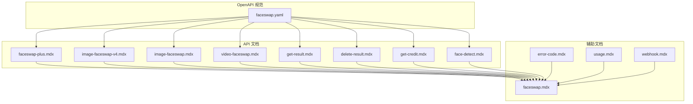
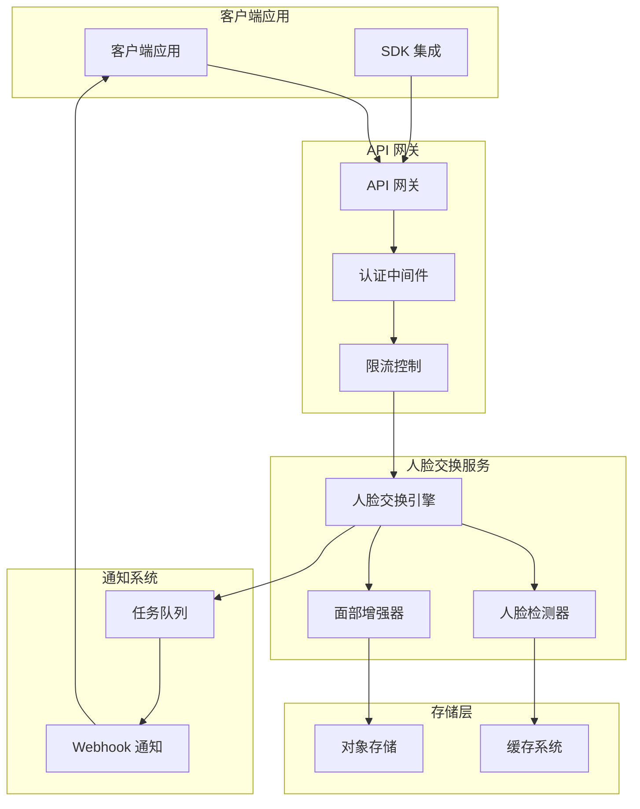
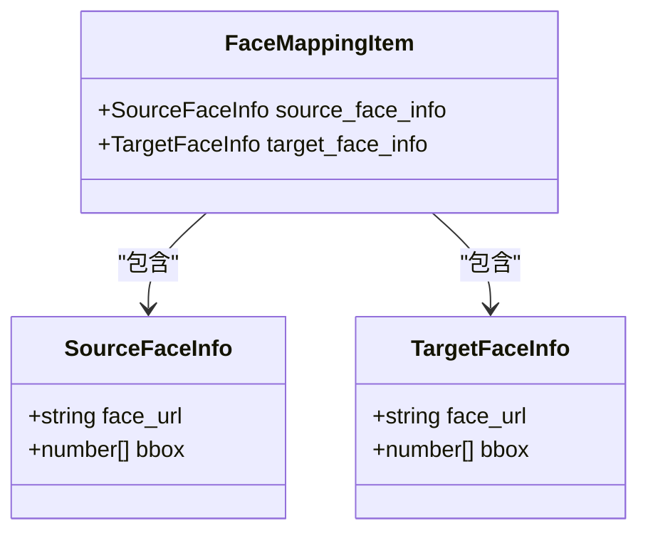
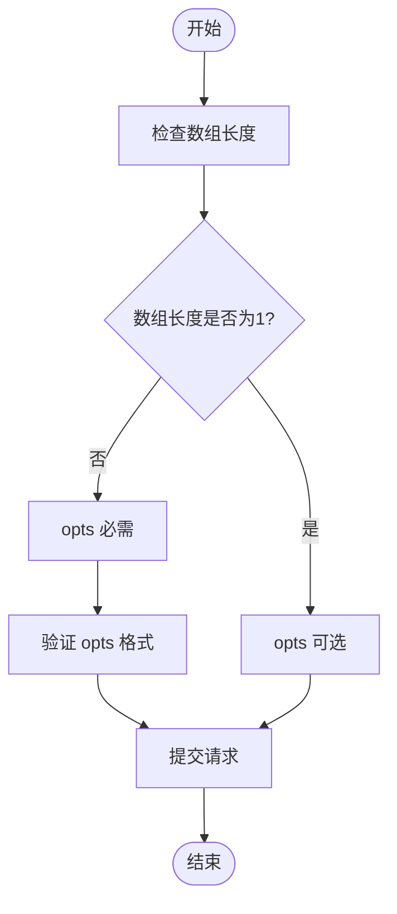
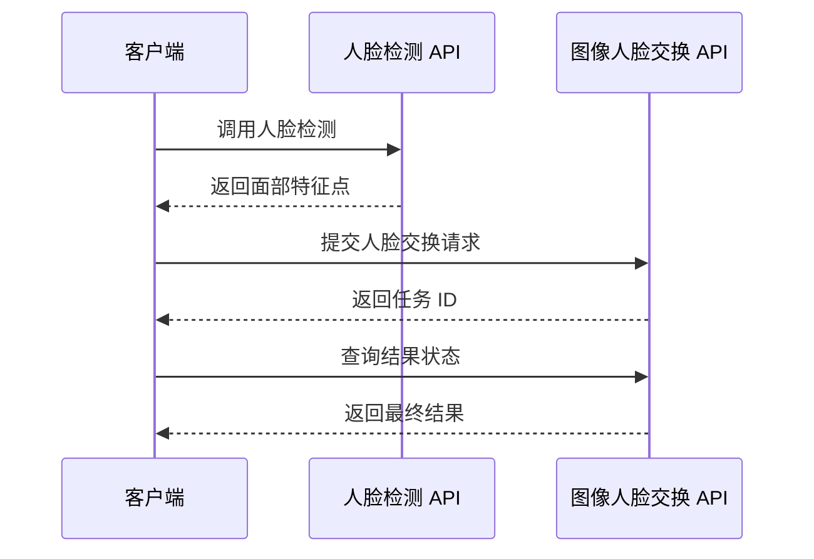
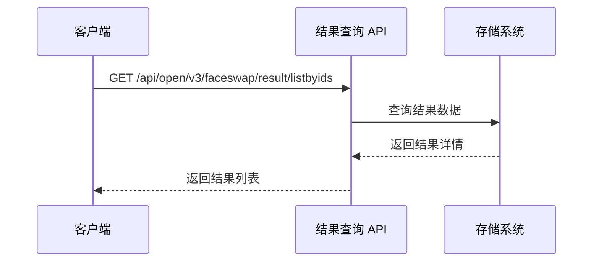
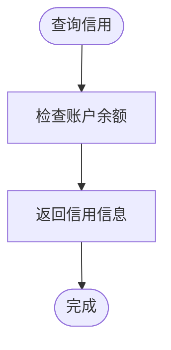
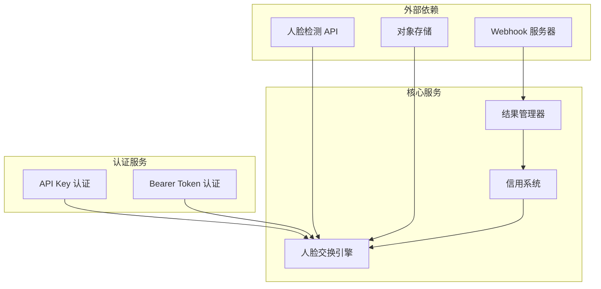
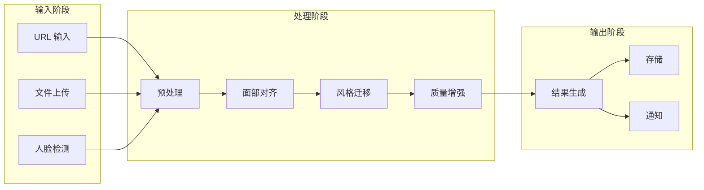
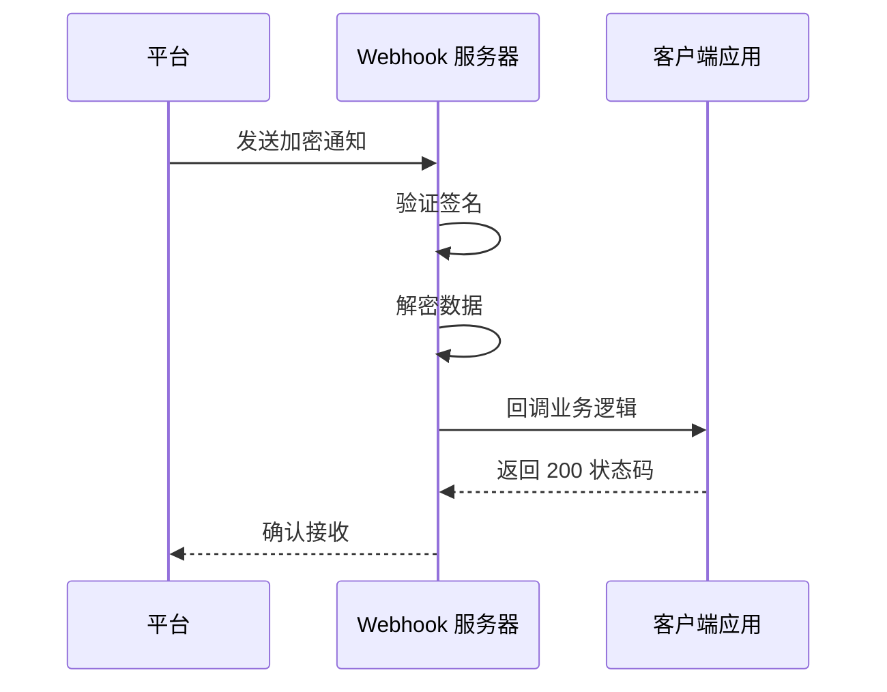

# 人脸交换 API 规范

<cite>
**本文档引用的文件**
- [faceswap.yaml](file://openapi/faceswap.yaml)
- [faceswap-plus.mdx](file://ai-tools-suite/faceswap/faceswap-plus.mdx)
- [image-faceswap-v4.mdx](file://ai-tools-suite/faceswap/image-faceswap-v4.mdx)
- [image-faceswap.mdx](file://ai-tools-suite/faceswap/image-faceswap.mdx)
- [video-faceswap.mdx](file://ai-tools-suite/faceswap/video-faceswap.mdx)
- [get-result.mdx](file://ai-tools-suite/faceswap/get-result.mdx)
- [delete-result.mdx](file://ai-tools-suite/faceswap/delete-result.mdx)
- [get-credit.mdx](file://ai-tools-suite/faceswap/get-credit.mdx)
- [face-detect.mdx](file://ai-tools-suite/faceswap/face-detect.mdx)
- [faceswap.mdx](file://ai-tools-suite/faceswap.mdx)
- [error-code.mdx](file://ai-tools-suite/error-code.mdx)
- [usage.mdx](file://authentication/usage.mdx)
- [webhook.mdx](file://ai-tools-suite/webhook.mdx)
</cite>

## 目录
1. [简介](#简介)
2. [项目结构](#项目结构)
3. [核心组件](#核心组件)
4. [架构概览](#架构概览)
5. [详细组件分析](#详细组件分析)
6. [依赖关系分析](#依赖关系分析)
7. [性能考虑](#性能考虑)
8. [故障排除指南](#故障排除指南)
9. [结论](#结论)

## 简介

人脸交换 API 提供了高质量的人脸替换服务，支持图像和视频中的人脸交换。该 API 包含多个版本，从基础的 V3 版本到最新的 V4 版本，提供了从简单单人脸交换到复杂的多人脸交换功能。

本规范文档详细说明了 Face Swap Plus、Face Swap Pro、Image Faceswap、Video Faceswap 等不同版本的 API 端点，包括请求参数、响应格式、使用场景以及高级功能如 Face Mapping、单人脸模式、多模型风格等。

## 项目结构

人脸交换 API 的文档结构清晰地组织了所有相关资源：

**图表来源**
- [faceswap.yaml:1-632](file://openapi/faceswap.yaml#L1-L632)
- [faceswap-plus.mdx:1-227](file://ai-tools-suite/faceswap/faceswap-plus.mdx#L1-L227)

**章节来源**
- [faceswap.yaml:1-632](file://openapi/faceswap.yaml#L1-L632)
- [faceswap.mdx:1-176](file://ai-tools-suite/faceswap.mdx#L1-L176)

## 核心组件

### 主要 API 端点

人脸交换 API 提供了四个主要的 API 端点，每个都有特定的功能和使用场景：

1. **Face Swap Plus** (`/api/open/v4/faceswap/faceswapPlusByImage`)
   - 支持图像和视频的人脸交换
   - 多人脸交换功能
   - 单人脸模式简化操作
   - 多种模型风格选择

2. **Face Swap Pro** (`/api/open/v4/faceswap/faceswapByImage`)
   - 最高质量的图像人脸交换
   - 支持最多 50 对人脸交换
   - 简化的集成方式（opts 参数可选）

3. **Image Faceswap** (`/api/open/v3/faceswap/highquality/specifyimage`)
   - 高质量图像人脸交换（V3 版本）
   - 需要预检测步骤
   - 使用 opts 参数进行精确对齐

4. **Video Faceswap** (`/api/open/v3/faceswap/highquality/specifyvideo`)
   - 高质量视频人脸交换（V3 版本）
   - 异步处理模式
   - 支持视频中的多个人脸

**章节来源**
- [faceswap.yaml:14-163](file://openapi/faceswap.yaml#L14-L163)
- [faceswap-plus.mdx:12-38](file://ai-tools-suite/faceswap/faceswap-plus.mdx#L12-L38)

### 认证机制

API 支持两种认证方式：

1. **直接 API Key 方法（推荐）**
   - 使用自定义 `x-api-key` 头部
   - 直接传递 API Key 作为认证令牌
   - 更简单且更安全

2. **传统客户端 ID/API Key 方法**
   - 通过 `/getToken` 端点获取访问令牌
   - 使用 `Authorization: Bearer {token}` 头部
   - 向后兼容性支持

**章节来源**
- [usage.mdx:10-48](file://authentication/usage.mdx#L10-L48)
- [faceswap.yaml:274-283](file://openapi/faceswap.yaml#L274-L283)

## 架构概览

人脸交换 API 采用模块化设计，支持多种使用场景：

**图表来源**
- [faceswap.yaml:6-11](file://openapi/faceswap.yaml#L6-L11)
- [webhook.mdx:7-11](file://ai-tools-suite/webhook.mdx#L7-L11)

## 详细组件分析

### Face Swap Plus API 分析

Face Swap Plus 是最灵活的 API 版本，支持图像和视频的人脸交换，具有以下特点：

#### 核心参数

| 参数名 | 类型 | 必需 | 描述 |
|--------|------|------|------|
| `source_url` | string | 是 | 新人脸图像 URL |
| `target_url` | string | 是 | 目标材料 URL（图像或视频） |
| `webhookUrl` | string | 否 | 结果通知回调 URL |
| `face_enhance` | boolean | 否 | 是否启用面部增强（默认：false） |
| `model_style` | string | 否 | 模型风格：`realistic`、`beautify` 或 `lossless`（默认：`realistic`） |
| `single_face_mode` | boolean | 否 | 单人脸模式（默认：false） |

#### 多人脸交换配置

当 `single_face_mode` 为 false 时，使用 `face_mapping` 进行多人脸交换：

**图表来源**
- [faceswap.yaml:362-410](file://openapi/faceswap.yaml#L362-L410)

#### 使用场景

1. **单人脸交换**：设置 `single_face_mode: true`
2. **多人脸交换**：提供 `face_mapping` 数组
3. **视频交换**：支持视频文件的人脸交换

**章节来源**
- [faceswap-plus.mdx:39-84](file://ai-tools-suite/faceswap/faceswap-plus.mdx#L39-L84)
- [faceswap-plus.mdx:154-200](file://ai-tools-suite/faceswap/faceswap-plus.mdx#L154-L200)

### Face Swap Pro API 分析

Face Swap Pro 提供最高质量的图像人脸交换，专为单人脸场景优化：

#### 请求参数

| 参数名 | 类型 | 必需 | 描述 |
|--------|------|------|------|
| `sourceImage` | array | 是 | 源人脸图像数组，每个元素包含 `path` 和 `opts` |
| `targetImage` | array | 是 | 目标人脸图像数组，每个元素包含 `path` 和 `opts` |
| `model_name` | string | 否 | 模型名称，默认：`akool_faceswap_image_hq` |
| `webhookUrl` | string | 否 | 结果通知回调 URL |
| `face_enhance` | boolean | 否 | 是否启用面部增强（默认：false） |
| `single_face_mode` | boolean | 否 | 单人脸模式（默认：false） |

#### opts 参数规则

opts 参数用于提供面部特征点坐标，提高对齐精度：

**图表来源**
- [image-faceswap-v4.mdx:47-58](file://ai-tools-suite/faceswap/image-faceswap-v4.mdx#L47-L58)

**章节来源**
- [image-faceswap-v4.mdx:22-35](file://ai-tools-suite/faceswap/image-faceswap-v4.mdx#L22-L35)
- [image-faceswap-v4.mdx:105-135](file://ai-tools-suite/faceswap/image-faceswap-v4.mdx#L105-L135)

### V3 版本 API 分析

#### Image Faceswap V3

V3 版本需要预检测步骤来获取 opts 参数：

**图表来源**
- [image-faceswap.mdx:16-23](file://ai-tools-suite/faceswap/image-faceswap.mdx#L16-L23)

#### Video Faceswap V3

视频交换采用异步处理模式：

**章节来源**
- [video-faceswap.mdx:12-19](file://ai-tools-suite/faceswap/video-faceswap.mdx#L12-L19)

### 结果管理 API

#### 获取结果列表

**图表来源**
- [faceswap.yaml:200-224](file://openapi/faceswap.yaml#L200-L224)

#### 删除结果

支持批量删除历史结果以管理存储空间。

**章节来源**
- [get-result.mdx:12-20](file://ai-tools-suite/faceswap/get-result.mdx#L12-L20)
- [delete-result.mdx:7-12](file://ai-tools-suite/faceswap/delete-result.mdx#L7-L12)

### 账户管理 API

#### 信用查询

**图表来源**
- [faceswap.yaml:226-243](file://openapi/faceswap.yaml#L226-L243)

**章节来源**
- [get-credit.mdx:7-11](file://ai-tools-suite/faceswap/get-credit.mdx#L7-L11)

## 依赖关系分析

人脸交换 API 的依赖关系展示了各个组件之间的交互：

**图表来源**
- [faceswap.yaml:274-283](file://openapi/faceswap.yaml#L274-L283)
- [face-detect.mdx:102-122](file://ai-tools-suite/faceswap/face-detect.mdx#L102-L122)

### 数据流分析

人脸交换请求的数据流：

**图表来源**
- [faceswap-plus.mdx:154-200](file://ai-tools-suite/faceswap/faceswap-plus.mdx#L154-L200)
- [image-faceswap-v4.mdx:105-135](file://ai-tools-suite/faceswap/image-faceswap-v4.mdx#L105-L135)

**章节来源**
- [faceswap.yaml:273-632](file://openapi/faceswap.yaml#L273-L632)

## 性能考虑

### 处理时间优化

1. **单人脸 vs 多人脸**
   - 单人脸交换：处理时间较短，适合实时应用
   - 多人脸交换：处理时间与人脸数量成正比

2. **视频处理优化**
   - 建议视频时长不超过 60 秒
   - 限制同时处理的人脸数量在 8 个以内
   - 使用标准编码格式（H.264）

3. **批量处理**
   - Face Swap Pro 支持最多 50 对人脸交换
   - 批量处理时注意内存使用情况

### 资源管理

1. **存储优化**
   - 生成的资源有效期为 7 天
   - 及时下载和保存结果
   - 使用删除 API 清理历史结果

2. **网络优化**
   - 使用 CDN 加速资源访问
   - 避免同时发起大量并发请求
   - 合理设置重试策略

## 故障排除指南

### 常见错误类型

| 错误代码 | 描述 | 解决方案 |
|----------|------|----------|
| 1000 | 成功 | 正常流程 |
| 1003 | 参数错误 | 检查请求参数格式 |
| 1005 | 操作过于频繁 | 实施限流策略 |
| 1006 | 配额不足 | 检查信用余额 |
| 1007 | 人脸数量超出限制 | 减少同时处理的人脸数 |
| 1101 | 授权无效或过期 | 更新 API Key 或重新获取令牌 |
| 1102 | 授权不能为空 | 提供有效的认证信息 |
| 1200 | 账户被封禁 | 联系技术支持 |

### 错误处理最佳实践

1. **参数验证**
   - 确保所有必需参数都已提供
   - 验证 URL 格式和可达性
   - 检查 opts 参数的格式正确性

2. **重试机制**
   - 对于临时性错误实施指数退避重试
   - 设置合理的超时时间
   - 监控重试次数避免无限循环

3. **监控和日志**
   - 记录所有 API 调用
   - 监控错误率和响应时间
   - 分析失败模式以改进实现

**章节来源**
- [error-code.mdx:6-59](file://ai-tools-suite/error-code.mdx#L6-L59)
- [faceswap.mdx:61-89](file://ai-tools-suite/faceswap.mdx#L61-L89)

### Webhook 处理

Webhook 通知的处理流程：

**图表来源**
- [webhook.mdx:13-43](file://ai-tools-suite/webhook.mdx#L13-L43)

**章节来源**
- [webhook.mdx:69-78](file://ai-tools-suite/webhook.mdx#L69-L78)

## 结论

人脸交换 API 提供了一个功能丰富、易于使用的解决方案，支持从简单的单人脸交换到复杂的多人脸视频交换。通过 V4 版本的 Face Swap Plus 和 Face Swap Pro，开发者可以轻松集成高质量的人脸交换功能。

关键优势包括：
- **灵活性**：支持多种使用场景和配置选项
- **易用性**：简化的集成方式和清晰的文档
- **可靠性**：完善的错误处理和监控机制
- **性能**：优化的处理流程和资源管理

建议开发者根据具体需求选择合适的 API 版本，并遵循最佳实践以获得最佳的用户体验。