# 流媒体虚拟主播 API 规范

<cite>
**本文档引用的文件**
- [live-avatar.yaml](file://openapi/live-avatar.yaml)
- [streaming-avatar.mdx](file://implementation-guide/streaming-avatar.mdx)
- [create-session.mdx](file://ai-tools-suite/live-avatar/create-session.mdx)
- [close-session.mdx](file://ai-tools-suite/live-avatar/close-session.mdx)
- [list-sessions.mdx](file://ai-tools-suite/live-avatar/list-sessions.mdx)
- [session-detail.mdx](file://ai-tools-suite/live-avatar/session-detail.mdx)
- [list.mdx](file://ai-tools-suite/live-avatar/list.mdx)
- [detail.mdx](file://ai-tools-suite/live-avatar/detail.mdx)
- [upload.mdx](file://ai-tools-suite/live-avatar/upload.mdx)
- [jssdk-start.mdx](file://sdk/jssdk-start.mdx)
- [FAQ.mdx](file://ai-tools-suite/FAQ.mdx)
</cite>

## 目录
1. [简介](#简介)
2. [项目结构](#项目结构)
3. [核心组件](#核心组件)
4. [架构概览](#架构概览)
5. [详细组件分析](#详细组件分析)
6. [依赖关系分析](#依赖关系分析)
7. [性能考虑](#性能考虑)
8. [故障排除指南](#故障排除指南)
9. [结论](#结论)
10. [附录](#附录)

## 简介

流媒体虚拟主播 API 是一个基于 OpenAPI 3.0.3 标准构建的完整解决方案，用于创建、管理和控制实时虚拟主播会话。该系统支持多种实时通信协议（Agora、LiveKit、TRTC），提供完整的会话生命周期管理、Avatar 资源管理和实时消息协议。

本规范涵盖了从会话创建到状态监控、消息发送接收的完整流程，包括 WebSocket 连接建立、消息格式、命令类型和参数配置的详细说明。

## 项目结构

该项目采用模块化组织方式，主要包含以下核心目录：

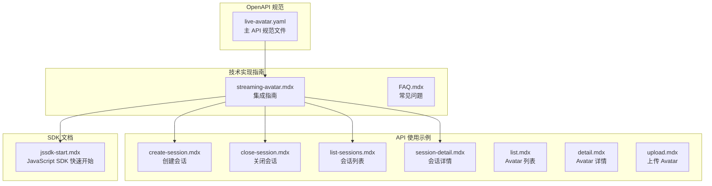

**图表来源**
- [live-avatar.yaml:1-689](file://openapi/live-avatar.yaml#L1-L689)
- [streaming-avatar.mdx:1-1581](file://implementation-guide/streaming-avatar.mdx#L1-L1581)

**章节来源**
- [live-avatar.yaml:1-689](file://openapi/live-avatar.yaml#L1-L689)
- [streaming-avatar.mdx:1-1581](file://implementation-guide/streaming-avatar.mdx#L1-L1581)

## 核心组件

### 1. 会话管理系统

会话管理是整个系统的核心，负责虚拟主播实例的生命周期控制：

| 组件 | 功能描述 | 关键特性 |
|------|----------|----------|
| 创建会话 | 初始化新的虚拟主播会话 | 支持多种交互模式、语音配置、时长限制 |
| 会话详情 | 获取单个会话的详细信息 | 实时状态监控、连接凭据、配置参数 |
| 会话列表 | 分页获取用户的所有会话 | 状态过滤、分页查询、总数统计 |
| 关闭会话 | 终止活跃的虚拟主播会话 | 自动计费结算、资源清理 |

### 2. Avatar 管理系统

Avatar 管理提供虚拟角色的创建、存储和检索能力：

| 组件 | 功能描述 | 支持类型 |
|------|----------|----------|
| 上传 Avatar | 从视频 URL 创建新的虚拟角色 | 支持 MP4、WebM 等格式 |
| Avatar 列表 | 获取可用的虚拟角色列表 | 支持分页、过滤、排序 |
| Avatar 详情 | 获取特定 Avatar 的详细信息 | 包含元数据、状态、配置 |

### 3. 实时通信协议

系统支持三种主流 WebRTC 提供商，每种都具有特定的消息协议和限制：

| 提供商 | 消息大小限制 | 频率限制 | 特殊功能 |
|--------|-------------|----------|----------|
| Agora | 1KB | 6KB/秒 | 需要手动扩展 API |
| LiveKit | 15KB | 更高 | 可靠模式支持 |
| TRTC | 1KB | 30次/秒 | 自定义消息支持 |

**章节来源**
- [live-avatar.yaml:13-282](file://openapi/live-avatar.yaml#L13-L282)
- [streaming-avatar.mdx:66-114](file://implementation-guide/streaming-avatar.mdx#L66-L114)

## 架构概览

系统采用三层架构设计，确保安全性、可扩展性和易用性：

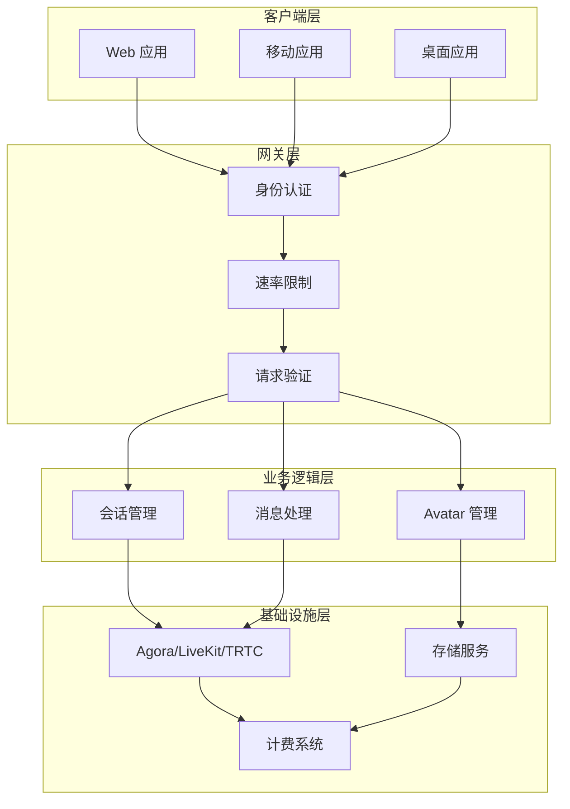

**图表来源**
- [live-avatar.yaml:6-11](file://openapi/live-avatar.yaml#L6-L11)
- [streaming-avatar.mdx:116-181](file://implementation-guide/streaming-avatar.mdx#L116-L181)

## 详细组件分析

### 会话管理 API

#### 创建会话流程

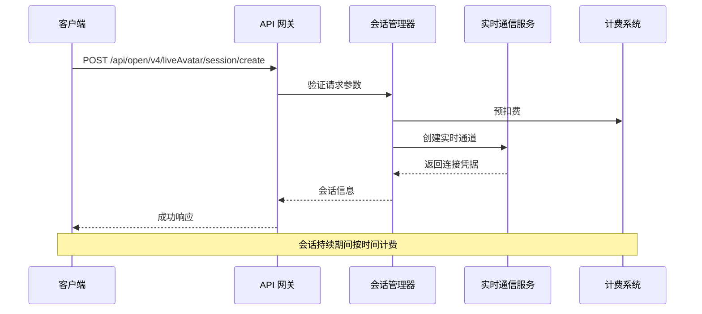

**图表来源**
- [live-avatar.yaml:132-188](file://openapi/live-avatar.yaml#L132-L188)
- [create-session.mdx:1-26](file://ai-tools-suite/live-avatar/create-session.mdx#L1-L26)

#### 会话状态管理

| 状态码 | 状态名称 | 描述 | 处理建议 |
|--------|----------|------|----------|
| 1 | queueing | 会话已创建但未开始处理 | 等待队列中的任务启动 |
| 2 | processing | 会话正在处理中 | 可以建立实时连接进行交互 |
| 3 | completed | 会话已完成 | 会话结束，资源已释放 |
| 4 | failed | 会话失败 | 检查错误日志并重试 |

#### 会话参数配置

会话创建支持丰富的配置选项：

| 参数名 | 类型 | 必需 | 描述 | 默认值 |
|--------|------|------|------|--------|
| avatar_id | string | 是 | 虚拟角色标识符 | - |
| duration | number | 否 | 会话时长（秒） | 3600 |
| voice_id | string | 否 | 语音模型标识符 | - |
| language | string | 否 | 语言代码 | "en" |
| mode_type | integer | 否 | 交互模式 | 2 |
| stream_type | string | 否 | 实时通信提供商 | "agora" |

**章节来源**
- [live-avatar.yaml:427-490](file://openapi/live-avatar.yaml#L427-L490)
- [streaming-avatar.mdx:185-242](file://implementation-guide/streaming-avatar.mdx#L185-L242)

### Avatar 管理 API

#### Avatar 创建流程

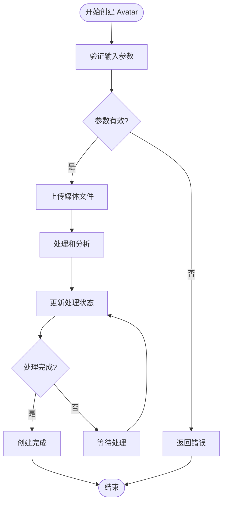

**图表来源**
- [live-avatar.yaml:14-63](file://openapi/live-avatar.yaml#L14-L63)
- [upload.mdx:1-11](file://ai-tools-suite/live-avatar/upload.mdx#L1-L11)

#### Avatar 数据模型

Avatar 对象包含以下关键属性：

| 属性名 | 类型 | 描述 | 示例值 |
|--------|------|------|--------|
| _id | string | 内部数据库标识符 | "655ffeada6976ea317087193" |
| avatar_id | string | 用户可见的 Avatar 标识符 | "Yasmin_in_White_shirt_20231121" |
| name | string | Avatar 显示名称 | "Yasmin in White shirt" |
| type | integer | Avatar 类型标识 | 2 |
| status | integer | 处理状态 | 1 |
| url | string | 主要资源 URL | "https://example.com/avatar.mp4" |
| thumbnailUrl | string | 缩略图 URL | "https://example.com/thumb.jpg" |
| gender | string | 性别标识 | "female" |

**章节来源**
- [live-avatar.yaml:350-426](file://openapi/live-avatar.yaml#L350-L426)
- [list.mdx:1-6](file://ai-tools-suite/live-avatar/list.mdx#L1-L6)

### 实时消息协议

#### WebSocket 消息格式

系统使用统一的消息协议，支持两种主要消息类型：

##### 聊天消息 (Chat)

聊天消息用于用户与虚拟主播之间的双向交流：

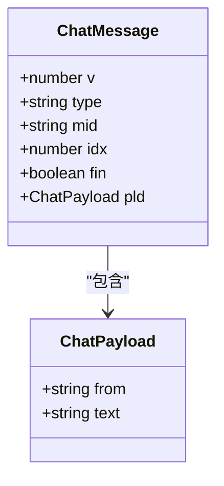

**图表来源**
- [streaming-avatar.mdx:418-521](file://implementation-guide/streaming-avatar.mdx#L418-L521)

##### 命令消息 (Command)

命令消息用于控制虚拟主播的行为和设置：

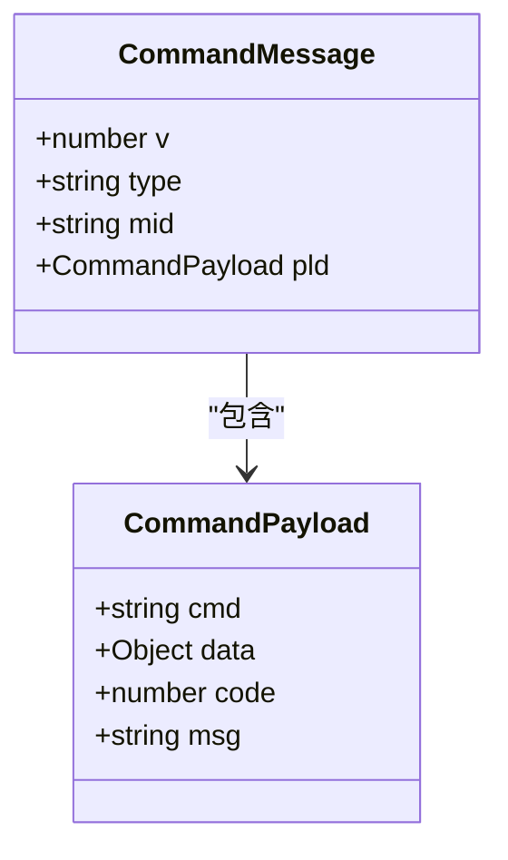

**图表来源**
- [streaming-avatar.mdx:703-821](file://implementation-guide/streaming-avatar.mdx#L703-L821)

#### 消息处理流程

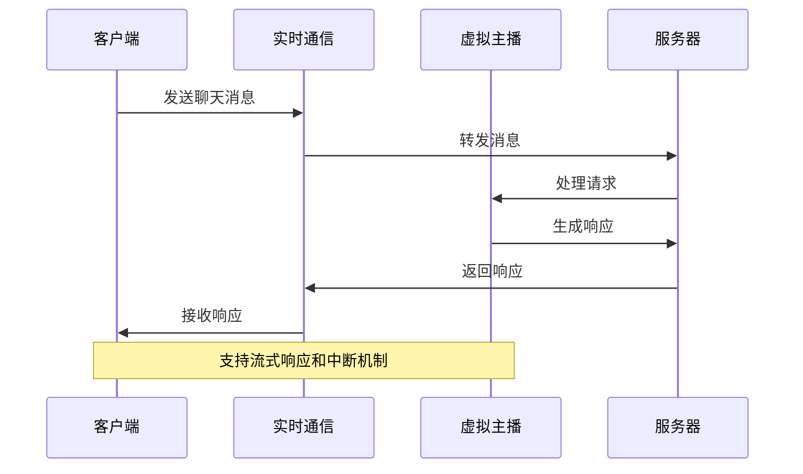

**图表来源**
- [streaming-avatar.mdx:412-521](file://implementation-guide/streaming-avatar.mdx#L412-L521)

#### 命令类型详解

| 命令类型 | 参数 | 描述 | 使用场景 |
|----------|------|------|----------|
| set-params | vid, lang, mode, bgurl | 设置 Avatar 参数 | 切换语音、语言、模式或背景 |
| interrupt | - | 中断当前响应 | 用户主动停止对话 |
| set-action | action, expression | 执行预定义动作 | 控制 Avatar 表情和动作 |

**章节来源**
- [streaming-avatar.mdx:699-821](file://implementation-guide/streaming-avatar.mdx#L699-L821)

### 安全认证机制

系统采用多层安全策略确保 API 使用的安全性：

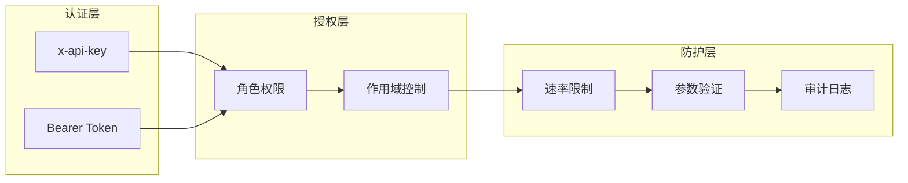

**图表来源**
- [live-avatar.yaml:284-293](file://openapi/live-avatar.yaml#L284-L293)

**章节来源**
- [live-avatar.yaml:9-11](file://openapi/live-avatar.yaml#L9-L11)
- [streaming-avatar.mdx:187-194](file://implementation-guide/streaming-avatar.mdx#L187-L194)

## 依赖关系分析

### 外部依赖

系统依赖于多个外部服务和 SDK：

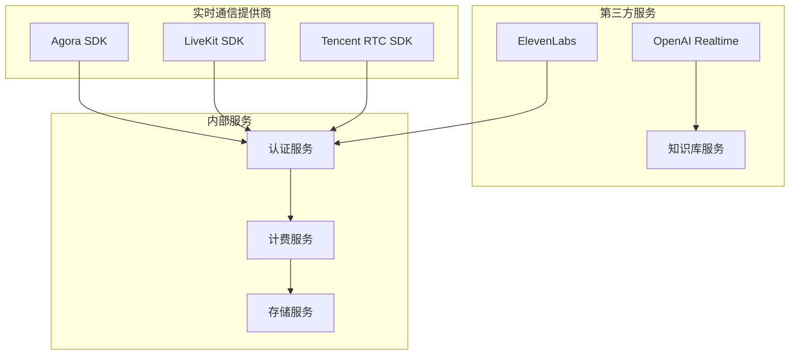

**图表来源**
- [live-avatar.yaml:475-586](file://openapi/live-avatar.yaml#L475-L586)
- [streaming-avatar.mdx:1090-1241](file://implementation-guide/streaming-avatar.mdx#L1090-L1241)

### 内部组件依赖

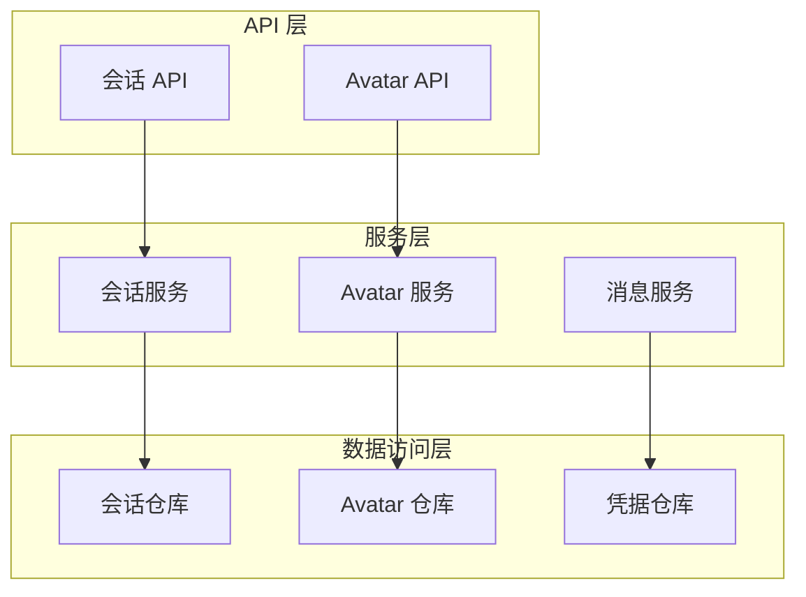

**图表来源**
- [live-avatar.yaml:13-282](file://openapi/live-avatar.yaml#L13-L282)

**章节来源**
- [live-avatar.yaml:283-689](file://openapi/live-avatar.yaml#L283-L689)
- [streaming-avatar.mdx:1-1581](file://implementation-guide/streaming-avatar.mdx#L1-L1581)

## 性能考虑

### 实时通信优化

不同实时通信提供商具有不同的性能特征：

| 特征 | Agora | LiveKit | TRTC |
|------|-------|---------|------|
| 最大消息大小 | 1KB | 15KB | 1KB |
| 消息频率 | 6KB/秒 | 更高 | 30次/秒 |
| 延迟 | 低延迟 | 低延迟 | 低延迟 |
| 可靠性 | 高 | 高 | 高 |
| 开发复杂度 | 中等 | 低 | 中等 |

### 消息分片策略

对于需要传输大量文本的场景，系统提供了智能分片机制：

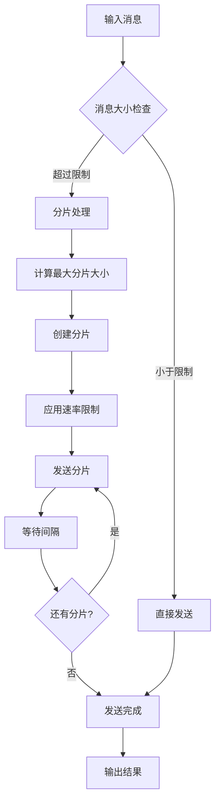

**图表来源**
- [streaming-avatar.mdx:604-697](file://implementation-guide/streaming-avatar.mdx#L604-L697)

### 资源管理最佳实践

1. **及时清理资源**：确保在会话结束后正确关闭连接和释放资源
2. **监控内存使用**：定期检查音频和视频轨道的状态
3. **错误处理**：实现完善的异常捕获和恢复机制
4. **性能监控**：跟踪网络质量、延迟和丢包率

**章节来源**
- [streaming-avatar.mdx:1243-1411](file://implementation-guide/streaming-avatar.mdx#L1243-L1411)

## 故障排除指南

### 常见问题诊断

#### 会话创建失败

| 错误原因 | 解决方案 | 预防措施 |
|----------|----------|----------|
| 凭据无效 | 检查 API 密钥和令牌 | 使用后端代理模式 |
| Avatar 未就绪 | 等待处理完成 | 使用状态查询接口 |
| 资源不足 | 检查配额和余额 | 实施资源监控 |
| 网络问题 | 检查防火墙设置 | 实现重连机制 |

#### 实时通信问题

| 问题类型 | 诊断方法 | 解决方案 |
|----------|----------|----------|
| 连接超时 | 检查网络和证书 | 验证 SSL 证书 |
| 音频无输出 | 检查麦克风权限 | 实现权限提示 |
| 视频卡顿 | 监控带宽使用 | 调整编码参数 |
| 消息丢失 | 检查分片逻辑 | 实现重传机制 |

#### 消息处理问题

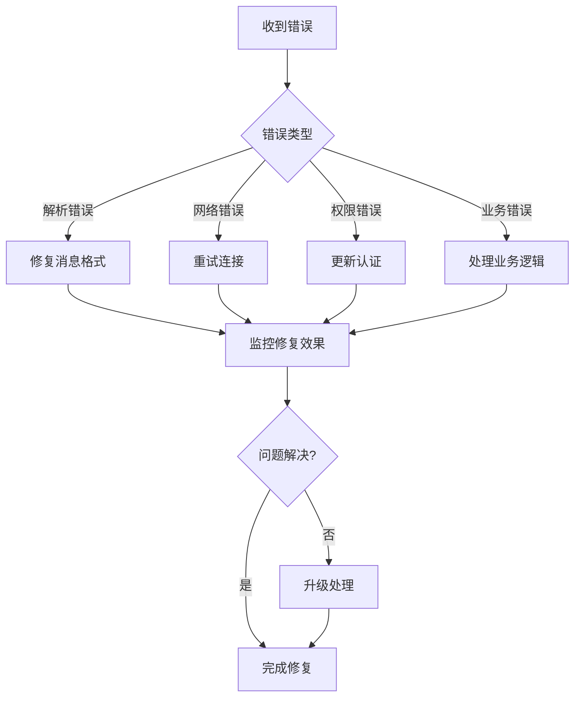

**图表来源**
- [FAQ.mdx:14-24](file://ai-tools-suite/FAQ.mdx#L14-L24)

**章节来源**
- [FAQ.mdx:1-29](file://ai-tools-suite/FAQ.mdx#L1-L29)
- [streaming-avatar.mdx:1243-1411](file://implementation-guide/streaming-avatar.mdx#L1243-L1411)

### 日志和监控

建议实施以下监控指标：

1. **会话级别**：创建时间、持续时间、成功率
2. **通信级别**：连接建立时间、消息延迟、丢包率
3. **资源级别**：CPU 使用率、内存占用、网络带宽
4. **业务级别**：用户满意度、响应时间、错误率

## 结论

流媒体虚拟主播 API 提供了一个完整、可扩展的解决方案，支持多种实时通信协议和丰富的功能特性。通过标准化的 OpenAPI 规范和详细的实现指南，开发者可以快速集成高质量的虚拟主播体验。

关键优势包括：
- **多提供商支持**：灵活选择最适合的实时通信服务
- **完整的生命周期管理**：从创建到清理的全流程支持
- **强大的消息协议**：支持复杂的交互场景和实时响应
- **企业级安全**：多层认证和防护机制
- **高性能架构**：优化的性能和可靠性设计

建议在生产环境中：
1. 使用后端代理模式保护 API 凭据
2. 实施完善的错误处理和监控
3. 根据业务需求选择合适的实时通信提供商
4. 定期评估和优化性能表现

## 附录

### API 参考

#### 会话管理端点

| 端点 | 方法 | 描述 | 认证要求 |
|------|------|------|----------|
| `/api/open/v4/liveAvatar/session/create` | POST | 创建新的会话 | ApiKey 或 Bearer |
| `/api/open/v4/liveAvatar/session/detail` | GET | 获取会话详情 | ApiKey 或 Bearer |
| `/api/open/v4/liveAvatar/session/list` | GET | 获取会话列表 | ApiKey 或 Bearer |
| `/api/open/v4/liveAvatar/session/close` | POST | 关闭会话 | ApiKey 或 Bearer |

#### Avatar 管理端点

| 端点 | 方法 | 描述 | 认证要求 |
|------|------|------|----------|
| `/api/open/v3/avatar/create` | POST | 上传 Avatar | ApiKey 或 Bearer |
| `/api/open/v4/liveAvatar/avatar/list` | GET | 获取 Avatar 列表 | ApiKey 或 Bearer |
| `/api/open/v4/liveAvatar/avatar/detail` | GET | 获取 Avatar 详情 | ApiKey 或 Bearer |

### 最佳实践清单

1. **安全实践**
   - 始终使用后端代理模式
   - 实施适当的速率限制
   - 定期轮换 API 凭据

2. **性能优化**
   - 监控网络质量和延迟
   - 实现智能重连机制
   - 优化消息大小和频率

3. **用户体验**
   - 提供清晰的错误反馈
   - 实现进度指示器
   - 支持中断和暂停功能

4. **运维管理**
   - 建立完善的监控体系
   - 实施日志记录和分析
   - 制定应急预案和回滚策略