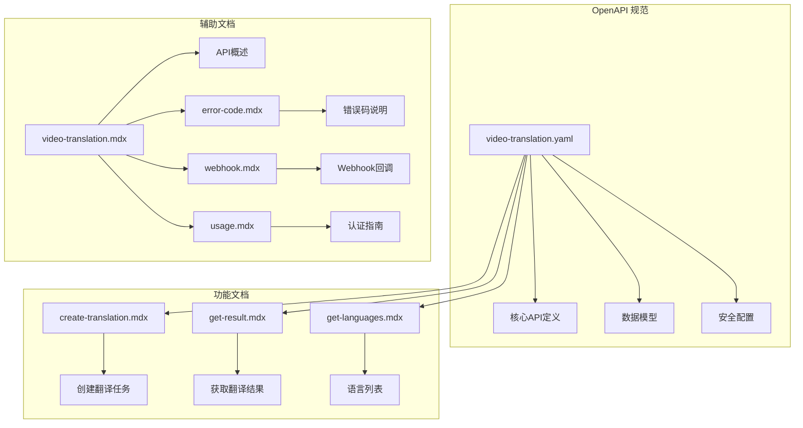
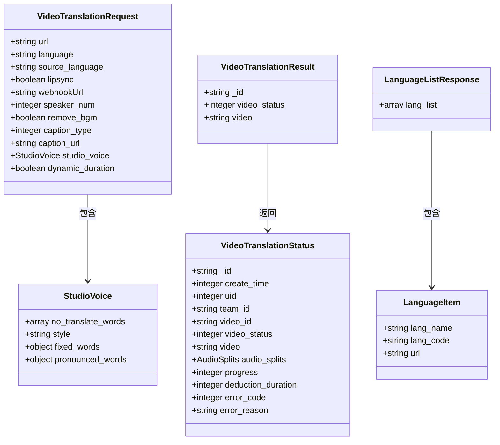
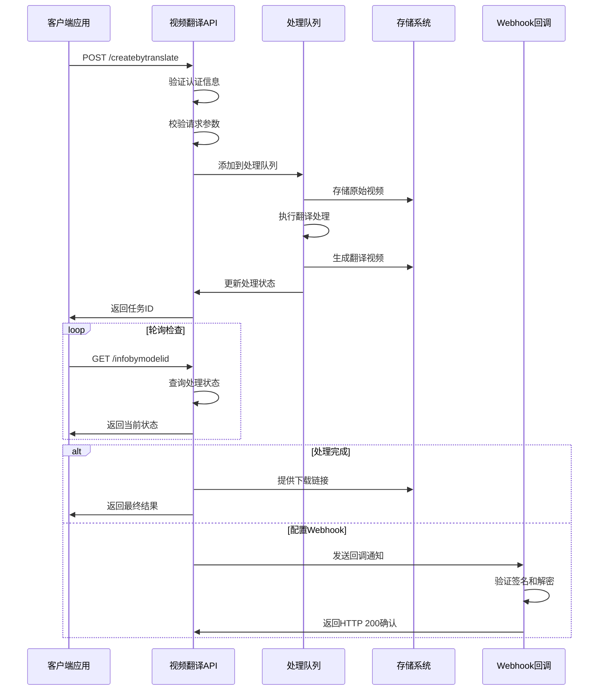
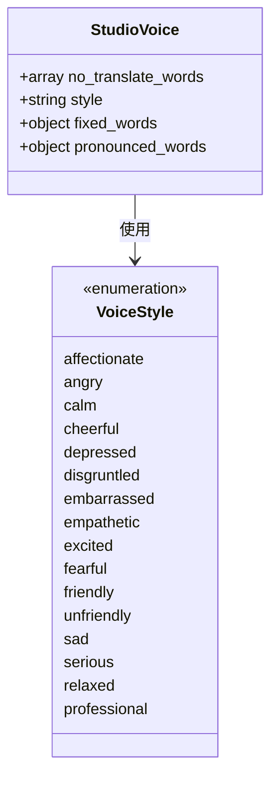
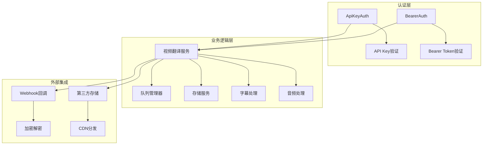
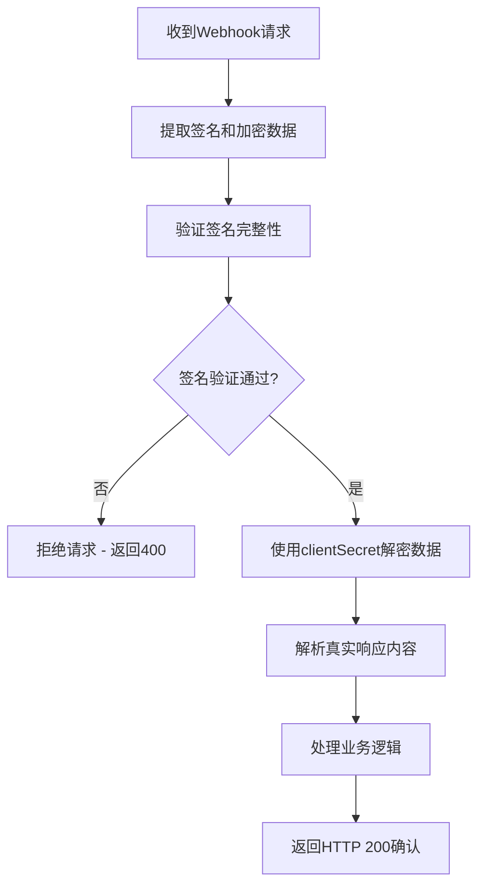

# 视频翻译 API 规范

<cite>
**本文档引用的文件**
- [video-translation.yaml](file://openapi/video-translation.yaml)
- [create-translation.mdx](file://ai-tools-suite/video-translation/create-translation.mdx)
- [get-result.mdx](file://ai-tools-suite/video-translation/get-result.mdx)
- [get-languages.mdx](file://ai-tools-suite/video-translation/get-languages.mdx)
- [video-translation.mdx](file://ai-tools-suite/video-translation.mdx)
- [error-code.mdx](file://ai-tools-suite/error-code.mdx)
- [webhook.mdx](file://ai-tools-suite/webhook.mdx)
- [usage.mdx](file://authentication/usage.mdx)
</cite>

## 目录
1. [简介](#简介)
2. [项目结构](#项目结构)
3. [核心组件](#核心组件)
4. [架构概览](#架构概览)
5. [详细组件分析](#详细组件分析)
6. [依赖关系分析](#依赖关系分析)
7. [性能考虑](#性能考虑)
8. [故障排除指南](#故障排除指南)
9. [结论](#结论)
10. [附录](#附录)

## 简介

视频翻译 API 是一个基于人工智能技术的多语言视频翻译服务，能够将视频内容翻译成多种目标语言，并提供AI配音和口型同步功能。该API支持自动语言检测、批量翻译、字幕处理、背景音乐移除等高级功能，为开发者提供了完整的视频多语言解决方案。

本规范文档详细说明了视频翻译API的所有端点、参数配置、数据格式和错误处理机制，帮助开发者快速集成和使用该服务。

## 项目结构

视频翻译API的文档结构采用模块化设计，主要包含以下核心部分：



**图表来源**
- [video-translation.yaml:1-283](file://openapi/video-translation.yaml#L1-L283)
- [create-translation.mdx:1-14](file://ai-tools-suite/video-translation/create-translation.mdx#L1-L14)
- [get-result.mdx:1-19](file://ai-tools-suite/video-translation/get-result.mdx#L1-L19)
- [get-languages.mdx:1-10](file://ai-tools-suite/video-translation/get-languages.mdx#L1-L10)

**章节来源**
- [video-translation.yaml:1-283](file://openapi/video-translation.yaml#L1-L283)
- [video-translation.mdx:1-168](file://ai-tools-suite/video-translation.mdx#L1-L168)

## 核心组件

视频翻译API由三个主要端点组成，每个端点都针对特定的功能场景：

### 主要端点概览

| 端点 | 方法 | 功能描述 | 必需参数 |
|------|------|----------|----------|
| `/api/open/v3/content/video/createbytranslate` | POST | 创建视频翻译任务 | url, language |
| `/api/open/v3/content/video/infobymodelid` | GET | 获取翻译任务状态 | video_model_id |
| `/api/open/v3/language/list` | GET | 获取支持的语言列表 | 无 |

### 数据模型架构



**图表来源**
- [video-translation.yaml:125-283](file://openapi/video-translation.yaml#L125-L283)

**章节来源**
- [video-translation.yaml:13-103](file://openapi/video-translation.yaml#L13-L103)
- [video-translation.yaml:114-283](file://openapi/video-translation.yaml#L114-L283)

## 架构概览

视频翻译API采用RESTful架构设计，支持两种认证方式和完整的异步处理流程：



**图表来源**
- [video-translation.yaml:14-102](file://openapi/video-translation.yaml#L14-L102)
- [webhook.mdx:9-447](file://ai-tools-suite/webhook.mdx#L9-L447)

## 详细组件分析

### 创建视频翻译任务

创建翻译任务是整个API流程的核心入口，支持丰富的参数配置选项。

#### 请求参数详解

| 参数名 | 类型 | 默认值 | 必填 | 描述 |
|--------|------|--------|------|------|
| url | string | - | 是 | 要翻译的视频URL地址 |
| language | string | - | 是 | 目标语言代码，支持多个语言用逗号分隔 |
| source_language | string | DEFAULT | 否 | 源语言代码，"DEFAULT"表示自动检测 |
| lipsync | boolean | false | 否 | 是否启用口型同步功能 |
| webhookUrl | string | - | 否 | HTTP回调URL，处理完成后接收通知 |
| speaker_num | integer | 0 | 否 | 视频中说话人数(0=自动检测) |
| remove_bgm | boolean | false | 否 | 是否移除背景音乐 |
| caption_type | integer | 0 | 否 | 字幕处理类型(0-4) |
| caption_url | string | - | 否 | 字幕文件URL(SRT或ASS格式) |
| studio_voice | object | - | 否 | 高级语音和翻译设置 |
| dynamic_duration | boolean | false | 否 | 控制视频动态时长 |

#### 高级语音配置



**图表来源**
- [video-translation.yaml:164-191](file://openapi/video-translation.yaml#L164-L191)

#### 响应数据结构

成功创建任务后，API返回包含任务标识符和初始状态的数据：

| 字段名 | 类型 | 描述 |
|--------|------|------|
| _id | string | 唯一的任务标识符 |
| video_status | integer | 处理状态(1=排队, 2=处理中, 3=已完成, 4=失败) |
| video | string | 生成的视频URL(状态为3时可用) |

**章节来源**
- [video-translation.yaml:14-58](file://openapi/video-translation.yaml#L14-L58)
- [video-translation.yaml:125-191](file://openapi/video-translation.yaml#L125-L191)

### 获取翻译结果

通过轮询或Webhook回调的方式监控翻译任务的处理进度和结果。

#### 状态码定义

| 状态码 | 描述 | 业务含义 |
|--------|------|----------|
| 1 | Queueing | 请求正在等待处理 |
| 2 | Processing | 正在生成翻译视频 |
| 3 | Completed | 翻译完成，可下载视频 |
| 4 | Failed | 翻译失败，需要查看错误详情 |

#### 详细状态响应

当任务状态为3(已完成)时，响应包含完整的下载信息：

| 字段名 | 类型 | 描述 |
|--------|------|------|
| _id | string | 任务唯一标识符 |
| create_time | integer | 创建时间戳 |
| uid | integer | 用户ID |
| team_id | string | 团队ID |
| video_id | string | 视频翻译唯一ID |
| video_status | integer | 处理状态 |
| video | string | 生成的视频资源URL |
| audio_splits | object | 处理过程中生成的拆分资源 |
| progress | integer | 处理进度百分比(0-100) |
| deduction_duration | integer | 本次视频翻译消耗的积分 |
| error_code | integer | 错误码(仅状态为4时) |
| error_reason | string | 详细错误描述(仅状态为4时) |

**章节来源**
- [video-translation.yaml:59-102](file://openapi/video-translation.yaml#L59-L102)
- [video-translation.yaml:206-244](file://openapi/video-translation.yaml#L206-L244)

### 获取语言列表

查询API支持的所有目标语言及其相关信息。

#### 语言列表响应

| 字段名 | 类型 | 描述 |
|--------|------|------|
| lang_list | array | 支持语言数组 |
| lang_name | string | 语言显示名称(如"南非荷兰语(南非)") |
| lang_code | string | 语言代码标识(如"af-ZA") |
| url | string | 语言国旗图标URL |

**章节来源**
- [video-translation.yaml:85-102](file://openapi/video-translation.yaml#L85-L102)
- [video-translation.yaml:262-283](file://openapi/video-translation.yaml#L262-L283)

## 依赖关系分析

视频翻译API的依赖关系相对简单，主要涉及认证、存储和外部回调等几个方面：



**图表来源**
- [video-translation.yaml:105-113](file://openapi/video-translation.yaml#L105-L113)
- [webhook.mdx:45-78](file://ai-tools-suite/webhook.mdx#L45-L78)

### 认证机制

API支持两种认证方式，确保不同场景下的安全性：

1. **直接API Key方式**：最简单的认证方法，直接在请求头中包含API Key
2. **Bearer Token方式**：传统的令牌认证方法，需要先获取访问令牌

**章节来源**
- [video-translation.yaml:9-11](file://openapi/video-translation.yaml#L9-L11)
- [usage.mdx:10-48](file://authentication/usage.mdx#L10-L48)

## 性能考虑

### 处理限制

为了保证服务质量，API对视频内容设置了多项限制：

- **视频时长**：最大60秒
- **文件大小**：最大300MB  
- **帧率**：最大30fps
- **编码格式**：推荐H.264格式

### 最佳实践建议

1. **批量处理优化**：对于多个视频，建议并行处理但注意监控配额使用情况
2. **缓存策略**：合理利用Webhook回调减少轮询频率
3. **错误重试**：实现适当的重试逻辑处理临时性错误
4. **资源管理**：及时下载和保存生成的资源，避免7天有效期过期

**章节来源**
- [video-translation.mdx:98-117](file://ai-tools-suite/video-translation.mdx#L98-L117)

## 故障排除指南

### 常见错误码说明

| 错误码 | 描述 | 解决方案 |
|--------|------|----------|
| 1000 | 成功 | 无需操作 |
| 1003 | 参数错误 | 检查请求参数格式和必填项 |
| 1008 | 内容不存在 | 验证视频URL有效性 |
| 1009 | 权限不足 | 检查API Key权限配置 |
| 1101 | 授权无效或过期 | 重新获取访问令牌 |
| 1200 | 账户被封禁 | 联系客服处理 |
| 1204 | 视频时长超限 | 将视频时长调整至60秒以内 |
| 1207 | 文件大小超限 | 压缩视频文件至300MB以内 |
| 1209 | 编码格式不支持 | 转换为标准编码格式 |

### Webhook回调处理

当配置Webhook回调时，需要正确处理加密和签名验证：



**图表来源**
- [webhook.mdx:69-78](file://ai-tools-suite/webhook.mdx#L69-L78)

**章节来源**
- [error-code.mdx:1-59](file://ai-tools-suite/error-code.mdx#L1-L59)
- [webhook.mdx:9-447](file://ai-tools-suite/webhook.mdx#L9-L447)

## 结论

视频翻译API提供了一个完整、易用且功能丰富的多语言视频翻译解决方案。通过清晰的RESTful接口设计、灵活的参数配置和完善的错误处理机制，开发者可以轻松集成视频翻译功能到自己的应用中。

关键优势包括：
- 支持多种目标语言的批量翻译
- 自动语言检测和高级语音控制
- 口型同步和字幕处理功能
- 灵活的认证方式和Webhook回调
- 完善的错误码和状态监控

建议开发者根据具体需求选择合适的参数配置，并遵循最佳实践以获得最优的使用体验。

## 附录

### API使用示例

#### 单语言翻译示例
```json
{
  "url": "https://example.com/my-video.mp4",
  "source_language": "DEFAULT",
  "language": "es",
  "lipsync": true
}
```

#### 多语言翻译示例
```json
{
  "url": "https://example.com/my-video.mp4",
  "source_language": "DEFAULT",
  "language": "es,fr,de",
  "lipsync": false,
  "caption_type": 2,
  "remove_bgm": true
}
```

#### 专业翻译示例
```json
{
  "url": "https://example.com/business-video.mp4",
  "source_language": "DEFAULT",
  "language": "zh-CN",
  "lipsync": true,
  "studio_voice": {
    "style": "professional",
    "no_translate_words": ["AKool", "API"],
    "fixed_words": {"hello": "您好"}
  },
  "caption_type": 3,
  "webhookUrl": "https://your-server.com/webhook"
}
```

**章节来源**
- [video-translation.mdx:121-161](file://ai-tools-suite/video-translation.mdx#L121-L161)