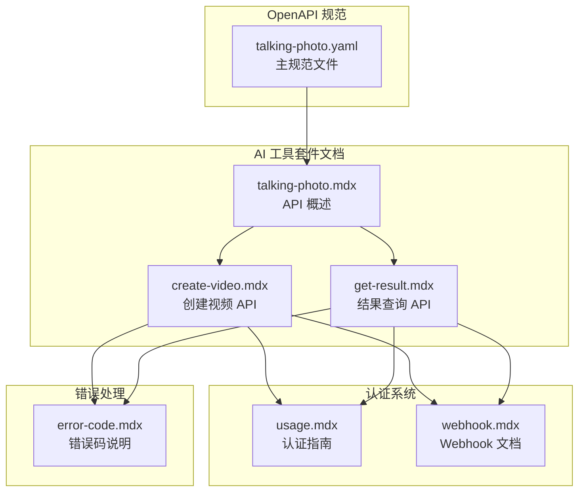
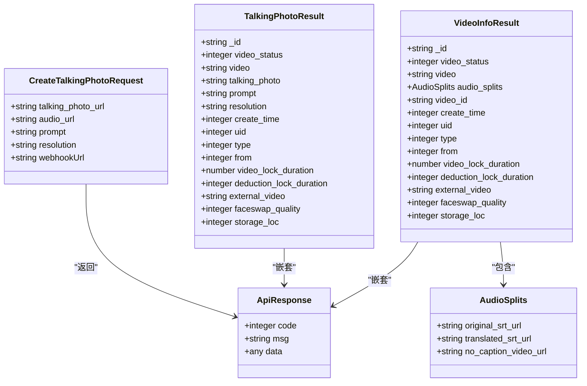
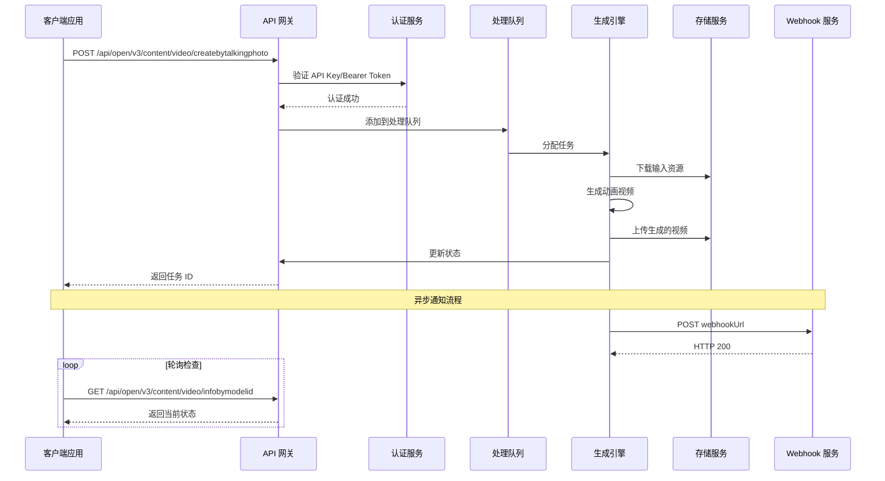
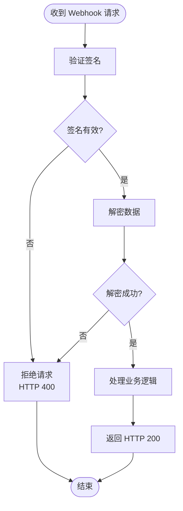
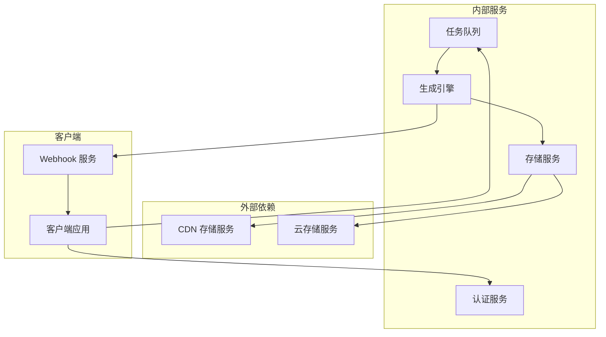

# 说话照片 API 规范

<cite>
**本文档引用的文件**
- [talking-photo.yaml](file://openapi/talking-photo.yaml)
- [create-video.mdx](file://ai-tools-suite/talking-photo/create-video.mdx)
- [get-result.mdx](file://ai-tools-suite/talking-photo/get-result.mdx)
- [talking-photo.mdx](file://ai-tools-suite/talking-photo.mdx)
- [usage.mdx](file://authentication/usage.mdx)
- [webhook.mdx](file://ai-tools-suite/webhook.mdx)
- [error-code.mdx](file://ai-tools-suite/error-code.mdx)
</cite>

## 目录
1. [简介](#简介)
2. [项目结构](#项目结构)
3. [核心组件](#核心组件)
4. [架构概览](#架构概览)
5. [详细组件分析](#详细组件分析)
6. [依赖关系分析](#依赖关系分析)
7. [性能考虑](#性能考虑)
8. [故障排除指南](#故障排除指南)
9. [结论](#结论)

## 简介

说话照片 API 是一个强大的 AI 驱动的视频生成服务，能够将静态照片转换为会说话的动画视频。该 API 可以将用户提供的静态照片与音频内容结合，生成具有自然口型同步和手势动作的动画视频。

本规范文档详细说明了说话照片 API 的端点、参数配置、认证机制、质量控制和输出格式等技术细节，为开发者提供了完整的集成指南。

## 项目结构

说话照片 API 的文档结构采用模块化组织方式，主要包含以下核心部分：



**图表来源**
- [talking-photo.yaml:1-288](file://openapi/talking-photo.yaml#L1-L288)
- [talking-photo.mdx:1-123](file://ai-tools-suite/talking-photo.mdx#L1-L123)

**章节来源**
- [talking-photo.yaml:1-288](file://openapi/talking-photo.yaml#L1-L288)
- [talking-photo.mdx:1-123](file://ai-tools-suite/talking-photo.mdx#L1-L123)

## 核心组件

### API 服务器配置

说话照片 API 使用统一的服务器配置，支持多种认证方式：

| 组件 | 描述 | 配置详情 |
|------|------|----------|
| 服务器地址 | 生产环境服务器 | `https://openapi.akool.com` |
| 认证方式 | 支持两种认证方法 | API Key 认证 和 Bearer Token 认证 |
| 安全协议 | HTTPS 加密传输 | 所有请求必须通过 HTTPS |
| 请求头 | 自定义头部字段 | `x-api-key` 或 `Authorization` |

### 主要数据模型

API 使用标准化的数据模型来确保一致性和可扩展性：



**图表来源**
- [talking-photo.yaml:140-287](file://openapi/talking-photo.yaml#L140-L287)

**章节来源**
- [talking-photo.yaml:112-287](file://openapi/talking-photo.yaml#L112-L287)

## 架构概览

说话照片 API 采用现代化的微服务架构，支持异步处理和实时通知：



**图表来源**
- [talking-photo.yaml:14-111](file://openapi/talking-photo.yaml#L14-L111)
- [create-video.mdx:16-24](file://ai-tools-suite/talking-photo/create-video.mdx#L16-L24)

## 详细组件分析

### 创建视频端点

#### 端点定义

`POST /api/open/v3/content/video/createbytalkingphoto`

该端点负责创建新的说话照片视频任务，支持异步处理和回调通知。

#### 请求参数规范

| 参数名 | 类型 | 必填 | 默认值 | 说明 |
|--------|------|------|--------|------|
| talking_photo_url | string | 是 | - | 说话照片的资源地址（支持 HTTP/HTTPS） |
| audio_url | string | 是 | - | 音频资源地址（支持 MP3 格式） |
| prompt | string | 否 | 空字符串 | 控制手势和动作的提示词 |
| resolution | string | 否 | "720" | 输出视频分辨率，支持 "720" 或 "1080" |
| webhookUrl | string | 否 | 空字符串 | 回调通知 URL |

#### 响应数据结构

| 字段名 | 类型 | 说明 |
|--------|------|------|
| _id | string | 视频模型 ID，用于状态查询 |
| video_status | integer | 视频状态：1=排队中, 2=处理中, 3=已完成, 4=失败 |
| video | string | 生成的视频 URL（状态为 3 时可用） |
| talking_photo | string | 原始照片 URL |
| prompt | string | 使用的提示词 |
| resolution | string | 输出分辨率 |
| create_time | integer | 创建时间戳 |
| uid | integer | 用户 ID |
| type | integer | 类型标识 |
| from | integer | 来源标识 |
| video_lock_duration | number | 视频锁定时长 |
| deduction_lock_duration | integer | 扣费锁定时长 |
| external_video | string | 外部视频 URL |
| faceswap_quality | integer | 质量设置 |
| storage_loc | integer | 存储位置 |

#### 请求示例

```json
{
  "talking_photo_url": "https://example.com/photo.jpg",
  "audio_url": "https://example.com/audio.mp3",
  "prompt": "保持自然的手势动作，语速协调，手势幅度适中",
  "resolution": "1080",
  "webhookUrl": "https://your-server.com/webhook"
}
```

**章节来源**
- [talking-photo.yaml:14-64](file://openapi/talking-photo.yaml#L14-L64)
- [talking-photo.yaml:140-167](file://openapi/talking-photo.yaml#L140-L167)
- [talking-photo.yaml:168-221](file://openapi/talking-photo.yaml#L168-L221)

### 查询结果端点

#### 端点定义

`GET /api/open/v3/content/video/infobymodelid`

该端点用于查询指定任务的处理状态和结果。

#### 查询参数

| 参数名 | 类型 | 必填 | 说明 |
|--------|------|------|------|
| video_model_id | string | 是 | 通过创建端点返回的任务 ID |

#### 响应数据扩展

除了基础结果外，还包含音频分割信息：

| 字段名 | 类型 | 说明 |
|--------|------|------|
| audio_splits.original_srt_url | string | 源语言字幕文件 URL |
| audio_splits.translated_srt_url | string | 翻译后字幕文件 URL |
| audio_splits.no_caption_video_url | string | 无内嵌字幕的视频 URL |

**章节来源**
- [talking-photo.yaml:65-111](file://openapi/talking-photo.yaml#L65-L111)
- [talking-photo.yaml:222-287](file://openapi/talking-photo.yaml#L222-L287)

### 认证机制

#### API Key 认证（推荐）

使用自定义 `x-api-key` 头部进行认证：

```http
x-api-key: YOUR_API_KEY_HERE
Content-Type: application/json
```

#### Bearer Token 认证

使用标准的 Bearer Token 认证方式：

```http
Authorization: Bearer YOUR_ACCESS_TOKEN
Content-Type: application/json
```

**章节来源**
- [talking-photo.yaml:9-122](file://openapi/talking-photo.yaml#L9-L122)
- [usage.mdx:10-48](file://authentication/usage.mdx#L10-L48)

### Webhook 通知

Webhook 提供异步通知机制，支持消息签名验证和数据加密：



**图表来源**
- [webhook.mdx:13-43](file://ai-tools-suite/webhook.mdx#L13-L43)

**章节来源**
- [webhook.mdx:1-447](file://ai-tools-suite/webhook.mdx#L1-L447)

## 依赖关系分析

说话照片 API 的依赖关系体现了清晰的分层架构：



**图表来源**
- [talking-photo.yaml:6-11](file://openapi/talking-photo.yaml#L6-L11)

**章节来源**
- [talking-photo.yaml:1-288](file://openapi/talking-photo.yaml#L1-L288)

## 性能考虑

### 处理时序优化

| 状态 | 描述 | 预期时长 | 处理策略 |
|------|------|----------|----------|
| 排队中 (1) | 请求等待处理 | 几秒到几分钟 | 优先级队列管理 |
| 处理中 (2) | 视频生成过程 | 几分钟到十几分钟 | 并行处理优化 |
| 成功 (3) | 生成完成 | 即时 | CDN 缓存加速 |
| 失败 (4) | 处理异常 | 即时 | 错误重试机制 |

### 资源管理

- **内存使用**: 最大支持 4GB 内存分配
- **CPU 利用率**: 动态调整处理线程数
- **网络带宽**: 支持 100Mbps 以上稳定连接
- **存储空间**: 自动生成的视频保留 7 天

### 扩展性设计

- **水平扩展**: 支持多实例部署
- **负载均衡**: 自动流量分发
- **缓存策略**: CDN 内容缓存
- **监控告警**: 实时性能监控

## 故障排除指南

### 常见错误码及解决方案

| 错误码 | 描述 | 可能原因 | 解决方案 |
|--------|------|----------|----------|
| 1000 | 成功 | 正常请求 | 继续处理 |
| 1003 | 参数错误 | 缺少必填参数 | 检查请求参数 |
| 1008 | 内容不存在 | 资源链接失效 | 验证资源 URL |
| 1009 | 权限不足 | 认证失败 | 检查 API Key |
| 1015 | 视频处理错误 | 系统内部错误 | 稍后重试 |
| 1101 | 令牌无效 | Token 过期 | 重新获取 Token |
| 1200 | 账户被封禁 | 违规使用 | 联系客服 |

### 视频生成质量控制

#### 输入资源要求

| 要求类型 | 具体标准 | 影响程度 |
|----------|----------|----------|
| 图像质量 | ≥1920×1080 像素 | 高度影响 |
| 面部清晰度 | 清晰可见，无遮挡 | 高度影响 |
| 光照条件 | 均匀光照，避免阴影 | 中等影响 |
| 音频质量 | ≥44.1kHz, ≥128kbps | 中等影响 |
| 音频时长 | ≤60 秒 | 影响处理时间 |

#### 输出质量参数

| 参数 | 可选值 | 默认值 | 说明 |
|------|--------|--------|------|
| 分辨率 | 720, 1080 | 720 | 输出清晰度 |
| 帧率 | 24, 30 | 30 | 动画流畅度 |
| 码率 | 低, 中, 高 | 中 | 文件大小控制 |
| 时长限制 | ≤60 秒 | 60 秒 | 系统限制 |

### 调试建议

1. **日志记录**: 启用详细的 API 调用日志
2. **重试机制**: 实现指数退避重试策略
3. **超时设置**: 设置合理的请求超时时间
4. **监控指标**: 监控成功率和响应时间

**章节来源**
- [error-code.mdx:1-59](file://ai-tools-suite/error-code.mdx#L1-L59)
- [talking-photo.mdx:66-86](file://ai-tools-suite/talking-photo.mdx#L66-L86)

## 结论

说话照片 API 提供了一个功能完整、易于集成的 AI 视频生成解决方案。通过标准化的 OpenAPI 规范、灵活的认证机制和完善的质量控制体系，开发者可以快速构建基于 AI 的动态内容生成功能。

### 关键优势

- **易用性**: 简洁的 API 设计和丰富的文档支持
- **可靠性**: 多层认证和错误处理机制
- **可扩展性**: 支持高并发和弹性扩展
- **质量保证**: 严格的质量控制和性能优化

### 最佳实践建议

1. **资源准备**: 确保输入图像和音频的质量符合要求
2. **参数优化**: 根据需求选择合适的分辨率和质量参数
3. **错误处理**: 实现健壮的错误处理和重试机制
4. **监控维护**: 建立完善的监控和告警系统

通过遵循本规范文档中的指导原则和技术要求，开发者可以充分利用说话照片 API 的强大功能，为用户提供高质量的 AI 视频生成体验。