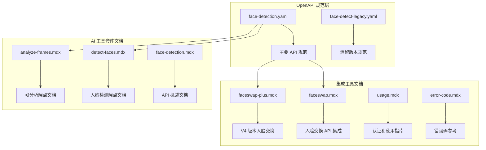
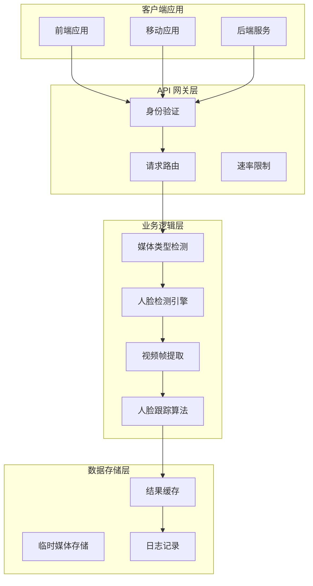
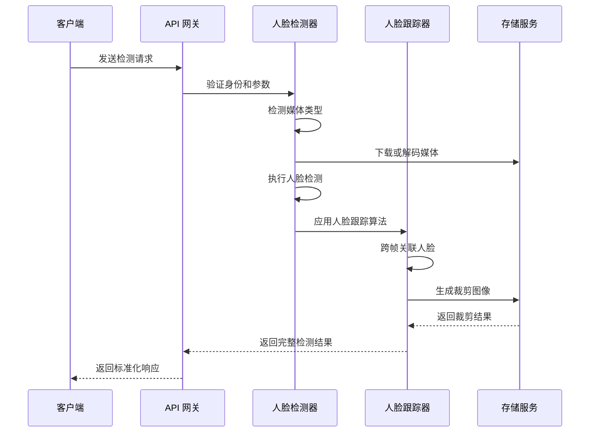
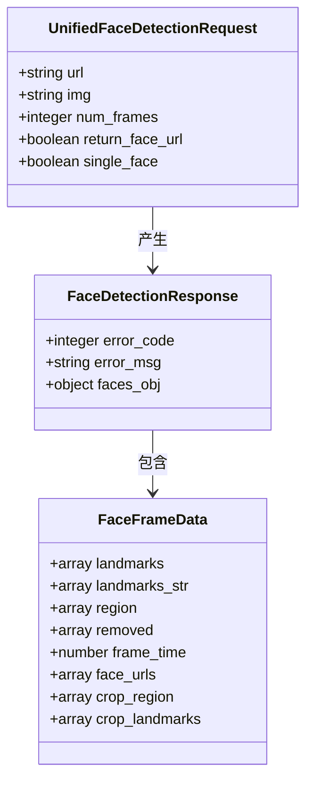
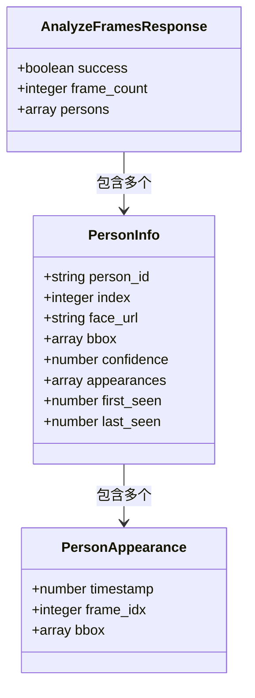
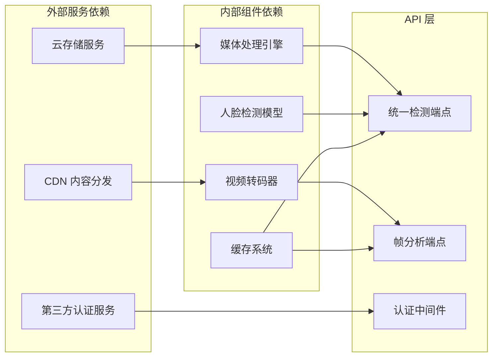
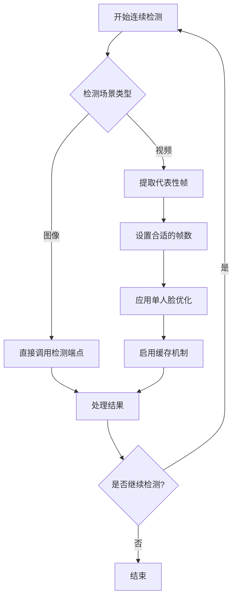
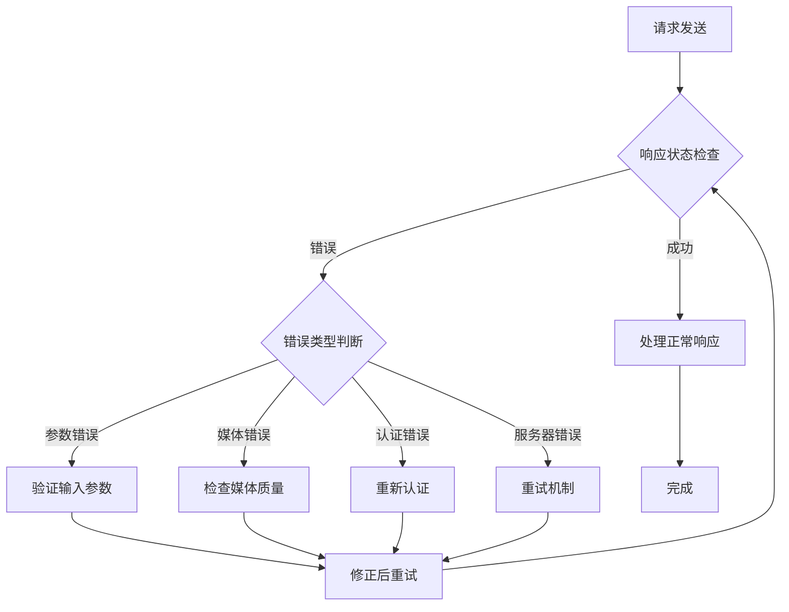
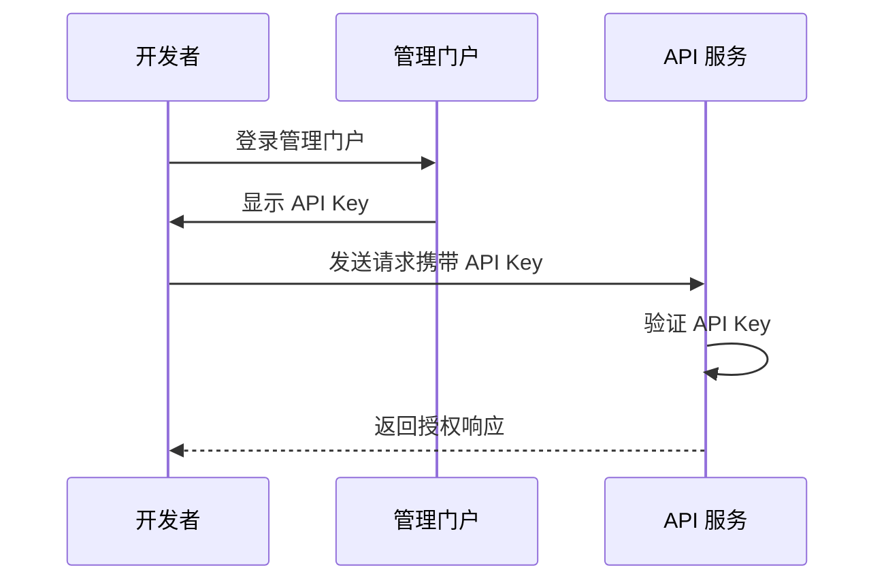

# 面部检测 API 规范

<cite>
**本文档引用的文件**
- [face-detection.yaml](file://openapi/face-detection.yaml)
- [face-detect-legacy.yaml](file://openapi/face-detect-legacy.yaml)
- [detect-faces.mdx](file://ai-tools-suite/face-detection/detect-faces.mdx)
- [analyze-frames.mdx](file://ai-tools-suite/face-detection/analyze-frames.mdx)
- [face-detection.mdx](file://ai-tools-suite/face-detection.mdx)
- [faceswap.mdx](file://ai-tools-suite/faceswap.mdx)
- [faceswap-plus.mdx](file://ai-tools-suite/faceswap/faceswap-plus.mdx)
- [usage.mdx](file://authentication/usage.mdx)
- [error-code.mdx](file://ai-tools-suite/error-code.mdx)
</cite>

## 目录
1. [简介](#简介)
2. [项目结构](#项目结构)
3. [核心组件](#核心组件)
4. [架构概览](#架构概览)
5. [详细组件分析](#详细组件分析)
6. [依赖关系分析](#依赖关系分析)
7. [性能考虑](#性能考虑)
8. [故障排除指南](#故障排除指南)
9. [结论](#结论)
10. [附录](#附录)

## 简介

面部检测 API 是一个基于 OpenAPI 3.0.3 标准构建的完整解决方案，专门用于在图像和视频中进行高精度的人脸检测。该 API 提供了统一的接口来处理静态图像和动态视频内容，支持 6 点面部特征点检测、边界框坐标计算、人脸跟踪以及裁剪后的面部图像生成。

### 主要特性

- **统一检测接口**：同时支持图像和视频的人脸检测
- **智能媒体类型识别**：自动检测输入是图像还是视频
- **高级人脸跟踪**：跨视频帧的人脸持续跟踪
- **6点面部特征点**：精确的面部关键点定位
- **可选裁剪功能**：生成高质量的面部图像
- **单人脸模式**：仅返回最大的人脸
- **多帧分析**：支持视频帧级的人脸分析和去重

## 项目结构

该项目采用模块化设计，将不同功能的 API 文档和规范分离管理：

**图表来源**
- [face-detection.yaml:1-626](file://openapi/face-detection.yaml#L1-L626)
- [face-detect-legacy.yaml:1-115](file://openapi/face-detect-legacy.yaml#L1-L115)

**章节来源**
- [face-detection.yaml:1-626](file://openapi/face-detection.yaml#L1-L626)
- [face-detect-legacy.yaml:1-115](file://openapi/face-detect-legacy.yaml#L1-L115)

## 核心组件

### 主要 API 组件

面部检测 API 由两个核心端点组成，每个都提供了完整的功能集：

#### 1. 统一人脸检测端点
- **端点路径**：`/detect_faces`
- **方法**：POST
- **功能**：支持图像和视频的统一检测
- **输入模式**：URL 或 Base64 编码数据
- **输出**：6点面部特征点、边界框、可选裁剪图像

#### 2. 帧分析端点
- **端点路径**：`/faceswap/analyze_frames`
- **方法**：POST
- **功能**：单帧或多帧图像分析
- **特性**：自动人物去重、时间戳跟踪
- **用途**：为后续的人脸交换操作准备数据

**章节来源**
- [face-detection.yaml:23-182](file://openapi/face-detection.yaml#L23-L182)
- [detect-faces.mdx:1-183](file://ai-tools-suite/face-detection/detect-faces.mdx#L1-L183)

## 架构概览

### 整体系统架构

**图表来源**
- [face-detection.yaml:16-21](file://openapi/face-detection.yaml#L16-L21)
- [face-detection.yaml:303-342](file://openapi/face-detection.yaml#L303-L342)

### 数据流处理流程

**图表来源**
- [face-detection.yaml:24-44](file://openapi/face-detection.yaml#L24-L44)
- [face-detection.yaml:160-181](file://openapi/face-detection.yaml#L160-L181)

## 详细组件分析

### 统一人脸检测端点

#### 请求参数规范

| 参数名 | 类型 | 必需 | 默认值 | 描述 |
|--------|------|------|--------|------|
| url | string | 是* | - | 图像或视频的公开可访问 URL |
| img | string | 是* | - | Base64 编码的图像数据 |
| num_frames | integer | 否 | 5 | 视频分析的帧数（图像忽略） |
| return_face_url | boolean | 否 | false | 是否返回裁剪后的面部图像 URL |
| single_face | boolean | 否 | false | 是否仅返回最大人脸 |

#### 响应数据结构

**图表来源**
- [face-detection.yaml:435-467](file://openapi/face-detection.yaml#L435-L467)
- [face-detection.yaml:343-433](file://openapi/face-detection.yaml#L343-L433)
- [face-detection.yaml:303-342](file://openapi/face-detection.yaml#L303-L342)

#### 6点面部特征点定义

API 检测以下 6个关键面部特征点：

1. **左眼中心点** - 左眼的几何中心
2. **右眼中心点** - 右眼的几何中心  
3. **鼻尖** - 鼻子的最高点
4. **嘴中心** - 嘴巴的中心点（左右嘴角的中点）
5. **左嘴角** - 左侧嘴角位置
6. **右嘴角** - 右侧嘴角位置

这些特征点以二维坐标形式返回，格式为 `[[x1, y1], [x2, y2], [x3, y3], [x4, y4], [x5, x5], [x6, y6]]`。

**章节来源**
- [face-detection.yaml:350-362](file://openapi/face-detection.yaml#L350-L362)
- [face-detection.mdx:62-71](file://ai-tools-suite/face-detection.mdx#L62-L71)

### 帧分析端点

#### 多帧分析功能

帧分析端点专为视频处理场景设计，提供以下核心功能：

- **自动人物去重**：通过面部嵌入向量匹配，将同一人在不同帧中的出现合并为单一实体
- **时间戳跟踪**：记录每个人物在视频中的首次和最后出现时间
- **批量处理**：支持单帧和多帧图像的统一处理
- **优化输出格式**：返回专门为后续人脸交换操作优化的数据格式

#### 响应数据结构

**图表来源**
- [face-detection.yaml:586-612](file://openapi/face-detection.yaml#L586-L612)
- [face-detection.yaml:530-584](file://openapi/face-detection.yaml#L530-L584)
- [face-detection.yaml:505-528](file://openapi/face-detection.yaml#L505-L528)

#### 自动去重算法

当处理多帧图像时，系统会执行以下去重流程：

1. **特征提取**：对每张图片中检测到的面部提取嵌入向量
2. **相似度计算**：计算面部之间的相似度分数
3. **聚类分析**：使用阈值算法将相似的面部归类到同一人物组
4. **结果合并**：将同一人物在不同帧中的出现合并为单一条目

**章节来源**
- [face-detection.yaml:167-175](file://openapi/face-detection.yaml#L167-L175)
- [analyze-frames.mdx:19-22](file://ai-tools-suite/face-detection/analyze-frames.mdx#L19-L22)

### 遗留版本对比

#### V3 与 V4 版本差异

| 特性 | V3 版本 | V4 版本 |
|------|---------|---------|
| **API 名称** | Face Detect | Face Detection |
| **输入方式** | 仅 URL | 支持 URL 和 Base64 |
| **输出格式** | 简单数组 | 结构化对象 |
| **人脸跟踪** | 不支持 | 支持跨帧跟踪 |
| **裁剪功能** | 基础裁剪 | 高质量裁剪和扩展 |
| **单人脸模式** | 支持 | 支持 |
| **错误码** | 0/1 | 1000/其他值 |
| **认证方式** | API Key | API Key + Bearer Token |

#### 迁移指南

从 V3 迁移到 V4 的关键步骤：

1. **更新认证方式**：使用新的 `x-api-key` 头替换旧的认证方法
2. **调整请求格式**：将简单的参数列表转换为结构化的 JSON 对象
3. **更新错误处理**：修改错误码处理逻辑以适配新的错误码体系
4. **优化输出解析**：重新设计数据结构解析以适配新的响应格式

**章节来源**
- [face-detect-legacy.yaml:17-25](file://openapi/face-detect-legacy.yaml#L17-L25)
- [faceswap.mdx:46-49](file://ai-tools-suite/faceswap.mdx#L46-L49)

## 依赖关系分析

### 外部依赖

**图表来源**
- [face-detection.yaml:16-18](file://openapi/face-detection.yaml#L16-L18)
- [face-detection.yaml:291-300](file://openapi/face-detection.yaml#L291-L300)

### 内部组件耦合

面部检测 API 的内部组件具有清晰的职责分离：

- **认证组件**：独立于业务逻辑，提供统一的身份验证
- **媒体处理组件**：负责媒体下载、解码和预处理
- **检测引擎组件**：执行实际的人脸检测和特征点定位
- **跟踪组件**：处理跨帧的人脸关联和去重
- **输出组件**：格式化最终响应数据

这种设计确保了系统的可维护性和可扩展性。

**章节来源**
- [face-detection.yaml:19-21](file://openapi/face-detection.yaml#L19-L21)
- [face-detection.yaml:291-300](file://openapi/face-detection.yaml#L291-L300)

## 性能考虑

### 处理时间优化

#### 图像处理性能

- **单张图像**：通常在 1 秒内完成处理
- **批量图像**：每张图像增加约 0.2-0.5 秒
- **复杂场景**：多人物、低质量图像可能需要额外时间

#### 视频处理性能

视频处理时间主要取决于以下因素：

| 因素 | 影响程度 | 优化建议 |
|------|----------|----------|
| 帧数 | 高 | 使用合理的 `num_frames` 值 |
| 分辨率 | 中等 | 720p 或更高效果最佳 |
| 人脸数量 | 低 | 单人脸场景处理更快 |
| 编码格式 | 低 | H.264 格式处理效率最高 |

#### 连续检测优化策略

**图表来源**
- [face-detection.mdx:282-303](file://ai-tools-suite/face-detection.mdx#L282-L303)

### 最佳实践建议

1. **参数优化**
   - 图像检测：仅提供 `url` 或 `img` 参数
   - 视频检测：合理设置 `num_frames`（短视频 5-10 帧，长视频 20-50 帧）

2. **网络优化**
   - 使用 HTTPS 协议确保安全传输
   - 确保媒体 URL 公开可访问
   - 考虑使用 CDN 加速

3. **资源管理**
   - 实现请求重试机制
   - 设置适当的超时时间
   - 合理使用缓存避免重复处理

**章节来源**
- [face-detection.mdx:125-137](file://ai-tools-suite/face-detection.mdx#L125-L137)
- [face-detection.mdx:298-303](file://ai-tools-suite/face-detection.mdx#L298-L303)

## 故障排除指南

### 常见错误类型及解决方案

#### 输入参数错误

| 错误代码 | 错误信息 | 可能原因 | 解决方案 |
|----------|----------|----------|----------|
| 0 | SUCCESS | 成功状态 | 无需处理 |
| 1 | Either 'url' or 'img' parameter must be provided | 缺少必需参数 | 提供 `url` 或 `img` 参数 |
| 1 | Invalid URL format | URL 格式不正确 | 检查 URL 协议和格式 |
| 1 | Failed to download media from URL | 媒体下载失败 | 确保 URL 公开可访问 |

#### 媒体处理错误

| 错误代码 | 错误信息 | 可能原因 | 解决方案 |
|----------|----------|----------|----------|
| 1 | No faces detected | 未检测到人脸 | 检查图像质量和人脸可见性 |
| 1 | Media type detection failed | 媒体类型识别失败 | 确保文件有正确的扩展名 |
| 1 | Failed to process media | 媒体格式不支持 | 使用支持的格式（JPG、PNG、MP4等） |

#### 认证相关错误

| 错误代码 | 错误信息 | 可能原因 | 解决方案 |
|----------|----------|----------|----------|
| 1 | Authentication failed | 认证失败 | 检查 API Key 有效性 |
| 1 | Invalid token | 令牌过期 | 重新获取新令牌 |
| 1 | Permission denied | 权限不足 | 检查账户权限设置 |

### 错误处理最佳实践

**图表来源**
- [face-detection.mdx:242-280](file://ai-tools-suite/face-detection.mdx#L242-L280)

### 调试技巧

1. **日志记录**：启用详细的请求和响应日志
2. **参数验证**：在发送请求前验证所有参数
3. **渐进测试**：从简单场景开始，逐步增加复杂度
4. **监控指标**：跟踪处理时间和成功率

**章节来源**
- [error-code.mdx:6-59](file://ai-tools-suite/error-code.mdx#L6-L59)
- [face-detection.mdx:242-280](file://ai-tools-suite/face-detection.mdx#L242-L280)

## 结论

面部检测 API 提供了一个完整、高效且易于使用的解决方案，适用于各种图像和视频处理场景。其核心优势包括：

### 技术优势

- **统一接口设计**：简化了开发者的集成工作
- **高性能处理**：优化的算法和架构确保快速响应
- **灵活的输出格式**：满足不同应用场景的需求
- **完善的错误处理**：提供详细的错误信息和解决方案

### 应用价值

- **人脸交换前置处理**：为后续的人脸交换操作提供高质量的输入数据
- **视频内容分析**：支持复杂的视频帧级分析需求
- **多场景适用性**：从简单的单张图像检测到复杂的视频分析都能胜任

### 发展前景

随着 AI 技术的不断发展，面部检测 API 将继续演进，提供更强大的功能和更好的性能。建议开发者关注版本更新，及时采用新的特性和优化。

## 附录

### 认证配置

#### API Key 配置

**图表来源**
- [usage.mdx:19-24](file://authentication/usage.mdx#L19-L24)

### 支持的媒体格式

| 媒体类型 | 支持的格式 | 推荐分辨率 | 文件大小限制 |
|----------|------------|------------|--------------|
| 图像 | JPG, JPEG, PNG, BMP, WEBP | 720p+ | 10MB |
| 视频 | MP4, MOV, AVI, WEBM | 720p+ | 100MB |
| 音频 | MP3, WAV | - | 50MB |

### 性能基准测试

| 场景 | 处理时间 | 并发能力 | 内存使用 |
|------|----------|----------|----------|
| 单张图像 | < 1 秒 | 100+ 请求/秒 | 50MB |
| 短视频(10帧) | 5-10 秒 | 50+ 请求/秒 | 100MB |
| 中视频(50帧) | 30-60 秒 | 20+ 请求/秒 | 200MB |
| 长视频(100帧) | 2-3 分钟 | 10+ 请求/秒 | 400MB |

**章节来源**
- [usage.mdx:10-48](file://authentication/usage.mdx#L10-L48)
- [face-detection.mdx:117-123](file://ai-tools-suite/face-detection.mdx#L117-L123)