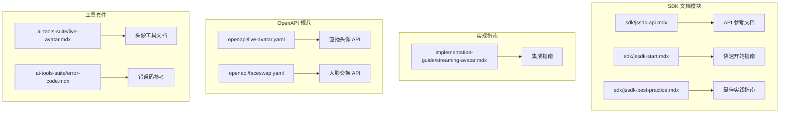
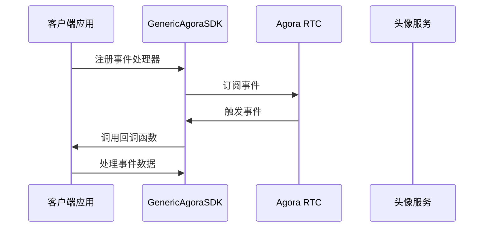
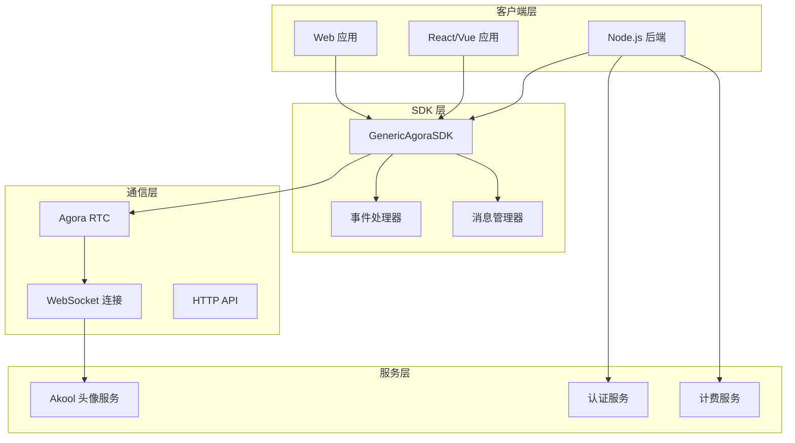
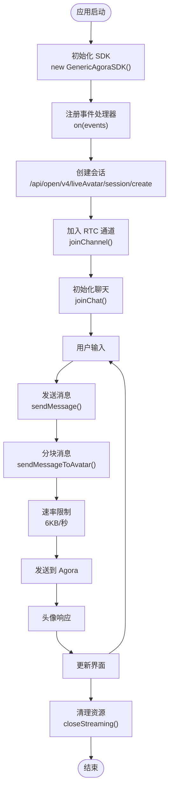
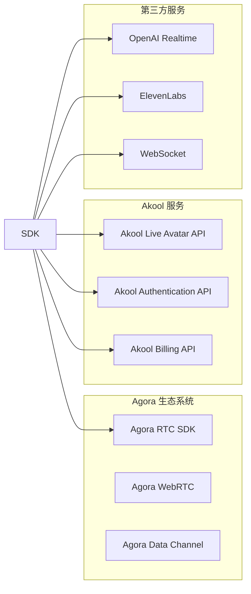
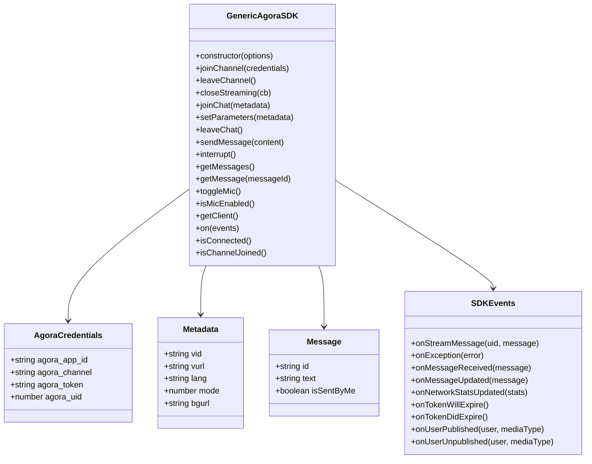
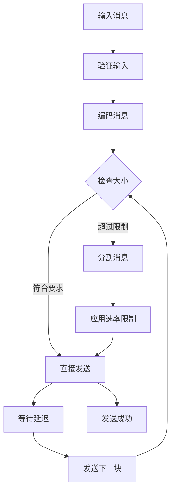
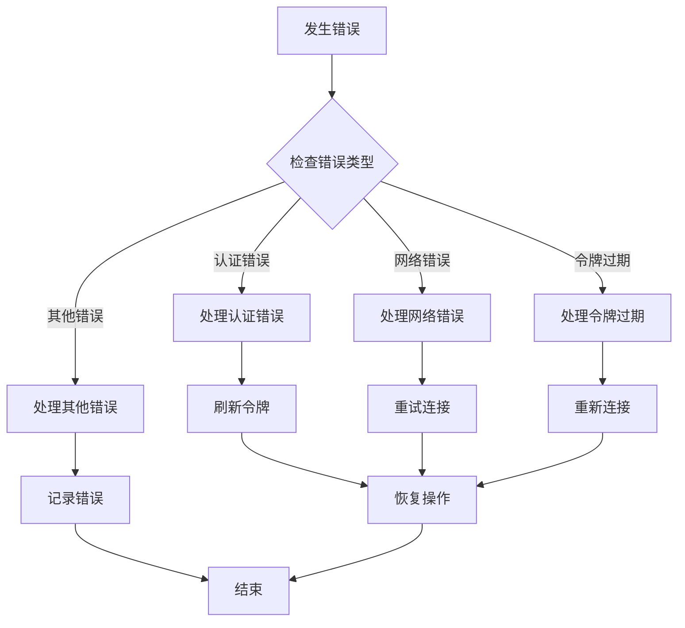

# JavaScript SDK API 参考

<cite>
**本文档引用的文件**
- [jssdk-api.mdx](file://sdk/jssdk-api.mdx)
- [jssdk-start.mdx](file://sdk/jssdk-start.mdx)
- [jssdk-best-practice.mdx](file://sdk/jssdk-best-practice.mdx)
- [streaming-avatar.mdx](file://implementation-guide/streaming-avatar.mdx)
- [live-avatar.yaml](file://openapi/live-avatar.yaml)
- [faceswap.yaml](file://openapi/faceswap.yaml)
- [live-avatar.mdx](file://ai-tools-suite/live-avatar.mdx)
- [error-code.mdx](file://ai-tools-suite/error-code.mdx)
</cite>

## 目录
1. [简介](#简介)
2. [项目结构](#项目结构)
3. [核心组件](#核心组件)
4. [架构概览](#架构概览)
5. [详细组件分析](#详细组件分析)
6. [依赖关系分析](#依赖关系分析)
7. [性能考虑](#性能考虑)
8. [故障排除指南](#故障排除指南)
9. [结论](#结论)
10. [附录](#附录)

## 简介

Akool Streaming Avatar SDK 是一个专为集成 Agora RTC 流媒体头像功能而设计的通用 JavaScript SDK。该 SDK 提供了面向对象的接口，支持实时视频流传输和智能头像交互功能。SDK 基于 TypeScript 构建，提供了完整的类型定义和事件驱动架构。

**主要特性：**
- 易于使用的 Agora RTC 集成 API
- TypeScript 支持和完整类型定义
- 多种打包格式（ESM、CommonJS、IIFE）
- 通过 unpkg 和 jsDelivr 的 CDN 分发
- 基于事件的架构用于处理消息和状态变化
- 消息管理与历史记录和更新
- 网络质量监控和统计
- 麦克风控制用于语音交互
- 大文本的分块消息发送
- 自动速率限制的消息分块
- 令牌过期处理
- 错误处理和日志记录

## 项目结构

该项目采用文档驱动的组织方式，主要包含以下核心模块：



**图表来源**
- [jssdk-api.mdx:1-585](file://sdk/jssdk-api.mdx#L1-L585)
- [jssdk-start.mdx:1-590](file://sdk/jssdk-start.mdx#L1-L590)
- [streaming-avatar.mdx:1-800](file://implementation-guide/streaming-avatar.mdx#L1-L800)

**章节来源**
- [jssdk-api.mdx:1-50](file://sdk/jssdk-api.mdx#L1-L50)
- [jssdk-start.mdx:1-50](file://sdk/jssdk-start.mdx#L1-L50)

## 核心组件

### GenericAgoraSDK 类

这是 SDK 的核心类，提供了所有主要功能的统一接口：

**构造函数**
```typescript
constructor(options?: { mode?: string; codec?: SDK_CODEC })
```

**参数：**
- `options.mode` (string) - SDK 模式，默认："rtc"
- `options.codec` (SDK_CODEC) - 视频编解码器，例如："vp8"、"h264"

**主要功能模块：**

1. **连接管理** - 处理 Agora RTC 通道的加入和离开
2. **聊天管理** - 管理头像聊天会话和消息
3. **音频管理** - 控制麦克风状态
4. **客户端访问** - 提供底层 Agora RTC 客户端实例
5. **事件处理** - 注册各种 SDK 事件处理器

**章节来源**
- [jssdk-api.mdx:17-116](file://sdk/jssdk-api.mdx#L17-L116)

### 事件系统

SDK 使用基于事件的架构来处理各种状态变化和用户交互：



**图表来源**
- [jssdk-api.mdx:279-406](file://sdk/jssdk-api.mdx#L279-L406)

**章节来源**
- [jssdk-api.mdx:279-406](file://sdk/jssdk-api.mdx#L279-L406)

## 架构概览

### 整体架构设计



**图表来源**
- [streaming-avatar.mdx:116-182](file://implementation-guide/streaming-avatar.mdx#L116-L182)

### 数据流架构

SDK 实现了清晰的数据流架构，支持双向通信：



**图表来源**
- [streaming-avatar.mdx:604-691](file://implementation-guide/streaming-avatar.mdx#L604-L691)

**章节来源**
- [streaming-avatar.mdx:116-182](file://implementation-guide/streaming-avatar.mdx#L116-L182)

## 详细组件分析

### 连接管理组件

#### joinChannel 方法
负责建立与 Agora RTC 服务的连接：

**方法签名：**
```typescript
async joinChannel(credentials: AgoraCredentials): Promise<void>
```

**参数：**
- `credentials` (AgoraCredentials) - Agora 连接凭证
  - `agora_app_id` (string) - Agora 应用 ID
  - `agora_channel` (string) - 通道名称
  - `agora_token` (string) - Agora 令牌
  - `agora_uid` (number) - 用户 ID

**使用示例：**
```javascript
await agoraSDK.joinChannel({
  agora_app_id: "your-agora-app-id",
  agora_channel: "your-channel-name", 
  agora_token: "your-agora-token",
  agora_uid: 12345
});
```

**章节来源**
- [jssdk-api.mdx:42-59](file://sdk/jssdk-api.mdx#L42-L59)

#### leaveChannel 方法
断开当前的 Agora RTC 通道连接：

**方法签名：**
```typescript
async leaveChannel(): Promise<void>
```

**使用示例：**
```javascript
await agoraSDK.leaveChannel();
```

**章节来源**
- [jssdk-api.mdx:61-69](file://sdk/jssdk-api.mdx#L61-L69)

#### closeStreaming 方法
关闭所有连接并执行清理操作：

**方法签名：**
```typescript
async closeStreaming(cb?: () => void): Promise<void>
```

**参数：**
- `cb` (function) - 可选的回调函数，在关闭后执行

**使用示例：**
```javascript
await agoraSDK.closeStreaming(() => {
  console.log("Streaming closed successfully");
});
```

**章节来源**
- [jssdk-api.mdx:71-85](file://sdk/jssdk-api.mdx#L71-L85)

### 聊天管理组件

#### joinChat 方法
初始化头像聊天会话：

**方法签名：**
```typescript
async joinChat(metadata: Metadata): Promise<void>
```

**参数：**
- `metadata` (Metadata) - 头像配置参数
  - `vid` (string) - 声音 ID
  - `vurl` (string) - 声音 URL
  - `lang` (string) - 语言代码（如："en"、"es"、"fr"）
  - `mode` (number) - 模式类型（1：重复模式，2：对话模式）
  - `bgurl` (string) - 背景图片 URL

**使用示例：**
```javascript
await agoraSDK.joinChat({
  vid: "voice-id-12345",
  lang: "en",
  mode: 2,
  bgurl: "https://example.com/background.jpg"
});
```

**章节来源**
- [jssdk-api.mdx:121-138](file://sdk/jssdk-api.mdx#L121-L138)

#### sendMessage 方法
向头像发送文本消息：

**方法签名：**
```typescript
async sendMessage(content: string): Promise<void>
```

**参数：**
- `content` (string) - 要发送的消息内容

**使用示例：**
```javascript
await agoraSDK.sendMessage("Hello, how are you today?");
```

**章节来源**
- [jssdk-api.mdx:168-180](file://sdk/jssdk-api.mdx#L168-L180)

#### setParameters 方法
设置头像参数：

**方法签名：**
```typescript
setParameters(metadata: Metadata): void
```

**使用示例：**
```javascript
agoraSDK.setParameters({
  vid: "new-voice-id",
  lang: "es",
  mode: 1
});
```

**章节来源**
- [jssdk-api.mdx:140-156](file://sdk/jssdk-api.mdx#L140-L156)

### 音频管理组件

#### toggleMic 方法
切换麦克风的开启和关闭状态：

**方法签名：**
```typescript
async toggleMic(): Promise<void>
```

**使用示例：**
```javascript
await agoraSDK.toggleMic();
console.log("Microphone enabled:", agoraSDK.isMicEnabled());
```

**章节来源**
- [jssdk-api.mdx:232-241](file://sdk/jssdk-api.mdx#L232-L241)

#### isMicEnabled 方法
检查麦克风当前是否启用：

**方法签名：**
```typescript
isMicEnabled(): boolean
```

**返回值：**
- `boolean` - 麦克风状态

**使用示例：**
```javascript
const micEnabled = agoraSDK.isMicEnabled();
console.log("Microphone is:", micEnabled ? "on" : "off");
```

**章节来源**
- [jssdk-api.mdx:243-256](file://sdk/jssdk-api.mdx#L243-L256)

### 事件处理组件

#### on 方法
注册各种 SDK 事件处理器：

**方法签名：**
```typescript
on(events: SDKEvents): void
```

**参数：**
- `events` (SDKEvents) - 包含事件处理器函数的对象

**支持的事件：**
- `onStreamMessage` - 接收流消息
- `onException` - SDK 异常处理
- `onMessageReceived` - 新消息接收
- `onMessageUpdated` - 消息更新
- `onNetworkStatsUpdated` - 网络统计更新
- `onTokenWillExpire` - 令牌即将过期
- `onTokenDidExpire` - 令牌已过期
- `onUserPublished` - 用户发布媒体
- `onUserUnpublished` - 用户停止发布媒体

**使用示例：**
```javascript
agoraSDK.on({
  onStreamMessage: (uid, message) => {
    console.log(`Message from ${uid}:`, message);
  },
  onException: (error) => {
    console.error("SDK Exception:", error);
  }
});
```

**章节来源**
- [jssdk-api.mdx:281-327](file://sdk/jssdk-api.mdx#L281-L327)

### 客户端访问组件

#### getClient 方法
返回底层 Agora RTC 客户端实例以进行高级操作：

**方法签名：**
```typescript
getClient(): RTCClient
```

**返回值：**
- `RTCClient` - Agora RTC 客户端

**使用示例：**
```javascript
const client = agoraSDK.getClient();
// 使用客户端进行高级 Agora 操作
```

**章节来源**
- [jssdk-api.mdx:262-275](file://sdk/jssdk-api.mdx#L262-L275)

## 依赖关系分析

### 外部依赖

SDK 主要依赖以下外部组件：



**图表来源**
- [live-avatar.yaml:13-12](file://openapi/live-avatar.yaml#L13-L12)

### 内部依赖关系



**图表来源**
- [jssdk-api.mdx:333-406](file://sdk/jssdk-api.mdx#L333-L406)

**章节来源**
- [jssdk-api.mdx:331-406](file://sdk/jssdk-api.mdx#L331-L406)

## 性能考虑

### 消息分块和速率限制

SDK 实现了智能的消息分块机制来处理大文本消息：



**图表来源**
- [streaming-avatar.mdx:608-691](file://implementation-guide/streaming-avatar.mdx#L608-L691)

### 最佳实践建议

1. **内存管理** - 定期清理消息历史记录
2. **网络优化** - 使用适当的编解码器和分辨率
3. **错误恢复** - 实现自动重连机制
4. **资源清理** - 在组件卸载时调用 `closeStreaming()`

## 故障排除指南

### 常见错误处理

SDK 提供了全面的错误处理机制：



**图表来源**
- [jssdk-api.mdx:530-555](file://sdk/jssdk-api.mdx#L530-L555)

### 错误码参考

| 错误码 | 描述 | 处理建议 |
|--------|------|----------|
| 1000 | 成功 | 正常操作 |
| 1003 | 参数错误 | 检查请求参数 |
| 1004 | 需要验证 | 完成身份验证 |
| 1006 | 配额不足 | 检查账户余额 |
| 1009 | 权限拒绝 | 检查用户权限 |
| 1101 | 无效令牌 | 刷新或重新获取令牌 |
| 1104 | 余额不足 | 充值或升级套餐 |
| 1200 | 账户被封禁 | 联系客服解封 |

**章节来源**
- [error-code.mdx:8-59](file://ai-tools-suite/error-code.mdx#L8-L59)

### 最佳实践安全措施

1. **后端会话管理** - 始终通过后端服务器管理会话，避免在客户端暴露敏感凭据
2. **短生命周期令牌** - 使用短期有效的会话令牌
3. **错误处理** - 实现完善的错误捕获和处理机制
4. **资源清理** - 在页面卸载时正确清理所有资源

**章节来源**
- [jssdk-best-practice.mdx:30-192](file://sdk/jssdk-best-practice.mdx#L30-L192)

## 结论

Akool Streaming Avatar SDK 提供了一个功能完整、架构清晰的 JavaScript 解决方案，用于集成实时头像交互功能。该 SDK 的设计特点包括：

**技术优势：**
- 基于事件的架构，易于扩展和维护
- 完整的 TypeScript 类型支持
- 智能的消息分块和速率限制机制
- 全面的错误处理和异常恢复能力
- 安全的后端会话管理模式

**适用场景：**
- 实时客服聊天机器人
- 教育培训平台的虚拟助教
- 企业内部知识问答系统
- 电商产品的虚拟导购

**未来发展：**
- 支持更多流媒体提供商（LiveKit、TRTC）
- 增强的 AI 集成能力
- 更丰富的头像动作和表情控制
- 多模态交互支持（语音+视觉）

开发者可以基于此 SDK 快速构建功能丰富的实时头像交互应用，同时享受其提供的安全保障和最佳实践指导。

## 附录

### API 方法完整列表

**连接管理：**
- `new GenericAgoraSDK(options)` - 构造函数
- `joinChannel(credentials)` - 加入通道
- `leaveChannel()` - 离开通道
- `closeStreaming(cb)` - 关闭流
- `isConnected()` - 检查连接状态
- `isChannelJoined()` - 检查频道加入状态

**聊天管理：**
- `joinChat(metadata)` - 初始化聊天
- `setParameters(metadata)` - 设置参数
- `leaveChat()` - 离开聊天
- `sendMessage(content)` - 发送消息
- `interrupt()` - 中断响应
- `getMessages()` - 获取消息列表
- `getMessage(messageId)` - 获取特定消息

**音频管理：**
- `toggleMic()` - 切换麦克风
- `isMicEnabled()` - 检查麦克风状态

**事件处理：**
- `on(events)` - 注册事件处理器
- `getClient()` - 获取底层客户端

### 类型定义参考

**AgoraCredentials：**
- `agora_app_id` (string) - Agora 应用 ID
- `agora_channel` (string) - 通道名称
- `agora_token` (string) - Agora 令牌
- `agora_uid` (number) - 用户 ID

**Metadata：**
- `vid` (string) - 声音 ID
- `vurl` (string) - 声音 URL
- `lang` (string) - 语言代码
- `mode` (number) - 模式类型
- `bgurl` (string) - 背景 URL

**Message：**
- `id` (string) - 消息 ID
- `text` (string) - 消息内容
- `isSentByMe` (boolean) - 是否由当前用户发送

**章节来源**
- [jssdk-api.mdx:333-406](file://sdk/jssdk-api.mdx#L333-L406)