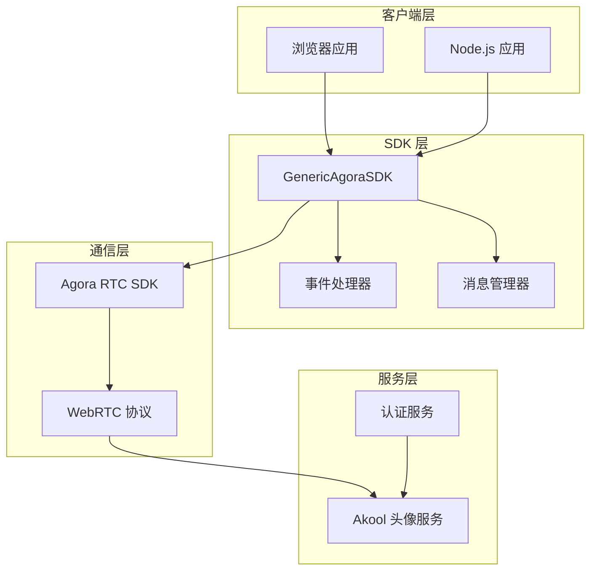
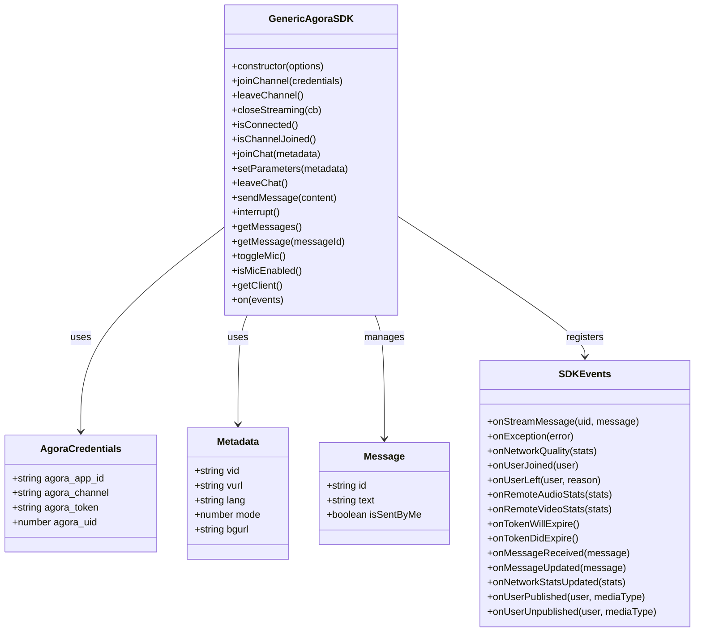
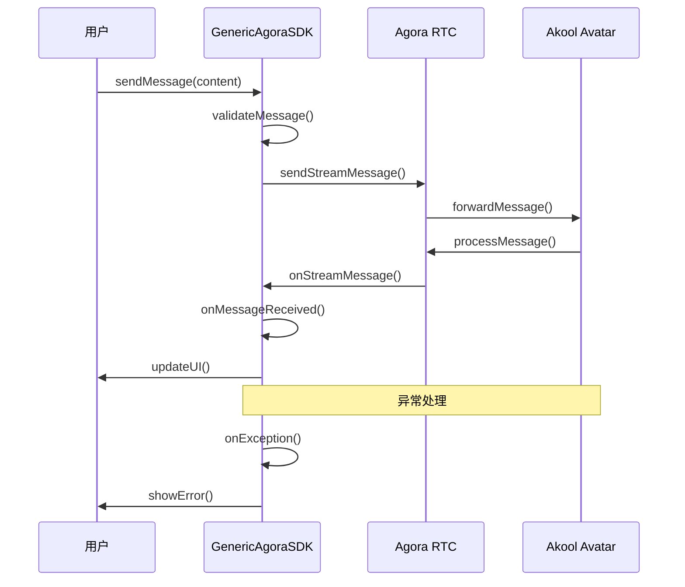

# JavaScript SDK 快速开始

<cite>
**本文档引用的文件**
- [jssdk-start.mdx](file://sdk/jssdk-start.mdx)
- [jssdk-api.mdx](file://sdk/jssdk-api.mdx)
- [jssdk-best-practice.mdx](file://sdk/jssdk-best-practice.mdx)
- [implementation-guide/jssdk-start.mdx](file://implementation-guide/jssdk-start.mdx)
- [authentication/usage.mdx](file://authentication/usage.mdx)
- [README.md](file://README.md)
</cite>

## 目录
1. [简介](#简介)
2. [项目结构](#项目结构)
3. [核心组件](#核心组件)
4. [架构概览](#架构概览)
5. [详细组件分析](#详细组件分析)
6. [依赖关系分析](#依赖关系分析)
7. [性能考虑](#性能考虑)
8. [故障排除指南](#故障排除指南)
9. [结论](#结论)
10. [附录](#附录)

## 简介
Akool Streaming Avatar SDK 是一个通用的 JavaScript SDK，用于在任何 JavaScript 应用程序中集成 Agora RTC 流媒体头像功能。该 SDK 支持 TypeScript，提供多种打包格式（ESM、CommonJS、IIFE），并通过 CDN 分发，支持事件驱动架构来处理消息和状态变化。

## 项目结构
本项目采用基于功能的文件组织方式，主要包含以下关键目录和文件：

```mermaid
graph TB
subgraph "SDK 文档"
A[sdk/jssdk-start.mdx] --> 快速开始
B[sdk/jssdk-api.mdx] --> API 参考
C[sdk/jssdk-best-practice.mdx] --> 最佳实践
end
subgraph "实现指南"
D[implementation-guide/jssdk-start.mdx] --> 基础实现
end
subgraph "认证文档"
E[authentication/usage.mdx] --> 认证指南
end
subgraph "项目根目录"
F[README.md] --> 开发指南
end
```

**图表来源**
- [jssdk-start.mdx:1-590](file://sdk/jssdk-start.mdx#L1-L590)
- [jssdk-api.mdx:1-585](file://sdk/jssdk-api.mdx#L1-L585)
- [jssdk-best-practice.mdx:1-203](file://sdk/jssdk-best-practice.mdx#L1-L203)

**章节来源**
- [jssdk-start.mdx:1-50](file://sdk/jssdk-start.mdx#L1-L50)
- [README.md:1-33](file://README.md#L1-L33)

## 核心组件
SDK 提供了以下核心功能模块：

### 安装与环境要求
- **NPM 包**: akool-streaming-avatar-sdk
- **GitHub 仓库**: akool-rinku/akool-streaming-avatar-sdk
- **当前版本**: 1.0.6
- **许可证**: ISC

### 浏览器支持
- Chrome 56+
- Firefox 44+
- Safari 11+
- Edge 79+
- Opera 43+

### 主要特性
- 易于使用的 Agora RTC 集成 API
- 支持 TypeScript 的完整类型定义
- 多种打包格式（ESM、CommonJS、IIFE）
- 通过 unpkg 和 jsDelivr 的 CDN 分发
- 基于事件的架构处理消息和状态变化
- 消息管理（历史记录和更新）
- 网络质量监控和统计
- 麦克风控制进行语音交互
- 大文本分块发送和自动速率限制
- 令牌过期处理
- 错误处理和日志记录

**章节来源**
- [jssdk-start.mdx:8-31](file://sdk/jssdk-start.mdx#L8-L31)
- [jssdk-start.mdx:39-47](file://sdk/jssdk-start.mdx#L39-L47)
- [jssdk-start.mdx:48-64](file://sdk/jssdk-start.mdx#L48-L64)

## 架构概览
SDK 采用模块化架构设计，支持多种集成方式：



**图表来源**
- [jssdk-start.mdx:66-144](file://sdk/jssdk-start.mdx#L66-L144)
- [jssdk-api.mdx:17-36](file://sdk/jssdk-api.mdx#L17-L36)

## 详细组件分析

### 安装方法

#### NPM 安装（Node.js/现代 JavaScript）
```bash
npm install akool-streaming-avatar-sdk
```

#### CDN 安装（浏览器）
```html
<!-- 使用 unpkg -->
<script src="https://unpkg.com/akool-streaming-avatar-sdk"></script>

<!-- 使用 jsDelivr -->
<script src="https://cdn.jsdelivr.net/npm/akool-streaming-avatar-sdk"></script>
```

**章节来源**
- [jssdk-start.mdx:50-64](file://sdk/jssdk-start.mdx#L50-L64)

### HTML 设置示例
创建一个包含视频容器的基本 HTML 页面：

```html
<!DOCTYPE html>
<html lang="en">
  <head>
    <meta charset="UTF-8" />
    <meta name="viewport" content="width=device-width, initial-scale=1.0" />
    <meta http-equiv="X-UA-Compatible" content="ie=edge" />
    <title>Akool Streaming Avatar SDK</title>
  </head>
  <body>
    <div id="app">
      <h1>Streaming Avatar Demo</h1>
      <div id="remote-video" style="width: 640px; height: 480px;"></div>
      <button id="join-btn">Join Channel</button>
      <button id="send-msg-btn">Send Message</button>
      <input type="text" id="message-input" placeholder="Type your message..." />
    </div>
  </body>
</html>
```

**章节来源**
- [jssdk-start.mdx:68-91](file://sdk/jssdk-start.mdx#L68-L91)

### 现代 JavaScript/TypeScript 集成

#### 基本使用流程
```javascript
import { GenericAgoraSDK } from 'akool-streaming-avatar-sdk';

// 创建 SDK 实例
const agoraSDK = new GenericAgoraSDK({ mode: "rtc", codec: "vp8" });

// 注册事件处理器
agoraSDK.on({
  onStreamMessage: (uid, message) => {
    console.log("Received message from", uid, ":", message);
  },
  onException: (error) => {
    console.error("An exception occurred:", error);
  },
  onMessageReceived: (message) => {
    console.log("New message:", message);
  },
  onUserPublished: async (user, mediaType) => {
    if (mediaType === 'video') {
      const remoteTrack = await agoraSDK.getClient().subscribe(user, mediaType);
      remoteTrack?.play('remote-video');
    } else if (mediaType === 'audio') {
      const remoteTrack = await agoraSDK.getClient().subscribe(user, mediaType);
      remoteTrack?.play();
    }
  }
});

// 从后端获取会话信息
const akoolSession = await fetch('your-backend-url-to-get-session-info');
const { data: { credentials, id } } = await akoolSession.json();

// 加入频道
await agoraSDK.joinChannel({
  agora_app_id: credentials.agora_app_id,
  agora_channel: credentials.agora_channel,
  agora_token: credentials.agora_token,
  agora_uid: credentials.agora_uid
});

// 初始化聊天
await agoraSDK.joinChat({
  vid: "voice-id",
  lang: "en",
  mode: 2
});

// 发送消息
await agoraSDK.sendMessage("Hello, world!");
```

**章节来源**
- [jssdk-start.mdx:93-144](file://sdk/jssdk-start.mdx#L93-L144)

### 浏览器全局使用（IIFE）

```html
<script src="https://unpkg.com/akool-streaming-avatar-sdk"></script>
<script>
  // SDK 作为 AkoolStreamingAvatar 全局变量可用
  const agoraSDK = new AkoolStreamingAvatar.GenericAgoraSDK({ mode: "rtc", codec: "vp8" });

  // 注册事件处理器
  agoraSDK.on({
    onUserPublished: async (user, mediaType) => {
      if (mediaType === 'video') {
        const remoteTrack = await agoraSDK.getClient().subscribe(user, mediaType);
        remoteTrack?.play('remote-video');
      }
    }
  });

  // 页面加载时初始化
  async function initializeSDK() {
    await agoraSDK.joinChannel({
      agora_app_id: "YOUR_APP_ID",
      agora_channel: "YOUR_CHANNEL", 
      agora_token: "YOUR_TOKEN",
      agora_uid: 12345
    });

    await agoraSDK.joinChat({
      vid: "YOUR_VOICE_ID",
      lang: "en", 
      mode: 2
    });
  }

  initializeSDK().catch(console.error);
</script>
```

**章节来源**
- [jssdk-start.mdx:146-182](file://sdk/jssdk-start.mdx#L146-L182)

### 完整可运行示例项目

#### 项目结构
```
sa-demo/
  server.js    # 后端代理（Node.js，零依赖）
  index.html   # 前端页面
  main.js      # 前端逻辑
```

#### 后端：server.js
最小的 Node.js 服务器执行两个操作：
- 将会话创建/关闭请求代理到 Akool API（这样 API 密钥永远不会到达浏览器）
- 提供静态前端文件

```javascript
const http = require("http");
const fs = require("fs");
const path = require("path");

const API_KEY = process.env.AKOOL_API_KEY || "";
const AKOOL_BASE = "https://openapi.akool.com";
const AVATAR_ID = process.env.AVATAR_ID || "dvp_Tristan_cloth2_1080P";
const PORT = Number(process.env.PORT) || 3100;

if (!API_KEY) {
  console.error("Set AKOOL_API_KEY environment variable before starting.");
  process.exit(1);
}

// ... (其余服务器代码实现)
```

**章节来源**
- [jssdk-start.mdx:210-357](file://sdk/jssdk-start.mdx#L210-L357)

#### 前端：index.html
```html
<!DOCTYPE html>
<html lang="en">
<head>
  <meta charset="UTF-8" />
  <meta name="viewport" content="width=device-width, initial-scale=1.0" />
  <title>Streaming Avatar Demo</title>
  <style>
    body { font-family: system-ui, sans-serif; max-width: 720px; margin: 40px auto; padding: 0 16px; }
    #remote-video { width: 100%; max-width: 640px; height: 480px; background: #111; border-radius: 8px; }
    .controls { margin: 12px 0; display: flex; gap: 8px; }
    button { padding: 8px 16px; border-radius: 6px; border: 1px solid #ccc; cursor: pointer; }
    button:disabled { opacity: 0.4; cursor: not-allowed; }
    .btn-primary { background: #6366f1; color: #fff; border-color: #6366f1; }
    .btn-danger { background: #dc2626; color: #fff; border-color: #dc2626; }
    #messages { border: 1px solid #e5e5e5; border-radius: 8px; min-height: 120px; max-height: 240px; overflow-y: auto; padding: 8px; margin: 12px 0; }
    .msg { padding: 6px 10px; margin: 4px 0; border-radius: 6px; max-width: 80%; }
    .msg.user { background: #6366f1; color: #fff; margin-left: auto; }
    .msg.bot { background: #f3f4f6; }
    .input-row { display: flex; gap: 8px; }
    .input-row input { flex: 1; padding: 8px; border: 1px solid #ccc; border-radius: 6px; }
    #status { color: #888; font-size: 0.85rem; margin-top: 8px; }
  </style>
</head>
<body>
  <h1>Streaming Avatar Demo</h1>
  <div id="remote-video"></div>
  <div class="controls">
    <button id="btn-session" class="btn-primary">Start Session</button>
    <button id="btn-mic" disabled>Mic Off</button>
    <button id="btn-interrupt" disabled>Interrupt</button>
  </div>
  <div id="messages"></div>
  <div class="input-row">
    <input id="msg-input" type="text" placeholder="Type a message..." disabled />
    <button id="btn-send" class="btn-primary" disabled>Send</button>
  </div>
  <div id="status">Ready</div>

  <script src="https://unpkg.com/akool-streaming-avatar-sdk"></script>
  <script src="main.js"></script>
</body>
</html>
```

**章节来源**
- [jssdk-start.mdx:359-404](file://sdk/jssdk-start.mdx#L359-L404)

#### 前端：main.js
```javascript
(function () {
  var BACKEND = "http://localhost:3100";
  var btnSession = document.getElementById("btn-session");
  var btnMic = document.getElementById("btn-mic");
  var btnInterrupt = document.getElementById("btn-interrupt");
  var btnSend = document.getElementById("btn-send");
  var msgInput = document.getElementById("msg-input");
  var messagesEl = document.getElementById("messages");
  var statusEl = document.getElementById("status");

  var sdk = null;
  var sessionId = null;
  var running = false;

  function setStatus(text) { statusEl.textContent = text; }

  function addMessage(text, role) {
    var div = document.createElement("div");
    div.className = "msg " + role;
    div.textContent = text;
    messagesEl.appendChild(div);
    messagesEl.scrollTop = messagesEl.scrollHeight;
  }

  function setControls(enabled) {
    btnMic.disabled = !enabled;
    btnInterrupt.disabled = !enabled;
    btnSend.disabled = !enabled;
    msgInput.disabled = !enabled;
  }

  async function startSession() {
    btnSession.disabled = true;
    setStatus("Creating session...");

    // 1. 通过后端代理创建会话
    var res = await fetch(BACKEND + "/session/create", { method: "POST" });
    if (!res.ok) throw new Error("Backend returned " + res.status);
    var body = await res.json();
    sessionId = body.data._id;
    var creds = body.data.credentials;

    // 2. 初始化 SDK
    sdk = new AkoolStreamingAvatar.GenericAgoraSDK({ mode: "rtc", codec: "vp8" });

    sdk.on({
      onMessageReceived: function (msg) {
        if (!msg.isSentByMe) addMessage(msg.text, "bot");
      },
      onMessageUpdated: function (msg) {
        if (!msg.isSentByMe) {
          var last = messagesEl.querySelector(".msg.bot:last-child");
          if (last) last.textContent = msg.text;
        }
      },
      onUserPublished: async function (user, mediaType) {
        var track = await sdk.getClient().subscribe(user, mediaType);
        if (mediaType === "video") track?.play("remote-video");
        else if (mediaType === "audio") track?.play();
      },
      onException: function (err) { setStatus("Error: " + (err.msg || "unknown")); },
      onTokenDidExpire: function () { setStatus("Token expired"); stopSession(); }
    });

    // 3. 使用来自 Akool 的凭据加入 Agora 频道
    setStatus("Connecting...");
    await sdk.joinChannel({
      agora_app_id: creds.agora_app_id,
      agora_channel: creds.agora_channel,
      agora_token: creds.agora_token,
      agora_uid: creds.agora_uid
    });

    // 4. 在对话模式下启动头像聊天
    await sdk.joinChat({ lang: "en", mode: 2 });

    running = true;
    btnSession.disabled = false;
    btnSession.textContent = "End Session";
    btnSession.className = "btn-danger";
    setControls(true);
    setStatus("Connected - avatar is ready");
  }

  // ... (其余前端逻辑实现)
})();
```

**章节来源**
- [jssdk-start.mdx:406-548](file://sdk/jssdk-start.mdx#L406-L548)

### 运行示例
1. 创建项目文件夹并放置三个文件：`server.js`、`index.html` 和 `main.js`
2. 设置 API 密钥并启动服务器
3. 在浏览器中访问 http://localhost:3100 并点击 **Start Session**

**章节来源**
- [jssdk-start.mdx:550-577](file://sdk/jssdk-start.mdx#L550-L577)

## 依赖关系分析

### 核心类关系图


**图表来源**
- [jssdk-api.mdx:17-406](file://sdk/jssdk-api.mdx#L17-L406)

### 事件处理流程


**图表来源**
- [jssdk-api.mdx:279-327](file://sdk/jssdk-api.mdx#L279-L327)

**章节来源**
- [jssdk-api.mdx:17-585](file://sdk/jssdk-api.mdx#L17-L585)

## 性能考虑
- **网络质量监控**: SDK 提供网络统计和质量监控功能
- **分块消息发送**: 支持大文本的分块传输和自动速率限制
- **连接状态管理**: 提供连接和频道加入状态检查
- **资源清理**: 完整的清理函数确保资源正确释放

## 故障排除指南

### 常见问题及解决方案

#### 认证问题
- 确保使用安全的后端代理而不是直接在客户端暴露 API 密钥
- 检查 Akool API Token 的有效性
- 验证 Agora 凭据的正确性

#### 浏览器兼容性问题
- 确保使用支持 WebRTC 的现代浏览器
- 检查浏览器的权限设置（摄像头和麦克风）
- 验证 HTTPS 环境（某些浏览器要求 HTTPS）

#### 网络问题
- 检查防火墙和代理设置
- 验证网络连接稳定性
- 考虑使用 CDN 加速

**章节来源**
- [jssdk-best-practice.mdx:30-29](file://sdk/jssdk-best-practice.mdx#L30-L29)
- [authentication/usage.mdx:48](file://authentication/usage.mdx#L48)

## 结论
Akool Streaming Avatar SDK 提供了一个强大而灵活的解决方案，使开发者能够快速集成流媒体头像功能。通过支持多种安装方式和集成模式，以及完善的错误处理和最佳实践指导，开发者可以在 5 分钟内完成集成并看到效果。

## 附录

### API 方法参考
- `new GenericAgoraSDK(options)`: 创建 SDK 实例
- `joinChannel(credentials)`: 加入 Agora 频道
- `joinChat(metadata)`: 初始化头像聊天
- `sendMessage(content)`: 发送消息
- `toggleMic()`: 切换麦克风
- `closeStreaming()`: 关闭连接

### 事件类型
- `onMessageReceived`: 接收新消息
- `onMessageUpdated`: 更新消息
- `onUserPublished`: 用户发布媒体
- `onException`: 异常处理
- `onTokenWillExpire/onTokenDidExpire`: 令牌过期处理

**章节来源**
- [jssdk-api.mdx:410-526](file://sdk/jssdk-api.mdx#L410-L526)