# JavaScript SDK 最佳实践

<cite>
**本文档引用的文件**
- [jssdk-best-practice.mdx](file://sdk/jssdk-best-practice.mdx)
- [jssdk-start.mdx](file://sdk/jssdk-start.mdx)
- [jssdk-api.mdx](file://sdk/jssdk-api.mdx)
- [live-avatar.mdx](file://ai-tools-suite/live-avatar.mdx)
- [error-code.mdx](file://ai-tools-suite/error-code.mdx)
- [FAQ.mdx](file://ai-tools-suite/FAQ.mdx)
- [image-generate.mdx](file://ai-tools-suite/image-generate.mdx)
- [faceswap.mdx](file://ai-tools-suite/faceswap.mdx)
- [README.md](file://README.md)
</cite>

## 目录
1. [简介](#简介)
2. [项目结构](#项目结构)
3. [核心组件](#核心组件)
4. [架构概览](#架构概览)
5. [详细组件分析](#详细组件分析)
6. [依赖关系分析](#依赖关系分析)
7. [性能考虑](#性能考虑)
8. [故障排除指南](#故障排除指南)
9. [结论](#结论)
10. [附录](#附录)

## 简介

本指南基于 Akool Streaming Avatar SDK 的实际实现，为 JavaScript 开发者提供全面的 SDK 最佳实践指导。该 SDK 提供了通用的 JavaScript 接口，用于在任何 JavaScript 应用中集成 Agora RTC 流媒体头像功能，支持实时视频流和聊天交互。

**核心特性包括：**
- 易于使用的 Agora RTC 集成 API
- 支持 TypeScript 的完整类型定义
- 多种打包格式（ESM、CommonJS、IIFE）
- 通过 unpkg 和 jsDelivr 的 CDN 分发
- 基于事件的架构处理消息和状态变化
- 消息管理与历史记录更新
- 网络质量监控和统计
- 麦克风控制用于语音交互
- 大文本分块发送和自动速率限制
- 令牌过期处理
- 错误处理和日志记录

## 项目结构

该项目采用文档驱动的结构，主要包含以下核心模块：

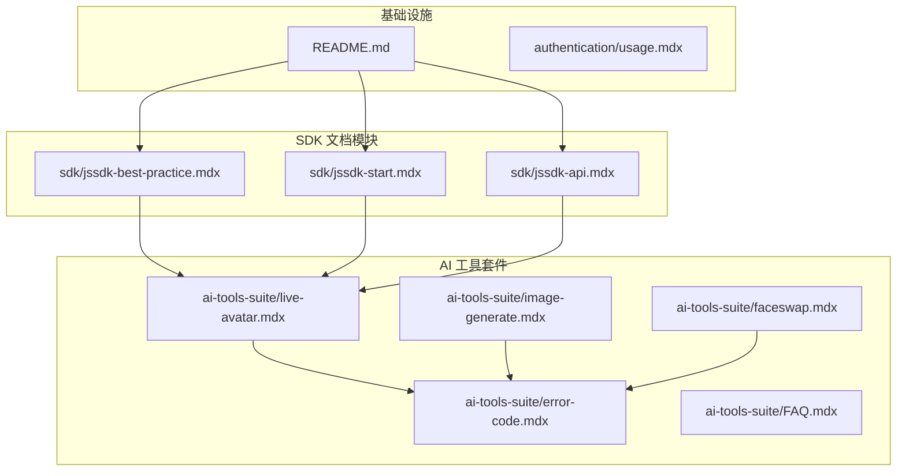

**图表来源**
- [jssdk-best-practice.mdx:1-203](file://sdk/jssdk-best-practice.mdx#L1-L203)
- [jssdk-start.mdx:1-590](file://sdk/jssdk-start.mdx#L1-L590)
- [jssdk-api.mdx:1-585](file://sdk/jssdk-api.mdx#L1-L585)

**章节来源**
- [README.md:1-33](file://README.md#L1-L33)
- [jssdk-best-practice.mdx:1-203](file://sdk/jssdk-best-practice.mdx#L1-L203)

## 核心组件

### 1. GenericAgoraSDK 类

这是 SDK 的核心类，提供了完整的头像交互功能：

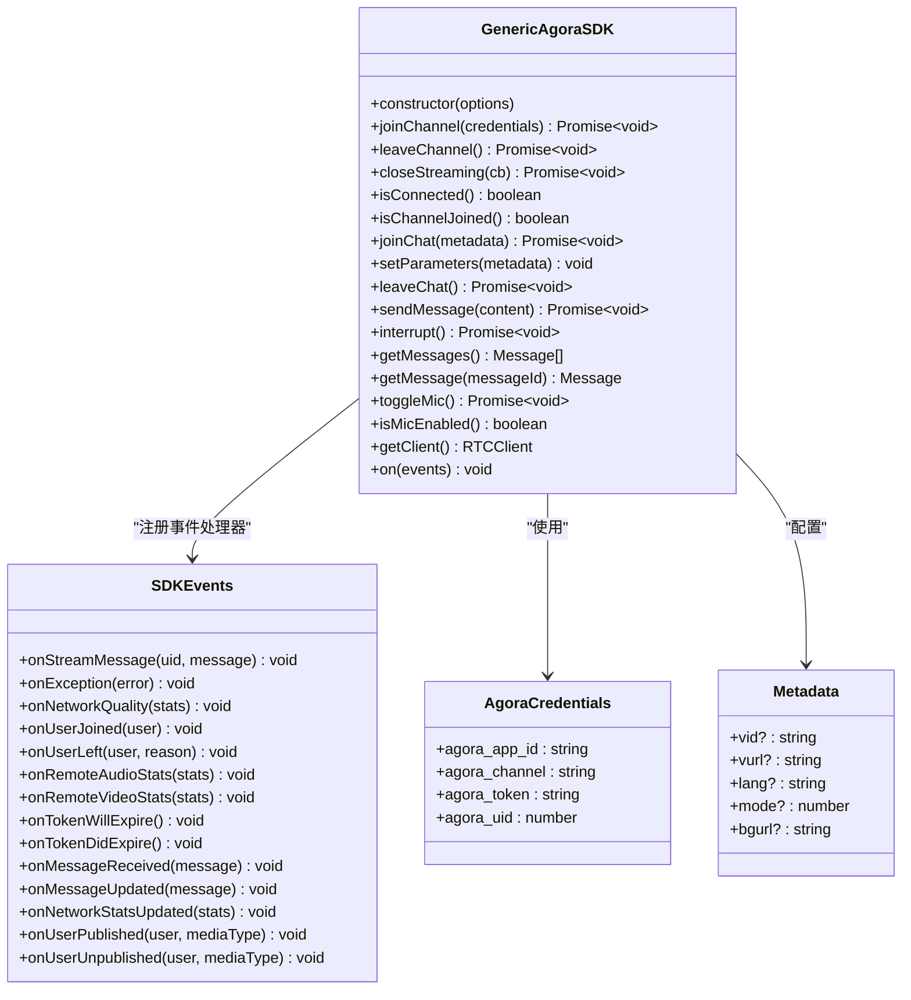

**图表来源**
- [jssdk-api.mdx:17-585](file://sdk/jssdk-api.mdx#L17-L585)

### 2. 事件处理系统

SDK 实现了完整的事件驱动架构：

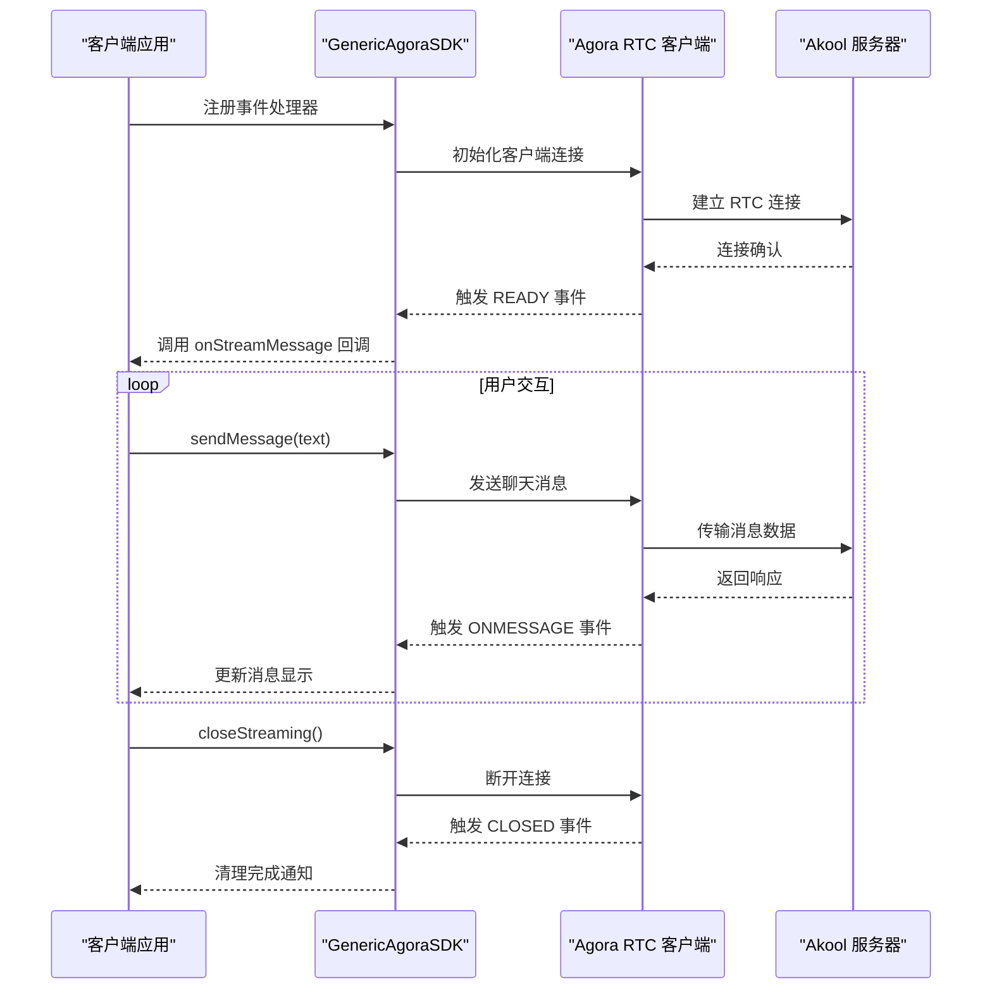

**图表来源**
- [jssdk-api.mdx:279-327](file://sdk/jssdk-api.mdx#L279-L327)
- [jssdk-start.mdx:414-526](file://sdk/jssdk-start.mdx#L414-L526)

**章节来源**
- [jssdk-api.mdx:17-585](file://sdk/jssdk-api.mdx#L17-L585)
- [jssdk-start.mdx:93-144](file://sdk/jssdk-start.mdx#L93-L144)

## 架构概览

### 安全架构设计

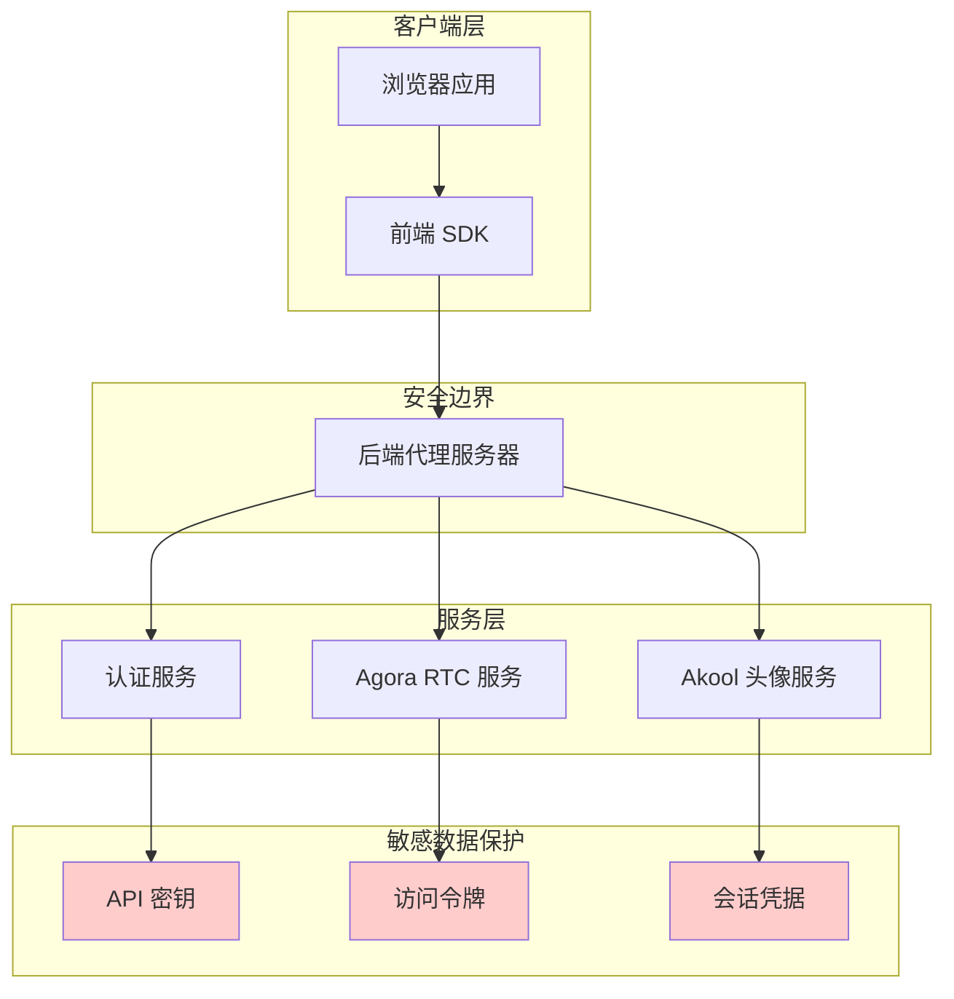

**图表来源**
- [jssdk-best-practice.mdx:30-112](file://sdk/jssdk-best-practice.mdx#L30-L112)
- [jssdk-start.mdx:210-357](file://sdk/jssdk-start.mdx#L210-L357)

### 数据流架构

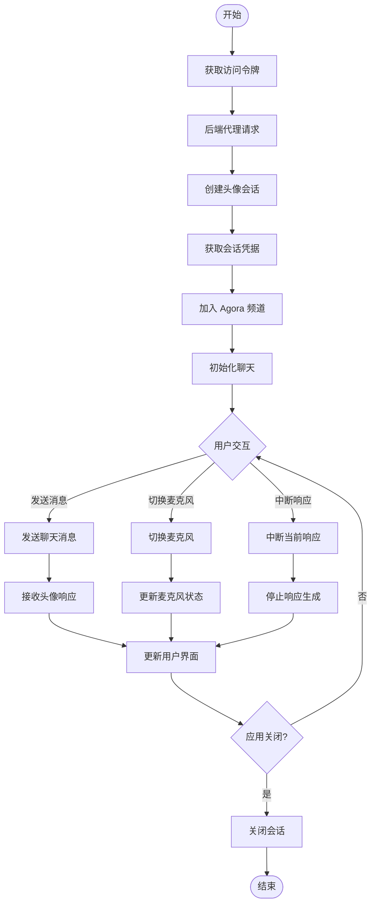

**图表来源**
- [jssdk-start.mdx:440-547](file://sdk/jssdk-start.mdx#L440-L547)
- [live-avatar.mdx:37-281](file://ai-tools-suite/live-avatar.mdx#L37-L281)

**章节来源**
- [jssdk-best-practice.mdx:30-112](file://sdk/jssdk-best-practice.mdx#L30-L112)
- [jssdk-start.mdx:210-547](file://sdk/jssdk-start.mdx#L210-L547)

## 详细组件分析

### 1. 安全最佳实践

#### 后端会话管理

**❌ 错误做法（客户端暴露敏感凭证）：**
```javascript
// 危险：在客户端暴露敏感凭证
const agoraSDK = new GenericAgoraSDK();
await agoraSDK.joinChannel({
  agora_app_id: "YOUR_SENSITIVE_APP_ID", // ❌ 暴露
  agora_token: "YOUR_SENSITIVE_TOKEN",   // ❌ 暴露
  agora_uid: 12345
});
```

**✅ 正确做法（安全的后端委托）：**
```javascript
// 推荐：从安全后端获取凭证
const credentials = await fetch('/api/secure/get-agora-session', {
  method: 'POST',
  headers: { 'Authorization': `Bearer ${userToken}` },
  body: JSON.stringify({ userId, sessionType: 'avatar' })
});
const sessionData = await credentials.json();

await agoraSDK.joinChannel(sessionData.credentials);
```

#### 后端实现示例

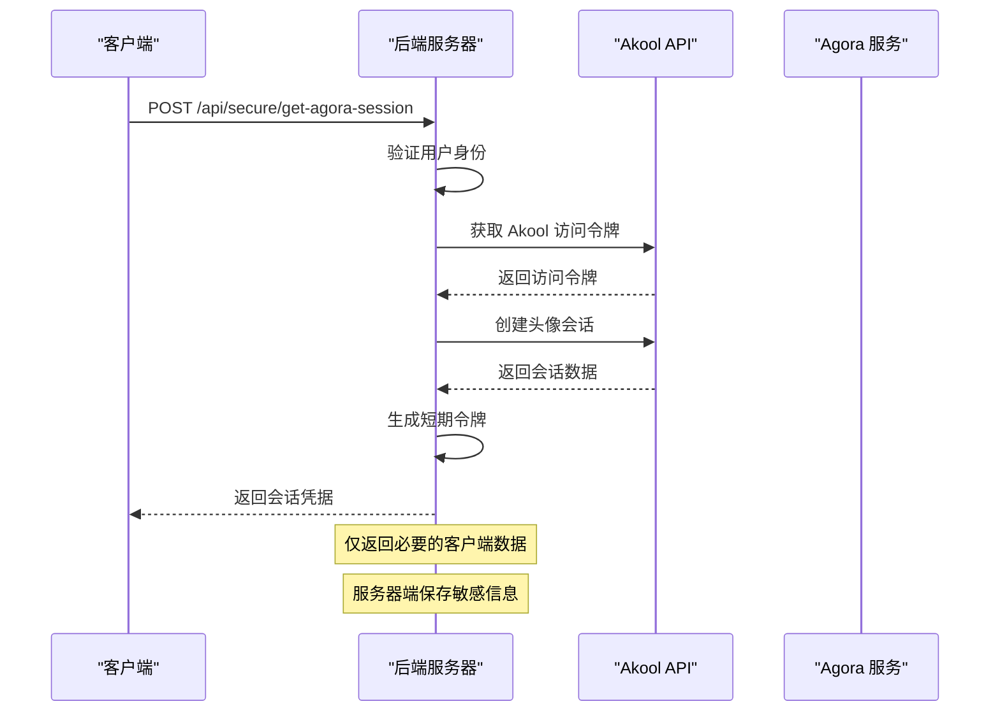

**图表来源**
- [jssdk-best-practice.mdx:58-112](file://sdk/jssdk-best-practice.mdx#L58-L112)

**章节来源**
- [jssdk-best-practice.mdx:30-112](file://sdk/jssdk-best-practice.mdx#L30-L112)

### 2. TypeScript 使用建议

#### 类型安全最佳实践

```typescript
// ✅ 推荐：使用强类型接口
interface AgoraCredentials {
  agora_app_id: string;
  agora_channel: string;
  agora_token: string;
  agora_uid: number;
}

interface Metadata {
  vid?: string;
  vurl?: string;
  lang?: string;
  mode?: number;
  bgurl?: string;
}

// ✅ 推荐：事件处理器类型定义
interface SDKEvents {
  onStreamMessage?: (uid: UID, message: StreamMessage) => void;
  onException?: (error: { code: number; msg: string; uid: UID }) => void;
  onMessageReceived?: (message: Message) => void;
  onNetworkStatsUpdated?: (stats: NetworkStats) => void;
}

// ✅ 推荐：消息类型定义
interface Message {
  id: string;
  text: string;
  isSentByMe: boolean;
}
```

#### 类型安全的消息处理

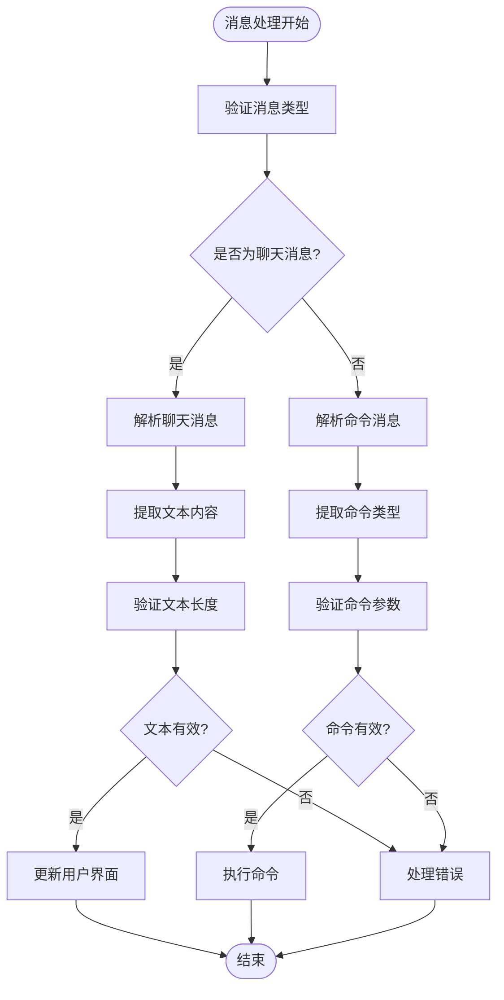

**图表来源**
- [jssdk-api.mdx:331-406](file://sdk/jssdk-api.mdx#L331-L406)

**章节来源**
- [jssdk-api.mdx:331-406](file://sdk/jssdk-api.mdx#L331-L406)

### 3. 内存管理和资源清理

#### 连接生命周期管理

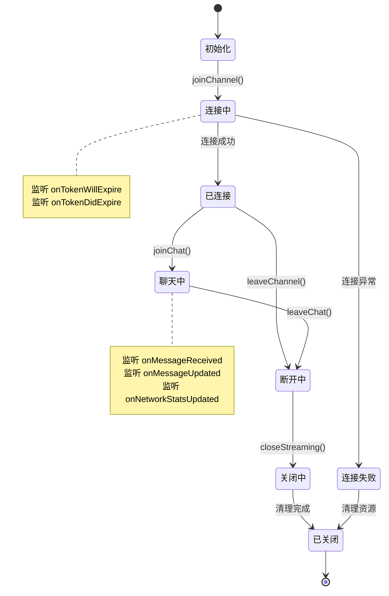

#### 资源清理策略

```javascript
// ✅ 推荐：完整的资源清理流程
async function cleanup() {
  try {
    // 1. 关闭所有连接
    await sdk.closeStreaming();
    
    // 2. 移除所有事件监听器
    removeEventListeners();
    
    // 3. 清空消息缓存
    clearMessageCache();
    
    // 4. 释放媒体资源
    releaseMediaResources();
    
    // 5. 清理定时器
    clearTimers();
    
    console.log("资源清理完成");
  } catch (error) {
    console.error("清理过程中发生错误:", error);
  }
}

function removeEventListeners() {
  const events = [
    'onStreamMessage',
    'onException', 
    'onMessageReceived',
    'onMessageUpdated',
    'onNetworkStatsUpdated',
    'onTokenWillExpire',
    'onTokenDidExpire'
  ];
  
  events.forEach(event => {
    sdk.off(event, handlers[event]);
  });
}
```

**图表来源**
- [jssdk-api.mdx:71-85](file://sdk/jssdk-api.mdx#L71-L85)
- [jssdk-start.mdx:493-517](file://sdk/jssdk-start.mdx#L493-L517)

**章节来源**
- [jssdk-api.mdx:71-85](file://sdk/jssdk-api.mdx#L71-L85)
- [jssdk-start.mdx:493-517](file://sdk/jssdk-start.mdx#L493-L517)

### 4. 性能优化技巧

#### 网络质量监控

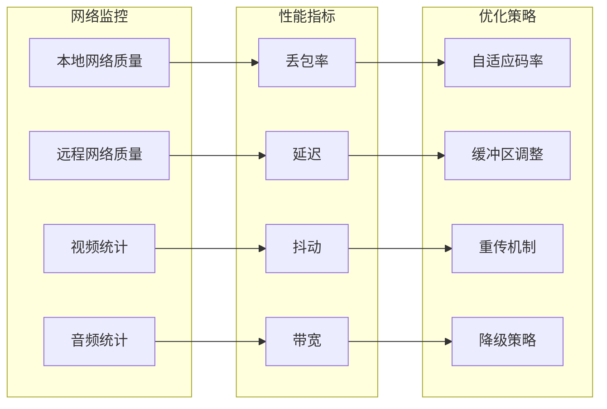

#### 缓冲区管理

```javascript
// ✅ 推荐：智能缓冲区管理
class BufferManager {
  constructor(maxSize = 100, timeout = 5000) {
    this.buffer = [];
    this.maxSize = maxSize;
    this.timeout = timeout;
    this.lastFlush = Date.now();
  }
  
  add(item) {
    this.buffer.push({
      item,
      timestamp: Date.now()
    });
    
    // 自动刷新条件
    if (this.buffer.length >= this.maxSize || 
        Date.now() - this.lastFlush > this.timeout) {
      this.flush();
    }
  }
  
  flush() {
    if (this.buffer.length > 0) {
      const items = this.buffer.splice(0, this.buffer.length);
      this.processBatch(items);
      this.lastFlush = Date.now();
    }
  }
  
  processBatch(items) {
    // 批量处理逻辑
    items.forEach(item => this.processItem(item.item));
  }
}
```

**章节来源**
- [jssdk-api.mdx:372-383](file://sdk/jssdk-api.mdx#L372-L383)

### 5. 错误处理策略

#### 错误分类和处理

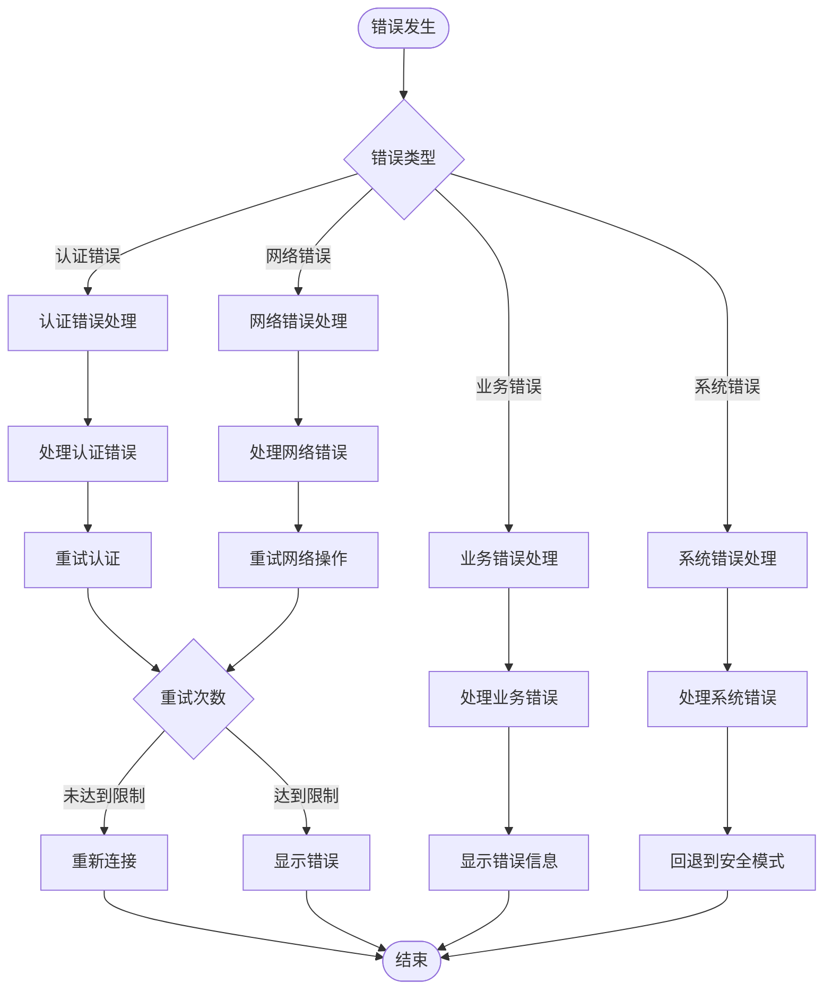

#### 具体错误处理实现

```javascript
// ✅ 推荐：完整的错误处理
agoraSDK.on({
  onException: (error) => {
    console.error("SDK 错误:", error.code, error.msg);
    
    // 处理特定错误代码
    switch (error.code) {
      case 1001:
        // 处理认证错误
        handleAuthError();
        break;
      case 1002:
        // 处理网络错误
        handleNetworkError();
        break;
      case 1003:
        // 处理参数错误
        handleParameterError(error);
        break;
      case 1004:
        // 处理需要验证
        handleVerificationRequired();
        break;
      case 1005:
        // 处理操作过于频繁
        handleRateLimiting();
        break;
      case 1006:
        // 处理配额不足
        handleQuotaError();
        break;
      default:
        // 处理其他错误
        handleGenericError(error);
    }
  }
});

function handleAuthError() {
  // 刷新令牌或重新登录
  refreshAuthToken();
}

function handleNetworkError() {
  // 断线重连机制
  scheduleReconnect();
}

function handleQuotaError() {
  // 显示配额不足提示
  showQuotaWarning();
  // 停止不必要的操作
  pauseOperations();
}
```

**图表来源**
- [jssdk-api.mdx:530-555](file://sdk/jssdk-api.mdx#L530-L555)
- [error-code.mdx:6-59](file://ai-tools-suite/error-code.mdx#L6-L59)

**章节来源**
- [jssdk-api.mdx:530-555](file://sdk/jssdk-api.mdx#L530-L555)
- [error-code.mdx:6-59](file://ai-tools-suite/error-code.mdx#L6-L59)

## 依赖关系分析

### 组件耦合度分析

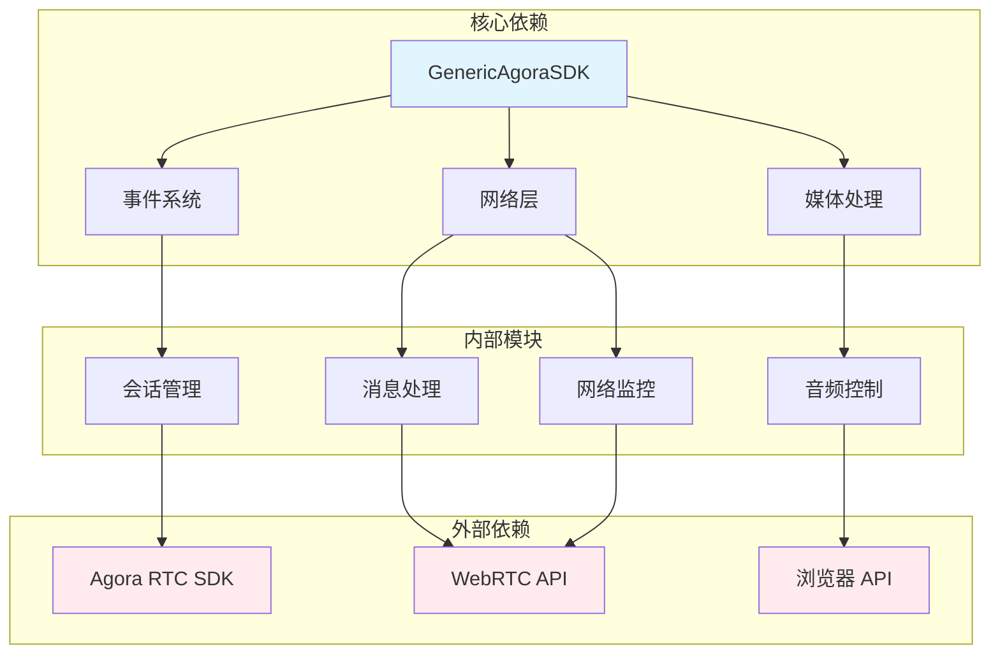

**图表来源**
- [jssdk-api.mdx:1-585](file://sdk/jssdk-api.mdx#L1-L585)
- [jssdk-start.mdx:1-590](file://sdk/jssdk-start.mdx#L1-L590)

### 循环依赖检测

该 SDK 设计避免了循环依赖：
- 核心类只依赖于事件系统和网络层
- 事件系统不依赖具体实现
- 网络层独立于业务逻辑
- 外部依赖通过接口抽象

**章节来源**
- [jssdk-api.mdx:1-585](file://sdk/jssdk-api.mdx#L1-L585)
- [jssdk-start.mdx:1-590](file://sdk/jssdk-start.mdx#L1-L590)

## 性能考虑

### 1. 内存使用优化

#### 对象池模式

```javascript
// ✅ 推荐：对象池减少垃圾回收压力
class ObjectPool {
  constructor(createFn, resetFn, initialSize = 10) {
    this.createFn = createFn;
    this.resetFn = resetFn;
    this.pool = [];
    this.inUse = new Set();
    
    // 预分配初始对象
    for (let i = 0; i < initialSize; i++) {
      this.pool.push(createFn());
    }
  }
  
  acquire() {
    let obj = this.pool.pop();
    if (!obj) {
      obj = this.createFn();
    }
    this.inUse.add(obj);
    return obj;
  }
  
  release(obj) {
    if (this.inUse.has(obj)) {
      this.resetFn(obj);
      this.inUse.delete(obj);
      this.pool.push(obj);
    }
  }
  
  getInUseCount() {
    return this.inUse.size;
  }
}
```

#### 内存泄漏防护

```javascript
// ✅ 推荐：弱引用防止内存泄漏
class WeakRefManager {
  constructor() {
    this.refs = new Map();
  }
  
  add(key, obj) {
    this.refs.set(key, new WeakRef(obj));
  }
  
  get(key) {
    const ref = this.refs.get(key);
    if (ref) {
      const obj = ref.deref();
      if (obj) {
        return obj;
      } else {
        // 对象已被垃圾回收
        this.refs.delete(key);
        return null;
      }
    }
    return null;
  }
  
  cleanup() {
    for (const [key, ref] of this.refs.entries()) {
      if (!ref.deref()) {
        this.refs.delete(key);
      }
    }
  }
}
```

### 2. 网络性能优化

#### 连接池管理

```javascript
// ✅ 推荐：连接池复用
class ConnectionPool {
  constructor(maxConnections = 5) {
    this.maxConnections = maxConnections;
    this.connections = [];
    this.inUse = new Set();
  }
  
  getConnection() {
    // 查找可用连接
    let conn = this.connections.find(c => !this.inUse.has(c));
    
    if (!conn && this.connections.length < this.maxConnections) {
      // 创建新连接
      conn = this.createConnection();
      this.connections.push(conn);
    }
    
    if (conn) {
      this.inUse.add(conn);
      return conn;
    }
    
    throw new Error("无法获取连接");
  }
  
  releaseConnection(conn) {
    this.inUse.delete(conn);
  }
  
  async closeAll() {
    for (const conn of this.connections) {
      await conn.close();
    }
    this.connections = [];
    this.inUse.clear();
  }
}
```

### 3. 响应时间优化

#### 异步操作优化

```javascript
// ✅ 推荐：批量异步操作
class BatchProcessor {
  constructor(batchSize = 10, delay = 100) {
    this.batchSize = batchSize;
    this.delay = delay;
    this.queue = [];
    this.processing = false;
  }
  
  async enqueue(operation) {
    this.queue.push(operation);
    
    if (!this.processing) {
      this.processing = true;
      await this.processBatch();
      this.processing = false;
    }
  }
  
  async processBatch() {
    while (this.queue.length > 0) {
      const batch = this.queue.splice(0, this.batchSize);
      await Promise.all(batch.map(op => op()));
      await this.delayPromise(this.delay);
    }
  }
  
  delayPromise(ms) {
    return new Promise(resolve => setTimeout(resolve, ms));
  }
}
```

## 故障排除指南

### 1. 常见问题诊断

#### 会话创建失败

**症状：** `Session creation failed`

**可能原因：**
- API 密钥无效
- 用户配额不足
- 服务器暂时不可用

**解决步骤：**
1. 验证 API 密钥有效性
2. 检查账户余额和配额
3. 查看服务器状态页面
4. 实现指数退避重试

#### 连接超时

**症状：** `连接超时` 或 `无法建立 RTC 连接`

**可能原因：**
- 网络防火墙阻拦
- 浏览器权限问题
- 代理服务器配置错误

**解决步骤：**
1. 检查网络连接和防火墙设置
2. 确认浏览器具有摄像头和麦克风权限
3. 验证代理服务器配置
4. 尝试不同的网络环境

#### 音频质量问题

**症状：** 音频断断续续或有杂音

**可能原因：**
- 网络带宽不足
- 麦克风增益设置过高
- 音频编解码器不兼容

**解决步骤：**
1. 监控网络质量指标
2. 调整麦克风增益设置
3. 更换音频编解码器
4. 降低音频采样率

### 2. 调试技巧

#### 日志记录最佳实践

```javascript
// ✅ 推荐：结构化日志记录
class Logger {
  constructor(level = 'info') {
    this.level = level;
    this.levels = {
      debug: 0,
      info: 1,
      warn: 2,
      error: 3
    };
  }
  
  log(level, message, context = {}) {
    if (this.levels[level] >= this.levels[this.level]) {
      const timestamp = new Date().toISOString();
      const logEntry = {
        timestamp,
        level,
        message,
        context: {
          ...context,
          userAgent: navigator.userAgent,
          timestamp: Date.now()
        }
      };
      
      console.log(JSON.stringify(logEntry));
    }
  }
  
  debug(message, context = {}) {
    this.log('debug', message, context);
  }
  
  info(message, context = {}) {
    this.log('info', message, context);
  }
  
  warn(message, context = {}) {
    this.log('warn', message, context);
  }
  
  error(message, context = {}) {
    this.log('error', message, context);
  }
}

// 使用示例
const logger = new Logger('debug');

logger.info('用户开始会话', {
  userId: 'user_123',
  sessionId: 'session_456'
});
```

#### 性能监控

```javascript
// ✅ 推荐：性能指标收集
class PerformanceMonitor {
  constructor() {
    this.metrics = new Map();
  }
  
  startTimer(name) {
    this.metrics.set(name, {
      startTime: performance.now(),
      endTime: null,
      duration: null
    });
  }
  
  endTimer(name) {
    const metric = this.metrics.get(name);
    if (metric) {
      metric.endTime = performance.now();
      metric.duration = metric.endTime - metric.startTime;
      return metric.duration;
    }
    return null;
  }
  
  getMetrics() {
    return Object.fromEntries(this.metrics);
  }
  
  logMetrics() {
    const metrics = this.getMetrics();
    console.log('性能指标:', JSON.stringify(metrics, null, 2));
  }
}

// 使用示例
const monitor = new PerformanceMonitor();

monitor.startTimer('joinChannel');
await sdk.joinChannel(credentials);
monitor.endTimer('joinChannel');

monitor.startTimer('sendMessage');
await sdk.sendMessage('Hello');
monitor.endTimer('sendMessage');

monitor.logMetrics();
```

### 3. 生产环境部署

#### 安全配置

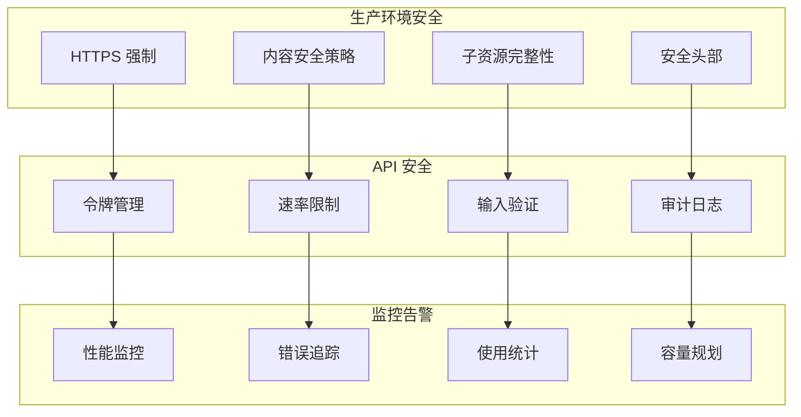

#### 配置管理

```javascript
// ✅ 推荐：环境变量配置
const config = {
  development: {
    apiUrl: 'https://dev-api.akool.com',
    debug: true,
    logLevel: 'debug'
  },
  staging: {
    apiUrl: 'https://staging-api.akool.com',
    debug: true,
    logLevel: 'info'
  },
  production: {
    apiUrl: 'https://openapi.akool.com',
    debug: false,
    logLevel: 'error'
  }
};

// 动态配置加载
function loadConfig(environment) {
  const baseConfig = config[environment] || config.development;
  
  return {
    ...baseConfig,
    apiKey: process.env.AKOOL_API_KEY,
    authToken: process.env.AUTH_TOKEN
  };
}

const appConfig = loadConfig(process.env.NODE_ENV);
```

**章节来源**
- [FAQ.mdx:1-29](file://ai-tools-suite/FAQ.mdx#L1-L29)
- [error-code.mdx:6-59](file://ai-tools-suite/error-code.mdx#L6-L59)
- [jssdk-best-practice.mdx:30-112](file://sdk/jssdk-best-practice.mdx#L30-L112)

## 结论

基于对 Akool Streaming Avatar SDK 的深入分析，本文档总结了 JavaScript SDK 最佳实践的关键要点：

### 安全性优先
- 始终在后端处理敏感凭证
- 实施最小权限原则
- 使用短期令牌和定期轮换
- 实现完善的错误处理和日志记录

### 性能优化
- 采用对象池和连接池减少资源消耗
- 实现智能缓冲区管理和批处理
- 监控网络质量和性能指标
- 优化媒体处理和传输效率

### 可靠性保障
- 建立完整的生命周期管理
- 实现优雅的错误恢复机制
- 提供详细的调试和监控工具
- 确保资源正确清理和释放

### 开发体验
- 提供完整的 TypeScript 支持
- 实现清晰的 API 设计和文档
- 支持多种部署方式和集成场景
- 提供丰富的示例和最佳实践

这些最佳实践不仅适用于 Akool Streaming Avatar SDK，也为其他 JavaScript SDK 的开发和集成提供了宝贵的参考价值。

## 附录

### 1. 快速参考清单

#### 开发阶段
- ✅ 完成 TypeScript 类型定义
- ✅ 实现基本功能测试
- ✅ 配置开发环境
- ✅ 设置版本控制

#### 测试阶段
- ✅ 单元测试覆盖
- ✅ 集成测试验证
- ✅ 性能基准测试
- ✅ 安全漏洞扫描

#### 部署阶段
- ✅ 生产环境配置
- ✅ 监控和告警设置
- ✅ 备份和恢复策略
- ✅ 文档更新

#### 维护阶段
- ✅ 定期安全审计
- ✅ 性能持续优化
- ✅ 用户反馈处理
- ✅ 技术债务管理

### 2. 相关资源链接

- [Akool Streaming Avatar SDK 官方文档](https://www.npmjs.com/package/akool-streaming-avatar-sdk)
- [Agora RTC SDK 文档](https://docs.agora.io/)
- [WebRTC 规范](https://webrtc.org/)
- [TypeScript 官方文档](https://www.typescriptlang.org/)
- [MDN Web API 参考](https://developer.mozilla.org/)