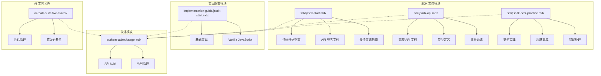
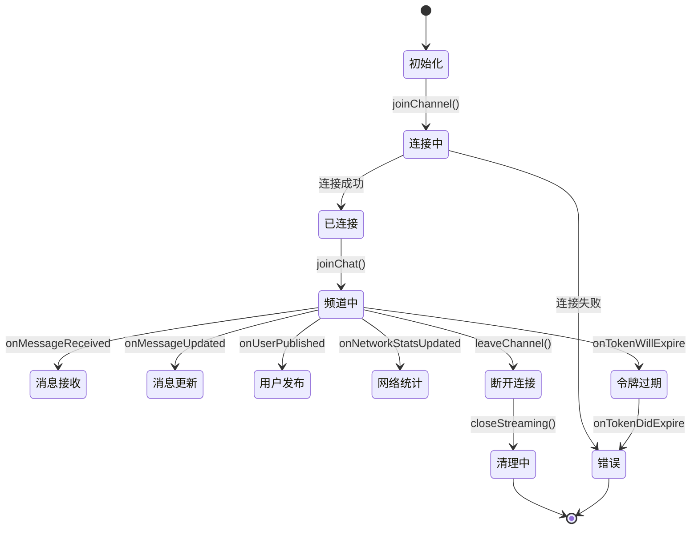
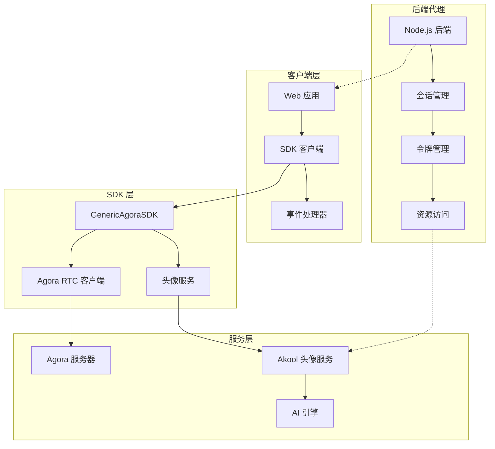
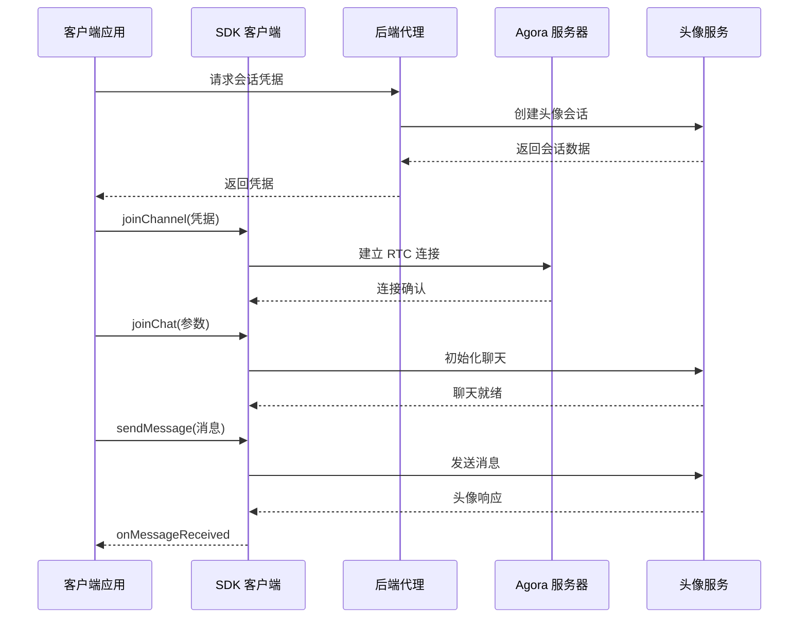
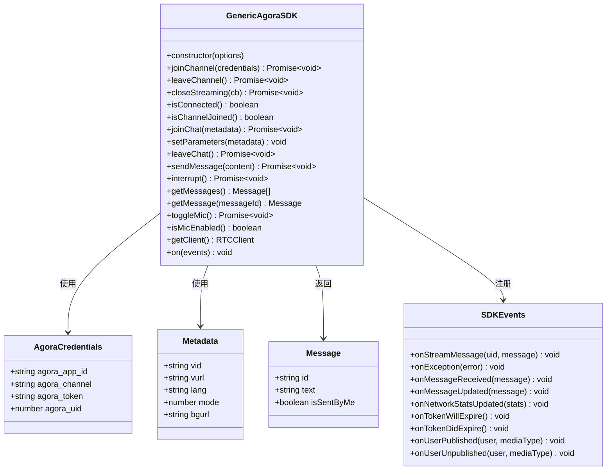
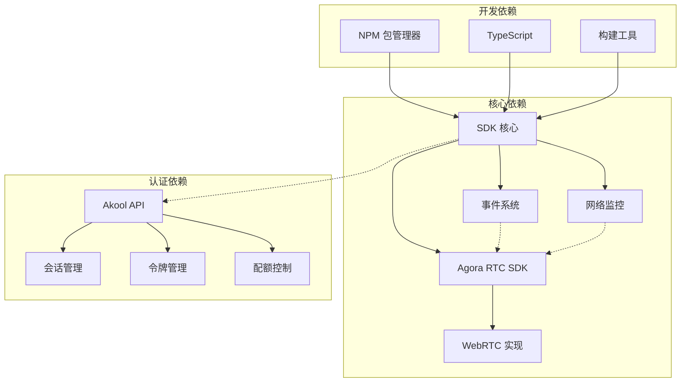
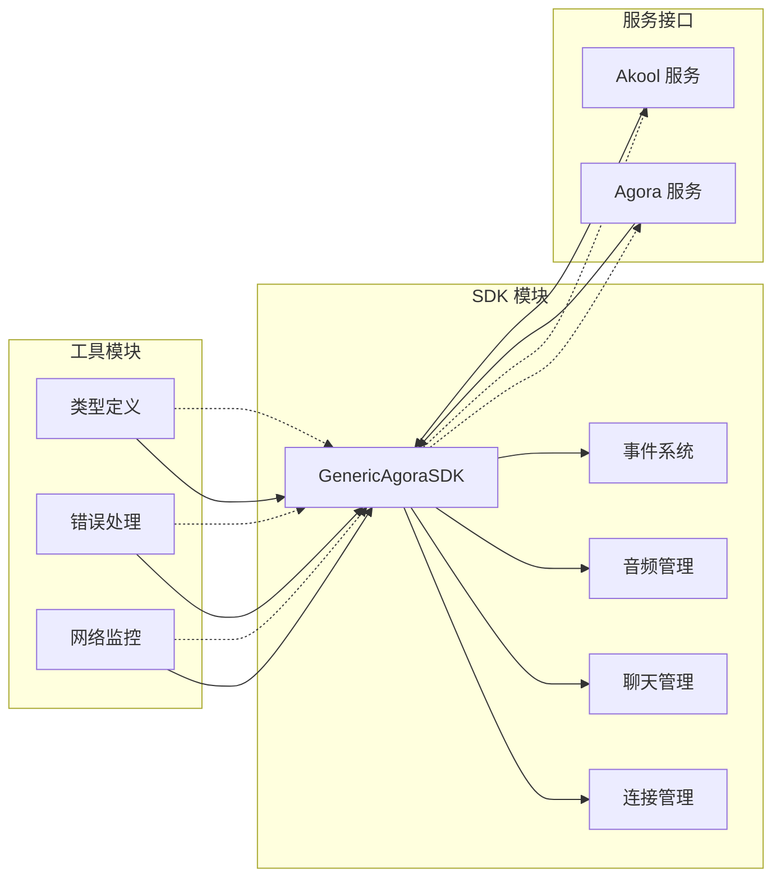
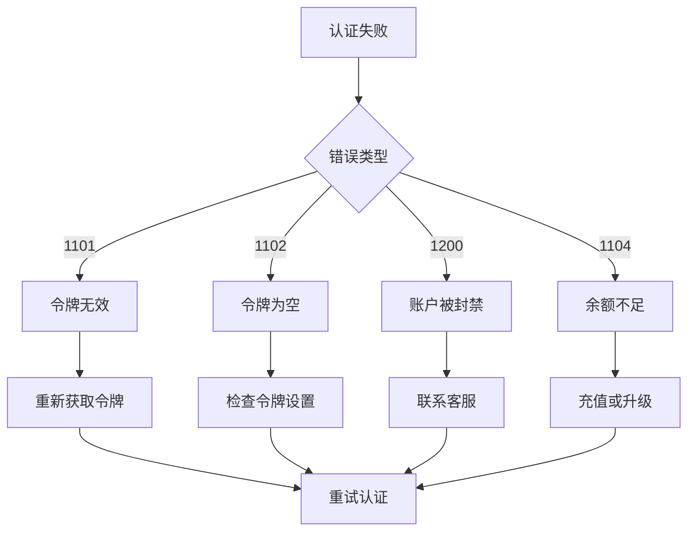

# SDK 集成

<cite>
**本文档中引用的文件**
- [sdk/jssdk-start.mdx](file://sdk/jssdk-start.mdx)
- [sdk/jssdk-api.mdx](file://sdk/jssdk-api.mdx)
- [sdk/jssdk-best-practice.mdx](file://sdk/jssdk-best-practice.mdx)
- [implementation-guide/jssdk-start.mdx](file://implementation-guide/jssdk-start.mdx)
- [authentication/usage.mdx](file://authentication/usage.mdx)
- [ai-tools-suite/live-avatar/create-session.mdx](file://ai-tools-suite/live-avatar/create-session.mdx)
- [ai-tools-suite/error-code.mdx](file://ai-tools-suite/error-code.mdx)
- [README.md](file://README.md)
</cite>

## 目录
1. [简介](#简介)
2. [项目结构](#项目结构)
3. [核心组件](#核心组件)
4. [架构概览](#架构概览)
5. [详细组件分析](#详细组件分析)
6. [依赖关系分析](#依赖关系分析)
7. [性能考虑](#性能考虑)
8. [故障排除指南](#故障排除指南)
9. [结论](#结论)
10. [附录](#附录)

## 简介

Akool Streaming Avatar SDK 是一个功能强大的 JavaScript SDK，专为在任何 JavaScript 应用程序中集成 Agora RTC 流媒体头像功能而设计。该 SDK 提供了对头像交互的编程控制，支持实时视频流传输能力。

### 主要特性

- **易于使用的 API**：用于 Agora RTC 集成的简单 API
- **TypeScript 支持**：完整的类型定义
- **多种包格式**：支持 ESM、CommonJS 和 IIFE 格式
- **CDN 分发**：通过 unpkg 和 jsDelivr 提供 CDN
- **基于事件的架构**：处理消息和状态变化
- **网络质量监控**：统计和质量监控
- **麦克风控制**：语音交互控制
- **令牌过期处理**：自动令牌管理
- **错误处理和日志记录**：完善的错误处理机制

### 技术栈

- **核心依赖**：Agora Real-Time Communication (RTC) SDK
- **运行环境**：现代浏览器（WebRTC 支持）
- **开发语言**：JavaScript/TypeScript
- **包管理**：NPM 包管理器

**章节来源**
- [sdk/jssdk-start.mdx:6-24](file://sdk/jssdk-start.mdx#L6-L24)

## 项目结构

该项目采用文档驱动的组织方式，主要包含以下核心模块：



**图表来源**
- [sdk/jssdk-start.mdx:1-590](file://sdk/jssdk-start.mdx#L1-L590)
- [sdk/jssdk-api.mdx:1-585](file://sdk/jssdk-api.mdx#L1-L585)
- [sdk/jssdk-best-practice.mdx:1-203](file://sdk/jssdk-best-practice.mdx#L1-L203)

### 文件组织结构

项目采用按功能分组的文件组织方式：

- **sdk/**：SDK 相关文档和指南
- **implementation-guide/**：实现指南和示例
- **ai-tools-suite/**：AI 工具套件相关文档
- **authentication/**：认证和授权文档
- **images/**：文档中使用的图片资源

**章节来源**
- [README.md:1-33](file://README.md#L1-L33)

## 核心组件

### GenericAgoraSDK 类

这是 SDK 的核心类，提供了所有主要功能的入口点。

#### 构造函数

```javascript
new GenericAgoraSDK(options?: { mode?: string; codec?: SDK_CODEC })
```

**参数说明：**
- `options.mode`：SDK 模式，默认为 "rtc"
- `options.codec`：视频编解码器，如 "vp8"、"h264"

#### 连接管理方法

| 方法 | 描述 | 返回值 |
|------|------|--------|
| `joinChannel(credentials)` | 加入 Agora RTC 频道 | `Promise<void>` |
| `leaveChannel()` | 离开当前频道 | `Promise<void>` |
| `closeStreaming(cb?)` | 关闭所有连接并清理 | `Promise<void>` |
| `isConnected()` | 检查连接状态 | `boolean` |
| `isChannelJoined()` | 检查频道加入状态 | `boolean` |

#### 聊天管理方法

| 方法 | 描述 | 返回值 |
|------|------|--------|
| `joinChat(metadata)` | 初始化头像聊天会话 | `Promise<void>` |
| `setParameters(metadata)` | 设置头像参数 | `void` |
| `leaveChat()` | 离开会话但保持频道连接 | `Promise<void>` |
| `sendMessage(content)` | 发送文本消息到头像 | `Promise<void>` |
| `interrupt()` | 中断当前头像响应 | `Promise<void>` |
| `getMessages()` | 获取当前会话的所有聊天消息 | `Message[]` |
| `getMessage(messageId)` | 根据 ID 获取特定消息 | `Message \| undefined` |

#### 音频管理方法

| 方法 | 描述 | 返回值 |
|------|------|--------|
| `toggleMic()` | 切换麦克风开关 | `Promise<void>` |
| `isMicEnabled()` | 检查麦克风状态 | `boolean` |

#### 客户端访问

| 方法 | 描述 | 返回值 |
|------|------|--------|
| `getClient()` | 获取底层 Agora RTC 客户端实例 | `RTCClient` |

**章节来源**
- [sdk/jssdk-api.mdx:17-585](file://sdk/jssdk-api.mdx#L17-L585)

### 事件系统

SDK 使用基于事件的架构来处理各种状态变化和消息：



**图表来源**
- [sdk/jssdk-api.mdx:279-406](file://sdk/jssdk-api.mdx#L279-L406)

**章节来源**
- [sdk/jssdk-api.mdx:279-406](file://sdk/jssdk-api.mdx#L279-L406)

## 架构概览

### 整体架构设计



**图表来源**
- [sdk/jssdk-start.mdx:8-24](file://sdk/jssdk-start.mdx#L8-L24)
- [sdk/jssdk-best-practice.mdx:30-57](file://sdk/jssdk-best-practice.mdx#L30-L57)

### 数据流架构



**图表来源**
- [sdk/jssdk-start.mdx:123-144](file://sdk/jssdk-start.mdx#L123-L144)
- [sdk/jssdk-api.mdx:42-85](file://sdk/jssdk-api.mdx#L42-L85)

**章节来源**
- [sdk/jssdk-start.mdx:8-24](file://sdk/jssdk-start.mdx#L8-L24)

## 详细组件分析

### 安装和配置

#### NPM 安装

```bash
npm install akool-streaming-avatar-sdk
```

#### CDN 引入

```html
<script src="https://unpkg.com/akool-streaming-avatar-sdk"></script>
<script src="https://cdn.jsdelivr.net/npm/akool-streaming-avatar-sdk"></script>
```

#### 基础配置

```javascript
import { GenericAgoraSDK } from 'akool-streaming-avatar-sdk';

const agoraSDK = new GenericAgoraSDK({ 
    mode: "rtc", 
    codec: "vp8" 
});
```

**章节来源**
- [sdk/jssdk-start.mdx:48-64](file://sdk/jssdk-start.mdx#L48-L64)
- [sdk/jssdk-start.mdx:95-100](file://sdk/jssdk-start.mdx#L95-L100)

### 基本使用流程

#### 1. HTML 设置

```html
<div id="remote-video" style="width: 640px; height: 480px;"></div>
<button id="join-btn">加入频道</button>
<button id="send-msg-btn">发送消息</button>
<input type="text" id="message-input" placeholder="输入消息..." />
```

#### 2. 事件处理注册

```javascript
agoraSDK.on({
    onStreamMessage: (uid, message) => {
        console.log("收到消息:", message);
    },
    onException: (error) => {
        console.error("异常:", error);
    },
    onMessageReceived: (message) => {
        console.log("新消息:", message);
    },
    onUserPublished: async (user, mediaType) => {
        if (mediaType === 'video') {
            const remoteTrack = await agoraSDK.getClient().subscribe(user, mediaType);
            remoteTrack?.play('remote-video');
        }
    }
});
```

#### 3. 会话初始化

```javascript
// 从后端获取会话信息
const akoolSession = await fetch('your-backend-url');
const { data: { credentials, id } } = await akoolSession.json();

// 加入频道
await agoraSDK.joinChannel({
    agora_app_id: credentials.agora_app_id,
    agora_channel: credentials.agora_channel,
    agora_token: credentials.agora_token,
    agora_uid: credentials.agora_uid
});

// 初始化聊天
await agoraSDK.joinChat({
    vid: "voice-id",
    lang: "en",
    mode: 2
});
```

**章节来源**
- [sdk/jssdk-start.mdx:68-144](file://sdk/jssdk-start.mdx#L68-L144)

### 完整工作示例

#### 后端实现 (Node.js)

```javascript
const API_KEY = process.env.AKOOL_API_KEY || "";
const AVATAR_ID = process.env.AVATAR_ID || "dvp_Tristan_cloth2_1080P";

function akoolFetch(urlPath, method, body) {
    const url = new URL(urlPath, AKOOL_BASE);
    const headers = {
        "x-api-key": API_KEY,
        "Content-Type": "application/json",
    };
    // ... 实现细节
}

// 创建会话端点
if (req.method === "POST" && req.url === "/session/create") {
    try {
        const result = await akoolFetch(
            "/api/open/v4/liveAvatar/session/create",
            "POST",
            { avatar_id: AVATAR_ID, duration: 600 }
        );
        sendJson(res, 200, result);
    } catch (err) {
        sendJson(res, 500, { error: err.message });
    }
}
```

#### 前端实现

```javascript
async function startSession() {
    // 1. 通过后端代理创建会话
    var res = await fetch(BACKEND + "/session/create", { method: "POST" });
    var body = await res.json();
    sessionId = body.data._id;
    var creds = body.data.credentials;

    // 2. 初始化 SDK
    sdk = new AkoolStreamingAvatar.GenericAgoraSDK({ mode: "rtc", codec: "vp8" });

    // 3. 注册事件处理器
    sdk.on({
        onUserPublished: async function (user, mediaType) {
            var track = await sdk.getClient().subscribe(user, mediaType);
            if (mediaType === "video") track?.play("remote-video");
        }
    });

    // 4. 加入 Agora 频道
    await sdk.joinChannel({
        agora_app_id: creds.agora_app_id,
        agora_channel: creds.agora_channel,
        agora_token: creds.agora_token,
        agora_uid: creds.agora_uid
    });

    // 5. 开始头像聊天
    await sdk.joinChat({ lang: "en", mode: 2 });
}
```

**章节来源**
- [sdk/jssdk-start.mdx:210-548](file://sdk/jssdk-start.mdx#L210-L548)

### 类关系图



**图表来源**
- [sdk/jssdk-api.mdx:19-406](file://sdk/jssdk-api.mdx#L19-L406)

**章节来源**
- [sdk/jssdk-api.mdx:19-406](file://sdk/jssdk-api.mdx#L19-L406)

## 依赖关系分析

### 外部依赖



**图表来源**
- [sdk/jssdk-start.mdx:26-31](file://sdk/jssdk-start.mdx#L26-L31)
- [authentication/usage.mdx:10-48](file://authentication/usage.mdx#L10-L48)

### 内部模块依赖



**图表来源**
- [sdk/jssdk-api.mdx:17-276](file://sdk/jssdk-api.mdx#L17-L276)

**章节来源**
- [sdk/jssdk-start.mdx:26-31](file://sdk/jssdk-start.mdx#L26-L31)

## 性能考虑

### 最佳实践建议

#### 1. 连接优化

- **合理的重连策略**：实现指数退避算法处理连接失败
- **连接池管理**：复用已建立的连接减少延迟
- **带宽自适应**：根据网络状况调整视频质量

#### 2. 内存管理

- **及时清理事件监听器**：避免内存泄漏
- **资源释放**：正确关闭会话和连接
- **缓存策略**：合理使用本地缓存减少重复请求

#### 3. 网络优化

- **CDN 使用**：通过 CDN 分发 SDK 文件
- **压缩传输**：启用 Gzip 压缩
- **连接复用**：复用 HTTP 连接

#### 4. 用户体验优化

- **加载指示器**：提供视觉反馈
- **错误恢复**：优雅处理网络中断
- **离线支持**：实现基本的离线功能

### 性能监控指标

| 指标类型 | 监控内容 | 建议阈值 |
|----------|----------|----------|
| 连接延迟 | 频道加入时间 | < 3 秒 |
| 视频质量 | FPS 和分辨率 | > 30 FPS, 720p+ |
| 音频质量 | 延迟和丢包率 | < 100ms, < 1% |
| 内存使用 | SDK 内存占用 | < 50MB |
| CPU 使用 | 处理器负载 | < 80% |

**章节来源**
- [sdk/jssdk-best-practice.mdx:30-112](file://sdk/jssdk-best-practice.mdx#L30-L112)

## 故障排除指南

### 常见错误和解决方案

#### 1. 认证相关错误



**图表来源**
- [ai-tools-suite/error-code.mdx:26-36](file://ai-tools-suite/error-code.mdx#L26-L36)

#### 2. 网络连接问题

| 错误代码 | 描述 | 解决方案 |
|----------|------|----------|
| 1214-1216 | 会话处理中/忙/不存在 | 检查会话状态, 重试操作 |
| 1217-1218 | 回调错误/处理错误 | 检查回调函数, 重试请求 |
| 1219-1223 | 会话已关闭/资源已存在 | 重新创建会话, 清理资源 |

#### 3. 令牌过期处理

```javascript
agoraSDK.on({
    onTokenWillExpire: () => {
        // 刷新令牌
        refreshToken();
    },
    onTokenDidExpire: () => {
        // 重新建立连接
        reconnect();
    }
});
```

#### 4. 音频/视频问题

- **麦克风权限**：检查浏览器权限设置
- **摄像头冲突**：确保只有一个应用使用摄像头
- **网络不稳定**：降低视频质量或切换到音频模式

**章节来源**
- [ai-tools-suite/error-code.mdx:6-59](file://ai-tools-suite/error-code.mdx#L6-L59)
- [sdk/jssdk-api.mdx:530-555](file://sdk/jssdk-api.mdx#L530-L555)

### 调试技巧

#### 1. 日志记录

```javascript
agoraSDK.on({
    onException: (error) => {
        console.error("SDK 错误:", {
            code: error.code,
            message: error.msg,
            timestamp: Date.now()
        });
    }
});
```

#### 2. 状态监控

```javascript
setInterval(() => {
    console.log("连接状态:", {
        isConnected: agoraSDK.isConnected(),
        isChannelJoined: agoraSDK.isChannelJoined(),
        isMicEnabled: agoraSDK.isMicEnabled()
    });
}, 5000);
```

#### 3. 性能分析

- 使用浏览器开发者工具的性能面板
- 监控内存使用情况
- 分析网络请求时间

**章节来源**
- [sdk/jssdk-api.mdx:530-555](file://sdk/jssdk-api.mdx#L530-L555)

## 结论

Akool Streaming Avatar SDK 提供了一个强大而灵活的解决方案，用于在 JavaScript 应用中集成实时头像功能。通过其简洁的 API 设计、完善的事件系统和丰富的功能特性，开发者可以快速构建高质量的实时交互应用。

### 主要优势

1. **易用性**：简单的 API 设计和清晰的文档
2. **安全性**：通过后端代理处理敏感操作
3. **可扩展性**：支持多种部署方式和集成场景
4. **可靠性**：完善的错误处理和重连机制
5. **性能**：优化的网络传输和资源管理

### 未来发展方向

- **更多编解码器支持**：扩展视频编码选项
- **增强的 AI 功能**：集成更先进的自然语言处理
- **移动端优化**：针对移动设备的专门优化
- **多平台支持**：扩展到更多前端框架和平台

通过遵循本文档中的最佳实践和安全指南，开发者可以确保 SDK 的稳定集成和高效使用。

## 附录

### 快速参考表

#### 安装命令

```bash
# NPM 安装
npm install akool-streaming-avatar-sdk

# CDN 引入
<script src="https://unpkg.com/akool-streaming-avatar-sdk"></script>
```

#### 基本使用步骤

1. **安装 SDK**：通过 NPM 或 CDN 安装
2. **创建实例**：初始化 GenericAgoraSDK
3. **注册事件**：设置事件处理器
4. **获取凭据**：从后端获取会话凭据
5. **建立连接**：加入 Agora 频道
6. **初始化聊天**：设置头像参数
7. **发送消息**：与头像进行交互

#### 支持的浏览器

- Chrome 56+
- Firefox 44+
- Safari 11+
- Edge 79+
- Opera 43+

#### 版本信息

- **当前版本**：1.0.6
- **许可证**：ISC
- **包管理**：NPM
- **GitHub**：akool-rinku/akool-streaming-avatar-sdk

**章节来源**
- [sdk/jssdk-start.mdx:26-46](file://sdk/jssdk-start.mdx#L26-L46)
- [sdk/jssdk-start.mdx:50-64](file://sdk/jssdk-start.mdx#L50-L64)