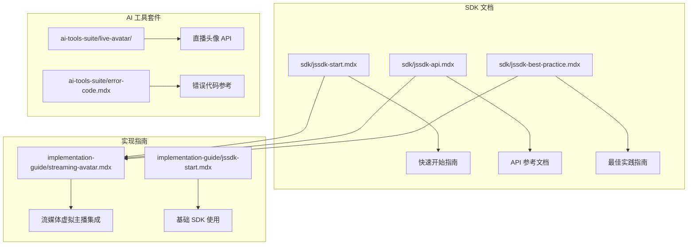
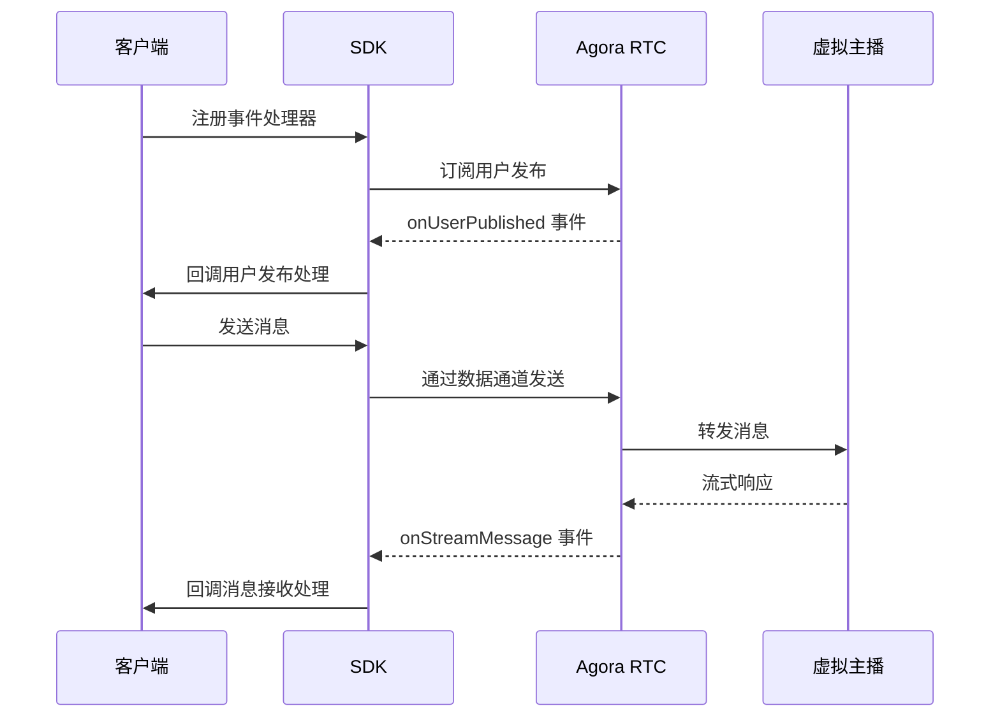
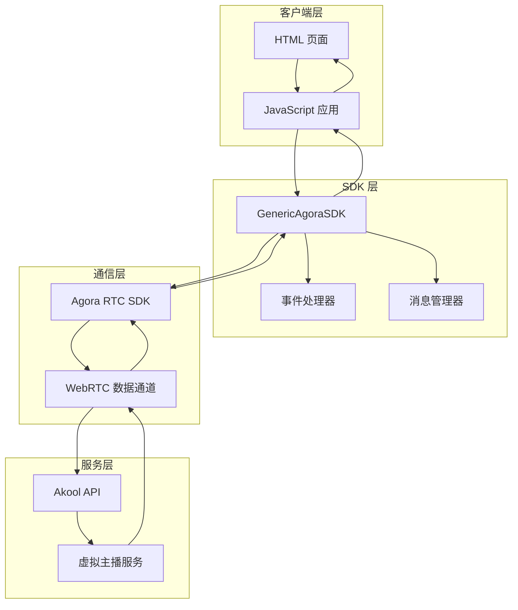
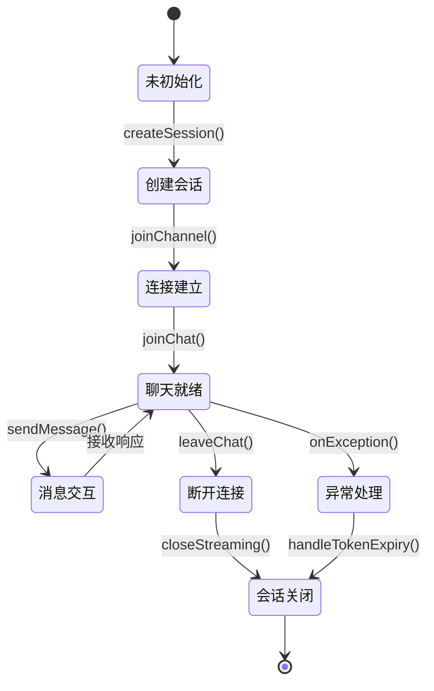
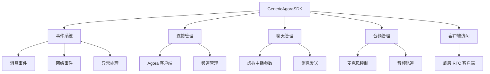

# JavaScript SDK 集成

<cite>
**本文档引用的文件**
- [jssdk-start.mdx](file://sdk/jssdk-start.mdx)
- [jssdk-api.mdx](file://sdk/jssdk-api.mdx)
- [jssdk-best-practice.mdx](file://sdk/jssdk-best-practice.mdx)
- [streaming-avatar.mdx](file://implementation-guide/streaming-avatar.mdx)
- [jssdk-start.mdx](file://implementation-guide/jssdk-start.mdx)
- [error-code.mdx](file://ai-tools-suite/error-code.mdx)
- [create-session.mdx](file://ai-tools-suite/live-avatar/create-session.mdx)
- [close-session.mdx](file://ai-tools-suite/live-avatar/close-session.mdx)
</cite>

## 目录
1. [简介](#简介)
2. [项目结构](#项目结构)
3. [核心组件](#核心组件)
4. [架构概览](#架构概览)
5. [详细组件分析](#详细组件分析)
6. [依赖关系分析](#依赖关系分析)
7. [性能考虑](#性能考虑)
8. [故障排除指南](#故障排除指南)
9. [结论](#结论)
10. [附录](#附录)

## 简介

Akool JavaScript SDK 是一个专为流媒体虚拟主播功能设计的通用 JavaScript SDK。该 SDK 支持 TypeScript，提供多种打包格式（ESM、CommonJS、IIFE），并通过 CDN 分发。它基于 Agora 实时通信（RTC）SDK 提供可靠的低延迟流媒体传输，并结合 Akool 的虚拟主播服务生成响应式的虚拟主播行为。

该 SDK 的主要特性包括：
- 易于使用的 API 进行 Agora RTC 集成
- 完整的 TypeScript 类型定义
- 多种打包格式支持
- 基于事件架构的消息处理和状态变更
- 消息历史记录和更新管理
- 网络质量监控和统计
- 麦克风控制用于语音交互
- 大文本的分块消息发送
- 自动速率限制
- 令牌过期处理
- 错误处理和日志记录

## 项目结构

该项目采用文档驱动的组织方式，主要分为以下几个部分：



**图表来源**
- [jssdk-start.mdx:1-590](file://sdk/jssdk-start.mdx#L1-L590)
- [streaming-avatar.mdx:1-1581](file://implementation-guide/streaming-avatar.mdx#L1-L1581)

**章节来源**
- [jssdk-start.mdx:1-590](file://sdk/jssdk-start.mdx#L1-L590)
- [streaming-avatar.mdx:1-1581](file://implementation-guide/streaming-avatar.mdx#L1-L1581)

## 核心组件

### GenericAgoraSDK 类

GenericAgoraSDK 是 SDK 的核心类，提供了以下主要功能：

#### 构造函数
```javascript
new GenericAgoraSDK(options?: { mode?: string; codec?: SDK_CODEC })
```

参数：
- `options.mode`：SDK 模式，默认为 "rtc"
- `options.codec`：视频编解码器（如 "vp8"、"h264"）

#### 连接管理
- `joinChannel(credentials: AgoraCredentials)`: 加入 Agora RTC 频道
- `leaveChannel()`: 离开当前频道
- `closeStreaming(cb?: () => void)`: 关闭所有连接并执行清理
- `isConnected()`: 检查是否已连接到 Agora 服务
- `isChannelJoined()`: 检查是否已加入频道

#### 聊天管理
- `joinChat(metadata: Metadata)`: 初始化虚拟主播聊天会话
- `setParameters(metadata: Metadata)`: 设置虚拟主播参数
- `leaveChat()`: 离开聊天会话但保持频道连接
- `sendMessage(content: string)`: 发送文本消息给虚拟主播
- `interrupt()`: 中断当前虚拟主播响应
- `getMessages()`: 获取当前会话的所有聊天消息
- `getMessage(messageId: string)`: 根据 ID 获取特定消息

#### 音频管理
- `toggleMic()`: 切换麦克风开关
- `isMicEnabled()`: 检查麦克风状态

#### 客户端访问
- `getClient()`: 返回底层 Agora RTC 客户端实例

#### 事件处理
- `on(events: SDKEvents)`: 注册各种 SDK 事件的处理器

**章节来源**
- [jssdk-api.mdx:17-526](file://sdk/jssdk-api.mdx#L17-L526)

### 事件系统

SDK 使用基于事件的架构来处理消息和状态变更：



**图表来源**
- [jssdk-api.mdx:279-406](file://sdk/jssdk-api.mdx#L279-L406)

**章节来源**
- [jssdk-api.mdx:279-406](file://sdk/jssdk-api.mdx#L279-L406)

## 架构概览

### 整体架构流程



**图表来源**
- [streaming-avatar.mdx:116-181](file://implementation-guide/streaming-avatar.mdx#L116-L181)

### 会话生命周期管理



**图表来源**
- [streaming-avatar.mdx:1200-1240](file://implementation-guide/streaming-avatar.mdx#L1200-L1240)

**章节来源**
- [streaming-avatar.mdx:116-181](file://implementation-guide/streaming-avatar.mdx#L116-L181)

## 详细组件分析

### SDK 初始化过程

#### 基础初始化步骤

1. **HTML 页面设置**
```html
<!DOCTYPE html>
<html lang="en">
<head>
    <meta charset="UTF-8" />
    <meta name="viewport" content="width=device-width, initial-scale=1.0" />
    <title>Akool Streaming Avatar SDK</title>
</head>
<body>
    <div id="app">
        <h1>Streaming Avatar Demo</h1>
        <div id="remote-video" style="width: 640px; height: 480px;"></div>
        <button id="join-btn">Join Channel</button>
        <button id="send-msg-btn">Send Message</button>
        <input type="text" id="message-input" placeholder="Type your message..." />
    </div>
</body>
</html>
```

2. **SDK 实例创建**
```javascript
import { GenericAgoraSDK } from 'akool-streaming-avatar-sdk';

// 创建 SDK 实例
const agoraSDK = new GenericAgoraSDK({ mode: "rtc", codec: "vp8" });
```

3. **事件处理器注册**
```javascript
agoraSDK.on({
    onStreamMessage: (uid, message) => {
        console.log("Received message from", uid, ":", message);
    },
    onException: (error) => {
        console.error("An exception occurred:", error);
    },
    onMessageReceived: (message) => {
        console.log("New message:", message);
    },
    onUserPublished: async (user, mediaType) => {
        if (mediaType === 'video') {
            const remoteTrack = await agoraSDK.getClient().subscribe(user, mediaType);
            remoteTrack?.play('remote-video');
        } else if (mediaType === 'audio') {
            const remoteTrack = await agoraSDK.getClient().subscribe(user, mediaType);
            remoteTrack?.play();
        }
    }
});
```

#### CDN 方式初始化

```html
<script src="https://unpkg.com/akool-streaming-avatar-sdk"></script>
<script>
    // SDK 作为全局变量可用
    const agoraSDK = new AkoolStreamingAvatar.GenericAgoraSDK({ 
        mode: "rtc", 
        codec: "vp8" 
    });
</script>
```

**章节来源**
- [jssdk-start.mdx:66-182](file://sdk/jssdk-start.mdx#L66-L182)

### 容器配置

#### 视频容器配置

```html
<div id="remote-video" style="width: 640px; height: 480px;"></div>
```

容器要求：
- 必须有唯一的 ID
- 需要设置明确的宽度和高度
- 建议设置背景色以便显示视频
- 可以添加边框圆角等样式

#### 控制器容器配置

```html
<div class="controls">
    <button id="btn-session" class="btn-primary">Start Session</button>
    <button id="btn-mic" disabled>Mic Off</button>
    <button id="btn-interrupt" disabled>Interrupt</button>
</div>
```

控制器要求：
- 按钮需要有明确的 ID 以便 JavaScript 操作
- 使用 CSS 类进行样式控制
- 根据状态动态启用/禁用按钮

**章节来源**
- [jssdk-start.mdx:359-404](file://sdk/jssdk-start.mdx#L359-L404)

### 基本使用方法

#### 基本聊天功能

```javascript
// 获取会话信息
const akoolSession = await fetch('your-backend-url-to-get-session-info');
const { data: { credentials, id } } = await akoolSession.json();

// 加入频道
await agoraSDK.joinChannel({
    agora_app_id: credentials.agora_app_id,
    agora_channel: credentials.agora_channel,
    agora_token: credentials.agora_token,
    agora_uid: credentials.agora_uid
});

// 初始化聊天
await agoraSDK.joinChat({
    vid: "voice-id",
    lang: "en",
    mode: 2 // 1 for repeat mode, 2 for dialog mode
});

// 发送消息
await agoraSDK.sendMessage("Hello, world!");
```

#### 高级功能

```javascript
// 切换麦克风
await agoraSDK.toggleMic();
const micEnabled = agoraSDK.isMicEnabled();

// 中断当前响应
await agoraSDK.interrupt();

// 设置虚拟主播参数
await agoraSDK.setParameters({
    vid: "new-voice-id",
    lang: "es",
    mode: 1
});
```

**章节来源**
- [jssdk-start.mdx:93-144](file://sdk/jssdk-start.mdx#L93-L144)

### 完整工作示例

#### 项目结构

```
sa-demo/
├── server.js    # 后端代理 (Node.js, 无依赖)
├── index.html   # 前端页面
└── main.js      # 前端逻辑
```

#### 后端服务器实现

```javascript
const http = require("http");
const fs = require("fs");
const path = require("path");

const API_KEY = process.env.AKOOL_API_KEY || "";
const AKOOL_BASE = "https://openapi.akool.com";

// 会话创建
if (req.method === "POST" && req.url === "/session/create") {
    try {
        const result = await akoolFetch(
            "/api/open/v4/liveAvatar/session/create",
            "POST",
            { avatar_id: AVATAR_ID, duration: 600 }
        );
        sendJson(res, 200, result);
    } catch (err) {
        sendJson(res, 500, { error: err.message });
    }
}

// 会话关闭
if (req.method === "POST" && req.url === "/session/close") {
    try {
        const raw = await readBody(req);
        const body = JSON.parse(raw);
        const result = await akoolFetch(
            "/api/open/v4/liveAvatar/session/close",
            "POST",
            { id: body.id }
        );
        sendJson(res, 200, result);
    } catch (err) {
        sendJson(res, 500, { error: err.message });
    }
}
```

#### 前端主逻辑

```javascript
(function () {
    var BACKEND = "http://localhost:3100";
    var btnSession = document.getElementById("btn-session");
    var btnMic = document.getElementById("btn-mic");
    var btnInterrupt = document.getElementById("btn-interrupt");
    var btnSend = document.getElementById("btn-send");
    var msgInput = document.getElementById("msg-input");
    var messagesEl = document.getElementById("messages");
    var statusEl = document.getElementById("status");

    var sdk = null;
    var sessionId = null;
    var running = false;

    async function startSession() {
        // 1. 通过后端代理创建会话
        var res = await fetch(BACKEND + "/session/create", { method: "POST" });
        var body = await res.json();
        sessionId = body.data._id;
        var creds = body.data.credentials;

        // 2. 初始化 SDK
        sdk = new AkoolStreamingAvatar.GenericAgoraSDK({ mode: "rtc", codec: "vp8" });

        // 3. 加入 Agora 频道
        await sdk.joinChannel({
            agora_app_id: creds.agora_app_id,
            agora_channel: creds.agora_channel,
            agora_token: creds.agora_token,
            agora_uid: creds.agora_uid
        });

        // 4. 开始虚拟主播聊天
        await sdk.joinChat({ lang: "en", mode: 2 });
    }

    async function stopSession() {
        // 清理 SDK 连接
        if (sdk) { await sdk.closeStreaming(); sdk = null; }
        
        // 关闭 Akool 会话
        if (sessionId) {
            await fetch(BACKEND + "/session/close", {
                method: "POST",
                headers: { "Content-Type": "application/json" },
                body: JSON.stringify({ id: sessionId })
            });
            sessionId = null;
        }
    }
})();
```

**章节来源**
- [jssdk-start.mdx:197-576](file://sdk/jssdk-start.mdx#L197-L576)

## 依赖关系分析

### 外部依赖

```mermaid
graph LR
subgraph "SDK 依赖"
A[akool-streaming-avatar-sdk]
B[agora-rtc-sdk-ng]
C[livekit-client]
D[trtc-sdk-v5]
end
subgraph "运行时环境"
E[现代浏览器]
F[WebRTC 支持]
G[Node.js 14+]
end
subgraph "外部服务"
H[Agora RTC 服务]
I[Akool API]
J[CDN (unpkg/jsdelivr)]
end
A --> B
A --> C
A --> D
A --> E
A --> F
A --> H
A --> I
A --> J
```

**图表来源**
- [streaming-avatar.mdx:24-46](file://implementation-guide/streaming-avatar.mdx#L24-L46)

### 内部模块依赖



**图表来源**
- [jssdk-api.mdx:17-276](file://sdk/jssdk-api.mdx#L17-L276)

**章节来源**
- [jssdk-api.mdx:17-276](file://sdk/jssdk-api.mdx#L17-L276)

## 性能考虑

### 网络优化

1. **编解码器选择**
   - VP8 编解码器提供更好的压缩比
   - H.264 编解码器兼容性更好
   - 根据目标浏览器选择合适的编解码器

2. **消息分块发送**
   - Agora 限制单条消息大小为 1KB
   - 实现自动分块机制处理大文本
   - 实现速率限制避免超过 6KB/秒的频率限制

3. **连接优化**
   - 使用 CDN 加速 SDK 加载
   - 实现连接重试机制
   - 监控网络质量并调整参数

### 内存管理

1. **资源清理**
   - 正确释放音频和视频轨道
   - 移除事件监听器
   - 清理定时器和回调函数

2. **会话管理**
   - 及时关闭不再使用的会话
   - 实现超时机制防止资源泄漏
   - 监控内存使用情况

**章节来源**
- [streaming-avatar.mdx:604-697](file://implementation-guide/streaming-avatar.mdx#L604-L697)

## 故障排除指南

### 常见问题及解决方案

#### 1. 令牌过期问题

```javascript
agoraSDK.on({
    onTokenWillExpire: () => {
        console.log("Token 将在 30 秒后过期");
        // 从后端刷新令牌
        refreshToken();
    },
    onTokenDidExpire: () => {
        console.log("Token 已过期");
        // 处理令牌过期
        handleTokenExpiry();
    }
});
```

#### 2. 网络连接问题

```javascript
agoraSDK.on({
    onNetworkStatsUpdated: (stats) => {
        console.log("网络统计:", stats);
        // 更新网络质量指示器
        updateNetworkQuality(stats);
    },
    onNetworkQuality: (quality) => {
        console.log("网络质量:", quality);
        // 根据质量调整视频参数
        adjustVideoQuality(quality);
    }
});
```

#### 3. 错误处理

```javascript
agoraSDK.on({
    onException: (error) => {
        console.error("SDK 错误:", error.code, error.msg);
        
        // 处理特定错误代码
        switch (error.code) {
            case 1001:
                // 处理认证错误
                handleAuthError();
                break;
            case 1002:
                // 处理网络错误
                handleNetworkError();
                break;
            default:
                // 处理其他错误
                handleGenericError(error);
        }
    }
});
```

#### 4. 会话管理

```javascript
// 确保会话正确关闭
async function cleanup() {
    try {
        await agoraSDK.closeStreaming();
        console.log("会话结束成功");
    } catch (error) {
        console.error("清理时发生错误:", error);
    }
}

// 监控会话状态
function monitorSession() {
    setInterval(async () => {
        const connected = agoraSDK.isConnected();
        const joined = agoraSDK.isChannelJoined();
        console.log("连接状态:", { connected, joined });
    }, 5000);
}
```

**章节来源**
- [jssdk-api.mdx:530-555](file://sdk/jssdk-api.mdx#L530-L555)
- [jssdk-best-practice.mdx:114-192](file://sdk/jssdk-best-practice.mdx#L114-L192)

### 错误代码参考

| 错误代码 | 描述 | 处理建议 |
|---------|------|----------|
| 1000 | 成功 | 正常操作 |
| 1003 | 参数错误 | 检查请求参数 |
| 1004 | 需要验证 | 完成身份验证 |
| 1005 | 操作过于频繁 | 实现节流机制 |
| 1006 | 配额余额不足 | 检查账户配额 |
| 1007 | 人脸数量变化超出限制 | 检查输入图像 |
| 1014 | 资源不存在 | 验证资源 ID |
| 1101 | 非法令牌 | 重新获取令牌 |
| 1104 | 余额不足 | 充值或升级套餐 |
| 1214 | 直播头像正在处理 | 稍后重试 |
| 1216 | 直播头像会话不存在 | 创建新会话 |

**章节来源**
- [error-code.mdx:1-59](file://ai-tools-suite/error-code.mdx#L1-L59)

## 结论

Akool JavaScript SDK 为集成流媒体虚拟主播功能提供了完整而强大的解决方案。通过其简洁的 API 设计、完善的事件系统和全面的安全实践，开发者可以快速构建高质量的虚拟主播应用。

关键优势包括：
- **易于集成**：支持多种安装方式和部署选项
- **功能完整**：涵盖从基础聊天到高级音频交互的所有功能
- **安全可靠**：推荐的后端会话管理模式确保敏感信息不被泄露
- **性能优化**：内置的网络监控和资源管理机制
- **文档完善**：详细的 API 参考和最佳实践指南

对于生产环境部署，建议遵循最佳实践指南中的安全原则，使用后端代理模式管理会话，并实现适当的错误处理和监控机制。

## 附录

### 最佳实践清单

1. **安全实践**
   - 始终使用后端代理模式
   - 不要在客户端暴露敏感令牌
   - 实现适当的 CORS 配置

2. **性能优化**
   - 选择合适的编解码器
   - 实现消息分块和速率限制
   - 监控网络质量和资源使用

3. **错误处理**
   - 实现全面的异常处理
   - 添加重试机制
   - 记录详细的日志信息

4. **用户体验**
   - 提供清晰的状态指示
   - 实现优雅的降级方案
   - 优化加载时间和响应速度

### 相关资源

- [官方 NPM 包](https://www.npmjs.com/package/akool-streaming-avatar-sdk)
- [GitHub 仓库](https://github.com/akool-rinku/akool-streaming-avatar-sdk)
- [Agora Web SDK 文档](https://docs.agora.io/en/sdks?platform=web)
- [LiveKit Web SDK 文档](https://docs.livekit.io/client-sdk-js/)
- [TRTC Web SDK 文档](https://web.sdk.qcloud.com/trtc/webrtc/v5/doc/en/index.html)