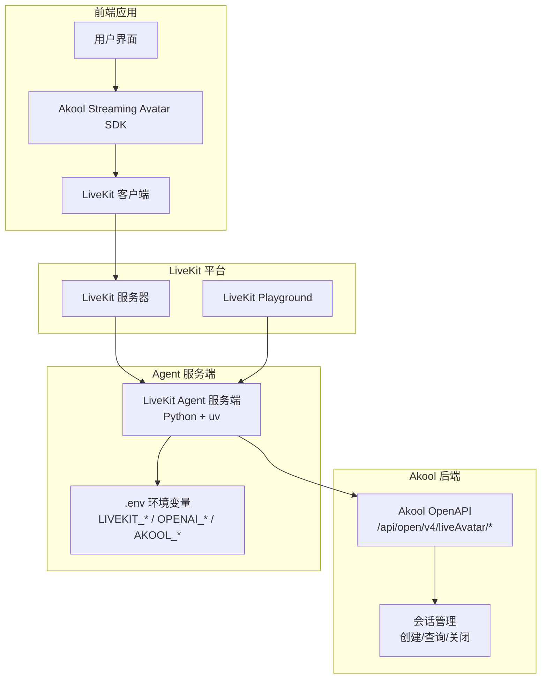
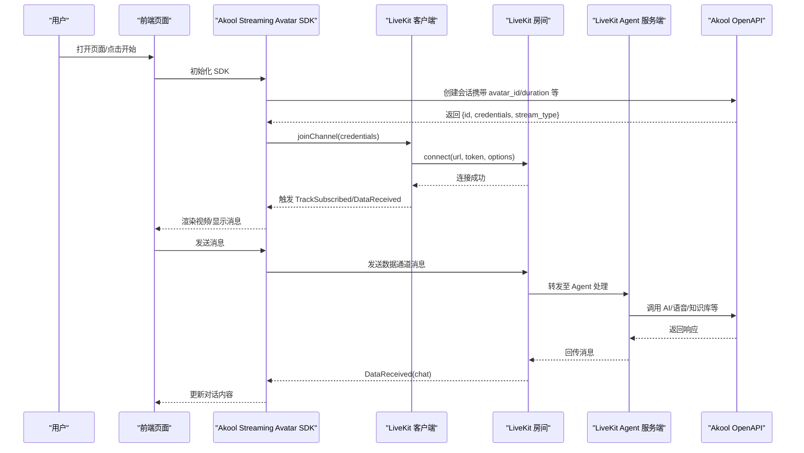
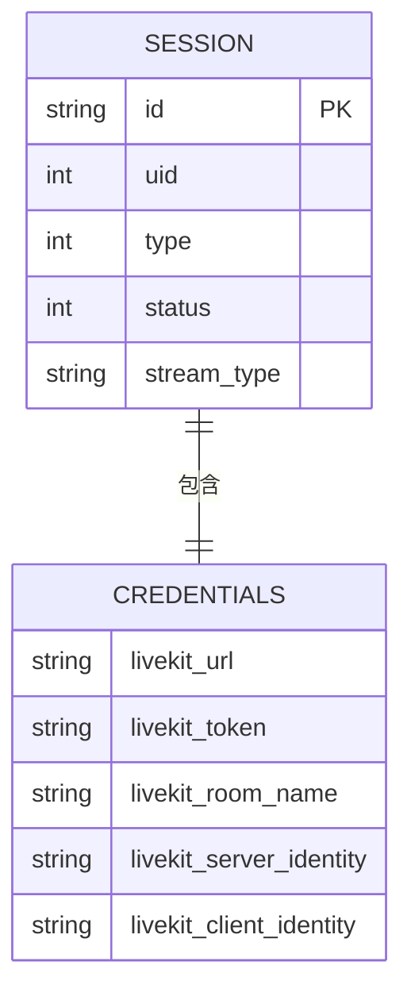
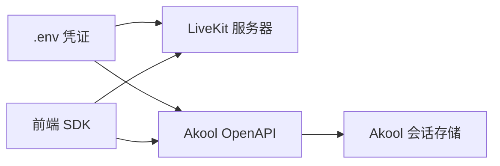

# LiveKit Agent 集成

<cite>
**本文引用的文件**
- [implementation-guide/livekit-agent.mdx](file://implementation-guide/livekit-agent.mdx)
- [implementation-guide/streaming-avatar.mdx](file://implementation-guide/streaming-avatar.mdx)
- [sdk/jssdk-start.mdx](file://sdk/jssdk-start.mdx)
- [sdk/jssdk-best-practice.mdx](file://sdk/jssdk-best-practice.mdx)
- [authentication/usage.mdx](file://authentication/usage.mdx)
- [ai-tools-suite/live-avatar/create-session.mdx](file://ai-tools-suite/live-avatar/create-session.mdx)
- [openapi/live-avatar.yaml](file://openapi/live-avatar.yaml)
</cite>

## 目录
1. [简介](#简介)
2. [项目结构](#项目结构)
3. [核心组件](#核心组件)
4. [架构总览](#架构总览)
5. [组件详解](#组件详解)
6. [依赖关系分析](#依赖关系分析)
7. [性能考量](#性能考量)
8. [故障排除指南](#故障排除指南)
9. [结论](#结论)
10. [附录](#附录)

## 简介
本指南面向希望在 LiveKit 平台上集成 Akool Streaming Avatar 的开发者，提供从 Agent 服务端配置、认证与会话管理到实时通信的消息处理完整流程。内容覆盖：
- LiveKit Agent 服务端搭建与本地测试
- Akool 后端会话创建与凭证下发
- 前端通过 LiveKit 客户端接入并进行消息交互
- 认证方式与安全最佳实践
- 网络与性能优化建议
- 常见问题与排障方法

## 项目结构
围绕 LiveKit Agent 集成的关键文档与接口如下：
- LiveKit Agent 搭建与运行：implementation-guide/livekit-agent.mdx
- LiveKit/Web 实时通信接入与数据通道限制：implementation-guide/streaming-avatar.mdx
- Akool Streaming Avatar SDK 快速开始与后端代理示例：sdk/jssdk-start.mdx
- 安全最佳实践（后端代管敏感凭据）：sdk/jssdk-best-practice.mdx
- 认证方式与令牌获取：authentication/usage.mdx
- Streaming Avatar 会话管理 API（OpenAPI）：ai-tools-suite/live-avatar/create-session.mdx、openapi/live-avatar.yaml

图表来源
- [implementation-guide/livekit-agent.mdx:22-67](file://implementation-guide/livekit-agent.mdx#L22-L67)
- [implementation-guide/streaming-avatar.mdx:273-296](file://implementation-guide/streaming-avatar.mdx#L273-L296)
- [sdk/jssdk-start.mdx:210-357](file://sdk/jssdk-start.mdx#L210-L357)
- [openapi/live-avatar.yaml:132-242](file://openapi/live-avatar.yaml#L132-L242)

章节来源
- [implementation-guide/livekit-agent.mdx:6-68](file://implementation-guide/livekit-agent.mdx#L6-L68)
- [implementation-guide/streaming-avatar.mdx:24-469](file://implementation-guide/streaming-avatar.mdx#L24-L469)
- [sdk/jssdk-start.mdx:48-576](file://sdk/jssdk-start.mdx#L48-L576)
- [sdk/jssdk-best-practice.mdx:30-112](file://sdk/jssdk-best-practice.mdx#L30-L112)
- [authentication/usage.mdx:7-280](file://authentication/usage.mdx#L7-L280)
- [ai-tools-suite/live-avatar/create-session.mdx:1-26](file://ai-tools-suite/live-avatar/create-session.mdx#L1-L26)
- [openapi/live-avatar.yaml:132-242](file://openapi/live-avatar.yaml#L132-L242)

## 核心组件
- LiveKit Agent 服务端：负责承载 AI 逻辑并与 LiveKit 房间交互，使用 uv 管理依赖，支持本地开发与 Playground 调试。
- Akool 后端 OpenAPI：提供会话创建、查询与关闭等能力，返回 LiveKit 凭证用于客户端接入。
- LiveKit 客户端（Web）：通过 Room 连接 LiveKit 服务器，订阅音视频流并接收数据通道消息。
- 前端 SDK：封装 SDK 初始化、加入房间、消息发送与事件监听，推荐通过后端代理调用 Akool API。

章节来源
- [implementation-guide/livekit-agent.mdx:14-67](file://implementation-guide/livekit-agent.mdx#L14-L67)
- [openapi/live-avatar.yaml:132-242](file://openapi/live-avatar.yaml#L132-L242)
- [implementation-guide/streaming-avatar.mdx:273-296](file://implementation-guide/streaming-avatar.mdx#L273-L296)
- [sdk/jssdk-start.mdx:66-196](file://sdk/jssdk-start.mdx#L66-L196)

## 架构总览
下图展示从前端到 LiveKit Agent，再到 Akool 后端的整体交互路径与职责边界。

图表来源
- [sdk/jssdk-start.mdx:440-547](file://sdk/jssdk-start.mdx#L440-L547)
- [implementation-guide/streaming-avatar.mdx:450-469](file://implementation-guide/streaming-avatar.mdx#L450-L469)
- [openapi/live-avatar.yaml:132-242](file://openapi/live-avatar.yaml#L132-L242)

## 组件详解

### LiveKit Agent 服务端配置与启动
- 克隆仓库并切换到指定分支，使用 uv 安装依赖。
- 在 examples 目录创建 .env 文件，填写 LiveKit 与 Akool/OpenAI 凭证。
- 使用 uv 运行示例脚本启动 Agent 服务端，并在 Playground 中验证。

章节来源
- [implementation-guide/livekit-agent.mdx:24-67](file://implementation-guide/livekit-agent.mdx#L24-L67)

### Akool 会话管理与凭证下发
- 通过 OpenAPI 创建会话，返回 credentials 包含 LiveKit 相关字段（如 livekit_url、livekit_token、room_name 等）。
- 支持查询会话列表与详情，按需关闭会话以避免持续计费。

章节来源
- [openapi/live-avatar.yaml:132-242](file://openapi/live-avatar.yaml#L132-L242)
- [ai-tools-suite/live-avatar/create-session.mdx:1-26](file://ai-tools-suite/live-avatar/create-session.mdx#L1-L26)

### LiveKit 客户端接入与消息处理
- 使用 LiveKit 客户端初始化房间并连接，自动订阅远端音视频轨道。
- 监听数据通道消息，解析 chat 类型消息并更新 UI；命令类消息用于状态反馈。
- 数据通道单包大小限制较 Agora 更宽松，典型对话无需分片；超大消息可参考 Agora 的分片策略适配。

章节来源
- [implementation-guide/streaming-avatar.mdx:273-296](file://implementation-guide/streaming-avatar.mdx#L273-L296)
- [implementation-guide/streaming-avatar.mdx:450-469](file://implementation-guide/streaming-avatar.mdx#L450-L469)
- [implementation-guide/streaming-avatar.mdx:691-697](file://implementation-guide/streaming-avatar.mdx#L691-L697)

### 前端 SDK 与后端代理模式
- 推荐通过后端代理调用 Akool API，避免在浏览器暴露敏感凭据。
- 提供完整 Demo：后端 server.js 代理会话创建/关闭，前端 main.js 通过 SDK 控制加入/离开、发送消息、麦克风开关与中断。

章节来源
- [sdk/jssdk-start.mdx:210-357](file://sdk/jssdk-start.mdx#L210-L357)
- [sdk/jssdk-start.mdx:440-547](file://sdk/jssdk-start.mdx#L440-L547)

### 认证与安全
- 支持直接 API Key 与 Bearer Token 两种认证方式；推荐直接使用 x-api-key。
- 后端应持有密钥，前端仅通过受保护的后端接口获取会话凭证。
- 令牌过期与异常事件需在前端妥善处理并引导用户重试或重新登录。

章节来源
- [authentication/usage.mdx:10-48](file://authentication/usage.mdx#L10-L48)
- [sdk/jssdk-best-practice.mdx:30-112](file://sdk/jssdk-best-practice.mdx#L30-L112)

### 数据模型与消息格式（概念性）
以下为典型数据结构与消息类型（概念示意，非代码映射）：

图表来源
- [openapi/live-avatar.yaml:587-634](file://openapi/live-avatar.yaml#L587-L634)
- [openapi/live-avatar.yaml:635-678](file://openapi/live-avatar.yaml#L635-L678)

## 依赖关系分析
- Agent 服务端依赖 LiveKit 服务器与 Akool OpenAPI；Agent 通过 .env 注入凭证。
- 前端 SDK 依赖 LiveKit 客户端与 Akool 后端；SDK 通过后端代理访问 OpenAPI。
- 认证层同时支持直连 API Key 与 Bearer Token，推荐后端代管密钥。

图表来源
- [implementation-guide/livekit-agent.mdx:42-58](file://implementation-guide/livekit-agent.mdx#L42-L58)
- [sdk/jssdk-start.mdx:220-266](file://sdk/jssdk-start.mdx#L220-L266)
- [openapi/live-avatar.yaml:132-242](file://openapi/live-avatar.yaml#L132-L242)

章节来源
- [implementation-guide/livekit-agent.mdx:42-67](file://implementation-guide/livekit-agent.mdx#L42-L67)
- [sdk/jssdk-start.mdx:220-357](file://sdk/jssdk-start.mdx#L220-L357)
- [openapi/live-avatar.yaml:132-242](file://openapi/live-avatar.yaml#L132-L242)

## 性能考量
- 选择合适的流媒体提供商：OpenAPI 支持 Agora/LiveKit/TRTC，默认为 Agora；LiveKit 数据通道单包更大，适合对话场景。
- 合理设置会话时长与语言参数，避免不必要的资源占用。
- 使用自适应码率与 Dynacast（LiveKit）提升弱网体验。
- 对于长文本，LiveKit 可减少分片需求；仍建议对超大消息做节流与合并策略。

章节来源
- [openapi/live-avatar.yaml:483-487](file://openapi/live-avatar.yaml#L483-L487)
- [implementation-guide/streaming-avatar.mdx:691-697](file://implementation-guide/streaming-avatar.mdx#L691-L697)

## 故障排除指南
- 无法连接 LiveKit 房间
  - 检查 credentials 是否正确下发（livekit_url、livekit_token、room_name）。
  - 确认 Agent 服务端日志与 Playground 状态。
- 会话创建失败
  - 核对 x-api-key 或 Bearer Token 是否有效。
  - 确认 avatar_id 与 voice_id 等参数是否符合规范。
- 消息不显示或延迟高
  - LiveKit 数据通道默认单包较大，检查消息格式与编码。
  - 弱网环境下启用自适应流与降分辨率。
- 令牌过期
  - 前端监听 onTokenDidExpire 事件，提示用户重新发起会话。
- 会话未关闭导致计费
  - Demo 中已演示后端关闭会话逻辑，确保在页面卸载或手动结束时调用关闭接口。

章节来源
- [sdk/jssdk-start.mdx:470-517](file://sdk/jssdk-start.mdx#L470-L517)
- [sdk/jssdk-best-practice.mdx:114-192](file://sdk/jssdk-best-practice.mdx#L114-L192)
- [openapi/live-avatar.yaml:215-242](file://openapi/live-avatar.yaml#L215-L242)

## 结论
通过上述步骤，可在 LiveKit 平台上完成 Akool Streaming Avatar 的端到端集成：Agent 服务端负责 AI 与业务编排，Akool 后端提供会话与凭证管理，前端 SDK 通过 LiveKit 客户端实现实时音视频与消息交互。遵循后端代理与认证最佳实践，可确保系统安全、稳定与高性能。

## 附录
- LiveKit Agent 示例与环境变量模板：implementation-guide/livekit-agent.mdx
- LiveKit/Web 接入与数据通道限制：implementation-guide/streaming-avatar.mdx
- SDK 快速开始与后端代理 Demo：sdk/jssdk-start.mdx
- 安全最佳实践与后端实现示例：sdk/jssdk-best-practice.mdx
- 认证方式与令牌获取：authentication/usage.mdx
- 会话管理 API（OpenAPI）：openapi/live-avatar.yaml