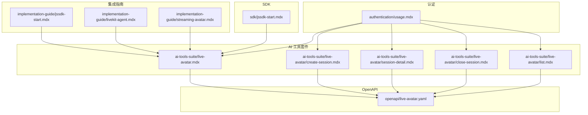
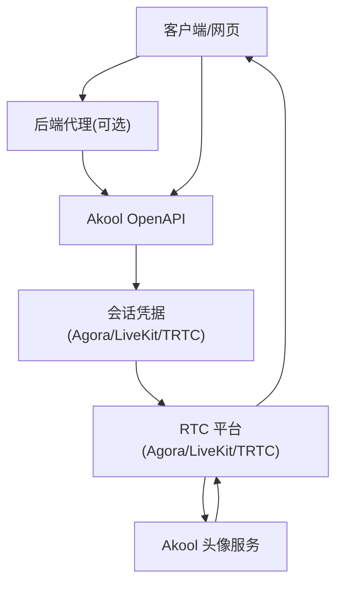
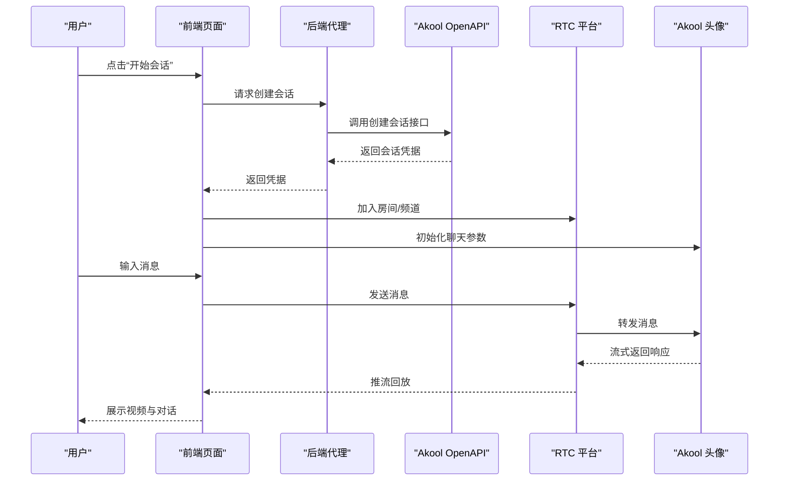
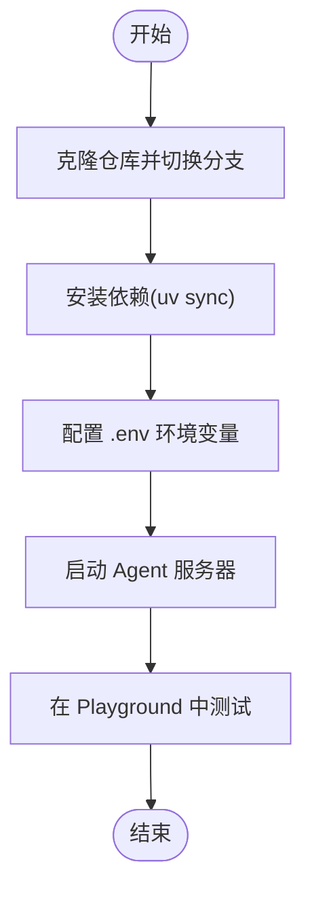
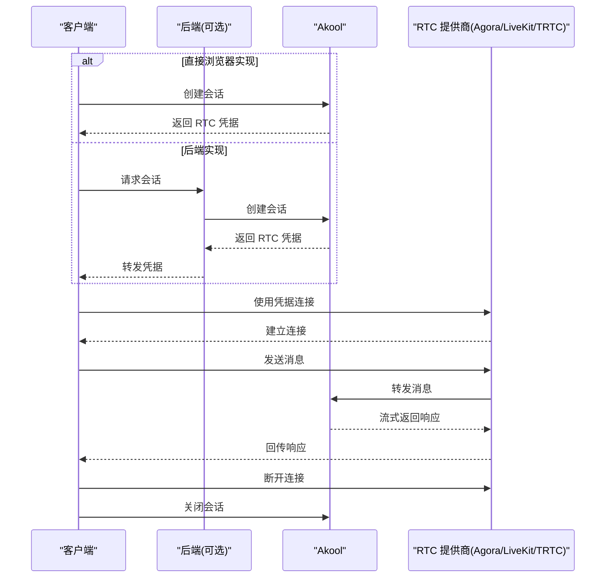
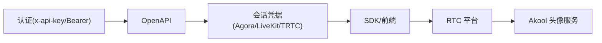

# 实现指南

<cite>
**本文引用的文件**   
- [implementation-guide/jssdk-start.mdx](file://implementation-guide/jssdk-start.mdx)
- [implementation-guide/livekit-agent.mdx](file://implementation-guide/livekit-agent.mdx)
- [implementation-guide/streaming-avatar.mdx](file://implementation-guide/streaming-avatar.mdx)
- [sdk/jssdk-start.mdx](file://sdk/jssdk-start.mdx)
- [ai-tools-suite/live-avatar.mdx](file://ai-tools-suite/live-avatar.mdx)
- [ai-tools-suite/live-avatar/create-session.mdx](file://ai-tools-suite/live-avatar/create-session.mdx)
- [ai-tools-suite/live-avatar/session-detail.mdx](file://ai-tools-suite/live-avatar/session-detail.mdx)
- [ai-tools-suite/live-avatar/close-session.mdx](file://ai-tools-suite/live-avatar/close-session.mdx)
- [ai-tools-suite/live-avatar/list.mdx](file://ai-tools-suite/live-avatar/list.mdx)
- [authentication/usage.mdx](file://authentication/usage.mdx)
- [openapi/live-avatar.yaml](file://openapi/live-avatar.yaml)
</cite>

## 目录
1. [简介](#简介)
2. [项目结构](#项目结构)
3. [核心组件](#核心组件)
4. [架构总览](#架构总览)
5. [详细组件分析](#详细组件分析)
6. [依赖关系分析](#依赖关系分析)
7. [性能考虑](#性能考虑)
8. [故障排除指南](#故障排除指南)
9. [结论](#结论)
10. [附录](#附录)

## 简介
本指南面向希望在应用中集成 Akool AI Tools Suite 的开发者，覆盖三大实现路径：
- JavaScript SDK（浏览器直连或通过后端代理）
- LiveKit Agent 集成（服务端 AI Agent + Akool 流媒体头像）
- 流媒体头像（基于 Agora/LiveKit/TRTC 的实时音视频与消息通道）

文档提供从环境准备、认证方式、会话创建、消息协议、错误码到调试与故障排除的完整流程，并给出可直接运行的最小示例与最佳实践。

## 项目结构
仓库采用按功能模块组织的文档结构，核心与本指南相关的关键目录如下：
- implementation-guide：集成指南（JavaScript SDK、LiveKit Agent、流媒体头像）
- sdk：SDK 快速开始与最佳实践
- ai-tools-suite/live-avatar：流媒体头像 API 文档与示例
- authentication：认证方式与令牌获取
- openapi：OpenAPI 规范（含 live-avatar.yaml）

图表来源
- [implementation-guide/jssdk-start.mdx:1-80](file://implementation-guide/jssdk-start.mdx#L1-L80)
- [implementation-guide/livekit-agent.mdx:1-69](file://implementation-guide/livekit-agent.mdx#L1-L69)
- [implementation-guide/streaming-avatar.mdx:1-120](file://implementation-guide/streaming-avatar.mdx#L1-L120)
- [sdk/jssdk-start.mdx:1-60](file://sdk/jssdk-start.mdx#L1-L60)
- [ai-tools-suite/live-avatar.mdx:1-40](file://ai-tools-suite/live-avatar.mdx#L1-L40)
- [ai-tools-suite/live-avatar/create-session.mdx:1-26](file://ai-tools-suite/live-avatar/create-session.mdx#L1-L26)
- [ai-tools-suite/live-avatar/session-detail.mdx:1-6](file://ai-tools-suite/live-avatar/session-detail.mdx#L1-L6)
- [ai-tools-suite/live-avatar/close-session.mdx:1-106](file://ai-tools-suite/live-avatar/close-session.mdx#L1-L106)
- [ai-tools-suite/live-avatar/list.mdx:1-6](file://ai-tools-suite/live-avatar/list.mdx#L1-L6)
- [authentication/usage.mdx:1-60](file://authentication/usage.mdx#L1-L60)
- [openapi/live-avatar.yaml:1-60](file://openapi/live-avatar.yaml#L1-L60)

章节来源
- [implementation-guide/jssdk-start.mdx:1-80](file://implementation-guide/jssdk-start.mdx#L1-L80)
- [implementation-guide/streaming-avatar.mdx:1-120](file://implementation-guide/streaming-avatar.mdx#L1-L120)
- [sdk/jssdk-start.mdx:1-60](file://sdk/jssdk-start.mdx#L1-L60)
- [ai-tools-suite/live-avatar.mdx:1-40](file://ai-tools-suite/live-avatar.mdx#L1-L40)
- [authentication/usage.mdx:1-60](file://authentication/usage.mdx#L1-L60)
- [openapi/live-avatar.yaml:1-60](file://openapi/live-avatar.yaml#L1-L60)

## 核心组件
- 认证与令牌
  - 支持直接 API Key（推荐）与 Bearer Token 两种方式；生产环境建议通过后端代理访问 OpenAPI，避免前端暴露密钥。
- 会话管理
  - 创建会话以获取 RTC 凭据（Agora/LiveKit/TRTC），支持设置语言、模式、背景等参数；会话结束后需主动关闭以停止计费。
- 消息协议
  - 使用统一的消息格式（chat/command）通过数据通道发送文本、控制命令；支持分片发送与速率限制。
- SDK 与前端集成
  - 提供浏览器直连与后端代理两种方式；SDK 封装了事件监听、订阅、消息发送、麦克风控制等能力。

章节来源
- [authentication/usage.mdx:10-48](file://authentication/usage.mdx#L10-L48)
- [ai-tools-suite/live-avatar.mdx:24-96](file://ai-tools-suite/live-avatar.mdx#L24-L96)
- [ai-tools-suite/live-avatar/create-session.mdx:1-26](file://ai-tools-suite/live-avatar/create-session.mdx#L1-L26)
- [ai-tools-suite/live-avatar/close-session.mdx:1-106](file://ai-tools-suite/live-avatar/close-session.mdx#L1-L106)
- [sdk/jssdk-start.mdx:33-590](file://sdk/jssdk-start.mdx#L33-L590)

## 架构总览
下图展示了三种集成路径的通用架构：客户端/后端通过 OpenAPI 获取会话凭据，再连接 RTC 平台，最终与 Akool 头像服务交互。

图表来源
- [implementation-guide/streaming-avatar.mdx:116-181](file://implementation-guide/streaming-avatar.mdx#L116-L181)
- [ai-tools-suite/live-avatar.mdx:24-36](file://ai-tools-suite/live-avatar.mdx#L24-L36)
- [openapi/live-avatar.yaml:132-188](file://openapi/live-avatar.yaml#L132-L188)

## 详细组件分析

### JavaScript SDK 实现（浏览器直连或后端代理）
- 适用场景
  - 快速原型、演示或小型项目可直接在浏览器中使用 SDK；生产环境建议通过后端代理调用 OpenAPI，保护密钥与进行风控。
- 关键步骤
  - 安装与引入 SDK；注册事件监听（消息接收、异常、用户发布等）；通过后端安全地获取会话凭据并加入频道；初始化聊天参数（语言、模式、语音等）；发送消息与处理响应。
- 最小示例
  - 提供完整的 Node.js 后端代理（仅内置模块）、HTML 前端与脚本逻辑，可在本地快速运行体验。
- 注意事项
  - 避免在前端直接暴露 API Key；合理处理令牌过期与网络异常；注意麦克风权限与自动播放策略。

图表来源
- [sdk/jssdk-start.mdx:197-577](file://sdk/jssdk-start.mdx#L197-L577)
- [ai-tools-suite/live-avatar.mdx:24-36](file://ai-tools-suite/live-avatar.mdx#L24-L36)

章节来源
- [sdk/jssdk-start.mdx:33-590](file://sdk/jssdk-start.mdx#L33-L590)
- [implementation-guide/jssdk-start.mdx:17-80](file://implementation-guide/jssdk-start.mdx#L17-L80)

### LiveKit Agent 集成
- 适用场景
  - 需要服务端 AI Agent 与 Akool 流媒体头像联动，构建更复杂的实时交互体验。
- 关键步骤
  - 克隆指定分支仓库；安装依赖（uv）；配置环境变量（LiveKit、OpenAI、Akool 凭据）；启动 Agent 服务器；在 Playground 中测试。
- 注意事项
  - 确保 LiveKit Cloud 账号可用且具备相应配额；Agent 与 Akool 的集成版本需匹配。

图表来源
- [implementation-guide/livekit-agent.mdx:22-68](file://implementation-guide/livekit-agent.mdx#L22-L68)

章节来源
- [implementation-guide/livekit-agent.mdx:1-69](file://implementation-guide/livekit-agent.mdx#L1-L69)

### 流媒体头像（Agora/LiveKit/TRTC）
- 适用场景
  - 基于 WebRTC 的低延迟实时音视频与消息通道，支持多 SDK 选择。
- 关键步骤
  - 安装对应 SDK；导入依赖；理解各 SDK 的数据通道限制；创建会话获取凭据；初始化客户端/房间；订阅音视频流；设置消息监听；发送消息与控制命令；清理资源。
- 数据通道与消息协议
  - 统一使用 chat/command 类型消息，支持分片与速率控制；不同 SDK 的最大消息大小与频率限制不同，需按规范实现。
- 会话生命周期
  - 创建 → 连接 → 交互 → 关闭；务必在会话结束后主动关闭，避免持续计费。

图表来源
- [implementation-guide/streaming-avatar.mdx:116-181](file://implementation-guide/streaming-avatar.mdx#L116-L181)
- [ai-tools-suite/live-avatar.mdx:24-36](file://ai-tools-suite/live-avatar.mdx#L24-L36)

章节来源
- [implementation-guide/streaming-avatar.mdx:22-181](file://implementation-guide/streaming-avatar.mdx#L22-L181)
- [ai-tools-suite/live-avatar.mdx:24-281](file://ai-tools-suite/live-avatar.mdx#L24-L281)

## 依赖关系分析
- 认证层
  - OpenAPI 支持 x-api-key 与 Bearer Token；推荐直接使用 API Key 并通过后端代理访问。
- 会话层
  - 通过 OpenAPI 创建会话，返回 Agora/LiveKit/TRTC 凭据；凭据类型随 stream_type 变化。
- 协议层
  - 统一的消息格式（chat/command）用于文本与控制；不同 SDK 的数据通道限制不同，需按规范实现。
- SDK 层
  - SDK 封装了事件监听、订阅、消息发送、麦克风控制等；浏览器直连适合演示，生产建议后端代理。

图表来源
- [authentication/usage.mdx:10-48](file://authentication/usage.mdx#L10-L48)
- [openapi/live-avatar.yaml:132-188](file://openapi/live-avatar.yaml#L132-L188)
- [sdk/jssdk-start.mdx:33-120](file://sdk/jssdk-start.mdx#L33-L120)

章节来源
- [authentication/usage.mdx:10-48](file://authentication/usage.mdx#L10-L48)
- [openapi/live-avatar.yaml:132-188](file://openapi/live-avatar.yaml#L132-L188)
- [sdk/jssdk-start.mdx:33-120](file://sdk/jssdk-start.mdx#L33-L120)

## 性能考虑
- 选择合适的 SDK
  - LiveKit 在可靠模式下支持更大的消息容量，适合长文本与复杂交互；Agora 与 TRTC 需实现分片与速率控制。
- 分片与速率控制
  - 对于 Agora/ TRTC，需将大消息拆分为不超过限制的块，并遵守每秒字节速率；对 LiveKit 可根据需要实现类似逻辑。
- 会话时长与计费
  - 会话时长在创建时预扣费，结束后未使用额度将退款；务必在交互结束后主动关闭会话。
- 语音参数优化
  - 通过 voice_params 控制语速、发音映射、STT 语言与转写类型、VAD 配置等，提升交互质量与稳定性。

章节来源
- [implementation-guide/streaming-avatar.mdx:66-114](file://implementation-guide/streaming-avatar.mdx#L66-L114)
- [ai-tools-suite/live-avatar.mdx:45-96](file://ai-tools-suite/live-avatar.mdx#L45-L96)
- [openapi/live-avatar.yaml:427-490](file://openapi/live-avatar.yaml#L427-L490)

## 故障排除指南
- 认证失败
  - 检查 x-api-key 或 Bearer Token 是否正确；确认令牌未过期；生产环境避免在前端暴露密钥。
- 会话创建失败
  - 确认 avatar_id、duration、stream_type、credentials 等参数是否符合规范；检查知识库 ID 与语音参数配置。
- 消息发送异常
  - 检查消息格式（chat/command）与字段完整性；对于 Agora/ TRTC，确保未超过消息大小与速率限制；必要时启用分片与限速。
- 无法收到头像响应
  - 确认已订阅音视频流；检查数据通道事件监听是否正确；验证会话状态与凭据有效性。
- 会话未关闭导致计费
  - 确保在交互结束后调用关闭接口；如出现异常，重试关闭直至成功。

章节来源
- [authentication/usage.mdx:270-280](file://authentication/usage.mdx#L270-L280)
- [ai-tools-suite/live-avatar.mdx:339-365](file://ai-tools-suite/live-avatar.mdx#L339-L365)
- [ai-tools-suite/live-avatar/close-session.mdx:1-106](file://ai-tools-suite/live-avatar/close-session.mdx#L1-L106)

## 结论
通过本指南，开发者可基于 JavaScript SDK、LiveKit Agent 或原生 RTC SDK（Agora/LiveKit/TRTC）快速集成 Akool 流媒体头像能力。建议优先采用后端代理与推荐的认证方式，结合统一的消息协议与合理的性能优化策略，构建稳定、低延迟的实时交互体验。

## 附录
- 快速开始（浏览器直连）
  - 引入 SDK、注册事件、通过后端获取凭据、加入频道、初始化聊天、发送消息与处理响应。
- 最小示例（后端代理 + 前端）
  - 提供 Node.js 内置模块实现的后端代理与前端页面，一键运行体验。
- OpenAPI 规范
  - 包含会话创建、详情查询、列表与关闭等接口定义与参数说明。

章节来源
- [sdk/jssdk-start.mdx:197-577](file://sdk/jssdk-start.mdx#L197-L577)
- [openapi/live-avatar.yaml:132-282](file://openapi/live-avatar.yaml#L132-L282)