# 流媒体头像实现

<cite>
**本文档引用的文件**
- [implementation-guide/streaming-avatar.mdx](file://implementation-guide/streaming-avatar.mdx)
- [ai-tools-suite/live-avatar.mdx](file://ai-tools-suite/live-avatar.mdx)
- [openapi/live-avatar.yaml](file://openapi/live-avatar.yaml)
- [ai-tools-suite/live-avatar/create-session.mdx](file://ai-tools-suite/live-avatar/create-session.mdx)
- [ai-tools-suite/live-avatar/list-sessions.mdx](file://ai-tools-suite/live-avatar/list-sessions.mdx)
- [ai-tools-suite/live-avatar/session-detail.mdx](file://ai-tools-suite/live-avatar/session-detail.mdx)
- [ai-tools-suite/live-avatar/close-session.mdx](file://ai-tools-suite/live-avatar/close-session.mdx)
- [implementation-guide/livekit-agent.mdx](file://implementation-guide/livekit-agent.mdx)
- [ai-tools-suite/audio.mdx](file://ai-tools-suite/audio.mdx)
- [ai-tools-suite/lip-sync.mdx](file://ai-tools-suite/lip-sync.mdx)
</cite>

## 目录
1. [简介](#简介)
2. [项目结构](#项目结构)
3. [核心组件](#核心组件)
4. [架构概览](#架构概览)
5. [详细组件分析](#详细组件分析)
6. [依赖关系分析](#依赖关系分析)
7. [性能考虑](#性能考虑)
8. [故障排除指南](#故障排除指南)
9. [结论](#结论)
10. [附录](#附录)

## 简介

流媒体头像实现是一个基于WebRTC技术的实时虚拟主播系统，支持与用户进行双向视频通信。该系统集成了Agora、LiveKit和TRTC三种WebRTC SDK，提供低延迟的音视频传输和实时交互功能。

本指南详细说明了如何构建和部署流媒体虚拟主播服务，包括头像配置、实时渲染和交互处理的完整实现步骤。

## 项目结构

该项目采用模块化设计，主要包含以下核心模块：

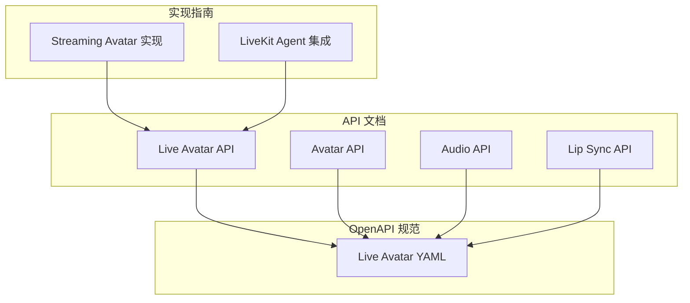

**图表来源**
- [implementation-guide/streaming-avatar.mdx:1-50](file://implementation-guide/streaming-avatar.mdx#L1-L50)
- [ai-tools-suite/live-avatar.mdx:1-30](file://ai-tools-suite/live-avatar.mdx#L1-L30)

**章节来源**
- [implementation-guide/streaming-avatar.mdx:10-25](file://implementation-guide/streaming-avatar.mdx#L10-L25)
- [ai-tools-suite/live-avatar.mdx:1-25](file://ai-tools-suite/live-avatar.mdx#L1-L25)

## 核心组件

### 1. 会话管理系统

会话管理是整个流媒体头像系统的核心，负责建立和维护用户与虚拟主播之间的连接。

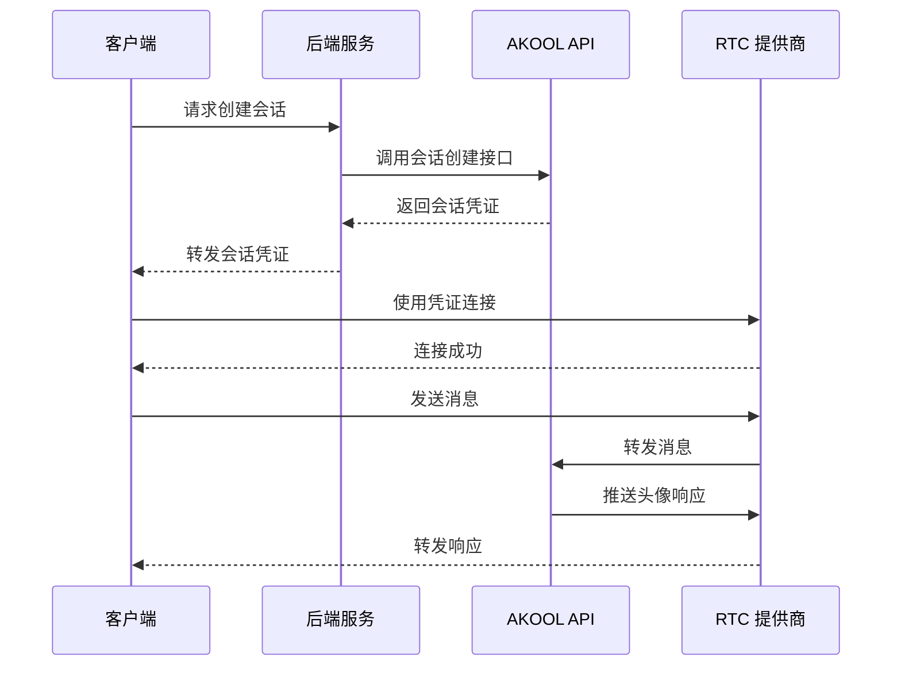

**图表来源**
- [implementation-guide/streaming-avatar.mdx:120-181](file://implementation-guide/streaming-avatar.mdx#L120-L181)

### 2. 头像参数控制系统

系统支持动态调整头像的各种参数，包括语音、语言、模式和背景等设置。

**章节来源**
- [implementation-guide/streaming-avatar.mdx:699-820](file://implementation-guide/streaming-avatar.mdx#L699-L820)
- [ai-tools-suite/live-avatar.mdx:59-155](file://ai-tools-suite/live-avatar.mdx#L59-L155)

### 3. 音频交互系统

支持双向音频通信，用户可以通过麦克风与虚拟主播进行实时语音交互。

**章节来源**
- [implementation-guide/streaming-avatar.mdx:823-1003](file://implementation-guide/streaming-avatar.mdx#L823-L1003)

### 4. 实时消息处理

系统采用统一的消息协议，支持聊天和命令两种类型的消息处理。

**章节来源**
- [implementation-guide/streaming-avatar.mdx:412-602](file://implementation-guide/streaming-avatar.mdx#L412-L602)
- [ai-tools-suite/live-avatar.mdx:37-216](file://ai-tools-suite/live-avatar.mdx#L37-L216)

## 架构概览

### 整体架构设计

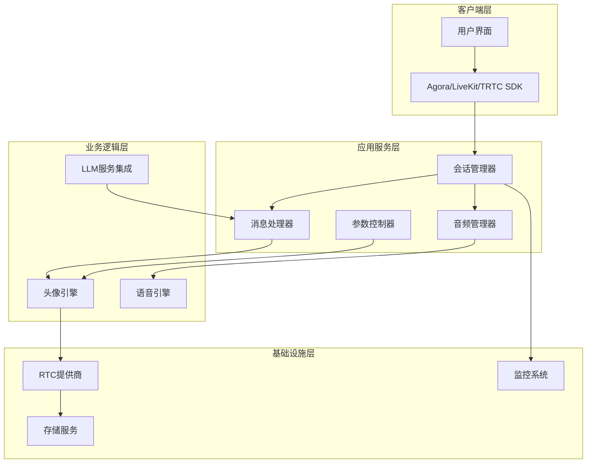

**图表来源**
- [implementation-guide/streaming-avatar.mdx:116-181](file://implementation-guide/streaming-avatar.mdx#L116-L181)

### 数据流架构

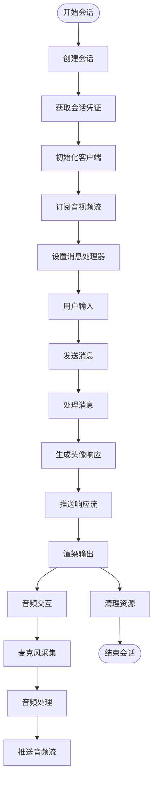

**图表来源**
- [implementation-guide/streaming-avatar.mdx:1413-1560](file://implementation-guide/streaming-avatar.mdx#L1413-L1560)

## 详细组件分析

### 1. 会话管理组件

#### 会话创建流程

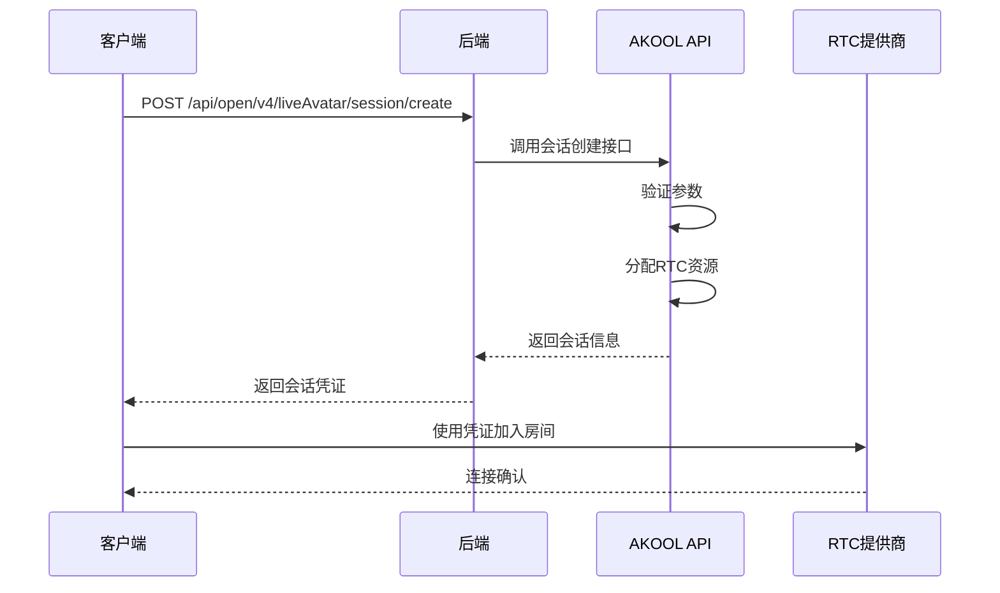

**图表来源**
- [openapi/live-avatar.yaml:132-188](file://openapi/live-avatar.yaml#L132-L188)

#### 会话参数配置

会话创建时可配置的参数包括：

| 参数名 | 类型 | 必填 | 描述 | 默认值 |
|--------|------|------|------|--------|
| avatar_id | String | 是 | 头像唯一标识符 | - |
| duration | Number | 否 | 会话持续时间(秒) | 3600 |
| voice_id | String | 否 | 语音模型ID | - |
| language | String | 否 | 语言代码 | "en" |
| mode_type | Number | 否 | 交互模式 | 2 |
| knowledge_id | String | 否 | 知识库ID | - |
| background_url | String | 否 | 背景图片URL | - |
| stream_type | String | 否 | RTC类型 | "agora" |

**章节来源**
- [openapi/live-avatar.yaml:427-490](file://openapi/live-avatar.yaml#L427-L490)

### 2. 音频处理组件

#### 音频流管理

音频处理组件支持实时音频采集、处理和播放：

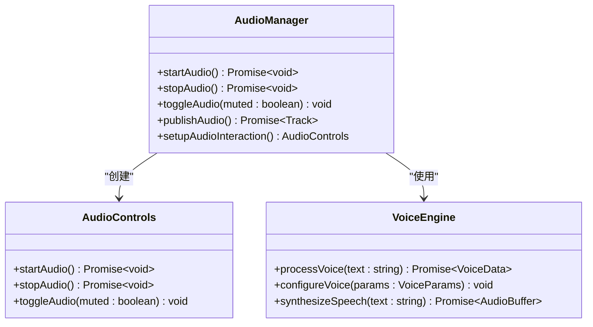

**图表来源**
- [implementation-guide/streaming-avatar.mdx:829-1003](file://implementation-guide/streaming-avatar.mdx#L829-L1003)

#### 语音参数配置

语音参数支持多种自定义选项：

| 参数名 | 类型 | 范围 | 描述 |
|--------|------|------|------|
| speed | Number | 0.8-1.2 | 语音速度控制 |
| stt_language | String | - | 语音识别语言 |
| pron_map | Object | - | 自定义发音映射 |
| stt_type | String | "openai_realtime" | 语音识别类型 |
| turn_detection | Object | - | 说话人检测配置 |

**章节来源**
- [openapi/live-avatar.yaml:512-586](file://openapi/live-avatar.yaml#L512-L586)

### 3. 视频渲染组件

#### 实时视频流处理

视频渲染组件负责接收和显示来自虚拟主播的实时视频流：

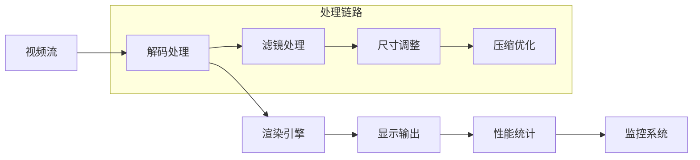

**图表来源**
- [implementation-guide/streaming-avatar.mdx:321-410](file://implementation-guide/streaming-avatar.mdx#L321-L410)

### 4. 消息通信组件

#### 统一消息协议

系统采用统一的消息协议格式，支持聊天和命令两种消息类型：

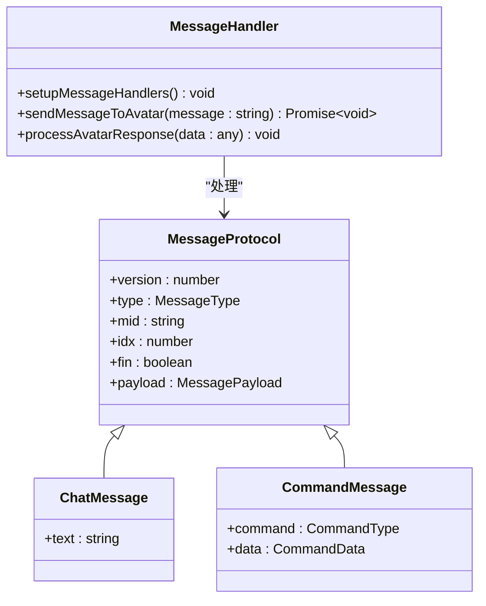

**图表来源**
- [implementation-guide/streaming-avatar.mdx:412-521](file://implementation-guide/streaming-avatar.mdx#L412-L521)

#### 消息类型定义

| 消息类型 | 用途 | 关键字段 |
|----------|------|----------|
| chat | 用户聊天消息 | text, from, to |
| command | 系统命令消息 | cmd, data, code |
| interrupt | 中断响应 | - | 

**章节来源**
- [ai-tools-suite/live-avatar.mdx:37-216](file://ai-tools-suite/live-avatar.mdx#L37-L216)

### 5. LLM服务集成

#### 可选的LLM增强功能

系统支持与外部LLM服务集成，提供更智能的对话能力：

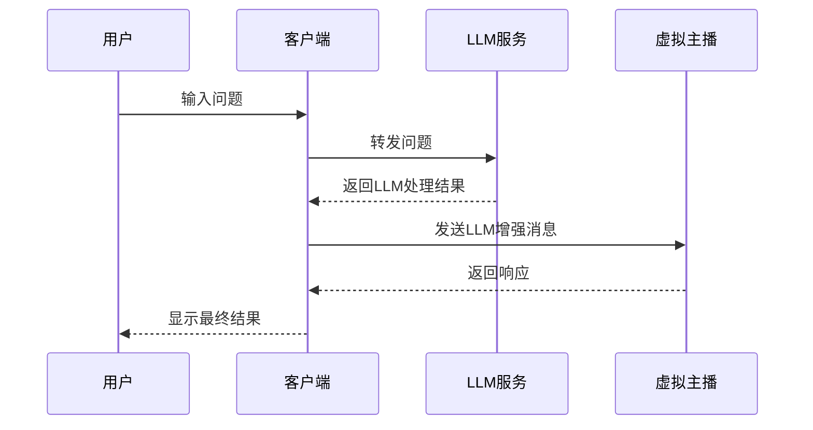

**图表来源**
- [implementation-guide/streaming-avatar.mdx:1090-1242](file://implementation-guide/streaming-avatar.mdx#L1090-L1242)

**章节来源**
- [implementation-guide/streaming-avatar.mdx:1090-1242](file://implementation-guide/streaming-avatar.mdx#L1090-L1242)

## 依赖关系分析

### 外部依赖

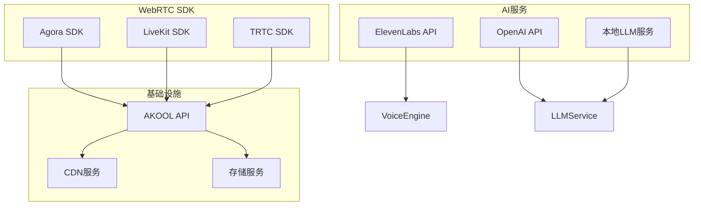

**图表来源**
- [implementation-guide/streaming-avatar.mdx:24-46](file://implementation-guide/streaming-avatar.mdx#L24-L46)

### 内部模块依赖

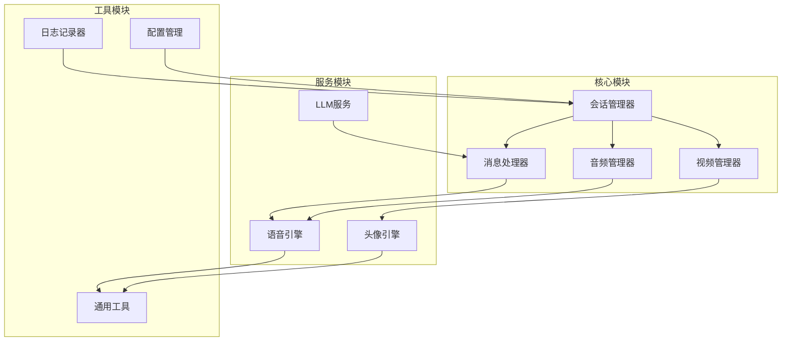

**图表来源**
- [implementation-guide/streaming-avatar.mdx:1413-1560](file://implementation-guide/streaming-avatar.mdx#L1413-L1560)

**章节来源**
- [implementation-guide/streaming-avatar.mdx:1413-1560](file://implementation-guide/streaming-avatar.mdx#L1413-L1560)

## 性能考虑

### 1. 带宽优化

系统针对不同网络环境提供了多种优化策略：

- **自适应码率控制**: 根据网络状况动态调整视频质量
- **音频降噪**: 减少传输带宽占用
- **消息分块传输**: 对于大消息进行分块处理，避免超限

### 2. 延迟优化

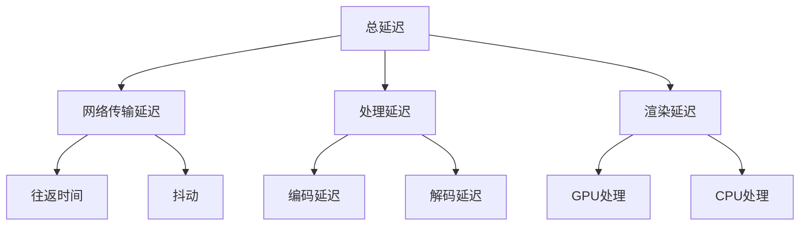

### 3. 资源管理

- **内存管理**: 及时释放不再使用的媒体资源
- **CPU优化**: 使用硬件加速进行编解码
- **连接池管理**: 复用RTC连接减少建立开销

## 故障排除指南

### 1. 常见错误处理

| 错误代码 | 描述 | 解决方案 |
|----------|------|----------|
| 1000 | 成功 | 正常状态 |
| 1003 | 参数错误 | 检查请求参数完整性 |
| 1008 | 内容不存在 | 验证资源ID有效性 |
| 1009 | 权限不足 | 检查API密钥权限 |
| 1101 | 认证失效 | 更新认证令牌 |
| 1201 | 音频生成错误 | 检查音频资源可用性 |

### 2. 调试工具

#### 日志记录

系统提供多级日志记录，便于问题诊断：

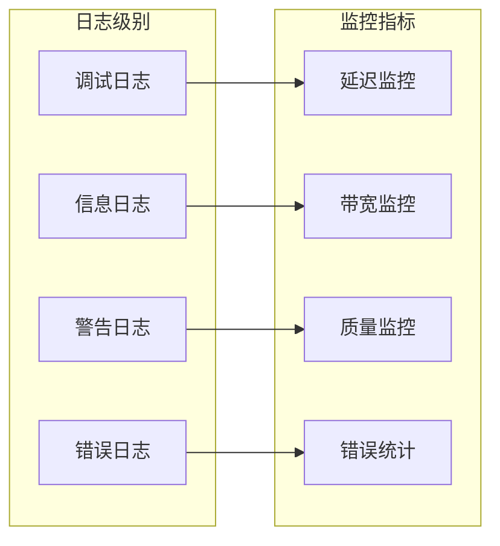

#### 性能监控

- **实时性能指标**: 延迟、丢包率、帧率
- **资源使用情况**: CPU、内存、网络带宽
- **用户体验指标**: 卡顿次数、缓冲次数

**章节来源**
- [ai-tools-suite/live-avatar.mdx:339-365](file://ai-tools-suite/live-avatar.mdx#L339-L365)

### 3. 最佳实践

- **安全考虑**: 始终通过后端管理会话，保护API密钥
- **错误重试**: 实现指数退避的重试机制
- **资源清理**: 确保在会话结束时正确释放资源
- **监控告警**: 设置关键指标的告警阈值

## 结论

流媒体头像实现提供了一个完整的实时虚拟主播解决方案，具有以下优势：

1. **多平台支持**: 兼容Agora、LiveKit、TRTC三大WebRTC SDK
2. **灵活配置**: 支持丰富的头像参数和语音配置
3. **高性能**: 优化的音视频处理和传输机制
4. **易扩展**: 模块化的架构设计便于功能扩展

通过遵循本指南的实现步骤和最佳实践，开发者可以快速构建稳定可靠的流媒体头像服务。

## 附录

### 1. API参考

#### 会话管理API

| 端点 | 方法 | 描述 |
|------|------|------|
| `/api/open/v4/liveAvatar/session/create` | POST | 创建新会话 |
| `/api/open/v4/liveAvatar/session/detail` | GET | 获取会话详情 |
| `/api/open/v4/liveAvatar/session/close` | POST | 关闭活动会话 |
| `/api/open/v4/liveAvatar/session/list` | GET | 获取会话列表 |

### 2. 开发环境要求

- **Node.js**: LTS版本
- **WebRTC SDK**: 选择对应SDK版本
- **开发工具**: VS Code或其他IDE
- **浏览器**: 支持WebRTC的现代浏览器

### 3. 部署建议

- **负载均衡**: 使用反向代理分发请求
- **缓存策略**: 实施合理的静态资源缓存
- **监控系统**: 集成APM和日志监控
- **备份策略**: 定期备份会话数据和配置