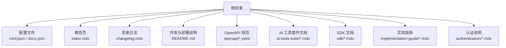
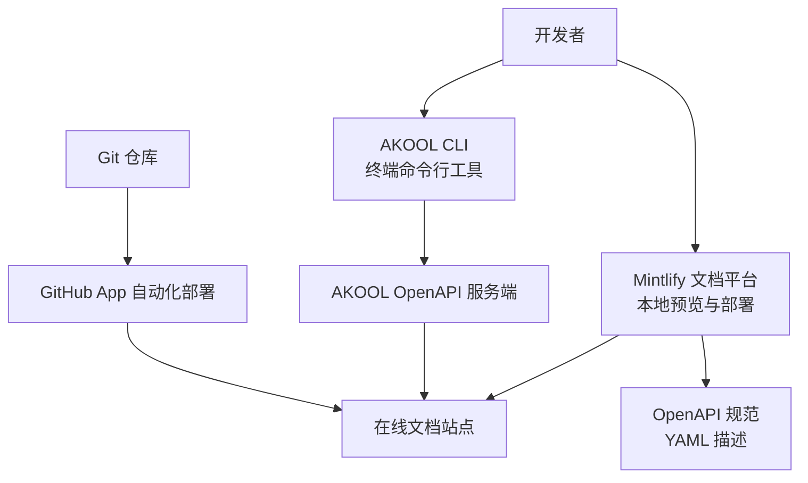
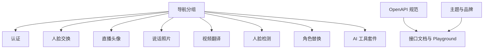
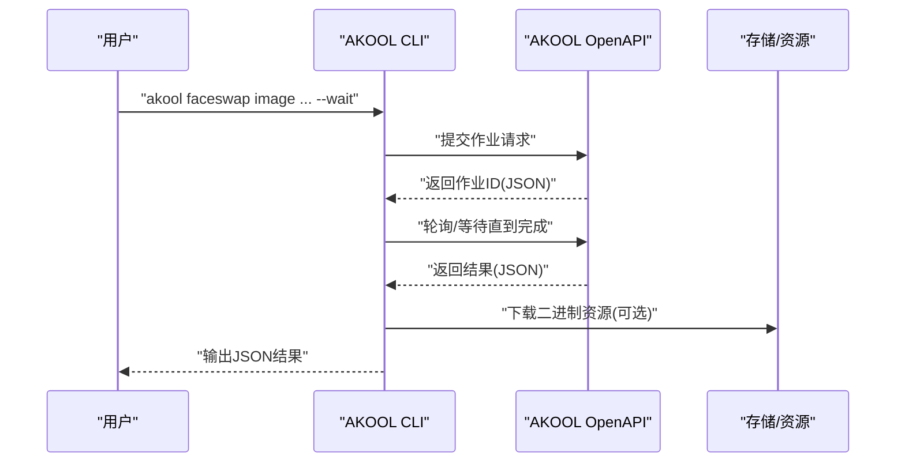
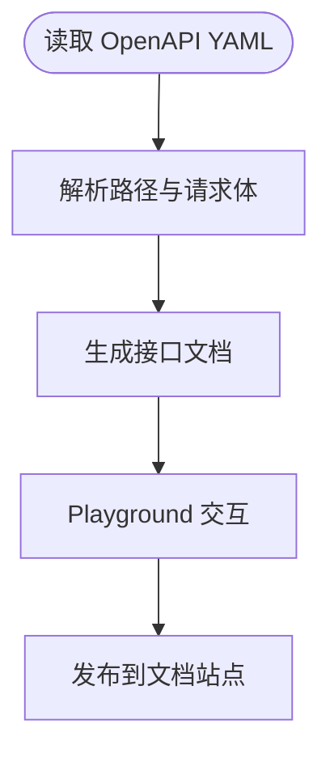
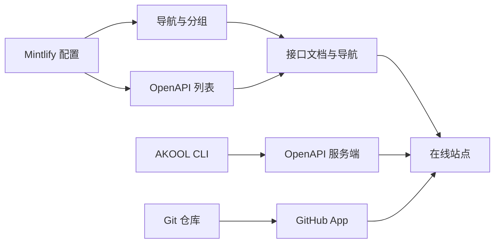

# 快速开始

<cite>
**本文引用的文件**
- [README.md](file://README.md)
- [cli.mdx](file://cli.mdx)
- [mint.json](file://mint.json)
- [docs.json](file://docs.json)
- [index.mdx](file://index.mdx)
- [changelog.mdx](file://changelog.mdx)
- [openapi/faceswap.yaml](file://openapi/faceswap.yaml)
- [openapi/live-avatar.yaml](file://openapi/live-avatar.yaml)
- [ai-tools-suite/aimodel.mdx](file://ai-tools-suite/aimodel.mdx)
- [ai-tools-suite/audio.mdx](file://ai-tools-suite/audio.mdx)
- [ai-tools-suite/avatar.mdx](file://ai-tools-suite/avatar.mdx)
- [ai-tools-suite/error-code.mdx](file://ai-tools-suite/error-code.mdx)
- [ai-tools-suite/FAQ.mdx](file://ai-tools-suite/FAQ.mdx)
</cite>

## 目录
1. [简介](#简介)
2. [项目结构](#项目结构)
3. [核心组件](#核心组件)
4. [架构总览](#架构总览)
5. [详细组件分析](#详细组件分析)
6. [依赖关系分析](#依赖关系分析)
7. [性能与可用性建议](#性能与可用性建议)
8. [故障排查指南](#故障排查指南)
9. [结论](#结论)
10. [附录](#附录)

## 简介
本快速开始指南面向首次接触 Akool AI Tools Suite 文档平台的用户，帮助你快速理解项目目标、核心能力与应用场景，并掌握 Mintlify CLI 的安装与使用方法，完成本地开发环境搭建、文档预览与部署流程。同时，我们将梳理项目的整体架构与组织结构，带你从“概览”到“实践”，逐步上手 AI 工具套件的各类能力。

## 项目结构
该仓库采用基于页面与分组的文档组织方式，通过 Mintlify 配置文件统一管理导航、OpenAPI 引用与主题样式。核心目录与文件如下：
- 根配置：mint.json（Mintlify 配置）、docs.json（Mintlify 文档配置）
- 概览页：index.mdx
- 变更日志：changelog.mdx
- 开发与部署：README.md（含 Mintlify CLI 安装与运行命令）
- AI 工具套件文档：ai-tools-suite 下按功能模块划分的多篇 .mdx 页面
- OpenAPI 规范：openapi 下各子模块的 YAML 文件
- SDK 与实现指南：sdk 与 implementation-guide 目录下的文档
- 认证与使用：authentication 目录下的使用说明

图表来源
- [mint.json:1-201](file://mint.json#L1-L201)
- [docs.json:1-235](file://docs.json#L1-L235)
- [index.mdx:1-38](file://index.mdx#L1-L38)
- [README.md:1-33](file://README.md#L1-L33)

章节来源
- [mint.json:1-201](file://mint.json#L1-L201)
- [docs.json:1-235](file://docs.json#L1-L235)
- [index.mdx:1-38](file://index.mdx#L1-L38)
- [README.md:1-33](file://README.md#L1-L33)

## 核心组件
- 文档平台（Mintlify）
  - 通过 mint.json/docs.json 统一配置站点名称、颜色、Logo、Favicon、顶部链接、锚点导航与 OpenAPI 引用。
  - 自动渲染 OpenAPI 规范中的接口文档，并提供交互式 Playground。
- CLI 工具（AKOOL CLI）
  - 提供终端内直接调用的命令集，覆盖人脸交换、说话照片、视频翻译、人脸检测、角色替换、直播头像、语音等能力。
  - 支持认证、输出格式、错误处理与批量操作等特性。
- AI 工具套件文档
  - 覆盖人脸交换、直播头像、说话照片、视频翻译、人脸检测、角色替换、AI 模型、音频与语音、知识库、错误码等模块。
- OpenAPI 规范
  - 以 YAML 描述各模块的接口路径、请求体、响应体与示例，便于自动生成文档与 SDK。

章节来源
- [cli.mdx:1-325](file://cli.mdx#L1-L325)
- [mint.json:1-201](file://mint.json#L1-L201)
- [docs.json:1-235](file://docs.json#L1-L235)
- [openapi/faceswap.yaml:1-200](file://openapi/faceswap.yaml#L1-L200)
- [openapi/live-avatar.yaml:1-200](file://openapi/live-avatar.yaml#L1-L200)

## 架构总览
下图展示了文档平台与工具链的整体关系：开发者通过 Mintlify CLI 在本地预览文档；通过 AKOOL CLI 在终端执行 AI 能力；OpenAPI 规范驱动文档生成与接口测试；最终通过 GitHub App 实现自动化部署。

图表来源
- [README.md:11-27](file://README.md#L11-L27)
- [mint.json:9-15](file://mint.json#L9-L15)
- [docs.json:207-221](file://docs.json#L207-L221)

章节来源
- [README.md:11-27](file://README.md#L11-L27)
- [mint.json:9-15](file://mint.json#L9-L15)
- [docs.json:207-221](file://docs.json#L207-L221)

## 详细组件分析

### Mintlify 文档平台
- 导航与分组
  - 使用 navigation/anchors 分组组织“认证”“人脸交换”“直播头像”“说话照片”“视频翻译”“人脸检测”“角色替换”“AI 工具套件”等模块。
  - 顶部锚点包含“概览”“Github”“Postman”“博客”“变更日志”等入口。
- OpenAPI 集成
  - 通过 openapi 数组引入多个模块的 YAML 规范，自动渲染接口文档与交互式 Playground。
- 主题与品牌
  - colors、logo、favicon、topbarLinks、topbarCtaButton 等统一视觉风格。

图表来源
- [mint.json:64-199](file://mint.json#L64-L199)
- [docs.json:11-143](file://docs.json#L11-L143)

章节来源
- [mint.json:64-199](file://mint.json#L64-L199)
- [docs.json:11-143](file://docs.json#L11-L143)

### AKOOL CLI（终端命令行）
- 安装与认证
  - 支持 curl 安装脚本与 npm 安装两种方式；支持环境变量、管道登录与交互式登录三种认证方式。
- 命令体系
  - 面向任务的命令模式：akool <noun> <verb>，涵盖 faceswap、talking-photo、video-translation、face-detection、character-swap、avatar、voice、asset、auth、user 等。
- 行为与输出
  - 标准输出为 JSON；错误在标准错误中返回结构化错误包络；支持 --wait、--timeout、异步作业重试与超时处理。
- 示例与最佳实践
  - 提供批量处理、下载结果、检查配额等实用示例。

图表来源
- [cli.mdx:47-117](file://cli.mdx#L47-L117)
- [cli.mdx:142-194](file://cli.mdx#L142-L194)

章节来源
- [cli.mdx:1-325](file://cli.mdx#L1-L325)

### OpenAPI 规范与接口文档
- 人脸交换（Faceswap）
  - 包含图像与视频的人脸交换接口，支持高精度与增强选项，提供作业查询与删除能力。
- 直播头像（Live Avatar）
  - 包含头像上传、列表、详情、会话创建、会话详情、关闭会话等接口，支持多种流媒体平台参数。
- 其他模块
  - 视频翻译、说话照片、人脸检测、角色替换等模块均以 YAML 规范定义，便于 Mintlify 自动渲染。

图表来源
- [openapi/faceswap.yaml:1-200](file://openapi/faceswap.yaml#L1-L200)
- [openapi/live-avatar.yaml:1-200](file://openapi/live-avatar.yaml#L1-L200)
- [docs.json:207-221](file://docs.json#L207-L221)

章节来源
- [openapi/faceswap.yaml:1-200](file://openapi/faceswap.yaml#L1-L200)
- [openapi/live-avatar.yaml:1-200](file://openapi/live-avatar.yaml#L1-L200)
- [docs.json:207-221](file://docs.json#L207-L221)

### AI 工具套件模块概览
- 人脸交换与直播头像
  - 提供图像/视频人脸交换、结果查询与删除、信用额度查询等能力。
- 说话照片与头像
  - 基于音频生成说话照片或头像视频，支持回调与状态查询。
- 视频翻译
  - 支持语言列表查询与翻译任务创建、结果查询。
- 人脸检测与角色替换
  - 提供图片与视频帧级的人脸检测与分析能力。
- AI 模型与音频/语音
  - 动态获取可用模型列表及其配置；提供语音列表、TTS 与声音克隆能力。
- 错误码与常见问题
  - 提供统一的业务状态码说明与常见问题解答，便于定位与排障。

章节来源
- [ai-tools-suite/aimodel.mdx:1-267](file://ai-tools-suite/aimodel.mdx#L1-L267)
- [ai-tools-suite/audio.mdx:1-575](file://ai-tools-suite/audio.mdx#L1-L575)
- [ai-tools-suite/avatar.mdx:1-946](file://ai-tools-suite/avatar.mdx#L1-L946)
- [ai-tools-suite/error-code.mdx:1-59](file://ai-tools-suite/error-code.mdx#L1-L59)
- [ai-tools-suite/FAQ.mdx:1-29](file://ai-tools-suite/FAQ.mdx#L1-L29)

## 依赖关系分析
- 文档平台依赖
  - Mintlify 配置依赖：mint.json/docs.json 中的导航、OpenAPI 列表、主题与品牌设置。
  - OpenAPI 依赖：各模块 YAML 文件作为接口规范来源。
- 工具链依赖
  - CLI 依赖：AKOOL OpenAPI 服务端；认证依赖 API Key 或 Bearer Token。
- 运维依赖
  - GitHub App 自动化：通过推送默认分支触发部署。

图表来源
- [mint.json:64-199](file://mint.json#L64-L199)
- [docs.json:207-221](file://docs.json#L207-L221)
- [README.md:25-27](file://README.md#L25-L27)

章节来源
- [mint.json:64-199](file://mint.json#L64-L199)
- [docs.json:207-221](file://docs.json#L207-L221)
- [README.md:25-27](file://README.md#L25-L27)

## 性能与可用性建议
- 文档预览与构建
  - 使用 Mintlify CLI 在本地启动预览，确保修改即时生效；避免在无 mint.json 的目录运行。
- 接口调用与并发
  - 对于批量任务，合理设置并发与重试策略；利用 --wait 与 --timeout 控制等待时间。
- 资源有效期
  - 文档明确生成资源有效期为 7 天，请及时保存与下载。
- 输出与错误处理
  - 优先使用 JSON 输出进行链式处理；在标准错误中解析稳定错误码，便于程序化分支。

章节来源
- [README.md:29-32](file://README.md#L29-L32)
- [cli.mdx:242-251](file://cli.mdx#L242-L251)
- [ai-tools-suite/audio.mdx:7-7](file://ai-tools-suite/audio.mdx#L7-L7)
- [ai-tools-suite/avatar.mdx:6-6](file://ai-tools-suite/avatar.mdx#L6-L6)

## 故障排查指南
- Mintlify dev 无法运行
  - 在项目根目录执行 mintlify install 重新安装依赖。
- 页面加载为 404
  - 确认当前工作目录包含 mint.json。
- 常见问题与错误码
  - 查看 FAQ 获取直播头像流地址播放、WebSocket 连接与数据处理建议。
  - 查看错误码文档，结合业务状态码定位失败原因。

章节来源
- [README.md:29-32](file://README.md#L29-L32)
- [ai-tools-suite/FAQ.mdx:1-29](file://ai-tools-suite/FAQ.mdx#L1-L29)
- [ai-tools-suite/error-code.mdx:1-59](file://ai-tools-suite/error-code.mdx#L1-L59)

## 结论
通过本快速开始指南，你已了解 Akool AI Tools Suite 文档平台的目标与组织结构，掌握了 Mintlify CLI 的安装与使用方法，理解了整体架构与 OpenAPI 驱动的文档生成机制，并对 CLI 工具与各 AI 工具套件模块有了初步认知。建议从“概览”“认证”“AI 工具套件”三大板块入手，结合 OpenAPI Playground 与 CLI 示例，逐步深入实践。

## 附录

### 快速开始步骤清单
- 安装 Mintlify CLI 并在项目根目录运行本地预览
- 阅读概览页与认证说明，获取 API Key
- 选择一个 AI 工具模块（如人脸交换或直播头像），在文档中找到对应 OpenAPI 端点与示例
- 使用 AKOOL CLI 执行相应命令，验证集成效果
- 将变更推送到默认分支，通过 GitHub App 自动部署到线上

章节来源
- [README.md:11-27](file://README.md#L11-L27)
- [index.mdx:1-38](file://index.mdx#L1-L38)
- [mint.json:9-15](file://mint.json#L9-L15)
- [docs.json:207-221](file://docs.json#L207-L221)
- [cli.mdx:1-325](file://cli.mdx#L1-L325)