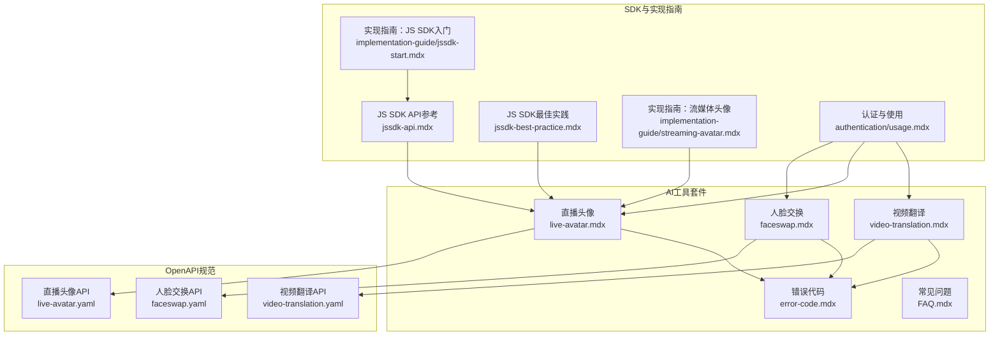
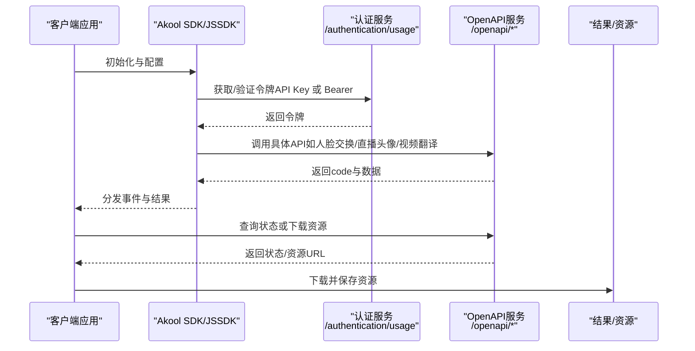
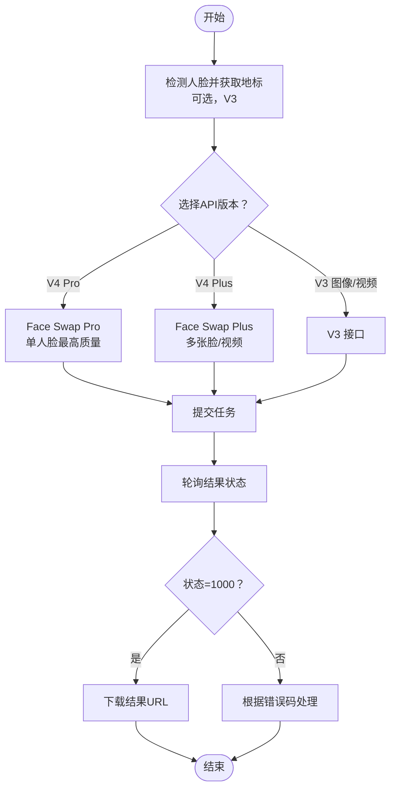
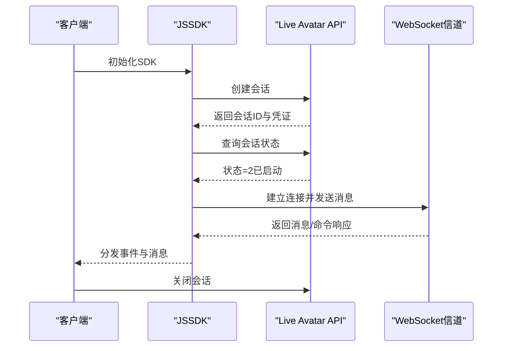
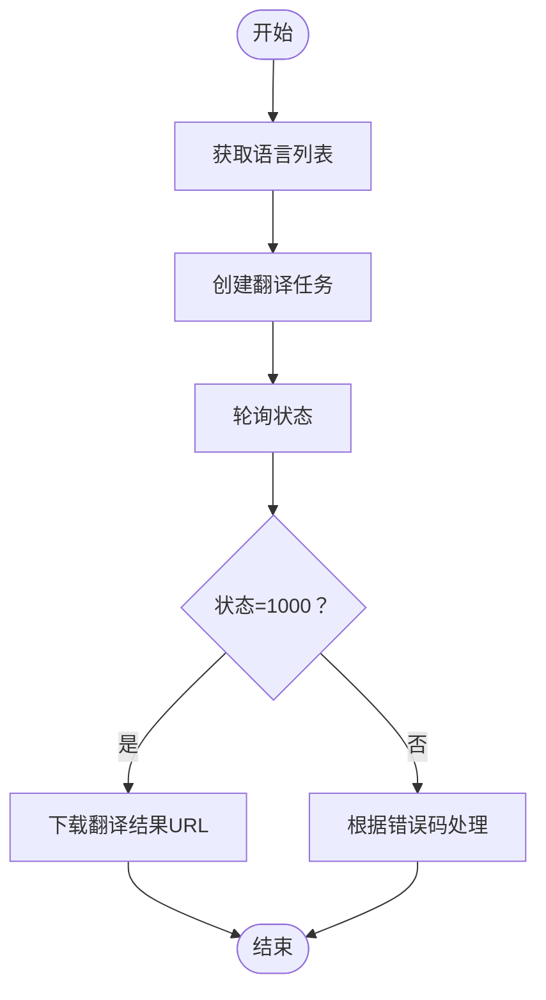
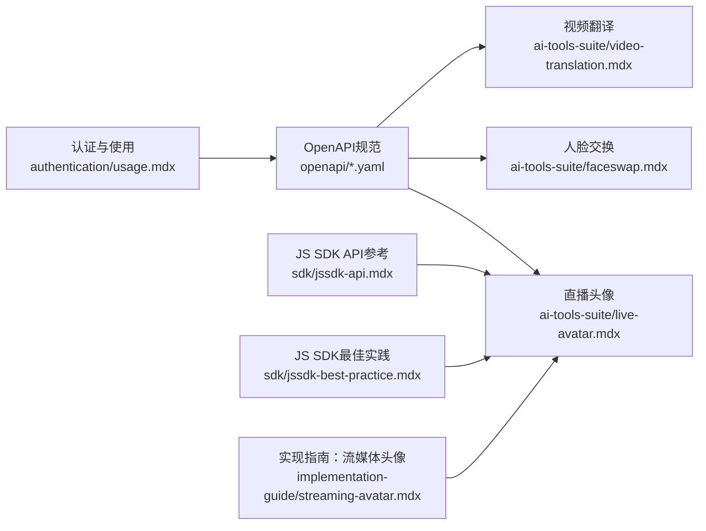

# 故障排除

<cite>
**本文引用的文件**
- [错误代码](file://ai-tools-suite/error-code.mdx)
- [常见问题](file://ai-tools-suite/FAQ.mdx)
- [人脸交换API](file://openapi/faceswap.yaml)
- [直播头像API](file://openapi/live-avatar.yaml)
- [视频翻译API](file://openapi/video-translation.yaml)
- [人脸交换概览](file://ai-tools-suite/faceswap.mdx)
- [直播头像概览](file://ai-tools-suite/live-avatar.mdx)
- [视频翻译概览](file://ai-tools-suite/video-translation.mdx)
- [JavaScript SDK API参考](file://sdk/jssdk-api.mdx)
- [JavaScript SDK最佳实践](file://sdk/jssdk-best-practice.mdx)
- [实现指南：流媒体头像](file://implementation-guide/streaming-avatar.mdx)
- [认证与使用](file://authentication/usage.mdx)
- [实现指南：JavaScript SDK入门](file://implementation-guide/jssdk-start.mdx)
</cite>

## 目录
1. [简介](#简介)
2. [项目结构](#项目结构)
3. [核心组件](#核心组件)
4. [架构总览](#架构总览)
5. [详细组件分析](#详细组件分析)
6. [依赖关系分析](#依赖关系分析)
7. [性能考虑](#性能考虑)
8. [故障排除指南](#故障排除指南)
9. [结论](#结论)
10. [附录](#附录)

## 简介
本故障排除文档面向 Akool AI Tools Suite 的使用者与集成开发者，旨在帮助您快速定位并解决在调用 API、使用 SDK、管理会话与资源时遇到的问题。内容覆盖：
- 错误代码对照表与解决方案
- 常见问题诊断流程与修复步骤
- 性能问题排查与优化建议
- 技术支持与问题反馈渠道

## 项目结构
Akool 文档仓库采用按功能模块组织的结构，AI 工具相关文档集中在 ai-tools-suite 目录下，并辅以 OpenAPI 规范、SDK 文档与实现指南，便于从接口定义到客户端集成的全链路排查。

图表来源
- [人脸交换概览](file://ai-tools-suite/faceswap.mdx)
- [直播头像概览](file://ai-tools-suite/live-avatar.mdx)
- [视频翻译概览](file://ai-tools-suite/video-translation.mdx)
- [人脸交换API](file://openapi/faceswap.yaml)
- [直播头像API](file://openapi/live-avatar.yaml)
- [视频翻译API](file://openapi/video-translation.yaml)
- [JavaScript SDK API参考](file://sdk/jssdk-api.mdx)
- [JavaScript SDK最佳实践](file://sdk/jssdk-best-practice.mdx)
- [实现指南：流媒体头像](file://implementation-guide/streaming-avatar.mdx)
- [认证与使用](file://authentication/usage.mdx)
- [实现指南：JavaScript SDK入门](file://implementation-guide/jssdk-start.mdx)

章节来源
- [人脸交换概览](file://ai-tools-suite/faceswap.mdx)
- [直播头像概览](file://ai-tools-suite/live-avatar.mdx)
- [视频翻译概览](file://ai-tools-suite/video-translation.mdx)

## 核心组件
- 错误代码与状态码：统一返回 code 字段，1000 表示成功；其他值表示失败或异常。不同模块（人脸交换、直播头像、视频翻译）有各自的错误码集合与状态说明。
- OpenAPI 规范：定义了各模块的端点、请求参数、响应模型与安全方案（API Key、Bearer Token），是排查接口问题的权威依据。
- SDK 与实现指南：提供客户端集成方式、事件处理、最佳实践与常见错误场景的规避策略。
- 认证与授权：支持直接 API Key 与 Bearer Token 两种方式，强调密钥的安全使用与后端代理。

章节来源
- [错误代码](file://ai-tools-suite/error-code.mdx)
- [人脸交换API](file://openapi/faceswap.yaml)
- [直播头像API](file://openapi/live-avatar.yaml)
- [视频翻译API](file://openapi/video-translation.yaml)
- [JavaScript SDK API参考](file://sdk/jssdk-api.mdx)
- [JavaScript SDK最佳实践](file://sdk/jssdk-best-practice.mdx)
- [认证与使用](file://authentication/usage.mdx)

## 架构总览
下图展示了从客户端到服务端的典型交互路径，以及错误与状态码在各环节的作用。

图表来源
- [认证与使用](file://authentication/usage.mdx)
- [JavaScript SDK API参考](file://sdk/jssdk-api.mdx)
- [人脸交换API](file://openapi/faceswap.yaml)
- [直播头像API](file://openapi/live-avatar.yaml)
- [视频翻译API](file://openapi/video-translation.yaml)

## 详细组件分析

### 人脸交换（Faceswap）
- 接口与工作流：支持图像与视频的人脸交换，提供 V3/V4 多种版本，推荐使用 Face Swap Plus 统一接口以支持多张脸与视频。
- 错误码与状态：包含参数错误、配额不足、操作频繁、资源不存在、权限不足、处理错误等；结果状态包括排队、处理中、成功、失败。
- 最佳实践：高质量输入、控制视频时长与分辨率、合理使用增强选项、及时清理历史结果。

图表来源
- [人脸交换概览](file://ai-tools-suite/faceswap.mdx)
- [人脸交换API](file://openapi/faceswap.yaml)
- [错误代码](file://ai-tools-suite/error-code.mdx)

章节来源
- [人脸交换概览](file://ai-tools-suite/faceswap.mdx)
- [人脸交换API](file://openapi/faceswap.yaml)
- [错误代码](file://ai-tools-suite/error-code.mdx)

### 直播头像（Live Avatar）
- 会话生命周期：创建头像模板 -> 创建会话 -> 检查状态 -> 连接信道 -> 发送消息/命令 -> 关闭会话。
- 协议与消息：支持聊天消息与系统命令（设置参数、打断响应等），通过 WebSocket 实时交互。
- 错误码与状态：包含鉴权失效、参数错误、账户被禁、处理错误、会话不存在/繁忙等。

图表来源
- [直播头像概览](file://ai-tools-suite/live-avatar.mdx)
- [直播头像API](file://openapi/live-avatar.yaml)
- [JavaScript SDK API参考](file://sdk/jssdk-api.mdx)
- [JavaScript SDK最佳实践](file://sdk/jssdk-best-practice.mdx)

章节来源
- [直播头像概览](file://ai-tools-suite/live-avatar.mdx)
- [直播头像API](file://openapi/live-avatar.yaml)
- [JavaScript SDK API参考](file://sdk/jssdk-api.mdx)
- [JavaScript SDK最佳实践](file://sdk/jssdk-best-practice.mdx)

### 视频翻译（Video Translation）
- 功能特性：多语言翻译、自动语言检测、唇同步、字幕处理、背景音乐移除、风格化语音映射。
- 错误码与状态：包含参数错误、资源不存在、权限不足、音频缺失、时长超限、编码不支持、帧率超限等；状态包括排队、处理中、完成、失败。
- 最佳实践：控制视频时长与大小、正确设置语言与语音参数、启用 webhook 回调。

图表来源
- [视频翻译概览](file://ai-tools-suite/video-translation.mdx)
- [视频翻译API](file://openapi/video-translation.yaml)
- [错误代码](file://ai-tools-suite/error-code.mdx)

章节来源
- [视频翻译概览](file://ai-tools-suite/video-translation.mdx)
- [视频翻译API](file://openapi/video-translation.yaml)
- [错误代码](file://ai-tools-suite/error-code.mdx)

## 依赖关系分析
- 安全与认证：OpenAPI 支持 API Key 与 Bearer Token 两种方式，推荐直接使用 API Key 并通过后端代理访问，避免前端暴露密钥。
- SDK 与服务端：JSSDK 提供事件回调与异常处理，结合 OpenAPI 的状态码与错误描述进行问题定位。
- 资源有效期：生成的图片/视频/语音资源通常有效期为 7 天，需及时下载与保存。

图表来源
- [认证与使用](file://authentication/usage.mdx)
- [人脸交换API](file://openapi/faceswap.yaml)
- [直播头像API](file://openapi/live-avatar.yaml)
- [视频翻译API](file://openapi/video-translation.yaml)
- [JavaScript SDK API参考](file://sdk/jssdk-api.mdx)
- [JavaScript SDK最佳实践](file://sdk/jssdk-best-practice.mdx)
- [实现指南：流媒体头像](file://implementation-guide/streaming-avatar.mdx)

章节来源
- [认证与使用](file://authentication/usage.mdx)
- [JavaScript SDK API参考](file://sdk/jssdk-api.mdx)
- [JavaScript SDK最佳实践](file://sdk/jssdk-best-practice.mdx)
- [实现指南：流媒体头像](file://implementation-guide/streaming-avatar.mdx)

## 性能考虑
- 消息分片与速率限制：在直播头像场景中，对消息进行分片并施加最小发送间隔，避免超过最大编码尺寸与带宽限制。
- 输入质量与规格：人脸交换与视频翻译对输入质量、时长、大小、帧率、编码格式有明确要求，遵循最佳实践可显著提升成功率与速度。
- 资源管理：定期清理历史结果，避免存储与配额压力；使用 webhook 回调减少轮询开销。

章节来源
- [实现指南：流媒体头像](file://implementation-guide/streaming-avatar.mdx)
- [人脸交换概览](file://ai-tools-suite/faceswap.mdx)
- [视频翻译概览](file://ai-tools-suite/video-translation.mdx)

## 故障排除指南

### 通用排错步骤
1. 检查返回 code 是否为 1000，非 1000 时根据模块错误码表定位原因。
2. 确认认证方式与令牌有效性：优先使用 API Key，必要时通过后端获取 Bearer Token。
3. 对照 OpenAPI 规范核对请求参数、头部与请求体格式。
4. 使用状态查询接口确认任务状态，避免重复提交或并发冲突。
5. 查看 SDK 事件回调与异常处理，结合日志定位问题。

章节来源
- [错误代码](file://ai-tools-suite/error-code.mdx)
- [认证与使用](file://authentication/usage.mdx)
- [JavaScript SDK API参考](file://sdk/jssdk-api.mdx)

### 错误代码对照与解决方案

- 通用错误（1000 成功，其他均为失败）
  - 1003 参数错误或必填项为空
  - 1004 需要验证
  - 1005 操作过于频繁
  - 1006 配额余额不足
  - 1007 人脸数量变更超出限制
  - 1008 请求内容不存在
  - 1009 权限不足
  - 1010 该内容无法操作
  - 1011 该内容已被操作
  - 1013 视频中缺少音频
  - 1014 资源不存在
  - 1015 视频处理错误
  - 1016 人脸交换错误
  - 1017 音频未生成
  - 1101 非法令牌或令牌过期
  - 1102 令牌不能为空
  - 1103 未付费或欠费
  - 1104 余额不足
  - 1105 头像处理错误
  - 1108 图像处理错误
  - 1109 账户不存在
  - 1110 音频处理错误
  - 1111 头像回调处理错误
  - 1112 语音处理错误
  - 1200 账户被封禁
  - 1201 创建音频错误
  - 1202 同一视频同语言多次唇同步
  - 1203 视频应包含音频
  - 1204 视频时长超限（60 秒）
  - 1205 创建视频错误
  - 1206 背景更换处理错误
  - 1207 视频大小超限（300MB）
  - 1208 视频解析错误
  - 1209 不支持的视频编码格式
  - 1210 视频帧率超限（60fps）
  - 1211 创建唇同步错误
  - 1212 情感分析失败
  - 1213 需要订阅用户
  - 1214 直播头像正在处理
  - 1215 直播头像处理繁忙
  - 1216 直播头像会话不存在
  - 1217 直播头像回调错误
  - 1218 直播头像处理错误
  - 1219 直播头像已关闭
  - 1220 直播头像上传头像错误
  - 1221 未订阅账户
  - 1222 资源已存在
  - 1223 直播头像上传超限

- 人脸交换（Faceswap）
  - 常见：参数错误、配额不足、人脸数量超限、处理错误
  - 解决：检查输入图像/视频质量与数量，确保符合规格；使用 webhook 获取通知；清理历史结果释放配额

- 直播头像（Live Avatar）
  - 常见：鉴权失效、会话不存在/繁忙、处理错误、回调错误
  - 解决：重新获取会话凭证；等待队列空闲；检查 WebSocket 连接与事件监听；确认回调地址可用

- 视频翻译（Video Translation）
  - 常见：音频缺失、时长超限、编码不支持、帧率超限、创建错误
  - 解决：确保视频包含清晰音频；压缩时长与大小；转换为标准编码格式；降低帧率至限制内

章节来源
- [错误代码](file://ai-tools-suite/error-code.mdx)
- [人脸交换概览](file://ai-tools-suite/faceswap.mdx)
- [直播头像概览](file://ai-tools-suite/live-avatar.mdx)
- [视频翻译概览](file://ai-tools-suite/video-translation.mdx)

### 常见问题诊断与修复

- 直播头像播放地址如何在网页/桌面应用中显示？
  - 使用支持拉取 RTMP 协议的播放器加载客户端流地址
  - 参考推荐播放器与示例链接进行集成

- WebSocket 连接与消息处理流程
  - 创建会话后轮询状态，当状态=2 时建立 WSS 连接并发送文本与命令
  - 监听消息回调并将其应用到业务逻辑

- 如何有效实现流式数据处理
  - 参考 SDK 事件回调与异常处理，结合网络统计更新 UI
  - 注意令牌即将/已过期的处理流程

章节来源
- [常见问题](file://ai-tools-suite/FAQ.mdx)
- [直播头像概览](file://ai-tools-suite/live-avatar.mdx)
- [JavaScript SDK API参考](file://sdk/jssdk-api.mdx)
- [JavaScript SDK最佳实践](file://sdk/jssdk-best-practice.mdx)

### 性能问题排查与优化建议

- 消息发送速率与分片
  - 控制每块大小不超过最大编码尺寸，按最小时间间隔发送，避免拥塞
  - 对于长消息进行分片并有序发送，最后标记完成

- 输入规格优化
  - 人脸交换：提高分辨率、保证面部清晰可见、良好光照与角度
  - 视频翻译：控制时长与大小、标准编码、合理帧率

- 资源与配额管理
  - 及时下载与保存生成的资源，避免过期
  - 使用 webhook 减少轮询频率，合理安排批量任务

章节来源
- [实现指南：流媒体头像](file://implementation-guide/streaming-avatar.mdx)
- [人脸交换概览](file://ai-tools-suite/faceswap.mdx)
- [视频翻译概览](file://ai-tools-suite/video-translation.mdx)

## 结论
通过统一的错误码体系、完善的 OpenAPI 规范、可靠的 SDK 与最佳实践，Akool AI Tools Suite 提供了从接口调用到客户端集成的完整支持。遇到问题时，请先核对返回 code 与错误描述，再对照本文提供的模块化排错步骤与优化建议，通常可以快速定位并解决问题。

## 附录

### 技术支持与问题反馈渠道
- 官方认证与使用指南：用于获取 API Key 与 Bearer Token，确保密钥安全使用
- 直播头像 SDK API 参考与最佳实践：涵盖事件处理、异常捕获与安全集成
- 实现指南：包含流媒体头像的详细集成步骤与示例

章节来源
- [认证与使用](file://authentication/usage.mdx)
- [JavaScript SDK API参考](file://sdk/jssdk-api.mdx)
- [JavaScript SDK最佳实践](file://sdk/jssdk-best-practice.mdx)
- [实现指南：JavaScript SDK入门](file://implementation-guide/jssdk-start.mdx)