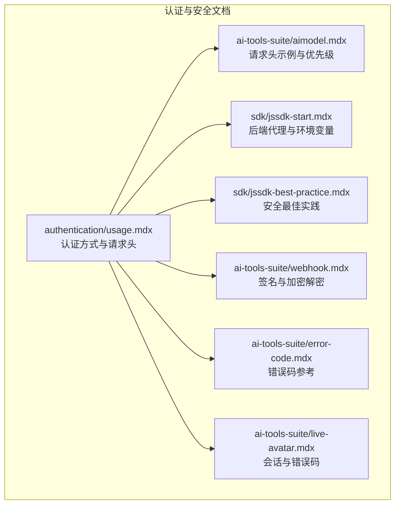
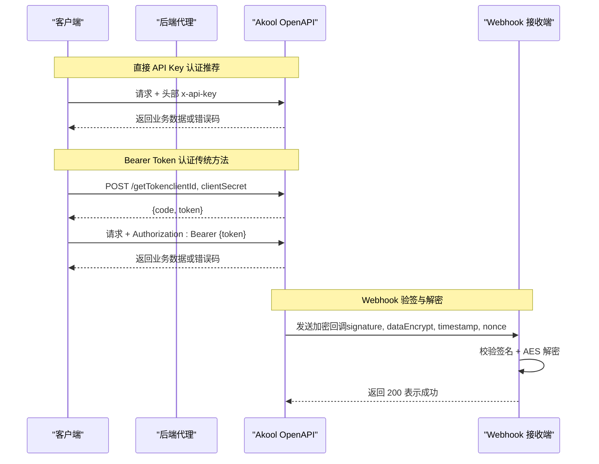
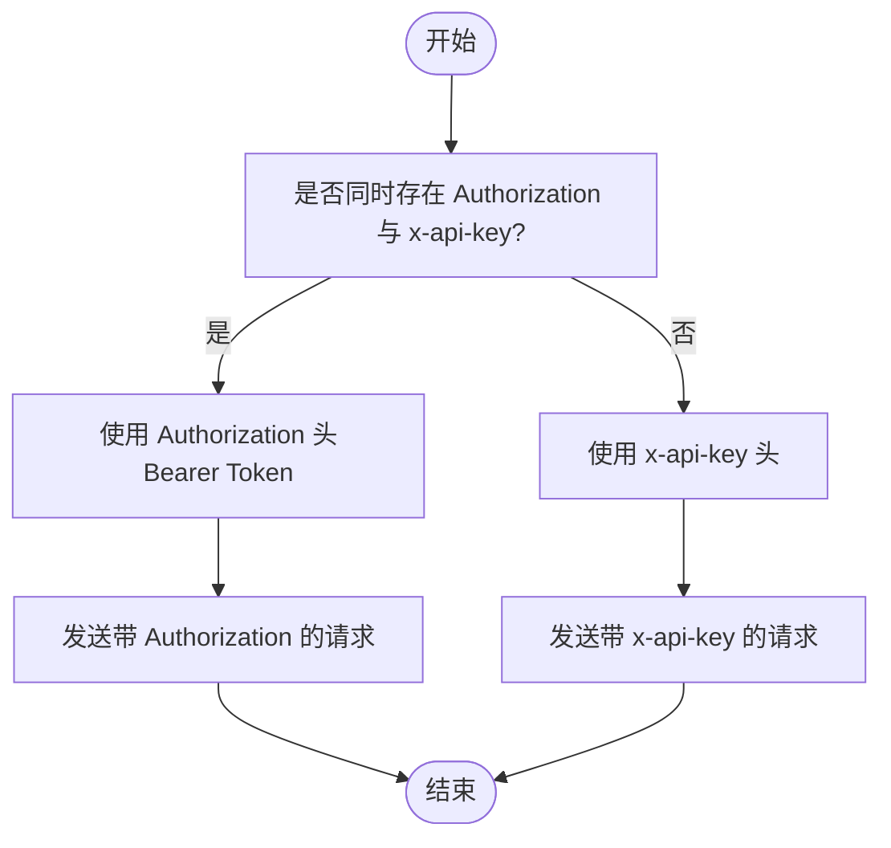
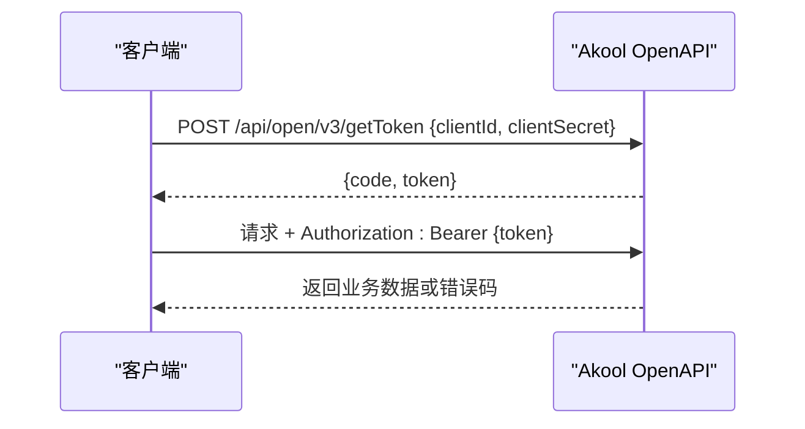
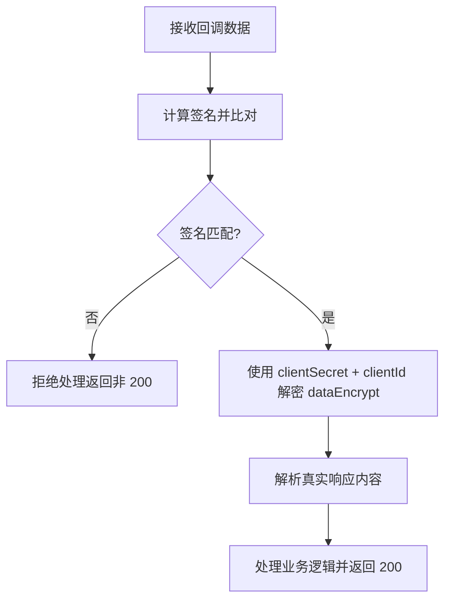
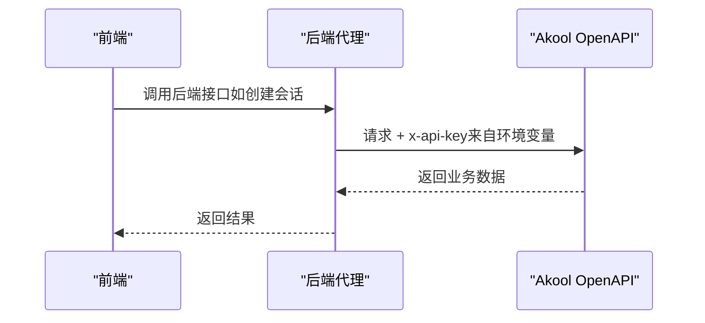
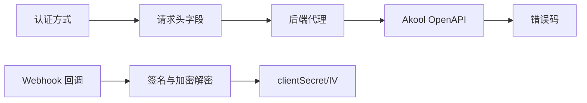

# 认证机制

<cite>
**本文引用的文件**
- [authentication/usage.mdx](file://authentication/usage.mdx)
- [ai-tools-suite/aimodel.mdx](file://ai-tools-suite/aimodel.mdx)
- [ai-tools-suite/error-code.mdx](file://ai-tools-suite/error-code.mdx)
- [sdk/jssdk-start.mdx](file://sdk/jssdk-start.mdx)
- [sdk/jssdk-best-practice.mdx](file://sdk/jssdk-best-practice.mdx)
- [ai-tools-suite/webhook.mdx](file://ai-tools-suite/webhook.mdx)
- [ai-tools-suite/live-avatar.mdx](file://ai-tools-suite/live-avatar.mdx)
</cite>

## 目录
1. [简介](#简介)
2. [项目结构](#项目结构)
3. [核心组件](#核心组件)
4. [架构总览](#架构总览)
5. [详细组件分析](#详细组件分析)
6. [依赖关系分析](#依赖关系分析)
7. [性能考量](#性能考量)
8. [故障排查指南](#故障排查指南)
9. [结论](#结论)
10. [附录](#附录)

## 简介
本文件系统性阐述 Akool AI Tools Suite 的认证机制与安全最佳实践，覆盖以下关键主题：
- API 认证方式与选择建议（推荐直接 API Key）
- API Key 管理与安全存储策略
- 请求头设置与令牌传递规范
- 传统 Bearer Token 获取流程与注意事项
- Webhook 消息签名与加密解密校验
- 常见错误码与故障排查
- 安全使用建议与防护措施

## 项目结构
认证相关内容主要分布在以下文档中：
- 认证使用说明：定义两种认证方法、请求头格式、令牌生成与安全提示
- AI 模型接口文档：展示 x-api-key 与 Authorization 的使用场景与优先级
- 错误码参考：统一的业务状态码与错误含义
- SDK 快速开始与最佳实践：后端代理、环境变量、事件处理与安全实践
- Webhook 文档：消息签名与 AES 加密解密流程
- Live Avatar 文档：会话管理与错误码说明

图表来源
- [authentication/usage.mdx:1-280](file://authentication/usage.mdx#L1-L280)
- [ai-tools-suite/aimodel.mdx:14-20](file://ai-tools-suite/aimodel.mdx#L14-L20)
- [ai-tools-suite/error-code.mdx:6-59](file://ai-tools-suite/error-code.mdx#L6-L59)
- [sdk/jssdk-start.mdx:220-266](file://sdk/jssdk-start.mdx#L220-L266)
- [sdk/jssdk-best-practice.mdx:30-112](file://sdk/jssdk-best-practice.mdx#L30-L112)
- [ai-tools-suite/webhook.mdx:45-78](file://ai-tools-suite/webhook.mdx#L45-L78)
- [ai-tools-suite/live-avatar.mdx:339-365](file://ai-tools-suite/live-avatar.mdx#L339-L365)

章节来源
- [authentication/usage.mdx:1-280](file://authentication/usage.mdx#L1-L280)
- [ai-tools-suite/aimodel.mdx:1-267](file://ai-tools-suite/aimodel.mdx#L1-L267)
- [ai-tools-suite/error-code.mdx:1-59](file://ai-tools-suite/error-code.mdx#L1-L59)
- [sdk/jssdk-start.mdx:1-590](file://sdk/jssdk-start.mdx#L1-L590)
- [sdk/jssdk-best-practice.mdx:1-203](file://sdk/jssdk-best-practice.mdx#L1-L203)
- [ai-tools-suite/webhook.mdx:1-447](file://ai-tools-suite/webhook.mdx#L1-L447)
- [ai-tools-suite/live-avatar.mdx:1-365](file://ai-tools-suite/live-avatar.mdx#L1-L365)

## 核心组件
- 直接 API Key 认证（推荐）：在 HTTP 头部使用自定义 x-api-key 字段传递 API Key
- 传统 Bearer Token 认证：通过 /getToken 获取访问令牌，并在后续请求中使用 Authorization: Bearer {token}
- Webhook 验签与加密：基于 clientSecret 的 AES-CBC 加密与 SHA-1 签名验证
- 后端代理与环境变量：避免前端暴露敏感凭据，通过后端安全加载 API Key

章节来源
- [authentication/usage.mdx:10-48](file://authentication/usage.mdx#L10-L48)
- [authentication/usage.mdx:63-84](file://authentication/usage.mdx#L63-L84)
- [ai-tools-suite/webhook.mdx:45-78](file://ai-tools-suite/webhook.mdx#L45-L78)
- [sdk/jssdk-start.mdx:220-266](file://sdk/jssdk-start.mdx#L220-L266)

## 架构总览
下图展示了三种典型认证路径：直接 API Key、Bearer Token、Webhook 回调。

图表来源
- [authentication/usage.mdx:52-84](file://authentication/usage.mdx#L52-L84)
- [authentication/usage.mdx:166-268](file://authentication/usage.mdx#L166-L268)
- [ai-tools-suite/webhook.mdx:45-78](file://ai-tools-suite/webhook.mdx#L45-L78)

## 详细组件分析

### 组件一：直接 API Key 认证（推荐）
- 使用场景：最简集成方式，无需额外获取令牌步骤
- 请求头设置：在所有请求中添加自定义头部 x-api-key: {API Key}
- 与 Bearer Token 的优先级：当同时存在 Authorization 和 x-api-key 时，Authorization 优先，x-api-key 将被忽略
- 安全要点：API Key 为机密信息，严禁在前端代码或客户端暴露；生产请求必须经由后端代理

图表来源
- [ai-tools-suite/aimodel.mdx:17-19](file://ai-tools-suite/aimodel.mdx#L17-L19)
- [authentication/usage.mdx:19-24](file://authentication/usage.mdx#L19-L24)

章节来源
- [authentication/usage.mdx:10-24](file://authentication/usage.mdx#L10-L24)
- [ai-tools-suite/aimodel.mdx:14-20](file://ai-tools-suite/aimodel.mdx#L14-L20)

### 组件二：Bearer Token 获取与使用（传统方法）
- 获取令牌：POST /api/open/v3/getToken，请求体包含 clientId 与 clientSecret（与 API Key 值相同）
- 令牌有效期：官方说明超过一年有效
- 使用令牌：后续请求在 Authorization 头中使用 Bearer {token}
- 安全提示：令牌同样为机密，应仅在服务端保存与使用

图表来源
- [authentication/usage.mdx:63-84](file://authentication/usage.mdx#L63-L84)
- [authentication/usage.mdx:166-268](file://authentication/usage.mdx#L166-L268)

章节来源
- [authentication/usage.mdx:63-84](file://authentication/usage.mdx#L63-L84)
- [authentication/usage.mdx:166-268](file://authentication/usage.mdx#L166-L268)

### 组件三：Webhook 验签与加密解密
- 数据结构：signature、dataEncrypt、timestamp、nonce
- 加密算法：AES-CBC，密钥长度 24 字节，IV 为 clientId，填充方式 PKCS#7
- 签名算法：对排序后的 (clientId, timestamp, nonce, dataEncrypt) 进行 SHA-1
- 成功条件：签名一致且解密成功，回调方需返回 HTTP 200

图表来源
- [ai-tools-suite/webhook.mdx:45-78](file://ai-tools-suite/webhook.mdx#L45-L78)
- [ai-tools-suite/webhook.mdx:284-310](file://ai-tools-suite/webhook.mdx#L284-L310)

章节来源
- [ai-tools-suite/webhook.mdx:45-78](file://ai-tools-suite/webhook.mdx#L45-L78)
- [ai-tools-suite/webhook.mdx:284-310](file://ai-tools-suite/webhook.mdx#L284-L310)

### 组件四：后端代理与环境变量（安全实践）
- 后端代理：将所有对 Akool API 的调用置于后端，避免前端直接暴露 API Key
- 环境变量：从服务器环境变量或密钥管理服务加载 API Key
- 事件处理：SDK 提供 token 过期等事件监听，便于及时处理异常

图表来源
- [sdk/jssdk-start.mdx:220-266](file://sdk/jssdk-start.mdx#L220-L266)
- [sdk/jssdk-best-practice.mdx:30-112](file://sdk/jssdk-best-practice.mdx#L30-L112)

章节来源
- [sdk/jssdk-start.mdx:220-266](file://sdk/jssdk-start.mdx#L220-L266)
- [sdk/jssdk-best-practice.mdx:30-112](file://sdk/jssdk-best-practice.mdx#L30-L112)

## 依赖关系分析
- 认证方式依赖于请求头字段与后端代理策略
- Webhook 依赖于 clientSecret、clientId、时间戳与随机数进行签名与解密
- 错误码统一由业务接口返回，用于定位失败原因

图表来源
- [authentication/usage.mdx:19-24](file://authentication/usage.mdx#L19-L24)
- [ai-tools-suite/webhook.mdx:45-78](file://ai-tools-suite/webhook.mdx#L45-L78)
- [ai-tools-suite/error-code.mdx:6-59](file://ai-tools-suite/error-code.mdx#L6-L59)

章节来源
- [authentication/usage.mdx:19-24](file://authentication/usage.mdx#L19-L24)
- [ai-tools-suite/webhook.mdx:45-78](file://ai-tools-suite/webhook.mdx#L45-L78)
- [ai-tools-suite/error-code.mdx:6-59](file://ai-tools-suite/error-code.mdx#L6-L59)

## 性能考量
- 直接 API Key 方式减少一次令牌获取请求，降低网络往返开销
- 后端代理可复用连接、缓存与限流策略，提升整体吞吐
- Webhook 回调需快速完成验签与解密，避免阻塞主线程

## 故障排查指南
- 通用错误码
  - 1000：成功
  - 1003：参数错误
  - 1009：权限不足
  - 1101：非法令牌或令牌过期
  - 1102：授权不能为空
  - 1200：账户被封禁
- Live Avatar 特定错误码
  - 1200 至 1223：涵盖会话、资源、配额等错误
- 排查步骤
  - 确认请求头是否正确设置（Authorization 或 x-api-key）
  - 若使用 Bearer Token，确认未过期且未被篡改
  - 对于 Webhook，检查签名与解密流程是否符合规范
  - 查看后端日志，定位代理层错误

章节来源
- [ai-tools-suite/error-code.mdx:6-59](file://ai-tools-suite/error-code.mdx#L6-L59)
- [ai-tools-suite/live-avatar.mdx:339-365](file://ai-tools-suite/live-avatar.mdx#L339-L365)

## 结论
- 强烈推荐使用直接 API Key 认证，简化集成并降低泄露风险
- 所有敏感凭据必须置于后端，通过环境变量或密钥管理服务加载
- 对于 Webhook，严格遵循签名与加密解密流程，确保回调安全可靠
- 建立完善的错误码监控与告警，快速定位并解决问题

## 附录
- 请求头设置示例与优先级说明
- Bearer Token 获取与使用流程
- Webhook 验签与解密代码片段路径
- 后端代理与环境变量配置示例

章节来源
- [authentication/usage.mdx:52-84](file://authentication/usage.mdx#L52-L84)
- [authentication/usage.mdx:166-268](file://authentication/usage.mdx#L166-L268)
- [ai-tools-suite/webhook.mdx:45-78](file://ai-tools-suite/webhook.mdx#L45-L78)
- [sdk/jssdk-start.mdx:220-266](file://sdk/jssdk-start.mdx#L220-L266)