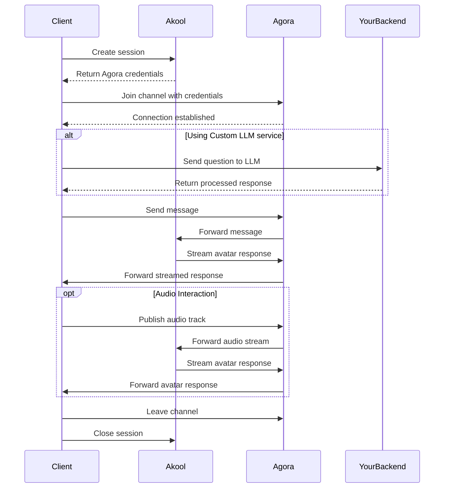

## Overview

This guide will walk you through integrating the streaming avatar feature using the Agora SDK.

## Prerequisites

1. Install the Agora SDK in your project:

```bash
npm install agora-rtc-sdk-ng
# or
yarn add agora-rtc-sdk-ng
```

2. Import the required dependencies:

```ts
import AgoraRTC, { IAgoraRTCClient } from "agora-rtc-sdk-ng";
```

3. Add the hidden API of Agora SDK

Agora SDK's sendStreamMessage is not exposed, so we need to add it manually. And it has some limitations, so we need to handle it carefully.

We can guess [from the doc](https://docs.agora.io/en/voice-calling/troubleshooting/error-codes?platform=android#data-stream-related-error-codes) that the message size is limited to 1KB and the message frequency is limited to 6KB per second.

The Agora SDK's `sendStreamMessage` method needs to be manually added to the type definitions:

```ts
interface RTCClient extends IAgoraRTCClient {
  sendStreamMessage(msg: Uint8Array | string, flag: boolean): Promise<void>;
}
```

> **Important**: The Agora SDK has the following limitations:
> - Maximum message size: 1KB
> - Maximum message frequency: 6KB per second

## Integration Flow



## Key Implementation Steps

### 1. Create a Live Avatar Session

First, create a session to obtain Agora credentials:

```ts
async function createSession() {
  const response = await fetch('https://openapi.akool.com/api/open/v4/liveAvatar/session/create', {
    method: 'POST',
    headers: {
      'Authorization': 'Bearer YOUR_TOKEN',
      'Content-Type': 'application/json'
    },
    body: JSON.stringify({
      avatar_id: "dvp_Tristan_cloth2_1080P"
    })
  });

  const res = await response.json();
  return res.data;
}
```

### 2. Initialize Agora Client

Create and configure the Agora client:

```ts
async function initializeAgoraClient(credentials) {
  const client = AgoraRTC.createClient({
    mode: 'rtc',
    codec: 'vp8'
  });

  try {
    await client.join(
      credentials.agora_app_id,
      credentials.agora_channel,
      credentials.agora_token,
      credentials.agora_uid
    );
    
    return client;
  } catch (error) {
    console.error('Error joining channel:', error);
    throw error;
  }
}
```

### 3. Subscribe Audio and Video Stream

Subscribe to the audio and video stream of the avatar:

```ts
async function subscribeToAvatarStream(client: IAgoraRTCClient) { 
  const onUserPublish = async (user: IAgoraRTCRemoteUser, mediaType: 'video' | 'audio') => {
    const remoteTrack = await client.subscribe(user, mediaType);
    remoteTrack.play();
  };

  const onUserUnpublish = async (user: IAgoraRTCRemoteUser, mediaType: 'video' | 'audio') => {
    await client.unsubscribe(user, mediaType);
  };

  client.on('user-published', onUserPublish);
  client.on('user-unpublished', onUserUnpublish);
}
```

### 4. Set Up Message Handling

Configure message listeners to handle avatar responses:

```ts
function setupMessageHandlers(client: IAgoraRTCClient) {
  let answer = '';
  client.on('stream-message', (uid, message) => {
    try {
      const parsedMessage = JSON.parse(message);
      
      if (parsedMessage.type === 'chat') {
        const payload = JSON.parse(parsedMessage.payload);
        
        if (!payload.answer_ended) {
          answer += payload.answer;
        } else {
          console.log('Avatar response:', answer);
          answer = '';
        }
      }
    } catch (error) {
      console.error('Error parsing message:', error);
    }
  });
}
```

### 5. Send Messages to Avatar

Implement functions to interact with the avatar:

```ts
async function sendMessageToAvatar(client: IAgoraRTCClient, question: string) {
  const message = {
    type: "chat",
    payload: JSON.stringify({
      message_id: `msg-${Date.now()}`,
      voice_id: "21m00Tcm4TlvDq8ikWAM", // Example voice ID
      language: "en",
      mode_type: 2, // Dialogue mode
      prompt: {
        from: "text",
        content: ""
      },
      question: question,
      question_ended: true,
    })
  };

  try {
    await client.sendStreamMessage(JSON.stringify(message), false);
  } catch (error) {
    console.error('Error sending message:', error);
    throw error;
  }
}
```

In real-world scenarios, the message size is limited to 1KB and the message frequency is limited to 6KB per second, so we need to split the message into chunks and send them separately.

```ts
async function sendMessageToAvatar(
  client: RTCClient,
  inputMessage: string,
  messageId: string,
  voiceId: string,
  language: string,
  modeType: number,
) {
  const message_id = messageId;

  // Helper function to create message payload
  const createPayload = (question: string, isEnded: boolean) => ({
    message_id,
    voice_id: voiceId,
    voice_url: '',
    language,
    mode_type: modeType,
    prompt: { from: 'url', content: '' },
    question,
    question_ended: isEnded,
  });

  // Helper function to encode message
  const encodeMessage = (question: string, isEnded: boolean) => {
    const message = {
      type: 'chat',
      payload: JSON.stringify(createPayload(question, isEnded)),
    };
    return new TextEncoder().encode(JSON.stringify(message));
  };

  const maxEncodedSize = 950; // Leave buffer below 1kb limit
  const baseEncoded = encodeMessage('', false);
  // Conservative UTF-8 encoding estimate
  const maxQuestionLength = Math.floor((maxEncodedSize - baseEncoded.length) / 4);

  // Split message into chunks that fit size limit
  const chunks: string[] = [];
  let remainingMessage = inputMessage;

  while (remainingMessage.length > 0) {
    let chunk = remainingMessage.slice(0, maxQuestionLength);
    let encoded = encodeMessage(chunk, false);

    // Reduce chunk size if needed
    while (encoded.length > maxEncodedSize && chunk.length > 0) {
      chunk = chunk.slice(0, chunk.length - 10);
      encoded = encodeMessage(chunk, false);
    }

    if (chunk.length === 0) {
      throw new Error('Unable to encode message: single character exceeds size limit');
    }

    chunks.push(chunk);
    remainingMessage = remainingMessage.slice(chunk.length);
  }

  // Calculate rate limiting delay based on 6kb/s limit
  const bytesPerSecond = 6000; // 6kb/s

  // Send chunks with rate limiting
  for (let i = 0; i < chunks.length; i++) {
    const isLastChunk = i === chunks.length - 1;
    const body = encodeMessage(chunks[i], isLastChunk);
    const chunkSize = body.length;
    
    // Calculate minimum time needed for this chunk at 6kb/s
    const minimumTimeMs = Math.ceil((1000 * chunkSize) / bytesPerSecond);
    const startTime = Date.now();

    console.log(`Sending chunk ${i + 1}/${chunks.length}, size=${chunkSize} bytes`);
    await client.sendStreamMessage(body, false);
    
    if (!isLastChunk) {
      const elapsedMs = Date.now() - startTime;
      // Only wait if we completed faster than our rate limit requires
      const remainingDelay = Math.max(0, minimumTimeMs - elapsedMs);
      if (remainingDelay > 0) {
        await new Promise((resolve) => setTimeout(resolve, remainingDelay));
      }
    }
  }
}

```

### 6. Control Avatar Parameters

Implement functions to control avatar settings:

```ts
async function setAvatarParams(client: IAgoraRTCClient, params: {
  voice_id?: string;
  language?: string;
  mode_type?: number;
  background_url?: string;
}) {
  const message = {
    type: 'command',
    payload: JSON.stringify({
      command: 'set-params',
      params
    })
  };

  await client.sendStreamMessage(JSON.stringify(message), false);
}

async function interruptAvatar(client: IAgoraRTCClient) {
  const message = {
    type: 'command',
    payload: JSON.stringify({
      command: 'interrupt'
    })
  };

  await client.sendStreamMessage(JSON.stringify(message), false);
}
```

### 7. Audio Interaction With The Avatar

To enable audio interaction with the avatar, you'll need to publish your local audio stream:

```ts
async function publishAudio(client: IAgoraRTCClient) {
  // Create a microphone audio track
  const audioTrack = await AgoraRTC.createMicrophoneAudioTrack();
  
  try {
    // Publish the audio track to the channel
    await client.publish(audioTrack);
    console.log("Audio publishing successful");
    
    return audioTrack;
  } catch (error) {
    console.error("Error publishing audio:", error);
    throw error;
  }
}

// Example usage with audio controls
async function setupAudioInteraction(client: IAgoraRTCClient) {
  let audioTrack;
  
  // Start audio
  async function startAudio() {
    try {
      audioTrack = await publishAudio(client);
    } catch (error) {
      console.error("Failed to start audio:", error);
    }
  }

  // Stop audio
  async function stopAudio() {
    if (audioTrack) {
      // Stop and close the audio track
      audioTrack.stop();
      audioTrack.close();
      await client.unpublish(audioTrack);
      audioTrack = null;
    }
  }

  // Mute/unmute audio
  function toggleAudio(muted: boolean) {
    if (audioTrack) {
      if (muted) {
        audioTrack.setEnabled(false);
      } else {
        audioTrack.setEnabled(true);
      }
    }
  }

  return {
    startAudio,
    stopAudio,
    toggleAudio
  };
}
```

Now you can integrate audio controls into your application:

```ts
async function initializeWithAudio() {
  try {
    // Initialize avatar
    const client = await initializeStreamingAvatar();
    
    // Setup audio controls
    const audioControls = await setupAudioInteraction(client);
    
    // Start audio when needed
    await audioControls.startAudio();
    
    // Example of muting/unmuting
    audioControls.toggleAudio(true); // mute
    audioControls.toggleAudio(false); // unmute
    
    // Stop audio when done
    await audioControls.stopAudio();
    
  } catch (error) {
    console.error("Error initializing with audio:", error);
  }
}
```

For more details about Agora's audio functionality, refer to the [Agora Web SDK Documentation](https://docs.agora.io/en/voice-calling/get-started/get-started-sdk?platform=web#publish-a-local-audio-track).

### 8. Integrating your own LLM service (optional)

You can integrate your own LLM service to process messages before sending them to the avatar. Here's how to do it:

```ts
// Define the LLM service response interface
interface LLMResponse {
  answer: string;
}

// Create a wrapper for your LLM service
async function processWithLLM(question: string): Promise<LLMResponse> {
  try {
    const response = await fetch('YOUR_LLM_SERVICE_ENDPOINT', {
      method: 'POST',
      headers: {
        'Content-Type': 'application/json',
      },
      body: JSON.stringify({
        question,
      })
    });

    if (!response.ok) {
      throw new Error('LLM service request failed');
    }

    return await response.json();
  } catch (error) {
    console.error('Error processing with LLM:', error);
    throw error;
  }
}

async function sendMessageToAvatarWithLLM(
  client: IAgoraRTCClient, 
  question: string
) {
  try {
    // Process the question with your LLM service
    const llmResponse = await processWithLLM(question);

    // Prepare the message with LLM response
    const message = {
      type: "chat",
      payload: JSON.stringify({
        message_id: `msg-${Date.now()}`,
        voice_id: "21m00Tcm4TlvDq8ikWAM",
        language: "en",
        mode_type: 1, // Retelling mode
        prompt: {
          from: "text",
          content: ""
        },
        question: llmResponse.answer // Use the LLM-processed response
      })
    };

    // Send the processed message to the avatar
    await client.sendStreamMessage(JSON.stringify(message), false);

  } catch (error) {
    console.error('Error in LLM-enhanced message sending:', error);
    throw error;
  }
}
```

*Remember to*:
1. Implement proper rate limiting for your LLM service
2. Handle token limits appropriately
3. Implement retry logic for failed LLM requests
4. Consider implementing streaming responses if your LLM service supports it
5. Cache common responses when appropriate

### 9. Putting It All Together

Here's how to use all the components together:

```ts
async function initializeStreamingAvatar() {
  try {
    // Create session and get credentials
    const session = await createSession();
    const { stream_urls: credentials } = session;
    
    // Initialize Agora client
    const client = await initializeAgoraClient(credentials);

    // Subscribe to the audio and video stream of the avatar
    await subscribeToAvatarStream(client);
    
    // Set up message handlers
    setupMessageHandlers(client);
    
    // Example usage
    await sendMessageToAvatar(client, "Hello!");

    // Or use your own LLM service
    await sendMessageToAvatarWithLLM(client, "Hello!");

    // Example of voice interaction
    await interruptAvatar(client);

    // Example of Audio Interaction With The Avatar
    await setupAudioInteraction(client);

    // Example of changing avatar parameters
    await setAvatarParams(client, {
      language: "en",
      voice_id: "new_voice_id"
    });
    
    return client;
  } catch (error) {
    console.error('Error initializing streaming avatar:', error);
    throw error;
  }
}
```

### 10. Cleanup

Don't forget to clean up when you're done:

```ts
async function cleanup(client: IAgoraRTCClient) {
  // Close the avatar session
  await fetch('https://openapi.akool.com/api/open/v4/liveAvatar/session/close', {
    method: 'POST',
    headers: {
      'Authorization': 'Bearer YOUR_TOKEN'
    },
    body: JSON.stringify({
      id: session._id
    })
  });

  // Remove event listeners
  client.removeAllListeners('user-published');
  client.removeAllListeners('user-unpublished');
  client.removeAllListeners('stream-message');

  // Stop audio and unpublish if it's still running
  await audioControls.stopAudio();
  await client.unpublish(audioTrack);
  
  // Leave the Agora channel
  await client.leave();
}
```

## Additional Resources

- [Agora Web SDK Documentation](https://docs.agora.io/en/sdks?platform=web)
- [API Reference](https://api-ref.agora.io/en/video-sdk/web/4.x/index.html)
- [Error Codes](/ai-tools-suite/live-avatar#response-code-description)
