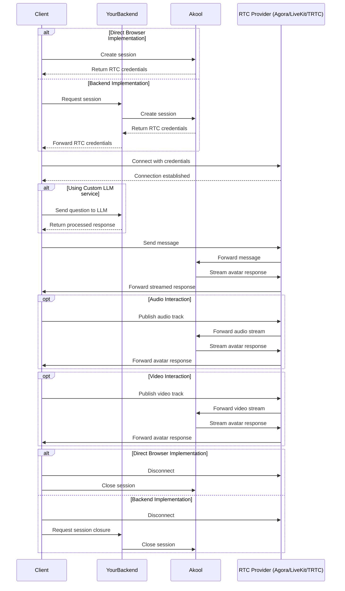

<Info>
**🎉 New Feature Available!** Video interaction with streaming avatars is now live! You can now enable two-way video communication with your avatars, including camera switching capabilities and video quality controls. Check out the [Video Interaction](#video-interaction-with-the-avatar) section for implementation details.
</Info>

## Overview

The Streaming Avatar feature allows you to create interactive, real-time avatar experiences in your application. This guide provides a comprehensive walkthrough of integrating streaming avatars using **Agora SDK**, **LiveKit SDK**, or **TRTC SDK**, including:

- Setting up real-time communication channels
- Handling avatar interactions and responses
- Managing audio streams
- Implementing cleanup procedures
- Optional LLM service integration

Choose between three reliable WebRTC-based SDKs for low-latency streaming with our avatar service. The code examples in this guide use **synchronized tabs** - select your preferred provider (Agora, LiveKit, or TRTC) in any code block, and all code examples on the page will automatically switch to match your selection.

## Prerequisites

### 1. Install the SDK

<CodeGroup tabs-group="provider">

```bash Agora
npm install agora-rtc-sdk-ng
# or
yarn add agora-rtc-sdk-ng
```

```bash LiveKit
npm install livekit-client
# or
yarn add livekit-client
```

```bash TRTC
npm install trtc-sdk-v5
# or
yarn add trtc-sdk-v5
```

</CodeGroup>

### 2. Import the required dependencies

<CodeGroup tabs-group="provider">

```ts Agora
import AgoraRTC, { IAgoraRTCClient } from "agora-rtc-sdk-ng";
```

```ts LiveKit
import { Room, RoomEvent } from "livekit-client";
```

```ts TRTC
import TRTC from "trtc-sdk-v5";
```

</CodeGroup>

### 3. Understanding Data Channel Limitations

<Accordion title="Agora SDK - Hidden API and Limitations">

Agora SDK's `sendStreamMessage` is not exposed in the public API, so we need to add it manually to the type definitions:

```ts
interface RTCClient extends IAgoraRTCClient {
  sendStreamMessage(msg: Uint8Array | string, flag: boolean): Promise<void>;
}
```

<Info>
**Important**: The Agora SDK has the following limitations ([reference](https://docs.agora.io/en/voice-calling/troubleshooting/error-codes?platform=android#data-stream-related-error-codes)):
- Maximum message size: **1 KB (1,024 bytes)**
- Maximum message frequency: **6 KB per second**
</Info>

</Accordion>

<Accordion title="LiveKit SDK - Data Channel Limitations">

LiveKit uses WebRTC data channels for message communication with more generous limits:

<Info>
**Important**: LiveKit data channel has the following limitations:
- **Reliable mode**: Maximum message size of **15 KiB (15,360 bytes)** per message
- **Lossy mode**: Recommended to keep messages under 1,300 bytes
- For this integration, we use reliable mode which provides significantly larger message capacity than Agora
</Info>

For more details, refer to [LiveKit's Data Channel Documentation](https://docs.livekit.io/home/client/data/packets/).

</Accordion>

<Accordion title="TRTC SDK - Data Channel Limitations">

TRTC uses custom messages for communication with specific limitations:

<Info>
**Important**: TRTC data channel has the following limitations:
- **Custom messages**: Maximum message size of **1 KB (1,024 bytes)** per message
- **Rate limit**: 30 calls per second, 8 KB/s for custom messages
- Messages are sent reliably and in order by default
</Info>

For more details, refer to [TRTC's Custom Message Documentation](https://web.sdk.qcloud.com/trtc/webrtc/v5/doc/en/TRTC.html#sendCustomMessage).

</Accordion>

## Integration Flow

The integration follows the same pattern regardless of which SDK you choose (Agora, LiveKit, or TRTC):



## Key Implementation Steps

### 1. Create a Live Avatar Session

<Warning>
**Security Recommendation**: We strongly recommend implementing session management through your backend server rather than directly in the browser. This approach:
- Protects your AKool API token from exposure
- Allows for proper request validation and rate limiting
- Enables usage tracking and monitoring
- Provides better control over session lifecycle
- Prevents unauthorized access to the API
</Warning>

First, create a session to obtain Agora credentials. While both browser and backend implementations are possible, the backend approach is recommended for security:

```ts
// Recommended: Backend Implementation
async function createSessionFromBackend(): Promise<Session> {
  // Your backend endpoint that securely wraps the AKool API
  const response = await fetch('https://your-backend.com/api/avatar/create-session', {
    method: 'POST',
    headers: {
      'Content-Type': 'application/json'
    },
    body: JSON.stringify({
      avatarId: "dvp_Tristan_cloth2_1080P",
      duration: 600,
    })
  });

  if (!response.ok) {
    throw new Error('Failed to create session through backend');
  }

  return response.json();
}

// Not Recommended: Direct Browser Implementation
// Only use this for development/testing purposes
async function createSessionInBrowser(): Promise<Session> {
  const response = await fetch('https://openapi.akool.com/api/open/v4/liveAvatar/session/create', {
    method: 'POST',
    headers: {
      'x-api-key':'{{API Key}}', // Security risk: Token exposed in browser
      'Content-Type': 'application/json'
    },
    body: JSON.stringify({
      avatar_id: "dvp_Tristan_cloth2_1080P",
      duration: 600,
    })
  });

  if (!response.ok) {
    throw new Error(`Failed to create session: ${response.status} ${response.statusText}`);
  }

  const res = await response.json();
  return res.data;
}
```

### 2. Initialize the Client/Room

Create and configure the client or room:

<CodeGroup tabs-group="provider">

```ts Agora
async function initializeAgoraClient(credentials) {
  const client = AgoraRTC.createClient({
    mode: 'rtc',
    codec: 'vp8'
  });

  try {
    await client.join(
      credentials.agora_app_id,
      credentials.agora_channel,
      credentials.agora_token,
      credentials.agora_uid
    );
    
    return client;
  } catch (error) {
    console.error('Error joining channel:', error);
    throw error;
  }
}
```

```ts LiveKit
import { Room } from 'livekit-client';

async function initializeLiveKitRoom(credentials) {
  const room = new Room({
    adaptiveStream: true,
    dynacast: true,
  });

  try {
    await room.connect(
      credentials.livekit_url,
      credentials.livekit_token,
      {
        autoSubscribe: true,
      }
    );
    
    return room;
  } catch (error) {
    console.error('Error connecting to room:', error);
    throw error;
  }
}
```

```ts TRTC
async function initializeTRTCClient(credentials) {
  const client = TRTC.create();

  try {
    await client.enterRoom({
      sdkAppId: credentials.trtc_app_id,
      roomId: credentials.trtc_room_id,
      userId: credentials.trtc_user_id,
      userSig: credentials.trtc_user_sig,
    });
    
    return client;
  } catch (error) {
    console.error('Error entering room:', error);
    throw error;
  }
}
```

</CodeGroup>

### 3. Subscribe to Audio and Video Stream

Subscribe to the audio and video stream of the avatar:

<CodeGroup tabs-group="provider">

```ts Agora
async function subscribeToAvatarStream(client: IAgoraRTCClient) { 
  const onUserPublish = async (user: IAgoraRTCRemoteUser, mediaType: 'video' | 'audio') => {
    const remoteTrack = await client.subscribe(user, mediaType);
    remoteTrack.play();
  };

  const onUserUnpublish = async (user: IAgoraRTCRemoteUser, mediaType: 'video' | 'audio') => {
    await client.unsubscribe(user, mediaType);
  };

  client.on('user-published', onUserPublish);
  client.on('user-unpublished', onUserUnpublish);
}
```

```ts LiveKit
import { RoomEvent, RemoteVideoTrack, RemoteAudioTrack } from 'livekit-client';

async function subscribeToAvatarStream(room: Room) {
  room.on(RoomEvent.TrackSubscribed, (track, publication, participant) => {
    if (track.kind === 'video' && track instanceof RemoteVideoTrack) {
      const videoElement = document.getElementById('remote-video') as HTMLVideoElement;
      if (videoElement) {
        track.attach(videoElement);
        videoElement.play();
      }
    } else if (track.kind === 'audio' && track instanceof RemoteAudioTrack) {
      const audioElement = document.createElement('audio');
      audioElement.autoplay = true;
      audioElement.volume = 1.0;
      document.body.appendChild(audioElement);
      track.attach(audioElement);
    }
  });

  room.on(RoomEvent.TrackUnsubscribed, (track, publication, participant) => {
    track.detach();
  });
}
```

```ts TRTC
async function subscribeToAvatarStream(client: TRTC) {
  // Handle remote user video stream
  client.on(TRTC.EVENT.REMOTE_VIDEO_AVAILABLE, (event) => {
    const { userId, streamType } = event;
    const videoElement = document.getElementById('remote-video') as HTMLVideoElement;
    if (videoElement) {
      client.startRemoteView({
        userId,
        streamType: streamType || TRTC.TRTCVideoStreamTypeBig,
        view: videoElement
      });
    }
  });

  // Handle remote user audio stream
  client.on(TRTC.EVENT.REMOTE_AUDIO_AVAILABLE, (event) => {
    const { userId } = event;
    client.startRemoteAudio({
      userId,
      volume: 100
    });
  });

  // Handle stream removal
  client.on(TRTC.EVENT.REMOTE_VIDEO_UNAVAILABLE, (event) => {
    const { userId } = event;
    client.stopRemoteView({
      userId
    });
  });

  client.on(TRTC.EVENT.REMOTE_AUDIO_UNAVAILABLE, (event) => {
    const { userId } = event;
    client.stopRemoteAudio({
      userId
    });
  });
}
```

</CodeGroup>

### 4. Set Up Message Handling

Configure message listeners to handle avatar responses:

<CodeGroup tabs-group="provider">

```ts Agora
function setupMessageHandlers(client: IAgoraRTCClient) {
  let answer = '';
  client.on('stream-message', (uid, message) => {
    try {
      const parsedMessage = JSON.parse(message);
      
      if (parsedMessage.type === 'chat') {
        const payload = parsedMessage.pld;
        
        if (payload.from === 'bot') {
          if (!payload.fin) {
            answer += payload.text;
          } else {
            console.log('Avatar response:', answer);
            answer = '';
          }
        } else if (payload.from === 'user') {
          console.log('User message:', payload.text);
        }
      } else if (parsedMessage.type === 'command') {
        if (parsedMessage.pld.code !== 1000) {
          console.error('Command failed:', parsedMessage.pld.msg);
        }
      }
    } catch (error) {
      console.error('Error parsing message:', error);
    }
  });
}
```

```ts LiveKit
import { RoomEvent } from 'livekit-client';

function setupMessageHandlers(room: Room) {
  let answer = '';
  
  room.on(RoomEvent.DataReceived, (payload: Uint8Array, participant) => {
    try {
      const message = new TextDecoder().decode(payload);
      const parsedMessage = JSON.parse(message);
      
      if (parsedMessage.type === 'chat') {
        const payload = parsedMessage.pld;
        
        if (payload.from === 'bot') {
          if (!payload.fin) {
            answer += payload.text;
          } else {
            console.log('Avatar response:', answer);
            answer = '';
          }
        } else if (payload.from === 'user') {
          console.log('User message:', payload.text);
        }
      } else if (parsedMessage.type === 'command') {
        if (parsedMessage.pld.code !== 1000) {
          console.error('Command failed:', parsedMessage.pld.msg);
        }
      }
    } catch (error) {
      console.error('Error parsing message:', error);
    }
  });
}
```

```ts TRTC
function setupMessageHandlers(client: TRTC) {
  let answer = '';
  
  client.on(TRTC.EVENT.CUSTOM_MESSAGE, (event) => {
    try {
      const { data } = event;
      const message = new TextDecoder().decode(new Uint8Array(data));
      const parsedMessage = JSON.parse(message);
      
      if (parsedMessage.type === 'chat') {
        const payload = parsedMessage.pld;
        
        if (payload.from === 'bot') {
          if (!payload.fin) {
            answer += payload.text;
          } else {
            console.log('Avatar response:', answer);
            answer = '';
          }
        } else if (payload.from === 'user') {
          console.log('User message:', payload.text);
        }
      } else if (parsedMessage.type === 'command') {
        if (parsedMessage.pld.code !== 1000) {
          console.error('Command failed:', parsedMessage.pld.msg);
        }
      }
    } catch (error) {
      console.error('Error parsing message:', error);
    }
  });
}
```

</CodeGroup>

### 5. Send Messages to Avatar

Implement functions to interact with the avatar:

<CodeGroup tabs-group="provider">

```ts Agora
async function sendMessageToAvatar(client: IAgoraRTCClient, question: string) {
  const message = {
    v: 2,
    type: "chat",
    mid: `msg-${Date.now()}`,
    idx: 0,
    fin: true,
    pld: {
      text: question,
    }
  };

  try {
    await client.sendStreamMessage(JSON.stringify(message), false);
  } catch (error) {
    console.error('Error sending message:', error);
    throw error;
  }
}
```

```ts LiveKit
async function sendMessageToAvatar(room: Room, question: string) {
  const message = {
    v: 2,
    type: "chat",
    mid: `msg-${Date.now()}`,
    idx: 0,
    fin: true,
    pld: {
      text: question,
    }
  };

  try {
    const encoder = new TextEncoder();
    const data = encoder.encode(JSON.stringify(message));
    await room.localParticipant.publishData(data, { reliable: true });
  } catch (error) {
    console.error('Error sending message:', error);
    throw error;
  }
}
```

```ts TRTC
async function sendMessageToAvatar(client: TRTC, question: string) {
  const message = {
    v: 2,
    type: "chat",
    mid: `msg-${Date.now()}`,
    idx: 0,
    fin: true,
    pld: {
      text: question,
    }
  };

  try {
    const encoder = new TextEncoder();
    const data = encoder.encode(JSON.stringify(message));
    await client.sendCustomMessage({
      cmdId: 1,
      data: data
    });
  } catch (error) {
    console.error('Error sending message:', error);
    throw error;
  }
}
```

</CodeGroup>

<Accordion title="Agora: Handling Large Messages with Chunking">

In real-world scenarios with Agora, the message size is limited to 1KB and the message frequency is limited to 6KB per second, so we need to split large messages into chunks and send them separately:

```ts
export async function sendMessageToAvatar(client: RTCClient, messageId: string, content: string) {
  const MAX_ENCODED_SIZE = 950;
  const BYTES_PER_SECOND = 6000;

  // Improved message encoder with proper typing
  const encodeMessage = (text: string, idx: number, fin: boolean): Uint8Array => {
    const message: StreamMessage = {
      v: 2,
      type: 'chat',
      mid: messageId,
      idx,
      fin,
      pld: {
        text,
      },
    };
    return new TextEncoder().encode(JSON.stringify(message));
  };

  // Validate inputs
  if (!content) {
    throw new Error('Content cannot be empty');
  }

  // Calculate maximum content length
  const baseEncoded = encodeMessage('', 0, false);
  const maxQuestionLength = Math.floor((MAX_ENCODED_SIZE - baseEncoded.length) / 4);

  // Split message into chunks
  const chunks: string[] = [];
  let remainingMessage = content;
  let chunkIndex = 0;

  while (remainingMessage.length > 0) {
    let chunk = remainingMessage.slice(0, maxQuestionLength);
    let encoded = encodeMessage(chunk, chunkIndex, false);

    // Binary search for optimal chunk size if needed
    while (encoded.length > MAX_ENCODED_SIZE && chunk.length > 1) {
      chunk = chunk.slice(0, Math.ceil(chunk.length / 2));
      encoded = encodeMessage(chunk, chunkIndex, false);
    }

    if (encoded.length > MAX_ENCODED_SIZE) {
      throw new Error('Message encoding failed: content too large for chunking');
    }

    chunks.push(chunk);
    remainingMessage = remainingMessage.slice(chunk.length);
    chunkIndex++;
  }

  log(`Splitting message into ${chunks.length} chunks`);

  // Send chunks with rate limiting
  for (let i = 0; i < chunks.length; i++) {
    const isLastChunk = i === chunks.length - 1;
    const encodedChunk = encodeMessage(chunks[i], i, isLastChunk);
    const chunkSize = encodedChunk.length;

    const minimumTimeMs = Math.ceil((1000 * chunkSize) / BYTES_PER_SECOND);
    const startTime = Date.now();

    log(`Sending chunk ${i + 1}/${chunks.length}, size=${chunkSize} bytes`);

    try {
      await client.sendStreamMessage(encodedChunk, false);
    } catch (error: unknown) {
      throw new Error(`Failed to send chunk ${i + 1}: ${error instanceof Error ? error.message : 'Unknown error'}`);
    }

    if (!isLastChunk) {
      const elapsedMs = Date.now() - startTime;
      const remainingDelay = Math.max(0, minimumTimeMs - elapsedMs);
      if (remainingDelay > 0) {
        await new Promise((resolve) => setTimeout(resolve, remainingDelay));
      }
    }
  }
}
```

</Accordion>

<Info>
**LiveKit Note**: Unlike Agora's 1KB limit, LiveKit supports messages up to 15 KiB in reliable mode, so chunking is generally not needed for typical conversational messages. For very large messages (over 15 KiB), you would need to implement similar chunking logic.

**TRTC Note**: TRTC has the same 1KB message size limit as Agora, so you would need to implement similar chunking logic for large messages. The chunking approach shown above for Agora can be adapted for TRTC by replacing `client.sendStreamMessage()` with `client.sendCustomMessage()`.
</Info>

### 6. Control Avatar Parameters

Implement functions to control avatar settings:

<CodeGroup tabs-group="provider">

```ts Agora
async function setAvatarParams(client: IAgoraRTCClient, params: {
  vid?: string;
  lang?: string;
  mode?: number;
  bgurl?: string;
}) {
  const message = {
    v: 2,
    type: 'command',
    mid: `msg-${Date.now()}`,
    pld: {
      cmd: 'set-params',
      data: params
    }
  };

  await client.sendStreamMessage(JSON.stringify(message), false);
}

async function interruptAvatar(client: IAgoraRTCClient) {
  const message = {
    v: 2,
    type: 'command',
    mid: `msg-${Date.now()}`,
    pld: {
      cmd: 'interrupt'
    }
  };

  await client.sendStreamMessage(JSON.stringify(message), false);
}
```

```ts LiveKit
async function setAvatarParams(room: Room, params: {
  vid?: string;
  lang?: string;
  mode?: number;
  bgurl?: string;
}) {
  const message = {
    v: 2,
    type: 'command',
    mid: `msg-${Date.now()}`,
    pld: {
      cmd: 'set-params',
      data: params
    }
  };

  const encoder = new TextEncoder();
  const data = encoder.encode(JSON.stringify(message));
  await room.localParticipant.publishData(data, { reliable: true });
}

async function interruptAvatar(room: Room) {
  const message = {
    v: 2,
    type: 'command',
    mid: `msg-${Date.now()}`,
    pld: {
      cmd: 'interrupt'
    }
  };

  const encoder = new TextEncoder();
  const data = encoder.encode(JSON.stringify(message));
  await room.localParticipant.publishData(data, { reliable: true });
}
```

```ts TRTC
async function setAvatarParams(client: TRTC, params: {
  vid?: string;
  lang?: string;
  mode?: number;
  bgurl?: string;
}) {
  const message = {
    v: 2,
    type: 'command',
    mid: `msg-${Date.now()}`,
    pld: {
      cmd: 'set-params',
      data: params
    }
  };

  const encoder = new TextEncoder();
  const data = encoder.encode(JSON.stringify(message));
  await client.sendCustomMessage({
    cmdId: 1,
    data: data.buffer
  });
}

async function interruptAvatar(client: TRTC) {
  const message = {
    v: 2,
    type: 'command',
    mid: `msg-${Date.now()}`,
    pld: {
      cmd: 'interrupt'
    }
  };

  const encoder = new TextEncoder();
  const data = encoder.encode(JSON.stringify(message));
  await client.sendCustomMessage({
    cmdId: 1,
    data: data.buffer
  });
}
```

</CodeGroup>

### 7. Audio Interaction With The Avatar

To enable audio interaction with the avatar, you'll need to publish your local audio stream:

<CodeGroup tabs-group="provider">

```ts Agora
async function publishAudio(client: IAgoraRTCClient) {
  // Create a microphone audio track
  const audioTrack = await AgoraRTC.createMicrophoneAudioTrack();
  
  try {
    // Publish the audio track to the channel
    await client.publish(audioTrack);
    console.log("Audio publishing successful");
    
    return audioTrack;
  } catch (error) {
    console.error("Error publishing audio:", error);
    throw error;
  }
}

// Example usage with audio controls
async function setupAudioInteraction(client: IAgoraRTCClient) {
  let audioTrack;
  
  // Start audio
  async function startAudio() {
    try {
      audioTrack = await publishAudio(client);
    } catch (error) {
      console.error("Failed to start audio:", error);
    }
  }

  // Stop audio
  async function stopAudio() {
    if (audioTrack) {
      // Stop and close the audio track
      audioTrack.stop();
      audioTrack.close();
      await client.unpublish(audioTrack);
      audioTrack = null;
    }
  }

  // Mute/unmute audio
  function toggleAudio(muted: boolean) {
    if (audioTrack) {
      if (muted) {
        audioTrack.setEnabled(false);
      } else {
        audioTrack.setEnabled(true);
      }
    }
  }

  return {
    startAudio,
    stopAudio,
    toggleAudio
  };
}
```

```ts LiveKit
import { createLocalAudioTrack } from 'livekit-client';

async function publishAudio(room: Room) {
  // Create a microphone audio track
  const audioTrack = await createLocalAudioTrack();
  
  try {
    // Publish the audio track to the room
    await room.localParticipant.publishTrack(audioTrack);
    console.log("Audio publishing successful");
    
    return audioTrack;
  } catch (error) {
    console.error("Error publishing audio:", error);
    throw error;
  }
}

// Example usage with audio controls
async function setupAudioInteraction(room: Room) {
  let audioTrack;
  
  // Start audio
  async function startAudio() {
    try {
      audioTrack = await publishAudio(room);
    } catch (error) {
      console.error("Failed to start audio:", error);
    }
  }

  // Stop audio
  async function stopAudio() {
    if (audioTrack) {
      // Stop and unpublish the audio track
      audioTrack.stop();
      await room.localParticipant.unpublishTrack(audioTrack);
      audioTrack = null;
    }
  }

  // Mute/unmute audio
  function toggleAudio(muted: boolean) {
    if (audioTrack) {
      audioTrack.setMuted(muted);
    }
  }

  return {
    startAudio,
    stopAudio,
    toggleAudio
  };
}
```

```ts TRTC
async function publishAudio(client: TRTC) {
  try {
    // Start local audio capture
    await client.startLocalAudio({
      quality: TRTC.TRTCAudioQualityDefault
    });
    
    console.log("Audio publishing successful");
    return true;
  } catch (error) {
    console.error("Error publishing audio:", error);
    throw error;
  }
}

// Example usage with audio controls
async function setupAudioInteraction(client: TRTC) {
  let isAudioEnabled = false;
  
  // Start audio
  async function startAudio() {
    try {
      await publishAudio(client);
      isAudioEnabled = true;
    } catch (error) {
      console.error("Failed to start audio:", error);
    }
  }

  // Stop audio
  async function stopAudio() {
    if (isAudioEnabled) {
      try {
        await client.stopLocalAudio();
        isAudioEnabled = false;
      } catch (error) {
        console.error("Failed to stop audio:", error);
      }
    }
  }

  // Mute/unmute audio
  function toggleAudio(muted: boolean) {
    if (isAudioEnabled) {
      client.muteLocalAudio(muted);
    }
  }

  return {
    startAudio,
    stopAudio,
    toggleAudio
  };
}
```

</CodeGroup>

Now you can integrate audio controls into your application:

<CodeGroup tabs-group="provider">

```ts Agora
async function initializeWithAudio() {
  try {
    // Initialize avatar
    const client = await initializeStreamingAvatar();
    
    // Setup audio controls
    const audioControls = await setupAudioInteraction(client);
    
    // Start audio when needed
    await audioControls.startAudio();
    
    // Example of muting/unmuting
    audioControls.toggleAudio(true); // mute
    audioControls.toggleAudio(false); // unmute
    
    // Stop audio when done
    await audioControls.stopAudio();
    
  } catch (error) {
    console.error("Error initializing with audio:", error);
  }
}
```

```ts LiveKit
async function initializeWithAudio() {
  try {
    // Initialize avatar
    const room = await initializeStreamingAvatar();
    
    // Setup audio controls
    const audioControls = await setupAudioInteraction(room);
    
    // Start audio when needed
    await audioControls.startAudio();
    
    // Example of muting/unmuting
    audioControls.toggleAudio(true); // mute
    audioControls.toggleAudio(false); // unmute
    
    // Stop audio when done
    await audioControls.stopAudio();
    
  } catch (error) {
    console.error("Error initializing with audio:", error);
  }
}
```

```ts TRTC
async function initializeWithAudio() {
  try {
    // Initialize avatar
    const client = await initializeStreamingAvatar();
    
    // Setup audio controls
    const audioControls = await setupAudioInteraction(client);
    
    // Start audio when needed
    await audioControls.startAudio();
    
    // Example of muting/unmuting
    audioControls.toggleAudio(true); // mute
    audioControls.toggleAudio(false); // unmute
    
    // Stop audio when done
    await audioControls.stopAudio();
    
  } catch (error) {
    console.error("Error initializing with audio:", error);
  }
}
```

</CodeGroup>

**Additional Resources:**
- [Agora Web SDK Documentation](https://docs.agora.io/en/voice-calling/get-started/get-started-sdk?platform=web#publish-a-local-audio-track)
- [LiveKit Web SDK Documentation](https://docs.livekit.io/client-sdk-js/)

### 8. Integrating your own LLM service (optional)

You can integrate your own LLM service to process messages before sending them to the avatar. Here's how to do it:

```ts
// Define the LLM service response interface
interface LLMResponse {
  answer: string;
}

// Set the avatar to retelling mode
await setAvatarParams(client, {
  mode: 1,
});

// Create a wrapper for your LLM service
async function processWithLLM(question: string): Promise<LLMResponse> {
  try {
    const response = await fetch('YOUR_LLM_SERVICE_ENDPOINT', {
      method: 'POST',
      headers: {
        'Content-Type': 'application/json',
      },
      body: JSON.stringify({
        question,
      })
    });

    if (!response.ok) {
      throw new Error('LLM service request failed');
    }

    return await response.json();
  } catch (error) {
    console.error('Error processing with LLM:', error);
    throw error;
  }
}
```

<CodeGroup tabs-group="provider">

```ts Agora
async function sendMessageToAvatarWithLLM(
  client: IAgoraRTCClient, 
  question: string
) {
  try {
    // Process the question with your LLM service
    const llmResponse = await processWithLLM(question);

    // Prepare the message with LLM response
    const message = {
      v: 2,
      type: "chat",
      mid: `msg-${Date.now()}`,
      idx: 0,
      fin: true,
      pld: {
        text: llmResponse.answer // Use the LLM-processed response
      }
    };

    // Send the processed message to the avatar
    await client.sendStreamMessage(JSON.stringify(message), false);

  } catch (error) {
    console.error('Error in LLM-enhanced message sending:', error);
    throw error;
  }
}
```

```ts LiveKit
async function sendMessageToAvatarWithLLM(
  room: Room, 
  question: string
) {
  try {
    // Process the question with your LLM service
    const llmResponse = await processWithLLM(question);

    // Prepare the message with LLM response
    const message = {
      v: 2,
      type: "chat",
      mid: `msg-${Date.now()}`,
      idx: 0,
      fin: true,
      pld: {
        text: llmResponse.answer // Use the LLM-processed response
      }
    };

    // Send the processed message to the avatar
    const encoder = new TextEncoder();
    const data = encoder.encode(JSON.stringify(message));
    await room.localParticipant.publishData(data, { reliable: true });

  } catch (error) {
    console.error('Error in LLM-enhanced message sending:', error);
    throw error;
  }
}
```

```ts TRTC
async function sendMessageToAvatarWithLLM(
  client: TRTC, 
  question: string
) {
  try {
    // Process the question with your LLM service
    const llmResponse = await processWithLLM(question);

    // Prepare the message with LLM response
    const message = {
      v: 2,
      type: "chat",
      mid: `msg-${Date.now()}`,
      idx: 0,
      fin: true,
      pld: {
        text: llmResponse.answer // Use the LLM-processed response
      }
    };

    // Send the processed message to the avatar
    const encoder = new TextEncoder();
    const data = encoder.encode(JSON.stringify(message));
    await client.sendCustomMessage({
      cmdId: 1,
      data: data
    });

  } catch (error) {
    console.error('Error in LLM-enhanced message sending:', error);
    throw error;
  }
}
```

</CodeGroup>

<Info>
*Remember to*:
1. Implement proper rate limiting for your LLM service
2. Handle token limits appropriately
3. Implement retry logic for failed LLM requests
4. Consider implementing streaming responses if your LLM service supports it
5. Cache common responses when appropriate
</Info>

### 9. Cleanup

Cleanup can also be performed either directly or through your backend:

<CodeGroup tabs-group="provider">

```ts Agora
// Browser Implementation
async function cleanupInBrowser(client: IAgoraRTCClient, sessionId: string) {
  await fetch('https://openapi.akool.com/api/open/v4/liveAvatar/session/close', {
    method: 'POST',
    headers: {
      'x-api-key':'{{API Key}}'
    },
    body: JSON.stringify({
      id: sessionId
    })
  });

  await performClientCleanup(client);
}

// Backend Implementation
async function cleanupFromBackend(client: IAgoraRTCClient, sessionId: string) {
  await fetch('https://your-backend.com/api/avatar/close-session', {
    method: 'POST',
    body: JSON.stringify({
      sessionId
    })
  });

  await performClientCleanup(client);
}

// Shared cleanup logic
async function performClientCleanup(client: IAgoraRTCClient) {
  // Remove event listeners
  client.removeAllListeners('user-published');
  client.removeAllListeners('user-unpublished');
  client.removeAllListeners('stream-message');

  // Stop audio/video and unpublish if they're still running
  if (audioControls) {
    await audioControls.stopAudio();
  }
  if (videoControls) {
    await videoControls.stopVideo();
  }
  
  // Leave the Agora channel
  await client.leave();
}
```

```ts LiveKit
// Browser Implementation
async function cleanupInBrowser(room: Room, sessionId: string) {
  await fetch('https://openapi.akool.com/api/open/v4/liveAvatar/session/close', {
    method: 'POST',
    headers: {
      'x-api-key':'{{API Key}}'
    },
    body: JSON.stringify({
      id: sessionId
    })
  });

  await performClientCleanup(room);
}

// Backend Implementation
async function cleanupFromBackend(room: Room, sessionId: string) {
  await fetch('https://your-backend.com/api/avatar/close-session', {
    method: 'POST',
    body: JSON.stringify({
      sessionId
    })
  });

  await performClientCleanup(room);
}

// Shared cleanup logic
async function performClientCleanup(room: Room) {
  // Remove event listeners
  room.removeAllListeners();

  // Stop and unpublish all local tracks
  room.localParticipant.audioTracks.forEach((publication) => {
    const track = publication.track;
    if (track) {
      track.stop();
      room.localParticipant.unpublishTrack(track);
    }
  });
  
  room.localParticipant.videoTracks.forEach((publication) => {
    const track = publication.track;
    if (track) {
      track.stop();
      room.localParticipant.unpublishTrack(track);
    }
  });
  
  // Disconnect from the LiveKit room
  await room.disconnect();
}
```

```ts TRTC
// Browser Implementation
async function cleanupInBrowser(client: TRTC, sessionId: string) {
  await fetch('https://openapi.akool.com/api/open/v4/liveAvatar/session/close', {
    method: 'POST',
    headers: {
      'x-api-key':'{{API Key}}'
    },
    body: JSON.stringify({
      id: sessionId
    })
  });

  await performClientCleanup(client);
}

// Backend Implementation
async function cleanupFromBackend(client: TRTC, sessionId: string) {
  await fetch('https://your-backend.com/api/avatar/close-session', {
    method: 'POST',
    body: JSON.stringify({
      sessionId
    })
  });

  await performClientCleanup(client);
}

// Shared cleanup logic
async function performClientCleanup(client: TRTC) {
  // Remove event listeners
  client.removeAllListeners();

  // Stop local audio and video
  try {
    await client.stopLocalAudio();
  } catch (error) {
    console.warn('Error stopping local audio:', error);
  }

  try {
    await client.stopLocalVideo();
  } catch (error) {
    console.warn('Error stopping local video:', error);
  }

  // Exit the room
  await client.exitRoom();
}
```

</CodeGroup>

<Info>
When implementing through your backend, make sure to:
- Securely store your AKool API token
- Implement proper authentication and rate limiting
- Handle errors appropriately
- Consider implementing session management and monitoring
</Info>

### 10. Putting It All Together

Here's how to use all the components together:

<CodeGroup tabs-group="provider">

```ts Agora
async function initializeStreamingAvatar() {
  let client;
  let session;
  try {
    // Create session and get credentials
    session = await createSession();
    const { credentials } = session;
    
    // Initialize Agora client
    client = await initializeAgoraClient(credentials);

    // Subscribe to the audio and video stream of the avatar
    await subscribeToAvatarStream(client);
    
    // Set up message handlers
    setupMessageHandlers(client);
    
    // Example usage
    await sendMessageToAvatar(client, "Hello!");

    // Or use your own LLM service
    await sendMessageToAvatarWithLLM(client, "Hello!");

    // Example of voice interaction
    await interruptAvatar(client);

    // Example of Audio Interaction With The Avatar
    await setupAudioInteraction(client);

    // Example of changing avatar parameters
    await setAvatarParams(client, {
      lang: "en",
      vid: "new_voice_id"
    });
    
    return client;
  } catch (error) {
    console.error('Error initializing streaming avatar:', error);
    if (client && session) {
      await cleanup(client, session._id);
    }
    throw error;
  }
}
```

```ts LiveKit
async function initializeStreamingAvatar() {
  let room;
  let session;
  try {
    // Create session and get credentials
    session = await createSession();
    const { credentials } = session;
    
    // Initialize LiveKit room
    room = await initializeLiveKitRoom(credentials);

    // Subscribe to the audio and video stream of the avatar
    await subscribeToAvatarStream(room);
    
    // Set up message handlers
    setupMessageHandlers(room);
    
    // Example usage
    await sendMessageToAvatar(room, "Hello!");

    // Or use your own LLM service
    await sendMessageToAvatarWithLLM(room, "Hello!");

    // Example of voice interaction
    await interruptAvatar(room);

    // Example of Audio Interaction With The Avatar
    await setupAudioInteraction(room);

    // Example of changing avatar parameters
    await setAvatarParams(room, {
      lang: "en",
      vid: "new_voice_id"
    });
    
    return room;
  } catch (error) {
    console.error('Error initializing streaming avatar:', error);
    if (room && session) {
      await cleanup(room, session._id);
    }
    throw error;
  }
}
```

```ts TRTC
async function initializeStreamingAvatar() {
  let client;
  let session;
  try {
    // Create session and get credentials
    session = await createSession();
    const { credentials } = session;
    
    // Initialize TRTC client
    client = await initializeTRTCClient(credentials);

    // Subscribe to the audio and video stream of the avatar
    await subscribeToAvatarStream(client);
    
    // Set up message handlers
    setupMessageHandlers(client);
    
    // Example usage
    await sendMessageToAvatar(client, "Hello!");

    // Or use your own LLM service
    await sendMessageToAvatarWithLLM(client, "Hello!");

    // Example of voice interaction
    await interruptAvatar(client);

    // Example of Audio Interaction With The Avatar
    await setupAudioInteraction(client);

    // Example of changing avatar parameters
    await setAvatarParams(client, {
      lang: "en",
      vid: "new_voice_id"
    });
    
    return client;
  } catch (error) {
    console.error('Error initializing streaming avatar:', error);
    if (client && session) {
      await cleanup(client, session._id);
    }
    throw error;
  }
}
```

</CodeGroup>

## Additional Resources

### Agora SDK Resources
- [Agora Web SDK Documentation](https://docs.agora.io/en/sdks?platform=web)
- [Agora Web SDK API Reference](https://api-ref.agora.io/en/video-sdk/web/4.x/index.html)
- [Agora Data Stream Error Codes](https://docs.agora.io/en/voice-calling/troubleshooting/error-codes?platform=android#data-stream-related-error-codes)

### LiveKit SDK Resources
- [LiveKit Web SDK Documentation](https://docs.livekit.io/client-sdk-js/)
- [LiveKit Web SDK API Reference](https://docs.livekit.io/client-sdk-js/classes/Room.html)
- [LiveKit Data Channel Documentation](https://docs.livekit.io/home/client/data/packets/)

### TRTC SDK Resources
- [TRTC Web SDK Documentation](https://web.sdk.qcloud.com/trtc/webrtc/v5/doc/en/index.html)
- [TRTC Web SDK API Reference](https://web.sdk.qcloud.com/trtc/webrtc/v5/doc/en/TRTC.html)
- [TRTC Custom Message Documentation](https://web.sdk.qcloud.com/trtc/webrtc/v5/doc/en/TRTC.html#sendCustomMessage)

### AKool API Resources
- [AKool OpenAPI Error Codes](/ai-tools-suite/live-avatar#response-code-description)
